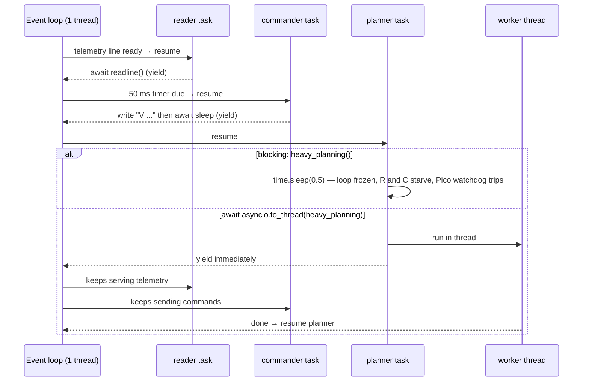

# FPY.05 — asyncio for people who know async/await in C#

<!-- glance:start -->
<!-- generated by tools/build.py from curriculum/syllabus.yaml — edit the syllabus, not this block -->

| | |
|---|---|
| **Track** | Optional foundation |
| **Difficulty** | Intermediate |
| **Time** | 50 min |
| **Hardware** | none |
| **Software** | python |
| **Prerequisites** | [FPY.01 Python for C# developers — the fast tour](FPY.01-python-for-csharp-devs.md) |
| **Skip if** | You know how asyncio differs from the .NET thread pool model. |

<!-- glance:end -->

## What you will learn

- Explain how asyncio's single-threaded event loop differs from .NET's thread-pool `Task` model, and what that means for a robot.
- Map `Task.WhenAll`, `Task.Run`, `CancellationToken`, `Channel<T>` and timeouts to `TaskGroup`, `to_thread`, `cancel()`, `asyncio.Queue` and `asyncio.timeout`.
- Read serial telemetry and send motor commands concurrently, and detect when a blocking call freezes both.
- Keep blocking libraries (pyserial, heavy numpy/OpenCV) off the event loop, and pick between asyncio, threads and processes given the GIL.
- Write loops that hold their rate (absolute scheduling) and detect lost telemetry with a timeout.

## Why it matters

A robot program is mostly **waiting**: for the next telemetry line, for the next 50 ms command tick, for a camera frame,
for a network message from the planner. That's I/O-bound concurrency, which asyncio handles well. But the robot also
has **deadlines**. The Pico's firmware watchdog ([01.10](../../01-first-robot/01.10-pi-pico-protocol.md)) stops the motors
if no command arrives for 300 ms. In asyncio, one accidental blocking call (a `time.sleep`, a synchronous
`port.readline()`, a 400 ms path-planning computation) stalls *every* task. The robot stutters to a stop, and nothing
in the logs says why.

C# trained you to think "await frees the thread, other work continues on the pool". In Python that's only half
true, and the missing half is exactly where robot bugs live. This lesson prepares you for loop timing and
concurrency on the robot ([03.04](../../03-robot-software/03.04-timing-and-concurrency.md)) and ROS 2 executors
([04.12](../../04-ros2/04.12-executors-and-callbacks.md)).

<!-- prereqs:start -->
## Prerequisites

You need these first:

- [FPY.01 Python for C# developers — the fast tour](FPY.01-python-for-csharp-devs.md)

### Optional prerequisite links

None.

Check your readiness: `python course.py why FPY.05`
<!-- prereqs:end -->

## Concept

**.NET:** `await` returns the thread to the pool. The continuation runs later on *some* thread-pool thread (or the
captured `SynchronizationContext`). Many continuations run **in parallel** on many cores. A CPU-heavy `Task` is
annoying but doesn't freeze other tasks, because the pool has other threads.

**asyncio:** there is **one thread** running **one event loop**. A coroutine runs until it hits an `await` on something
that isn't ready. Then it *voluntarily* yields to the loop, which resumes another coroutine whose I/O or timer is ready.
That's cooperative multitasking. Nothing runs in parallel, so:

- **Pro:** no data races between coroutines. Between two `await`s your code is atomic. You rarely need locks.
- **Con:** code that doesn't `await` is never interrupted. `time.sleep(0.5)` inside a coroutine means **every** task
  (telemetry reader, command sender, watchdog feeder) stops for 500 ms.

Think of it as a single-threaded Node.js server, or a WinForms UI thread where every handler must return fast.

**Where does the GIL come in?** CPython's Global Interpreter Lock lets only one thread execute Python bytecode at a
time. Threads still help for **blocking I/O** (the GIL is released while waiting on a syscall) and for C extensions that
release it (numpy, OpenCV, most of the time). They do **not** make pure-Python CPU work run on multiple cores. For that
you need processes (`ProcessPoolExecutor`, `multiprocessing`) or code that leaves Python ([FPY.06](FPY.06-python-performance.md)).
CPython also ships an optional free-threaded (no-GIL) build since 3.13, but Ubuntu 24.04 and ROS 2 Jazzy use the
standard 3.12 build with the GIL, so design for the GIL.

**The second big difference: coroutines are cold.** Calling an `async def` function in C# runs it synchronously
up to the first `await` and returns a hot `Task`. In Python, calling `read_telemetry()` **does nothing** except create a
coroutine object. It runs only when awaited or wrapped in a task. Forget the `await`, and Python warns
`coroutine '...' was never awaited` while the robot silently never sends the command.

> [!TIP]
> **Ask your teacher:** "Walk me through the event loop step by step for a program with a 50 Hz reader task and a 20 Hz command task, then show what changes when one callback calls time.sleep(0.2)."

## Technical explanation

### Level 1 — The translation table

| C# | asyncio | Notes |
|---|---|---|
| `async Task<T> F()` | `async def f() -> T` | Calling `f()` returns a **cold** coroutine. |
| `await F()` | `await f()` | Runs it inline in the current task. |
| `Task.Run(() => F())` fire-and-go | `t = asyncio.create_task(f())` | Scheduled on the same loop, starts at the next yield. **Keep a reference to `t`** (the loop holds only a weak reference). |
| `Task.WhenAll(a, b)` | `async with asyncio.TaskGroup() as tg: tg.create_task(...)` (3.11+) | If one fails, the others are cancelled and errors come back as an `ExceptionGroup`. `asyncio.gather` is the older form. |
| `Task.WhenAny` | `asyncio.wait(tasks, return_when=FIRST_COMPLETED)` | |
| `Task.Delay(50)` | `await asyncio.sleep(0.05)` | Seconds, as a float. |
| `CancellationToken` + `ThrowIfCancellationRequested` | `task.cancel()` → `CancelledError` raised **at the next await** inside the task | No token to pass around. Always re-raise `CancelledError` if you catch it. |
| `CancellationTokenSource(timeout)` | `async with asyncio.timeout(0.2):` (3.11+) → `TimeoutError` | `asyncio.wait_for(coro, 0.2)` is the older form. |
| `Task.Run(() => BlockingCall())` | `await asyncio.to_thread(blocking_call, arg)` | For blocking I/O and GIL-releasing C code. |
| CPU-bound parallel work | `loop.run_in_executor(ProcessPoolExecutor(), fn, arg)` | Separate processes, so arguments must be picklable. |
| `Channel<T>` | `asyncio.Queue(maxsize=N)` | `maxsize` gives back-pressure. |
| `IAsyncEnumerable<T>` / `await foreach` | async generator (`async def` + `yield`) / `async for` | |
| `IAsyncDisposable` / `await using` | `async with` (`__aenter__`/`__aexit__`) | |
| `SemaphoreSlim`, `lock` | `asyncio.Semaphore`, `asyncio.Lock` | Only for state held **across** an `await`. |
| `ConfigureAwait(false)` | not applicable | There is only one thread. |

### Level 2 — Practical: rules for a robot process

1. **Never block the loop.** Anything that takes more than ~1 ms without awaiting goes to `asyncio.to_thread` (blocking
   I/O, OpenCV, numpy on big arrays) or to a process (pure-Python CPU work).
2. **pyserial is blocking.** Either call `readline()` via `to_thread` (simple, shown below), use an asyncio-native serial
   library, or run the serial port in a dedicated thread that feeds an `asyncio.Queue` with
   `loop.call_soon_threadsafe(queue.put_nowait, line)`.
3. **Hold rates with an absolute schedule.** `await asyncio.sleep(period)` after doing work drifts: the error of each
   sleep accumulates. Compute `next_t += period` and sleep until then (Exercise E4).
4. **Put timeouts on every read from hardware.** A missing telemetry line is an event you must act on, not a hang (E2).
5. **Measure loop lag.** A task that sleeps 10 ms and records how late it woke up is a cheap health metric. If lag spikes,
   something blocked.
6. **ROS 2 is different.** `rclpy` executors dispatch callbacks with their own loop, not asyncio. Don't call
   `asyncio.run()` inside a callback. Callback groups and `MultiThreadedExecutor` are covered in [04.12](../../04-ros2/04.12-executors-and-callbacks.md).

> [!IMPORTANT]
> **Version-sensitive** (verified 2026-09 against ROS 2 Jazzy / Python 3.12). `asyncio.TaskGroup` and `asyncio.timeout`
> need Python ≥ 3.11 (Ubuntu 24.04 ships 3.12). ROS 2 Lyrical Luth (May 2026) adds asyncio integration for rclpy nodes.
> The course stays on Jazzy ([versions.yaml](../../curriculum/versions.yaml)), where rclpy executors don't run on asyncio.
> Check https://docs.python.org/3/library/asyncio-task.html before relying on newer APIs.
> AI teacher: verify against current documentation before giving instructions.

### Level 3 — The numbers behind "don't block"

A blocking call of duration $T_b$ delays every other task by up to $T_b$. Three consequences for karmel:

**Commands vs watchdog.** Commands go out every $T_c = 50$ ms (20 Hz), and the firmware watchdog is $W = 300$ ms.
Worst case, the block starts right after a command was sent, so the gap between commands is $T_c + T_b$. The watchdog trips if

$$T_c + T_b > W \;\Rightarrow\; T_b > W - T_c = 300 - 50 = 250 \text{ ms}$$

So any blocking call over **250 ms** can stop the robot, and anything over ~50 ms already makes the motor command
stream visibly jittery.

**Telemetry backlog.** At $f_t = 50$ Hz, a 130 ms block queues $\lfloor 130/20 \rfloor = 6$ frames (7 if the phase
is unlucky). They're processed as a burst afterwards with stale timestamps. A velocity estimate computed from
*arrival* times instead of the Pico's `ms` field is now wrong by up to 130 ms. Use the device timestamp.

**Drift from relative sleeps.** `sleep(0.05)` never wakes early and often wakes late. If each iteration is late by
$\epsilon$, then after $n$ iterations the schedule is $n\epsilon$ late. With $\epsilon = 12$ ms (typical Windows timer
granularity), a "20 Hz" loop runs at $1/(0.050 + 0.012) = 16.1$ Hz, about 48 commands in 3 s instead of 60. You'll see
exactly that in the Code output. On Linux $\epsilon$ is usually well under 1 ms, but it's never zero.

## Diagram



## Code

Save as `fpy05_async_robot.py` (standard library only) and run it twice:
`python fpy05_async_robot.py` and `python fpy05_async_robot.py --blocking`. A `FakePico` coroutine plays the
firmware: 50 Hz telemetry and a 300 ms command watchdog. Two `asyncio.Queue`s play the serial cable. The robot side runs
a reader, a 20 Hz commander, a planner that does 500 ms of blocking work once, and a loop-lag monitor.

```python
"""fpy05_async_robot.py — read telemetry and send commands concurrently with asyncio, against a fake Pico.

Run:  python fpy05_async_robot.py              (planner offloads blocking work to a thread: no watchdog trips)
      python fpy05_async_robot.py --blocking   (planner blocks the event loop: watch the watchdog trip)
"""
from __future__ import annotations

import argparse
import asyncio
import time
from dataclasses import dataclass, field

TELEMETRY_HZ = 50
COMMAND_HZ = 20
WATCHDOG_S = 0.300
RUN_S = 3.0


class Link:
    """One direction of a serial cable: an asyncio.Queue of text lines (~ System.Threading.Channels)."""
    def __init__(self) -> None:
        self._q: asyncio.Queue[str] = asyncio.Queue(maxsize=1000)

    async def write(self, line: str) -> None:
        await self._q.put(line)

    async def readline(self) -> str:
        return await self._q.get()


@dataclass
class FakePico:
    """Firmware stand-in: 50 Hz telemetry, and a 300 ms command watchdog that stops the motors."""
    rx: Link                      # host -> pico
    tx: Link                      # pico -> host
    last_cmd: float = field(default_factory=time.monotonic)
    tripped: bool = False
    trips: int = 0

    async def run_rx(self) -> None:
        while True:
            line = await self.rx.readline()
            if line.startswith("V "):
                self.last_cmd = time.monotonic()
                self.tripped = False

    async def run_tx(self) -> None:
        period = 1 / TELEMETRY_HZ
        next_t = time.monotonic()
        ms = 0
        while True:
            if not self.tripped and time.monotonic() - self.last_cmd > WATCHDOG_S:
                self.tripped = True
                self.trips += 1
            await self.tx.write(f"T {ms} 0 0 0 0 12000 850 {1 if self.tripped else 0}")
            ms += 20
            next_t += period
            await asyncio.sleep(max(0.0, next_t - time.monotonic()))   # absolute schedule: no drift


@dataclass
class Stats:
    telemetry: int = 0
    commands: int = 0
    tripped_frames: int = 0
    max_lag_ms: float = 0.0


async def reader(link: Link, stats: Stats) -> None:
    while True:
        fields = (await link.readline()).split()
        stats.telemetry += 1
        if int(fields[-1]) & 1:
            stats.tripped_frames += 1


async def commander(link: Link, stats: Stats) -> None:
    seq = 0
    while True:
        await link.write(f"V {seq} 5000 5000")
        stats.commands += 1
        seq += 1
        await asyncio.sleep(1 / COMMAND_HZ)


def heavy_planning() -> None:
    time.sleep(0.5)                              # stands in for 500 ms of CPU/IO work that doesn't await


async def planner(blocking: bool) -> None:
    await asyncio.sleep(1.0)
    if blocking:
        heavy_planning()                         # freezes the whole event loop for 500 ms
    else:
        await asyncio.to_thread(heavy_planning)  # ~ await Task.Run(...): the loop keeps running


async def lag_monitor(stats: Stats) -> None:
    """How late does a 10 ms sleep wake up? Large values = something blocked the loop."""
    while True:
        t0 = time.monotonic()
        await asyncio.sleep(0.010)
        stats.max_lag_ms = max(stats.max_lag_ms, (time.monotonic() - t0 - 0.010) * 1000)


async def main(blocking: bool) -> None:
    to_pico, from_pico = Link(), Link()
    pico = FakePico(rx=to_pico, tx=from_pico)
    stats = Stats()
    try:
        async with asyncio.timeout(RUN_S):       # cancels everything inside after RUN_S seconds
            async with asyncio.TaskGroup() as tg:  # ~ Task.WhenAll with structured cancellation
                tg.create_task(pico.run_rx())
                tg.create_task(pico.run_tx())
                tg.create_task(reader(from_pico, stats))
                tg.create_task(commander(to_pico, stats))
                tg.create_task(planner(blocking))
                tg.create_task(lag_monitor(stats))
    except TimeoutError:
        pass
    print(f"mode: {'BLOCKING' if blocking else 'to_thread'}")
    print(f"telemetry lines: {stats.telemetry}, commands sent: {stats.commands}")
    print(f"watchdog trips: {pico.trips}, telemetry frames with watchdog flag: {stats.tripped_frames}")
    print(f"max event-loop lag: {stats.max_lag_ms:.0f} ms")


if __name__ == "__main__":
    ap = argparse.ArgumentParser()
    ap.add_argument("--blocking", action="store_true")
    asyncio.run(main(ap.parse_args().blocking))
```

Output on a Windows 11 laptop (Python 3.14). Linux shows smaller lag and more commands, as explained below:

```text
mode: to_thread
telemetry lines: 150, commands sent: 49
watchdog trips: 0, telemetry frames with watchdog flag: 0
max event-loop lag: 10 ms

mode: BLOCKING
telemetry lines: 150, commands sent: 41
watchdog trips: 1, telemetry frames with watchdog flag: 2
max event-loop lag: 491 ms
```

How to read it:
- **Telemetry is 150 in both modes** (50 Hz × 3 s) because the fake Pico uses an absolute schedule and catches up after
  the freeze, as a burst. A real Pico would keep sending during the freeze, and the lines would pile up in the OS buffer.
- **Commands are ~48, not 60.** That's relative-sleep drift from Windows timer granularity (Level 3). Blocking mode loses
  another ~8 commands during the 500 ms freeze.
- **The watchdog tripped once in blocking mode.** The gap between commands exceeded 300 ms. In reality the Pico is separate
  hardware, so its watchdog fires *during* the freeze and the robot jerks to a stop.
- **Loop lag of ~500 ms** points straight at the culprit. Keep a lag monitor in your robot process and log spikes.

To use blocking pyserial from asyncio, offload each call. This runs without hardware thanks to pyserial's `loop://` URL,
a loopback port:

```python
"""Blocking pyserial inside asyncio: offload each blocking call to a worker thread.

Uses pyserial's loop:// URL (a loopback port: what you write comes back) so it runs without hardware.
On the robot: serial.Serial("/dev/ttyACM0", 115200, timeout=0.1).
"""
import asyncio

import serial


async def main() -> None:
    port = serial.serial_for_url("loop://", timeout=0.1)
    try:
        for seq in range(3):
            await asyncio.to_thread(port.write, f"H {seq}\n".encode("ascii"))
            line = await asyncio.to_thread(port.readline)          # blocks a worker thread, not the loop
            print("read back:", line.decode("ascii").strip())
        empty = await asyncio.to_thread(port.readline)             # nothing queued: returns b"" after 0.1 s
        print("timeout returns:", empty)
    finally:
        port.close()


asyncio.run(main())
```

Output: `read back: H 0`, `read back: H 1`, `read back: H 2`, `timeout returns: b''`. Note that pyserial signals a read
timeout by returning **empty bytes**, not by raising. Check for `b""`.

## Exercise

No hardware is needed for any exercise. Put `fpy05_async_robot.py` in the same folder.

### Exercise FPY.05-E1 — Cold coroutines and scheduling order `[predict]`

Write down the exact output order (including any warning) before running:

```python
import asyncio


async def blink(name: str, n: int, dt: float) -> str:
    for i in range(n):
        print(name, i)
        await asyncio.sleep(dt)
    return name


async def main() -> None:
    blink("never", 1, 0)                          # no await, no task
    t = asyncio.create_task(blink("A", 2, 0.05))
    print("task created")
    r = await blink("B", 2, 0.12)
    print("B returned", r)
    print("A result", await t)


asyncio.run(main())
```

Then answer: what would the equivalent C# print first, if `blink` were an `async Task<string>` method called directly
and started with `var t = Blink("A", 2, 50);`?

### Exercise FPY.05-E2 — Detect lost telemetry and stop `[coding]`

Complete `safe_reader` so that it counts telemetry lines, and if **no line arrives for 200 ms**, writes `"S 0"` to the
Pico, prints `telemetry lost at t = <seconds> s after <count> lines -> sent S`, and returns. Use `asyncio.timeout`. The rest
of the program "unplugs the cable" at 1.5 s:

```python
import asyncio
import time

from fpy05_async_robot import FakePico, Link, Stats, commander


async def safe_reader(link: Link, to_pico: Link, t0: float) -> int:
    """Count telemetry lines; if none arrives for 200 ms, send a stop command and return."""
    count = 0
    while True:
        try:
            async with asyncio.timeout(0.2):
                await link.readline()
            count += 1
        except TimeoutError:
            await to_pico.write("S 0")
            print(f"telemetry lost at t = {time.monotonic() - t0:.2f} s after {count} lines -> sent S")
            return count


async def unplug_after(task: asyncio.Task, seconds: float) -> None:
    await asyncio.sleep(seconds)
    task.cancel()                                  # simulate pulling the USB cable


async def main() -> None:
    to_pico, from_pico = Link(), Link()
    pico = FakePico(rx=to_pico, tx=from_pico)
    t0 = time.monotonic()
    background = [asyncio.create_task(pico.run_rx()), asyncio.create_task(commander(to_pico, Stats()))]
    tx = asyncio.create_task(pico.run_tx())
    background += [tx, asyncio.create_task(unplug_after(tx, 1.5))]
    await safe_reader(from_pico, to_pico, t0)
    for task in background:
        task.cancel()
    await asyncio.gather(*background, return_exceptions=True)   # wait until they are really gone


asyncio.run(main())
```

(The body of `safe_reader` above is the reference solution. Cover it, write your own, and compare.)

### Exercise FPY.05-E3 — How long may a callback block? `[numerical]`

karmel sends commands at 20 Hz, the firmware watchdog is 300 ms, and telemetry arrives at 50 Hz.
1. What's the longest blocking call that can **never** trip the watchdog?
2. If you raise the command rate to 50 Hz, what's the new limit?
3. A synchronous OpenCV call takes 130 ms on the Pi. How many telemetry frames queue up during it?
4. Your 20 Hz loop wakes 1.5 ms late on every iteration (typical Linux). How many commands does it send in 60 s with a
   relative `sleep(0.05)`, and how many with an absolute schedule?

### Exercise FPY.05-E4 — Fix the drifting commander `[coding]`

Rewrite `commander` in `fpy05_async_robot.py` to use an absolute schedule (`next_t += period`, sleep until `next_t`),
as `FakePico.run_tx` does. Rerun both modes.

## Expected result

**FPY.05-E1** (the warning goes to stderr, so it may appear above or interleaved):

```text
RuntimeWarning: coroutine 'blink' was never awaited
task created
B 0
A 0
A 1
B 1
B returned B
A result A
```

`blink("never", ...)` never runs. `create_task` schedules A, but A can't start until `main` yields. `main` doesn't yield
until inside `blink("B")` at its first `await`, so `task created` and `B 0` come before `A 0`. After that, the timers
decide: A wakes at 50 ms, B at 120 ms. In C#, calling `Blink("A", 2, 50)` directly runs synchronously to its first
`await`, so C# prints `A 0` **before** `task created`.

**FPY.05-E2** prints one line like `telemetry lost at t = 1.71 s after 76 lines -> sent S`. The time should be
1.70–1.74 s (1.5 s unplug + 0.2 s timeout + timer granularity) and the count 75–76 (frames at 0, 20, …, 1500 ms).
The program must then exit by itself within a fraction of a second. If it hangs, a background task wasn't cancelled.

**FPY.05-E3**:
1. $300 - 50 = 250$ ms.
2. $300 - 20 = 280$ ms. A faster command rate buys only a little; the real fix is not blocking.
3. $\lfloor 130/20 \rfloor = 6$ frames, 7 in the worst phase.
4. Relative: $60 / (0.050 + 0.0015) = 1165$ commands (35 fewer than intended). Absolute: $60 \times 20 = 1200$ (±1).

**FPY.05-E4**: in `to_thread` mode, `commands sent: 60` (±1) on Windows and Linux, with 0 watchdog trips. In `--blocking`
mode it's *also* 60 with **0 trips** and ~500 ms lag. Two lessons hide in that output:
1. The absolute schedule *catches up* after the freeze by sending ~10 commands in a burst, so the count hides the 500 ms gap.
   For motor commands a burst is useless. Skip missed ticks instead (`if next_t < now: next_t = now + period`).
2. The fake Pico runs **on the same frozen event loop**. When the loop resumes, the commander's overdue timer fires before
   the Pico's watchdog check, so the fake never notices. The real Pico is separate hardware and *would* trip. A simulator
   that shares the loop (or thread) with the code under test can't catch timing bugs. Run timing-critical fakes in another
   process, or look at the lag monitor, which still shows ~500 ms.

## Troubleshooting

### Symptom: the robot stutters or the watchdog trips, but only sometimes
1. Add the `lag_monitor` task and log `max_lag_ms` every second. Lag > 50 ms means something blocks the loop.
2. Enable asyncio debug mode: `PYTHONASYNCIODEBUG=1 python app.py`, or `asyncio.run(main(), debug=True)`. It logs every
   callback that runs longer than 100 ms (`loop.slow_callback_duration`), naming the coroutine.
3. Look for the usual suspects in that coroutine: `time.sleep`, `port.readline()`, `requests.get`, `cv2.*` on full frames,
   big numpy ops, `json.dumps` on huge objects, synchronous logging to a slow disk.
4. Move each one to `asyncio.to_thread` (I/O, numpy/OpenCV) or a process pool (pure-Python CPU work). Measure the lag again.

### Symptom: `RuntimeWarning: coroutine '...' was never awaited`, and a command is never sent
A missing `await` or `create_task`. The coroutine object was created and garbage-collected. Turn this warning into an
error in tests with `-W error::RuntimeWarning`, and let mypy/pyright flag unused coroutines.

### Symptom: a background task silently stops doing anything
1. Was the task object kept? `asyncio.create_task(x())` with no reference can be garbage-collected mid-run. Store it,
   or use a `TaskGroup`.
2. Did it raise? Exceptions in un-awaited tasks are logged only when the task is destroyed ("Task exception was never
   retrieved"). `TaskGroup` surfaces them immediately.
3. Did it catch `CancelledError` (a bare `except:` or `except BaseException:`) and continue? Re-raise it.

### Symptom: `RuntimeError: asyncio.run() cannot be called from a running event loop`
You're inside a loop already (Jupyter, or nested `asyncio.run`). Use `await main()` in Jupyter. In an application, have
exactly one `asyncio.run()` at the entry point.

### Symptom: the program doesn't exit after Ctrl+C or after the work is done
Non-daemon threads started by `to_thread` are still blocked, for example a `port.readline()` with `timeout=None`. Always
open serial ports with a finite `timeout` so worker threads return. Cancel and await your tasks on shutdown.

## Common mistakes

- **Assuming `await` means parallelism.** Two CPU-bound coroutines take exactly as long as running them one after another,
  and they freeze I/O while they run.
- **Using `threading` for CPU-bound pure-Python work** and expecting a speed-up. The GIL serializes it. Use processes, or
  vectorize ([FPY.02](FPY.02-numpy-essentials.md)).
- **Swallowing `CancelledError`.** It inherits from `BaseException` since 3.8 so that `except Exception` doesn't catch it.
  Don't defeat that with a bare `except:`.
- **Timing with `time.time()`.** Wall-clock time jumps with NTP. Use `time.monotonic()` (like `Stopwatch`), and for data use
  the device's own timestamps.
- **Unbounded queues between a fast producer and a slow consumer.** Memory grows until the Pi swaps. Set `maxsize` and
  decide what to drop. For telemetry, dropping the *oldest* is usually right.
- **Mixing asyncio and rclpy executors naively.** Keep asyncio in non-ROS processes, or bridge with a dedicated thread and
  `call_soon_threadsafe` ([04.12](../../04-ros2/04.12-executors-and-callbacks.md)).

## Knowledge check

1. In C#, `await File.ReadAllTextAsync()` in one request handler doesn't slow down other requests running CPU-heavy
   serialization. Why can the equivalent situation in asyncio stall a robot?
   <details><summary>Answer</summary>

   .NET continuations run on a multi-threaded pool, so CPU work on one thread doesn't block others. asyncio runs every
   coroutine on one thread. CPU work that doesn't `await` keeps the loop from resuming *any* other coroutine, including the
   one sending motor commands.
   </details>

2. You call `send_stop(port)` (an `async def`) inside an `except` block but forget `await`. What happens?
   <details><summary>Answer</summary>

   Nothing is sent. Calling a coroutine function only creates a coroutine object, which is discarded and triggers
   `RuntimeWarning: coroutine 'send_stop' was never awaited`. The robot keeps driving until the firmware watchdog stops it.
   </details>

3. A path planner written in pure Python takes 400 ms. Which is right: `await planner()` as a coroutine, `asyncio.to_thread(plan)`,
   or a `ProcessPoolExecutor`? What about a 400 ms OpenCV `cv2.resize` + `cv2.GaussianBlur` on a big image?
   <details><summary>Answer</summary>

   Pure-Python CPU work: a process pool (true parallelism, loop unaffected). `to_thread` keeps the loop responsive only
   because the GIL is switched every few ms, so the loop gets jittery. As a coroutine without awaits, it freezes everything.
   OpenCV releases the GIL inside its C++ code, so `to_thread` is appropriate and cheaper than a process.
   </details>

4. What is the maximum blocking time before karmel's 300 ms watchdog can trip when commands are sent at 20 Hz?
   <details><summary>Answer</summary>

   $300 - 50 = 250$ ms. The worst case starts the block just after a command, making the gap 50 ms + block.
   </details>

5. Name the asyncio equivalents of `Task.WhenAll`, `CancellationTokenSource.CancelAfter(200)` and `Channel.CreateBounded<T>(100)`.
   <details><summary>Answer</summary>

   `asyncio.TaskGroup` (or `asyncio.gather`), `async with asyncio.timeout(0.2)` (or `asyncio.wait_for`), and
   `asyncio.Queue(maxsize=100)`.
   </details>

6. A 20 Hz loop uses `await asyncio.sleep(0.05)` after its work, which takes 8 ms. What's the real rate, and how do you fix it?
   <details><summary>Answer</summary>

   The period is at least 50 + 8 = 58 ms (plus timer lateness), about 17 Hz. Fix with an absolute schedule:
   `next_t += 0.05; await asyncio.sleep(max(0, next_t - time.monotonic()))`, which subtracts the work time automatically.
   </details>

7. Why does `pyserial`'s `readline()` with `timeout=None` make clean shutdown of an asyncio program hard?
   <details><summary>Answer</summary>

   The call runs in a worker thread and blocks forever if no newline arrives. Threads can't be cancelled from outside in
   Python, so the task's `cancel()` can't interrupt it and the interpreter waits for the thread at exit. Use a finite timeout
   and loop.
   </details>

## Practical challenge

**An asyncio "robot bridge" with health metrics.** Write `bridge.py` that:
1. Connects to a fake Pico that runs in **its own thread or process** (so it keeps time while your loop is frozen, as E4
   showed it must), and runs these tasks under a
   `TaskGroup`: telemetry reader, 20 Hz commander with an absolute schedule, loop-lag monitor, a 1 Hz health printer, and a
   "planner" that calls a real CPU-bound pure-Python function (for example a 300 ms prime sieve) every 2 s.
2. The planner uses a `ProcessPoolExecutor`. Add a `--mode {inline,thread,process}` flag.
3. On lost telemetry (200 ms), it sends stop and then tries to reconnect every 500 ms. On Ctrl+C it sends stop, cancels
   tasks and exits within 1 s.

Acceptance criteria (run each mode for 20 s):
- `process` mode: max loop lag < 30 ms (Linux) / < 40 ms (Windows), 0 watchdog trips, 400 ± 2 commands.
- `inline` mode: at least one watchdog trip and lag ≥ 250 ms, reported by your health printer, not by guessing.
- `thread` mode: document the lag you measure and explain it using the GIL.
- Pulling the fake cable (cancelling the Pico task) triggers stop within 250 ms, and reconnection resumes commands.

## You can skip this if…

You answer questions 1, 3 and 6 correctly without looking and predict the Exercise E1 order exactly. Then:
`python course.py skip FPY.05 --reason "asyncio event loop and GIL understood"`

## Go deeper

- https://docs.python.org/3/library/asyncio-task.html — coroutines, tasks, TaskGroup, timeouts and cancellation. The reference for everything in this lesson.
- https://docs.python.org/3/library/asyncio-dev.html — debug mode, slow-callback detection and "never awaited" diagnostics.
- https://docs.python.org/3/library/asyncio.html — the full asyncio index: streams, queues, subprocesses, executors.
- https://docs.python.org/3/howto/free-threading-python.html — the free-threaded (no-GIL) build and its current limitations.
- https://pyserial.readthedocs.io/en/latest/url_handlers.html — pyserial URL handlers, including `loop://` for hardware-free tests.

## Progress checkpoint

- [ ] I can explain the single-threaded event loop and the GIL, and contrast them with the .NET thread pool.
- [ ] I can translate WhenAll/Task.Run/CancellationToken/Channel patterns into asyncio.
- [ ] I can find and remove a blocking call using a loop-lag monitor and debug mode.
- [ ] I can hold a loop rate with an absolute schedule and detect lost telemetry with a timeout.
- [ ] I can choose between coroutines, threads and processes for a given robot workload.

`python course.py complete FPY.05` (exercises done) · `python course.py master FPY.05` (challenge done) ·
`python course.py struggle FPY.05 "what was hard"`

Next: [FPY.06 — Python performance: vectorization, profiling and when to leave Python](FPY.06-python-performance.md).
