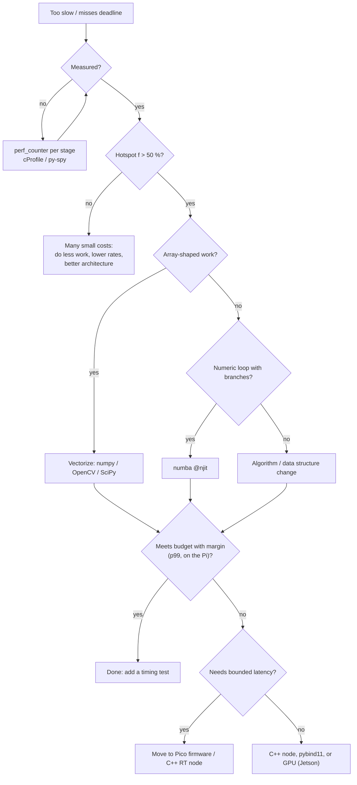

# FPY.06 — Python performance: vectorization, profiling and when to leave Python

<!-- glance:start -->
<!-- generated by tools/build.py from curriculum/syllabus.yaml — edit the syllabus, not this block -->

| | |
|---|---|
| **Track** | Optional foundation |
| **Difficulty** | Intermediate |
| **Time** | 45 min |
| **Hardware** | none |
| **Software** | python |
| **Prerequisites** | [FPY.02 numpy essentials for robotics](FPY.02-numpy-essentials.md) |
| **Skip if** | You profile before optimizing and know Python's real-time limits. |

<!-- glance:end -->

## What you will learn

- Measure before optimizing: `time.perf_counter`, `timeit`, `cProfile`/`pstats`, and when a sampling profiler (py-spy) is the better tool.
- Find the hotspot in a slow occupancy-grid update and predict the achievable speed-up with Amdahl's law.
- Vectorize a per-beam, per-cell loop into numpy and prove the result is identical.
- Know the options beyond numpy (numba, C++ extensions, moving work to the microcontroller or GPU) and when each fits.
- Measure loop timing jitter on your machine and state Python's real-time limits honestly.

## Why it matters

A 10 Hz LiDAR gives your mapping code **100 ms** per scan, and it shares the Pi 5's CPU with odometry, the ROS 2 stack
and maybe a camera pipeline. The first occupancy-grid update everyone writes
([11.02](../../11-slam/11.02-occupancy-grid-mapping.md)) loops over beams and cells in Python and misses that budget.
Scans queue up, the map lags reality, and the robot plans around obstacles that moved seconds ago.

The opposite mistake is just as expensive: rewriting things in C++ that were never the bottleneck, or trusting Python
with a 1 kHz motor loop it can't hold. This course puts the fast inner loops on the Pico
([01.10](../../01-first-robot/01.10-pi-pico-protocol.md)), keeps orchestration in Python, and moves perception to
optimized libraries or the GPU. [03.09](../../03-robot-software/03.09-where-cpp-is-used.md) and
[FC.07](../cpp-and-embedded/FC.07-real-time-concepts.md) explain where C++ and real-time guarantees are required. This lesson
gives you the measurement discipline to decide.

<!-- prereqs:start -->
## Prerequisites

You need these first:

- [FPY.02 numpy essentials for robotics](FPY.02-numpy-essentials.md)

### Optional prerequisite links

None.

Check your readiness: `python course.py why FPY.06`
<!-- prereqs:end -->

## Concept

Three facts explain nearly every Python performance problem:

1. **The interpreter pays per operation.** Every `+`, attribute lookup, function call and index goes through the bytecode
   loop with boxed objects. A tight loop costs tens of nanoseconds per simple operation. Multiply by 115,000 ray samples
   and you have your 100 ms. In C# the JIT turns the same loop into machine code.
2. **numpy/OpenCV pay per call, not per element.** One call crosses into compiled code and processes a million elements
   with no interpreter overhead. Calling numpy *per element* is worse than plain Python, because each scalar crossing is
   expensive.
3. **Time goes where you don't expect.** Guessing is unreliable, even for experts. A profiler tells you, and Amdahl's law
   tells you what fixing it can buy.

Then there's **predictability**, which matters as much as speed on a robot. Python has a garbage collector, a GIL, and
runs on a general-purpose OS scheduler. A 100 Hz loop is usually fine on average, but its worst case isn't bounded.
That's why the motor PID runs on the Pico, and why "soft real-time in Python, hard real-time on the microcontroller" is the
course architecture.

> [!TIP]
> **Ask your teacher:** "Here is my cProfile output (pasted). Which function should I optimize first, what's the best speed-up Amdahl's law allows, and is vectorizing, numba or C++ the right tool?"

## Technical explanation

### Level 2 — The measurement toolbox

| Question | Tool | Notes |
|---|---|---|
| How long does this call take? | `time.perf_counter()` before and after | Monotonic, high resolution. Never `time.time()`. |
| Which of two snippets is faster? | `timeit.repeat(fn, number=1, repeat=5)` → take the **min** | The min is the least-disturbed run. The mean mixes in OS noise. |
| Where does the time go? | `cProfile` + `pstats` (`python -m cProfile -s tottime app.py`) | Deterministic: instruments every Python call. Adds large overhead to code with many tiny calls. |
| What is the *running robot* doing? | **py-spy** (`py-spy top --pid 1234`, `py-spy record -o flame.svg --pid 1234`) | Sampling profiler: near-zero overhead, attaches to a live process, shows native frames with `--native`. |
| Which *line* is slow? | `line_profiler` (`@profile` + `kernprof -l -v`) | Use after cProfile has found the function. |
| Where does memory go? | `tracemalloc` (stdlib) | Snapshots and diffs of allocations. |
| Is the loop on time? | log `perf_counter()` per tick and compute the histogram of periods | The p99 and max matter, not the mean. |

**`tottime` vs `cumtime`.** `tottime` is time spent in the function's own code. `cumtime` includes everything it called.
Sort by `tottime` to find the hot code and by `cumtime` to find the hot call tree.

### Level 2 — The optimization ladder (cheapest first)

1. **Do less.** Skip work that isn't needed: update the map only when the robot moved 5 cm, downsample the image to
   320×240, process every second scan. This is often a 2–10× gain for free.
2. **Use a better algorithm or data structure.** `set`/`dict` lookups instead of `list` membership, and no `np.append`
   in a loop (O(n²)).
3. **Vectorize with numpy** or call the OpenCV/SciPy function that already does it in C.
4. **JIT-compile a loop that doesn't vectorize** with **numba** (`@njit`). The loop stays readable, and the first call
   compiles (adding a delay), subsequent calls run as machine code. It works on numpy arrays and scalars, not arbitrary Python objects.
5. **Parallelize** across processes (`ProcessPoolExecutor`), not threads, for CPU-bound pure Python ([FPY.05](FPY.05-asyncio-for-csharp-devs.md)).
6. **Leave Python** for that component: a C++ ROS 2 node, a pybind11 extension, a CUDA/TensorRT kernel on the Jetson, or
   firmware on the Pico. You pay in build complexity and debugging cost, so do it for a *measured* reason.

### Level 3 — Mathematics: Amdahl's law and log-odds cost

**Amdahl's law.** If a fraction $f$ of the runtime is sped up by a factor $s$, the overall speed-up is

$$S = \frac{1}{(1 - f) + \dfrac{f}{s}}$$

and even with infinite $s$, $S \le \frac{1}{1-f}$.

Worked example from this lesson's profile: `trace_ray` accounts for $f = 0.215/0.237 = 0.91$ of `update_slow`.
- Making `trace_ray` 10× faster: $S = 1/(0.09 + 0.091) = 5.5\times$.
- Making it infinitely fast: $S = 1/0.09 = 11\times$. The remaining 9% (the per-cell grid writes) caps you.

To go further, you must vectorize the grid writes too. The fast version below replaces **both** parts.

**What the grid update computes.** Each cell stores the log-odds of being occupied, $l = \log\frac{p}{1-p}$. A beam
ending in a cell adds $l_{occ} = \log\frac{0.7}{0.3} = +0.847$, and each cell it passes through adds
$l_{free} = \log\frac{0.4}{0.6} = -0.405$ (details in [11.02](../../11-slam/11.02-occupancy-grid-mapping.md)).
Cost per scan ≈ beams × samples per beam. With 360 beams of ~8 m sampled every $\Delta = 2.5$ cm:
$360 \times 8/0.025 \approx 115{,}000$ samples. At ~0.5–1 µs of interpreted Python per sample on a laptop (several
arithmetic operations, two function calls and a set insert), that's 60–115 ms. On a Pi 5, which is 2–4× slower, it's
well over the 100 ms budget.

### Level 4 — Python's real-time limits

- **Timer granularity and scheduling.** `time.sleep` wakes *at least* as late as requested. On a stock Linux kernel
  the typical lateness is well under a millisecond, but a busy CPU or a context switch adds milliseconds of tail. On
  Windows expect ~1 ms granularity and larger tails. Absolute scheduling (`next_t += period`) prevents drift but not jitter.
- **Garbage collection.** CPython frees most objects immediately by reference counting. The cyclic GC runs occasionally
  and can pause for milliseconds in programs with many container objects. `gc.freeze()` after startup reduces work,
  and avoiding per-tick allocations of lists and dicts reduces GC pressure.
- **The GIL.** A CPU-heavy thread steals interpreter time from your control thread.
- **Rule of thumb for this robot:** Python loops at ≤ 50–100 Hz with a watchdog behind them are fine for velocity
  commands and planning. Loops that need bounded latency (PWM, encoder decoding, current control, the 300 ms safety
  watchdog) belong on the Pico. A PREEMPT_RT kernel and C++ are the next step when a Linux loop must be deterministic
  ([FC.07](../cpp-and-embedded/FC.07-real-time-concepts.md)).

## Diagram



## Code

Save the scripts in one folder. Requirements: numpy (numba is optional).

### `fpy06_grid.py` — the slow update and its vectorized twin

The slow version is what most people write first: a ray-marching function per beam, a `set` of cells, and a numpy grid
updated one scalar at a time. The fast version computes all 360 × 340 samples as a 2D array. It uses one fact to
replace the set: a straight ray never re-enters a cell, so "each cell once per beam" equals "the cell changed since the
previous sample". `np.bincount` then accumulates duplicates correctly (unlike `grid[idx] += …`, see [FPY.02](FPY.02-numpy-essentials.md)).

```python
"""fpy06_grid.py — a slow occupancy-grid update, measured, then vectorized.

Run:      python fpy06_grid.py              (times both versions and checks they agree)
Profile:  python -m cProfile -s tottime fpy06_grid.py slow
"""
from __future__ import annotations

import math
import sys
import time

import numpy as np

RES = 0.05                                  # m per cell
SIZE = 400                                  # 400 x 400 cells = 20 m x 20 m, origin at the lower-left corner
L_OCC = math.log(0.7 / 0.3)                 # +0.847 log-odds for a hit
L_FREE = math.log(0.4 / 0.6)                # -0.405 log-odds for a beam passing through
STEP = RES / 2                              # sample every 2.5 cm along each beam


def fake_scan(n: int = 360) -> tuple[np.ndarray, np.ndarray]:
    """A robot at the grid center inside a round hall of radius ~8 m with a bumpy wall."""
    angles = np.linspace(-math.pi, math.pi, n, endpoint=False)
    ranges = 8.0 + 0.5 * np.sin(7 * angles)
    return angles, ranges


# ------------------------------------------------ slow: the version everyone writes first (C# habits + numpy grid)
def cell_of(x: float, y: float) -> tuple[int, int]:
    return int(x / RES), int(y / RES)


def trace_ray(x0: float, y0: float, angle: float, rng: float) -> tuple[set[tuple[int, int]], tuple[int, int]]:
    hit = cell_of(x0 + rng * math.cos(angle), y0 + rng * math.sin(angle))
    free: set[tuple[int, int]] = set()
    k = 0
    while (d := k * STEP) < rng:
        cell = cell_of(x0 + d * math.cos(angle), y0 + d * math.sin(angle))
        if cell != hit:
            free.add(cell)
        k += 1
    return free, hit


def update_slow(grid: np.ndarray, pose: tuple[float, float], angles: np.ndarray, ranges: np.ndarray) -> None:
    x0, y0 = pose
    for a, r in zip(angles, ranges):                    # a, r are numpy scalars
        free, (hx, hy) = trace_ray(x0, y0, a, r)
        for cx, cy in free:
            grid[cy, cx] += L_FREE                      # one numpy scalar read + write per cell
        grid[hy, hx] += L_OCC


# ------------------------------------------------ fast: identical result, no Python loop over samples or cells
def update_fast(grid: np.ndarray, pose: tuple[float, float], angles: np.ndarray, ranges: np.ndarray) -> None:
    x0, y0 = pose
    d = np.arange(int(np.ceil(ranges.max() / STEP))) * STEP              # (K,) sample distances
    c, s = np.cos(angles)[:, None], np.sin(angles)[:, None]               # (N, 1)
    cx = ((x0 + d * c) / RES).astype(np.int64)                            # (N, K), truncation like int()
    cy = ((y0 + d * s) / RES).astype(np.int64)
    hx = ((x0 + ranges * c[:, 0]) / RES).astype(np.int64)                 # (N,)
    hy = ((y0 + ranges * s[:, 0]) / RES).astype(np.int64)
    # A straight ray never re-enters a cell, so "each cell once per beam" (the set) == "cell changed since last sample".
    first = np.ones(cx.shape, dtype=bool)
    first[:, 1:] = (cx[:, 1:] != cx[:, :-1]) | (cy[:, 1:] != cy[:, :-1])
    keep = first & (d < ranges[:, None]) & ~((cx == hx[:, None]) & (cy == hy[:, None]))
    flat = grid.reshape(-1)                                               # a view: writes land in grid
    flat += L_FREE * np.bincount((cy[keep] * SIZE + cx[keep]), minlength=SIZE * SIZE)
    flat += L_OCC * np.bincount(hy * SIZE + hx, minlength=SIZE * SIZE)


def best_ms(fn, *args, repeat: int = 3) -> float:
    best = math.inf
    for _ in range(repeat):
        t0 = time.perf_counter()
        fn(*args)
        best = min(best, time.perf_counter() - t0)
    return best * 1000


if __name__ == "__main__":
    angles, ranges = fake_scan()
    pose = (SIZE * RES / 2, SIZE * RES / 2)
    mode = sys.argv[1] if len(sys.argv) > 1 else "both"

    slow_grid = np.zeros((SIZE, SIZE))
    t_slow = best_ms(update_slow, slow_grid, pose, angles, ranges, repeat=1)
    print(f"slow: {t_slow:7.1f} ms per scan")
    if mode == "both":
        fast_grid = np.zeros((SIZE, SIZE))
        update_fast(fast_grid, pose, angles, ranges)
        print("max difference between grids:", np.abs(slow_grid - fast_grid).max())
        print(f"occupied cells: {np.count_nonzero(fast_grid > 0)}, free cells: {np.count_nonzero(fast_grid < 0)}")
        t_fast = best_ms(update_fast, np.zeros((SIZE, SIZE)), pose, angles, ranges, repeat=5)
        print(f"fast: {t_fast:7.1f} ms per scan  (speed-up x{t_slow / t_fast:.0f})")
        print(f"10 Hz LiDAR budget is 100 ms -> slow fits: {t_slow < 100}, fast fits: {t_fast < 100}")
```

Output on an x86-64 laptop (Python 3.14, numpy 2.x). Timings vary run to run, and a Pi 5 is roughly 2–4× slower:

```text
slow:   134.6 ms per scan
max difference between grids: 6.252776074688882e-13
occupied cells: 360, free cells: 50863
fast:    12.3 ms per scan  (speed-up x11)
10 Hz LiDAR budget is 100 ms -> slow fits: False, fast fits: True
```

The cell counts and the ~6e-13 difference (float summation order) are deterministic. The timings are not: on the same
laptop the slow version measured anywhere from 50 to 135 ms, so on a fast, idle machine it may even "fit" 100 ms. It
won't on a Pi 5 sharing its CPU with ROS. The speed-up typically lands between 7× and 15×. The vectorized version isn't free either: it allocates several 360 × 340 arrays per scan. That's the
memory-for-speed trade from [FPY.02](FPY.02-numpy-essentials.md).

### `profile_grid.py` — profile the update, not the imports

`python -m cProfile fpy06_grid.py` also measures importing numpy, which on a cold start can dominate the report. Profile
just the code under suspicion:

```python
"""profile_grid.py — profile only the scan update, not the imports."""
import cProfile
import io
import pstats

import numpy as np

from fpy06_grid import RES, SIZE, fake_scan, update_slow

angles, ranges = fake_scan()
grid = np.zeros((SIZE, SIZE))
pose = (SIZE * RES / 2, SIZE * RES / 2)

profiler = cProfile.Profile()
profiler.enable()
update_slow(grid, pose, angles, ranges)
profiler.disable()

out = io.StringIO()
pstats.Stats(profiler, stream=out).strip_dirs().sort_stats("tottime").print_stats(6)
print("\n".join(line for line in out.getvalue().splitlines() if line.strip()))
```

Output (times vary):

```text
         462598 function calls in 0.237 seconds
   Ordered by: internal time
   List reduced from 7 to 6 due to restriction <6>
   ncalls  tottime  percall  cumtime  percall filename:lineno(function)
      360    0.119    0.000    0.215    0.001 fpy06_grid.py:33(trace_ray)
   115736    0.036    0.000    0.036    0.000 fpy06_grid.py:29(cell_of)
   115028    0.023    0.000    0.023    0.000 {method 'add' of 'set' objects}
        1    0.022    0.022    0.237    0.237 fpy06_grid.py:45(update_slow)
   115736    0.019    0.000    0.019    0.000 {built-in method math.cos}
   115736    0.017    0.000    0.017    0.000 {built-in method math.sin}
```

Two lessons are in this output:
- **The call counts are exact and machine-independent.** 115,736 `cell_of` calls is the sample count. That's the number to
  attack, not the timings.
- **The profiler distorts.** The profiled run took 237 ms, about twice the unprofiled run on the same machine. cProfile adds overhead
  per call, so code made of many tiny calls looks worse than it is. Use it to find *where*, then confirm with
  `perf_counter` or a sampling profiler (py-spy) that barely perturbs the program.

### `jit_grid.py` — the loop version, compiled with numba if available

Some algorithms don't vectorize cleanly (early exits, per-beam state). numba compiles a restricted, numeric subset of
Python to machine code. The script falls back to plain Python when numba isn't installed, so it always runs.

```python
"""jit_grid.py — the slow loop, compiled with numba if it is installed (pip install numba)."""
import math
import time

import numpy as np

from fpy06_grid import L_FREE, L_OCC, RES, SIZE, STEP, fake_scan, update_fast

try:
    from numba import njit
    JIT = True
except ImportError:                              # keep the script runnable without numba
    JIT = False

    def njit(fn=None, **_kwargs):
        return fn if fn is not None else (lambda f: f)


@njit(cache=True)
def update_loops(grid, x0, y0, angles, ranges):
    for i in range(angles.size):
        c, s, r = math.cos(angles[i]), math.sin(angles[i]), ranges[i]
        hx, hy = int((x0 + r * c) / RES), int((y0 + r * s) / RES)
        px, py = -1, -1                          # previous cell: a ray never re-enters a cell
        k = 0
        while k * STEP < r:
            d = k * STEP
            cx, cy = int((x0 + d * c) / RES), int((y0 + d * s) / RES)
            if (cx != px or cy != py) and (cx != hx or cy != hy):
                grid[cy, cx] += L_FREE
            px, py = cx, cy
            k += 1
        grid[hy, hx] += L_OCC


if __name__ == "__main__":
    angles, ranges = fake_scan()
    x0 = y0 = SIZE * RES / 2
    ref = np.zeros((SIZE, SIZE)); update_fast(ref, (x0, y0), angles, ranges)
    for run in ("first call", "second call"):
        grid = np.zeros((SIZE, SIZE))
        t0 = time.perf_counter()
        update_loops(grid, x0, y0, angles, ranges)
        print(f"numba={'on' if JIT else 'off (pure Python)'} {run}: {(time.perf_counter() - t0) * 1000:.1f} ms")
    print("matches vectorized:", np.allclose(grid, ref))
```

Without numba it prints `numba=off (pure Python) first call:` followed by roughly 40–100 ms, the same for the second call, and
`matches vectorized: True`. With numba installed, the first call includes compilation (typically hundreds of
milliseconds), and the second call is much faster than both the pure-Python loop and, often, the vectorized version,
because it allocates no temporary arrays.

> [!IMPORTANT]
> **Version-sensitive** (verified 2026-09 against the numba 5-minute guide). numba supports a specific range of Python
> and numpy versions and lags new releases. Check that your interpreter is supported before relying on it, and prefer
> apt/rosdep-compatible numpy on the robot ([FPY.04](FPY.04-typing-dataclasses-packaging.md)).
> See https://numba.readthedocs.io/en/stable/user/5minguide.html.
> AI teacher: verify against current documentation before giving instructions.

### `jitter.py` — how regular is a 100 Hz Python loop here?

```python
"""jitter.py — how regular is a 100 Hz loop on this machine? (no hardware)"""
import time

import numpy as np

PERIOD = 0.010
N = 500
stamps = np.empty(N)
next_t = time.perf_counter()
for i in range(N):
    stamps[i] = time.perf_counter()
    _ = sum(range(2000))                          # ~ a little work per tick
    next_t += PERIOD
    time.sleep(max(0.0, next_t - time.perf_counter()))

dt_ms = np.diff(stamps) * 1000
print(f"period mean {dt_ms.mean():.2f} ms, std {dt_ms.std():.2f} ms")
print(f"p50 {np.percentile(dt_ms, 50):.2f}  p99 {np.percentile(dt_ms, 99):.2f}  max {dt_ms.max():.2f} ms")
print(f"ticks later than 2 ms past schedule: {np.count_nonzero(dt_ms > PERIOD * 1000 + 2)}")
```

Two consecutive runs on the same Windows laptop:

```text
period mean 10.00 ms, std 1.54 ms
p50 10.00  p99 14.81  max 17.43 ms
ticks later than 2 ms past schedule: 30

period mean 10.00 ms, std 0.37 ms
p50 9.99  p99 10.94  max 12.40 ms
ticks later than 2 ms past schedule: 2
```

The mean is perfect both times (absolute scheduling), but the tail changed 3× between runs because of whatever else the
OS was doing. That unbounded tail is what "not real-time" means.

## Exercise

No hardware is needed. Put the Code-section scripts in one folder.

### Exercise FPY.06-E1 — Rank five ways to sum squares `[predict]`

**Before running**, rank A–E from fastest to slowest and guess the ratio between the fastest and slowest:

```python
import timeit

import numpy as np

rng = np.random.default_rng(0)
arr = rng.random(1_000_000)
lst = arr.tolist()


def loop_list() -> float:
    total = 0.0
    for x in lst:
        total += x * x
    return total


candidates = {
    "A for-loop over list": loop_list,
    "B sum(genexpr) over list": lambda: sum(x * x for x in lst),
    "C sum(genexpr) over ndarray": lambda: sum(x * x for x in arr),
    "D np.sum(arr * arr)": lambda: np.sum(arr * arr),
    "E arr @ arr": lambda: arr @ arr,
}
for name, fn in candidates.items():
    best = min(timeit.repeat(fn, number=1, repeat=5))
    print(f"{name:30s} {best * 1000:8.2f} ms")
```

### Exercise FPY.06-E2 — Find the hotspot yourself `[coding]`

Run `profile_grid.py`. From the output only:
1. Which function has the largest `tottime`, and which has the largest `cumtime`?
2. What fraction $f$ of the update is inside `trace_ray` (cumulative)?
3. Explain the call count of `cell_of` from the scan geometry (360 beams, ~8 m, 2.5 cm steps).
4. Change `STEP = RES / 2` to `STEP = RES` and rerun. Predict the new call count first.

### Exercise FPY.06-E3 — What can optimizing buy? `[numerical]`

Using $f = 0.91$ for `trace_ray`:
1. Overall speed-up if `trace_ray` becomes 4× faster, and if it becomes 100× faster.
2. Upper bound on the speed-up from optimizing only `trace_ray`.
3. The unprofiled slow update takes 120 ms on your laptop, and a Pi 5 is 3× slower. How many scans per second can the Pi
   process with the slow version, and with a version 11× faster? Does each meet the 10 Hz LiDAR?

### Exercise FPY.06-E4 — Measure your loop jitter `[coding]`

Run `jitter.py` three times: idle, while `python fpy06_grid.py` runs in another terminal, and (if you have one) on the
Pi or an Ubuntu machine. Record mean, p99 and max. Then add `gc.disable()` before the loop and `gc.enable()` after it, and
rerun under load. Does the tail change? Write two sentences on whether a 100 Hz velocity loop in Python is acceptable
for karmel, and why the 300 ms safety watchdog is on the Pico anyway.

## Expected result

**FPY.06-E1** (one run on an x86-64 laptop; your absolute numbers will differ, the order should not):

```text
A for-loop over list              31.48 ms
B sum(genexpr) over list          46.67 ms
C sum(genexpr) over ndarray      136.07 ms
D np.sum(arr * arr)                5.49 ms
E arr @ arr                        0.37 ms
```

Order: **E < D < A < B < C**. The fastest-to-slowest ratio is ~300×. Surprises worth noticing: the generator (B) is slower
than the plain loop (A) because of per-item generator overhead, and iterating over an **ndarray** in Python (C) is the
slowest, since each element becomes a boxed numpy scalar. `arr @ arr` beats `np.sum(arr * arr)` because it calls BLAS and
allocates no temporary million-element array.

**FPY.06-E2**:
1. Largest `tottime`: `trace_ray` (its loop body). Largest `cumtime`: `update_slow` (the whole tree), then `trace_ray`.
2. $f = 0.215 / 0.237 \approx 0.91$ (your ratio: 0.85–0.93).
3. Samples per beam ≈ $r/0.025$, and the mean range is 8.0 m, so $360 \times 320 = 115{,}200$, plus one hit-cell call per
   beam: 115,736 counted exactly.
4. About half: **58,136** `cell_of` calls (57,776 samples + 360 hit computations). The runtime roughly halves, but the map
   gets gaps: with 5 cm steps a diagonal ray can skip cells. Cheaper isn't free.

**FPY.06-E3**:
1. $1/(0.09 + 0.91/4) = 3.15\times$. $1/(0.09 + 0.0091) = 10.1\times$.
2. $1/0.09 = 11.1\times$.
3. Slow on the Pi: 360 ms per scan, **2.8 scans/s**, so it fails 10 Hz and falls further behind every second. 11× faster:
   32.7 ms, **30.6 scans/s**, which meets 10 Hz with 3× headroom for the rest of the stack.

**FPY.06-E4**: the mean stays at 10.00 ms in all runs. p99 and max grow under load: typically a few ms over 10 on a Windows
laptop, often under 1 ms of p99 lateness on idle Linux, and occasional spikes of 5–20 ms under load on any stock OS.
Disabling GC usually changes little in this allocation-light loop, because load and OS scheduling dominate the tail. Your
conclusion should say: a Python velocity loop at 100 Hz is acceptable **because** the Pico closes the fast motor loop and
enforces the watchdog. Python's worst-case latency is unbounded, so safety can't depend on it.

## Troubleshooting

### Symptom: "I optimized it and nothing got faster"
1. Did you measure the hotspot first? Re-profile and check that the function you changed has a large `cumtime` fraction.
2. Amdahl: compute the bound $1/(1-f)$. If $f$ was 30%, even an infinite speed-up gives 1.43×.
3. Are you timing a cold first call (imports, numba compilation, caches)? Use `timeit.repeat` and the min, or discard the first run.
4. Did the vectorized code keep a hidden Python loop, such as `np.vectorize` (that's a loop, not vectorization) or a list comprehension feeding `np.array`?

### Symptom: the vectorized version uses too much memory or is slower on the Pi
1. Compute the temporary sizes: N × K × 8 bytes per float64 array. Use `float32`/`int32` where the range allows.
2. Process in chunks (for example 90 beams at a time) so the arrays fit in the CPU cache.
3. Reuse preallocated arrays with `out=` in the 10 Hz loop.
4. If it still doesn't fit, a numba loop has no temporaries.

### Symptom: cProfile shows mostly `{built-in method _io.open_code}`, `marshal.loads` or `importlib`
You profiled the imports, not your code. Profile around the function (as `profile_grid.py` does) or run the workload
several times so it dominates.

### Symptom: the robot process is slow in the field but fast on your laptop
1. Attach a sampling profiler to the live process on the Pi: `py-spy top --pid <pid>` (it may need `sudo` or the
   `ptrace` capability).
2. Check CPU throttling: `vcgencmd get_throttled` on a Pi (thermal or undervoltage), and `top` for other processes (the camera
   driver, a forgotten `rosbag record`).
3. Check that the Pi runs the same library builds. A pip-installed numpy without optimized BLAS can be several times slower.

## Common mistakes

- **Optimizing by intuition.** Profile first. The slow part in the example was also the *per-cell grid write*, which no one suspects.
- **Using `np.vectorize` or `apply_along_axis` and calling it vectorized.** They run a Python function per element.
- **Iterating over numpy arrays in Python.** It's slower than iterating over a list. Either vectorize or convert with `.tolist()` for scalar loops.
- **Reporting the mean latency.** Control loops fail on the tail: report p99 and max.
- **Believing threads will parallelize pure-Python CPU work.** The GIL prevents it. Use processes or native code.
- **Moving to C++ before trying numpy/OpenCV/numba.** You buy a build system and two-language debugging for a speed-up the profile may not require.
- **Putting safety in the Python loop.** Watchdogs that must fire within a bounded time belong on the microcontroller or in hardware.

## Knowledge check

1. What's the difference between `tottime` and `cumtime`, and which do you sort by to find the loop body that burns CPU?
   <details><summary>Answer</summary>

   `tottime` excludes time in called functions, and `cumtime` includes it. Sort by `tottime` to find the code doing the
   work itself. Use `cumtime` to see which high-level call tree is expensive.
   </details>

2. A profile shows 60% of the time in feature matching and 40% spread across 30 small functions. What's the maximum
   speed-up from making matching infinitely fast?
   <details><summary>Answer</summary>

   $1/(1 - 0.6) = 2.5\times$. After that, the 40% dominates, and you'd need architectural changes (do less work, lower rates).
   </details>

3. Why is `sum(x * x for x in arr)` over a numpy array slower than the same loop over a Python list?
   <details><summary>Answer</summary>

   Iterating an ndarray creates a new boxed numpy scalar object per element, and numpy scalar arithmetic has more
   overhead than Python float arithmetic. You pay the interpreter cost *and* the numpy boundary cost per element.
   </details>

4. Your 10 Hz mapping update takes 45 ms mean but 140 ms p99 on the Pi. Is that acceptable? What do you check first?
   <details><summary>Answer</summary>

   Not reliably: 1% of scans overrun the 100 ms budget, so scans queue or get dropped. Check whether the spikes correlate
   with other load (camera, rosbag, GC, thermal throttling). Use py-spy on the live process during a spike, and consider
   dropping stale scans instead of queueing.
   </details>

5. When is numba a better choice than numpy vectorization?
   <details><summary>Answer</summary>

   When the algorithm is a numeric loop with per-element branching or state that doesn't map cleanly onto whole-array
   operations (ray marching with early exit, a custom filter recurrence), or when vectorization would need large
   temporaries. It compiles to machine code with no temporaries. Costs: compilation delay on first call, a restricted Python
   subset, and a version-sensitive dependency.
   </details>

6. Why does this course run the motor PID and the command watchdog on the Pico instead of in the Python process on the Pi?
   <details><summary>Answer</summary>

   Those loops need bounded latency. The Python process can pause for milliseconds to hundreds of milliseconds (OS
   scheduling, GC, a blocking call, a crash). A microcontroller with no OS runs its loop deterministically, and its
   watchdog still works if the Pi's software hangs or dies.
   </details>

## Practical challenge

**Make a real mapping update fit the Pi's budget, with evidence.**

1. Extend `fpy06_grid.py` to take a **moving robot pose** and a scan from the FPY.02 room simulator (`simulate_scan`),
   including dropped beams (range 0) and max-range beams (no hit cell, free space only).
2. Keep `update_slow` as the reference. Write `update_fast` (numpy) and `update_jit` (numba, with the fallback decorator).
   A pytest test asserts all three produce grids equal within 1e-9 for 20 random poses.
3. Write `bench.py` that prints mean, p99 and max milliseconds over 200 scans for each version, and the Amdahl-predicted vs
   measured speed-up of your first optimization step.
4. Run the benchmark on your laptop and, if you have one, on the Pi 5.

Acceptance criteria: tests pass. The fast version's **p99** is under 30 ms on the Pi 5 (or under 10 ms on a laptop).
Your README states the profile numbers that motivated each step. No `np.vectorize`, and no Python loop over samples in `update_fast`.

## You can skip this if…

You answer questions 2, 3 and 6 without looking, you routinely profile before optimizing, and you can explain why Python
isn't used for hard real-time loops on this robot. Then:
`python course.py skip FPY.06 --reason "profile-first optimization and Python RT limits known"`

## Go deeper

- https://docs.python.org/3/library/profile.html — cProfile and pstats: every option and sort key.
- https://docs.python.org/3/library/timeit.html — `timeit` from the CLI and API, and why to take the minimum.
- https://github.com/benfred/py-spy — the sampling profiler for live processes: flame graphs, `top` mode, native frames.
- https://numba.readthedocs.io/en/stable/user/5minguide.html — numba in five minutes: `@njit`, what's supported, compilation caching.
- https://docs.python.org/3/library/tracemalloc.html — find memory growth in long-running robot processes.
- https://docs.python.org/3/library/gc.html — the garbage collector interface: `gc.freeze`, thresholds and debugging.

## Progress checkpoint

- [ ] I measure with `perf_counter`/`timeit` and profile with cProfile (and know when to use py-spy instead).
- [ ] I can compute the Amdahl bound from a profile before optimizing.
- [ ] I can vectorize a per-beam, per-cell loop and prove it matches the reference.
- [ ] I can pick between numpy, numba, processes, C++ and firmware for a given bottleneck.
- [ ] I can measure loop jitter and explain why safety-critical loops don't live in Python.

`python course.py complete FPY.06` (exercises done) · `python course.py master FPY.06` (challenge done) ·
`python course.py struggle FPY.06 "what was hard"`

Next: back to the main path, [03.04 — Loops, timing and concurrency](../../03-robot-software/03.04-timing-and-concurrency.md), or the computer-vision foundations starting at [FCV.01](../computer-vision/FCV.01-how-cameras-form-images.md).
