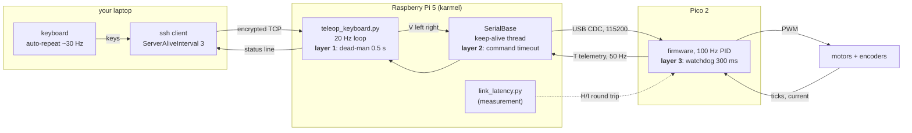

# P01 — Project 1 — Robot drives manually

<!-- glance:start -->
<!-- generated by tools/build.py from curriculum/syllabus.yaml — edit the syllabus, not this block -->

| | |
|---|---|
| **Track** | Project |
| **Difficulty** | Beginner |
| **Time** | 2 h |
| **Hardware** | Stage 1 robot: Pi 5, Pico, encoder motors, driver, chassis, battery, distance sensors (stage 1) |
| **Software** | none |
| **Prerequisites** | [01.15 Drive it from your laptop — keyboard teleop over the network](../01-first-robot/01.15-teleop-from-laptop.md) |

<!-- glance:end -->

## Goal

Your robot drives around a room under your control from a laptop, and it stops by itself the
moment you stop asking it to move — whether you released the key, closed the lid, killed the
process or pulled the USB cable. At the end of this project you can hand the laptop to someone
who has never seen the robot, let them drive it for three minutes without hitting anything, and
then show them a table of measured numbers: the link latency, the stopping distance, and which of
the three independent stop layers fires for each way of breaking the system.

This is the first project because it is the first thing that has to be true forever. Everything
later in the course — PID, odometry, Nav2, an arm, an LLM issuing commands — moves a robot that
must still stop when the thing commanding it goes away.

## Why this project

Driving a robot with a keyboard is not an achievement; *proving that it stops* is. The habit you
build here is the one the course keeps asking for: don't claim a safety property, measure it.
"The robot stops when I let go" becomes "over 10 trials the robot travelled 11.4 cm ± 1.8 cm after
key release at 0.20 m/s, worst case 14.9 cm", and now it is a fact you can design against.

Three things feed forward from here:

- **The lease pattern.** A drive command is a lease that expires, never an order that persists.
  `cmd_vel` in [04.16](../04-ros2/04.16-your-robot-as-ros2-node.md) works exactly this way, and so
  does Nav2's controller in module 12.
- **A measured latency and stopping distance.** [P02](P02-obstacle-avoidance.md) needs them to
  choose a braking threshold; [P05](P05-autonomous-square-path.md) needs them to choose a path
  speed. You will produce them here once and reuse them.
- **Evidence discipline.** A project directory with a CSV, a plot, a video and a short write-up.
  Every later project adds to that pile, and the final robot's safety case
  ([20.04](../20-final-robot/20.04-safety-case.md)) is built from it.

## Prerequisites

| Comes from | What it contributes |
|---|---|
| [01.15 Drive it from your laptop](../01-first-robot/01.15-teleop-from-laptop.md) | `teleop_keyboard.py`, the dead-man switch, the three stop layers, `link_latency.py` |
| [01.11 Drive forward, backward and rotate](../01-first-robot/01.11-drive-and-rotate.md) | open-loop driving, wheel sign conventions |
| [01.14 Battery monitoring](../01-first-robot/01.14-battery-monitoring.md) | voltage bands, what "low" means before the robot browns out |
| [01.10 The Pi ↔ Pico protocol](../01-first-robot/01.10-pi-pico-protocol.md) | the firmware watchdog and the telemetry flags you will read |
| [SAFETY.md](../SAFETY.md) | the ten standing rules; rules 1, 2, 3 and 7 are the ones this project exercises |

Check your readiness: `python course.py why P01`

## Hardware and software

| Item | Catalog id | Notes |
|---|---|---|
| Assembled robot with battery, fuse and switch | `robot-base` ([Stage 1](../HARDWARE.md)) | Pi 5, Pico 2, two encoder motors, DRV8874 drivers, 3S pack |
| Laptop on the same Wi-Fi | — | SSH client; Windows, macOS or Linux all work |
| A stand for the wheels | `tools` | a mug, a box, anything that lifts the wheels clear |
| Tape measure, masking tape, phone camera | `tools` | the tape measure is the only ground truth you have |

Software: Ubuntu Server 24.04 on the Pi with the course repo checked out, MicroPython firmware on
the Pico, Python 3.12 on the Pi. Versions come from
[`curriculum/versions.yaml`](../curriculum/versions.yaml).

**No-hardware alternative.** Everything except milestone 2 (the floor drive) and milestone 5
(tape-measured stopping distance) can be done against the fake Pico, which speaks the real
protocol over a real socket:

```bash
python -m robotlab.fake_pico --port 5760 --world apartment --realistic   # terminal 1
python labs/robot/teleop_keyboard.py --port socket://localhost:5760      # terminal 2
```

You still get the latency numbers, the stop-layer table (cases A and B), and the write-up. You do
not get the floor, which is where the surprises live.

## Architecture

You are not writing much code in this project — you are wiring together what modules 01 gave you
and adding measurement. This is the system under test:



The interfaces that matter:

| Interface | Contract |
|---|---|
| keyboard → teleop loop | every key received refreshes `last_key_time`; nothing else means "keep going" |
| teleop → `SerialBase` | `set_wheel_velocity(left, right)` in rad/s, resent every loop even when unchanged |
| `SerialBase` → Pico | `V <seq> <left_mrad_s> <right_mrad_s>*<checksum>`, at least every 300 ms |
| Pico → Pi | `T <ms> <lticks> <rticks> <l_mrad_s> <r_mrad_s> <batt_mV> <range_mm> <flags>` at 50 Hz |
| flags | `1` watchdog tripped · `2` low battery · `4` range error · `8` velocity mode |

Note what is *not* in the diagram: there is no path by which a stalled laptop keeps the wheels
turning. That absence is the deliverable.

## Milestones

### Milestone 1 — Bench check, wheels in the air

> [!CAUTION]
> **Safety:** the robot goes on a stand with both wheels clear of the bench before any drive
> command. Battery fused and switched, switch within reach ([SAFETY.md](../SAFETY.md) rules 1, 2
> and 4). Keep fingers, cables and hair away from the gearbox — a 1:56 gearmotor does not notice
> a finger. No pets in the room.

1. Charge the pack, check it reads 12.0–12.6 V at the switch with a multimeter, and confirm the
   inline fuse is present.
2. `ssh karmel`, then `python labs/robot/teleop_keyboard.py` with the wheels in the air.
3. Press `w`: both wheels turn *forward* (top of the wheel moves toward the robot's front). Press
   `a`: the robot would rotate counter-clockwise seen from above — left wheel back, right wheel
   forward. Fix the wiring or the sign, not your mental model, if either is reversed.
4. Read the status line: battery in volts, `range` in metres, `flags 8` while driving.

**Done when** all six keys do what their name says with the wheels up, and the status line shows a
battery voltage that matches your multimeter within 0.2 V.

### Milestone 2 — Floor drive

> [!CAUTION]
> **Safety:** clear a 2 × 3 m area. Nothing fragile, no cables across the floor, stairs blocked,
> people and pets out. Start at `--speed 0.10`. One hand stays on the battery switch for the first
> five minutes of floor driving.

1. `python labs/robot/teleop_keyboard.py --speed 0.10 --turn-rate 0.8 --deadman 0.5`.
2. Mark a 3 m course with masking tape: forward, a 90° turn, forward, back to the start.
3. Drive it at 0.10 m/s until it feels boring, then at 0.20 m/s, then 0.30 m/s. Notice that the
   difficulty grows faster than the speed does — that is the quadratic term you will compute in
   milestone 4.

**Done when** you drive the course three times in a row at 0.20 m/s without touching anything and
without a single unintended stop.

### Milestone 3 — Measure the link

1. On the Pi, over USB, to get your baseline:
   `python 01-first-robot/code/link_latency.py --port /dev/ttyACM0`
2. Over the network, to get what you actually drive with: run the fake Pico on the Pi
   (`python -m robotlab.fake_pico --host 0.0.0.0 --port 5760`) and
   `python 01-first-robot/code/link_latency.py --port socket://karmel.local:5760` from the laptop.
3. Repeat in the worst realistic conditions: far from the access point, with a video streaming on
   the same Wi-Fi. Turn Wi-Fi power save off and repeat once more.
4. Record p50, p99 and max for the round trip, and the `command -> motion` figure.

**Done when** you have a four-row table (USB / good Wi-Fi / bad Wi-Fi / power-save off) with p50,
p99 and max, and you can say in one sentence which statistic changed when you turned power save
off and why the mean did not.

### Milestone 4 — Turn latency into a speed limit

The arithmetic is two terms, and the second one is why "it was fine at 0.2 m/s" proves nothing:

$$d_{\text{stop}} = v\,t_{\text{reaction}} \;+\; \frac{v^{2}}{2a}$$

`reaction` is your measured link p99 plus one loop period (50 ms at 20 Hz) plus the motor time
constant (0.08 s from [`karmel.yaml`](../labs/config/karmel.yaml)); `a` is how hard the robot
actually brakes, which you measure rather than assume.

```bash
# measure a: drive at 0.30 m/s, hit space, tape-measure the coast
python projects/code/safety_envelope.py --coast 0.30 0.045

# then the table, with your measured link p99
python projects/code/safety_envelope.py --link-latency 0.030 --loop-hz 20 --clearance 0.50
```

With a 30 ms p99, a 20 Hz loop and a braked deceleration of 1.0 m/s² (karmel's
`max_linear_accel_m_s2`), the reaction time is 160 ms and the table looks like this:

| Speed | Blind | Braking | Stopping |
|---|---|---|---|
| 0.10 m/s | 1.6 cm | 0.5 cm | 2.1 cm |
| 0.20 m/s | 3.2 cm | 2.0 cm | 5.2 cm |
| 0.30 m/s | 4.8 cm | 4.5 cm | 9.3 cm |
| 0.50 m/s | 8.0 cm | 12.5 cm | 20.5 cm |

Five times the speed is ten times the stopping distance. Now do it again with the *bad* Wi-Fi p99
from milestone 3 and watch the blind column overtake the braking column.

**Done when** you have both tables (good link, bad link) and a stated maximum teleop speed for
your flat, with the clearance you assumed written next to it.

### Milestone 5 — Stopping-distance trials

> [!CAUTION]
> **Safety:** this milestone deliberately lets the robot run without a command. Open floor, hand
> on the switch, nobody else in the room.

1. Lay a tape line. Drive at a steady 0.20 m/s, and release `w` exactly as the wheel axle crosses
   the line.
2. Measure how far past the line the robot ends up. Ten trials.
3. Record them in `projects/evidence/P01/release_stop.csv` with a header `trial,stop_cm`.
4. Build the acceptance table:

```bash
python projects/code/report.py projects/evidence/P01/release_stop.csv --column stop_cm \
    --criterion "abs_mean<=15" --criterion "abs_max<=20" --criterion "n>=10" \
    --unit cm --title "P01 - stop after key release, 0.20 m/s"
```

**Done when** `report.py` exits 0 and the table is in your write-up. If it exits 1, that is a
finding, not a failure: raise `--deadman`? No — *lower* it toward your terminal's repeat delay, or
lower the speed. Write down which you chose.

### Milestone 6 — Break it on purpose

> [!CAUTION]
> **Safety:** you are creating uncontrolled robot states on purpose. `--speed 0.10`, open floor,
> hand on the battery switch, and nothing you mind being bumped.

Break exactly one thing at a time while holding `w`, and time the stop (film at 60 fps and count
frames, or watch the status line and the wheels):

| # | What you break | Which layer should catch it |
|---|---|---|
| 1 | laptop Wi-Fi off (airplane mode) | 1 — dead-man |
| 2 | close the lid / `~.` to kill the SSH client | 1, then `SIGHUP` cleanup |
| 3 | `kill -9` the teleop process from a second SSH session | 3 — firmware watchdog |
| 4 | unplug the Pico's USB cable mid-drive | 3 — firmware watchdog |
| 5 | pull the power to the Pi (do this last, at 0.10 m/s) | 3 — firmware watchdog |

After case 4 and 5, reconnect and check the first telemetry line: `flags & 1` should be set.

**Done when** all five rows have a measured stop time and a named layer, and you can explain why
cases 3–5 cannot be caught by anything running on the Pi.

### Milestone 7 — The demo and the write-up

Record a single continuous 2–3 minute video, without cuts, showing: the wheels-up sign check, a
floor drive around your marked course, one key release with the tape measure visible, and at least
two of the five failure cases with a clock or timer in frame. Then write
`projects/evidence/P01/README.md`: what you built, the four tables, the one thing that surprised
you, and your chosen teleop speed with its justification.

**Done when** someone who has not read this file can watch the video and the write-up and tell you
what your robot's stopping distance is.

## Acceptance criteria

- [ ] **Stop after key release:** over **10 trials at 0.20 m/s**, mean absolute travel after
      release ≤ **15 cm**, worst case ≤ **20 cm**. (`report.py`, milestone 5.)
- [ ] **All three layers demonstrated:** five failure cases, each stopping the robot within
      **0.8 s**, each attributed to the correct layer with a measurement, not a guess.
- [ ] **Link measured:** p50, p99 and max round trip, and `command -> motion`, over USB and over
      Wi-Fi, with and without Wi-Fi power save. p99 over your normal Wi-Fi ≤ **100 ms**; if it is
      not, you have a Wi-Fi problem to fix before P02.
- [ ] **Speed limit justified:** a stopping-distance table from `safety_envelope.py` using *your*
      measured p99 and *your* measured deceleration, and a chosen teleop speed whose stopping
      distance is at most **half** the clearance you drive with.
- [ ] **Three minutes of driving** around a marked course at your chosen speed with **zero**
      collisions and **zero** unintended stops.
- [ ] **Battery stays healthy:** voltage never drops below **10.5 V** (`low_warning_v`) during the
      session, and you logged the start and end voltage.
- [ ] **Hold-to-drive is genuinely hold-to-drive:** there is no key sequence that leaves the robot
      moving with nothing being pressed. Try to find one.
- [ ] **Evidence exists:** CSV, four tables, video, write-up, all in `projects/evidence/P01/`.

## Safety

Read [SAFETY.md](../SAFETY.md) before the first floor run. The rules this project leans on:

- **Rule 1 — wheels in the air for first tests.** Milestone 1 is not optional, even the second
  time you do this project.
- **Rule 2 — a switch you can reach in one second.** Until you build the e-stop in Stage 6, the
  battery switch *is* the e-stop. Know where it is without looking.
- **Rule 3 — watchdogs everywhere.** Never raise `--deadman` above 1 s "just for this test", and
  never comment out the firmware watchdog. Milestone 6 exists to prove all three still work.
- **Rule 7 — clear the test area.** Children and pets are drawn to a moving robot precisely when
  you least want them there. Stairs blocked, cables up.

Project-specific hazards:

| Hazard | Control |
|---|---|
| Robot drives off a step or down stairs while you look at the terminal | Test on one level, block doorways, drive at 0.10 m/s until milestone 6 is done |
| Wheels pinch fingers or eat a charging cable during the bench check | Stand, tidy bench, nothing loose within a wheel's reach |
| Li-ion pack shorted by a stray strand or a dropped tool | Fuse in place, covered connectors, power off before touching wiring (rule 9) |
| Pack over-discharged during a long session | Watch the status line; stop at 10.5 V, never drive below `cutoff_v` 9.9 V |
| Pi browns out when the motors start, taking Wi-Fi with it | If it happens, stop and read [02.02 Power budget](../02-robot-electronics/02.02-power-budget.md) — it is a wiring problem, not a software one |

## Troubleshooting

### Symptom: the robot stutters while I hold a key

Measure before changing anything: does the status line flip between `MOVING` and `stopped`?

1. **Yes, roughly twice a second** → your `--deadman` is shorter than the terminal's initial
   auto-repeat delay (250–500 ms). Raise it to 0.5 s. This is the single most common cause.
2. **Yes, irregularly, and `flags` shows `9`** → commands are not reaching the Pico. Check
   `base.stats` for `bad_lines` and `ack_timeouts`; a `bad_lines` count that grows means a serial
   problem (cable, baud, a second process on the port), not a network problem.
3. **No, the status line is steady but the wheels stutter** → the motors, not the link. Battery
   under load (check the voltage *while* driving), or duty near the 0.12 deadband.

### Symptom: it takes half a second to respond

Run `link_latency.py` rather than guessing, and read the rows in order:

1. **Round trip large even over USB** → the Pi is busy. `top`; an `apt` job or a runaway process.
2. **Round trip fine, telemetry interval spiky** → your loop is being delayed. Remove prints.
3. **Round trip p99 large over Wi-Fi only** → power save, congestion, or distance. Compare 2.4 GHz
   and 5 GHz directly; the robot's antenna is low, inside a metal-ish chassis, and moving.
4. **All three fine and it still feels slow** → that is the 80 ms motor time constant plus your
   status line being 20–50 ms behind reality. It is real, it is physics, and it is why the speed
   limit from milestone 4 matters.

### Symptom: the stop distance varies wildly between trials

1. **Is the speed actually the same each trial?** You are driving open loop at this point; a
   tired battery is a slower robot. Log the voltage per trial and check for a trend.
2. **Is the release point consistent?** Releasing "as it crosses the line" by eye has about
   ±3 cm of human error at 0.20 m/s. Film it and use the frames instead.
3. **Different surfaces?** Tile and rug differ by a factor of two in braking distance. Measure on
   the surface you actually drive on, and say which in the write-up.
4. **Still noisy after all that?** Report the spread honestly: `sd` is a number, not an
   embarrassment. It is what [P04](P04-pid-movement.md) will reduce.

### Symptom: `could not open port /dev/ttyACM0`

Something else owns it — a leftover teleop, an `mpremote repl`, a previous crash. `fuser -v
/dev/ttyACM0`, stop it, retry. One owner per serial port, always.

### Symptom: the robot did NOT stop in one of the failure cases

Stop the project and fix this before anything else.

1. Reproduce it with the wheels in the air and the fake Pico, so you can add prints safely.
2. Check which layer was supposed to fire. If it was layer 3, read the Pico's `watchdog_ms`
   parameter — something may have set it to 0 or a huge value with a `P` command.
3. Confirm the firmware actually running on the Pico is the course firmware and not a stale copy.
4. Re-run milestone 6 from the top after the fix. A safety property you fixed but did not re-test
   is not fixed.

## Stretch goals

1. **Teleop with an acceleration limit.** Ramp the commanded speed at `max_linear_accel_m_s2`
   instead of stepping it, and re-measure the stopping distance. Does it get better or worse, and
   why is the answer "both"?
2. **A gamepad instead of a keyboard.** A USB or Bluetooth pad gives you a proportional stick and
   a real dead-man button. The lease pattern does not change — the trigger is now an axis value.
3. **A live dashboard.** A second terminal plotting speed, battery, range and rolling p99 latency
   from the telemetry stream, using [`plot_telemetry.py`](../labs/robot/plot_telemetry.py) as the
   starting point.
4. **A safety veto.** Refuse forward motion when the front range reading is below the braking
   threshold from milestone 4, and refuse any motion when the battery band is critical. This is
   [P02](P02-obstacle-avoidance.md) arriving early — do it here and P02 gets easier.
5. **Drive it from outside the flat.** A VPN or reverse tunnel, then repeat milestone 3. Watch what
   a 60 ms p50 does to your speed limit. (See
   [03.10 Networking for robots](../03-robot-software/03.10-networking-for-robots.md).)

## Evidence to keep

Put everything in `projects/evidence/P01/` (small files are fine in Git; video is git-ignored, so
keep it locally or upload it and link it):

| File | What it holds |
|---|---|
| `README.md` | the write-up: what you built, the tables, what surprised you, your chosen speed |
| `release_stop.csv` | `trial,stop_cm` — the 10 stopping-distance trials |
| `link_latency.md` | the four-row latency table (USB / good / bad / power-save off) |
| `safety_envelope.md` | the stopping-distance tables from `safety_envelope.py`, both links |
| `stop_layers.md` | the five failure cases: what you broke, which layer fired, measured time |
| `battery.md` | start and end voltage, session length |
| `drive.mp4` | the continuous 2–3 minute demo video (git-ignored — keep it locally) |

Keep the numbers, not just the conclusion. [P02](P02-obstacle-avoidance.md) reuses your reaction
time and deceleration directly, and [P04](P04-pid-movement.md) will compare its stopping distance
against the one you measured here.

## Progress checkpoint

```bash
python course.py project P01 start     # when you begin
python course.py project P01 done      # when every acceptance criterion is ticked
```

Next: [P02 — Obstacle avoidance](P02-obstacle-avoidance.md) once you have done
[01.13](../01-first-robot/01.13-distance-sensors-stop.md), or
[P03 — Encoder-based movement](P03-encoder-movement.md) after
[01.12](../01-first-robot/01.12-encoder-distance-and-square.md). P02 takes the reaction time and
deceleration you measured here and gives the robot the job of noticing obstacles itself.
