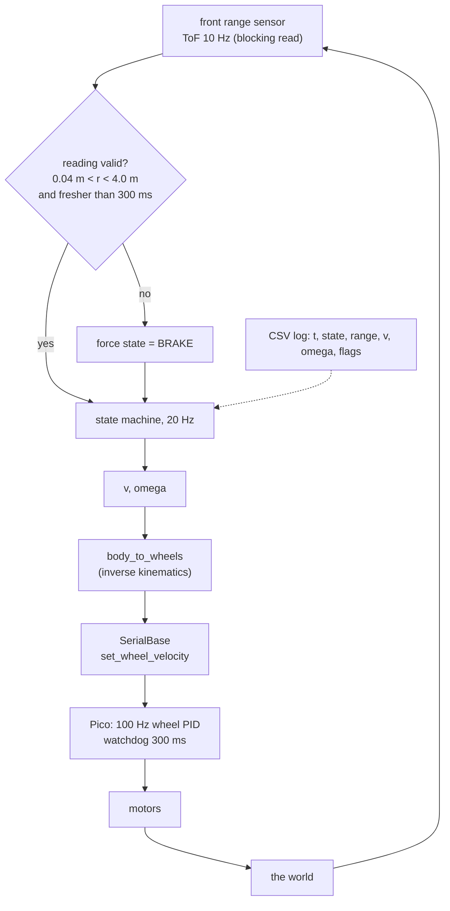
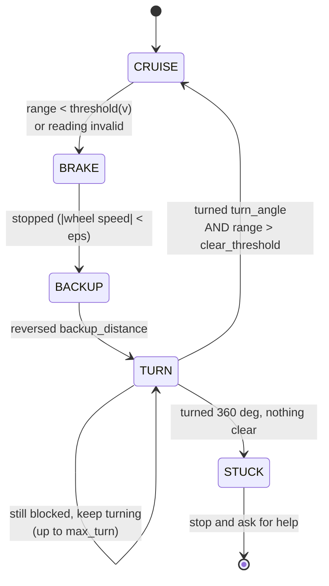

# P02 — Project 2 — Obstacle avoidance

<!-- glance:start -->
<!-- generated by tools/build.py from curriculum/syllabus.yaml — edit the syllabus, not this block -->

| | |
|---|---|
| **Track** | Project |
| **Difficulty** | Beginner |
| **Time** | 3 h |
| **Hardware** | Stage 1 robot: Pi 5, Pico, encoder motors, driver, chassis, battery, distance sensors (stage 1) |
| **Software** | python |
| **Prerequisites** | [01.13 Ultrasonic and ToF sensors — stop before hitting things](../01-first-robot/01.13-distance-sensors-stop.md)<br>[P01 Project 1 — Robot drives manually](P01-manual-drive.md) |

<!-- glance:end -->

## Goal

Put the robot on the floor of a cluttered room, press Enter, and walk away. It drives forward on
its own, notices obstacles before touching them, backs off, turns to a clear direction, and carries
on — for five minutes, without you. When it does eventually fail, you can say in advance *which*
obstacles it will fail on and why, because you measured its field of view and its stopping distance
instead of hoping.

This is the first autonomous behaviour in the course: the first time the robot decides something.
It is also the first time the robot can be wrong on its own, which is why half of this project is
about the failure envelope rather than the happy path.

## Why this project

[P01](P01-manual-drive.md) proved the robot stops when *you* stop commanding it. This one closes a
loop that has no human in it at all: sensor → decision → motors → world → sensor. Every autonomous
behaviour later in the course has exactly this shape, only with a better sensor and a better
planner. Nav2's collision monitor in [12.10](../12-navigation/12.10-recovery-and-navigation-safety.md)
is this project with a LiDAR and a costmap.

Three ideas are worth more than the working demo:

- **"No reading" is not "all clear".** A sensor that returns nothing is the most dangerous state
  there is, because the naive code treats it as free space. Here you make missing data mean *stop*,
  and you will keep making it mean stop for the rest of the course.
- **A state machine beats a pile of `if`s.** Five named states with explicit transitions is the
  difference between a robot you can debug and one that "sometimes gets stuck in corners". You will
  meet this again as behaviour trees in [19.05](../19-llm-robot-agents/19.05-behavior-trees.md).
- **Know your blind spots numerically.** Your ToF sensor has a 27° cone. At 30 cm that cone is
  14 cm wide and your robot is 20 cm wide. The robot is *blind to its own corners* closer than
  42 cm, and no amount of tuning changes that — only a second sensor or a different approach angle
  does.

## Prerequisites

| Comes from | What it contributes |
|---|---|
| [01.13 Ultrasonic and ToF sensors — stop before hitting things](../01-first-robot/01.13-distance-sensors-stop.md) | both sensors, the validity rules, `stop_before_obstacle.py`, the braking threshold |
| [P01 Manual drive](P01-manual-drive.md) | your measured link latency, braking deceleration and stopping-distance table |
| [01.11 Drive forward, backward and rotate](../01-first-robot/01.11-drive-and-rotate.md) | the open-loop turn you will use to escape |
| [03.04 Timing and concurrency](../03-robot-software/03.04-timing-and-concurrency.md) (helpful) | why a 30 ms blocking sensor read must not live in a 100 Hz control loop |
| [SAFETY.md](../SAFETY.md) | rules 3, 6, 7 and 8 — watchdogs, software limits, a clear area, a hand on the stop |

Check your readiness: `python course.py why P02`

## Hardware and software

| Item | Catalog id | Notes |
|---|---|---|
| Assembled robot | `robot-base` ([Stage 1](../HARDWARE.md)) | with **both** front sensors fitted: VL53L1X ToF and US-100 ultrasonic |
| Obstacle set | — | a cardboard box, a book standing up, a chair, a wastepaper bin, a rolled towel, a mirror or picture glass, a black sock |
| Tape measure and masking tape | `tools` | for the approach trials |
| Phone camera | `tools` | the endurance run is the demo |

The sensor geometry, from [`labs/config/karmel.yaml`](../labs/config/karmel.yaml): the front range
sensor sits at x = 0.125 m (level with the chassis front), z = 0.05 m, max range 4.0 m, field of
view 0.47 rad = **27°**.

**No-hardware alternative.** The whole project runs against the fake Pico with simulated, noisy
sensors and a walled world:

```bash
python -m robotlab.fake_pico --port 5760 --world room --realistic --seed 3   # terminal 1
python labs/robot/stop_before_obstacle.py --port socket://localhost:5760 --speed 0.20
```

The simulator gives you a 5-ray cone and 1 cm of range noise, so the reflex loop, the state machine
and the endurance run are all real work. What it will not give you is the black sock, the glass
door and the chair leg — milestone 5 is hardware-only, and it is the milestone that teaches the
most.

## Architecture



The behaviour itself is five states and nothing else:



Interfaces and the numbers behind them:

| Element | Contract | Where the number comes from |
|---|---|---|
| sensor task | 10 Hz, never blocks the control loop | the US-100 read blocks up to 30 ms ([01.13](../01-first-robot/01.13-distance-sensors-stop.md)) |
| validity gate | `None`, `0`, `> max_range` or older than 300 ms → BRAKE | "no reading means stop" |
| brake threshold | `stop_distance + v·t_reaction + v²/(2a)` | `safety_envelope.py`, your P01 numbers |
| BACKUP | 0.10 m at 0.10 m/s | enough to clear the 42 cm blind cone at the *next* approach |
| TURN | 45° steps, open loop (encoders, from 01.12, if you have them) | small enough to find a gap, large enough to escape a corner |
| STUCK | full circle with no clear direction → stop, log, beep | a robot that gives up is safer than one that grinds |

The `STUCK` state matters more than it looks. A reactive robot in a corner will happily oscillate
forever; the honest answer is to stop and say so.

## Milestones

### Milestone 1 — The reflex, with the wheels in the air

> [!CAUTION]
> **Safety:** wheels on a stand for the whole of this milestone
> ([SAFETY.md](../SAFETY.md) rule 1). You are about to write code that drives the robot forward
> with no human in the loop; the first time it runs, it must not be able to go anywhere.

1. Run [`stop_before_obstacle.py`](../labs/robot/stop_before_obstacle.py) with the wheels up and
   your hand as the obstacle. Watch the threshold in the printout change with `--speed`.
2. Compute *your* braking threshold rather than using the default. The ToF task runs at 10 Hz, so
   add its period as `--extra`:

```bash
python projects/code/safety_envelope.py --link-latency 0.002 --loop-hz 20 --extra 0.10 \
    --speeds 0.10,0.15,0.20,0.25,0.30 --clearance 0.25
```

With a USB link, a 20 Hz loop, the 10 Hz sensor and 1.0 m/s² of braking, the reaction time is
**232 ms** and the table is:

| Speed | Blind | Braking | Stopping |
|---|---|---|---|
| 0.10 m/s | 2.3 cm | 0.5 cm | 2.8 cm |
| 0.15 m/s | 3.5 cm | 1.1 cm | 4.6 cm |
| 0.20 m/s | 4.6 cm | 2.0 cm | 6.6 cm |
| 0.30 m/s | 7.0 cm | 4.5 cm | 11.5 cm |

Add a safety margin for sensor noise and the fact that the sensor sits at the chassis front: a
`stop_distance` of 0.20 m plus the stopping distance gives a threshold of about 0.27 m at
0.20 m/s.

**Done when** you can state your threshold as a formula with your measured numbers in it, and the
robot brakes with the wheels up whenever your hand enters the cone.

### Milestone 2 — "No reading" means stop

1. Make the loop treat all of these as BRAKE, not as free space: `range_mm == -1`, a reading of
   exactly 0, a reading above `max_range_m`, and **a reading that has not been updated for 300 ms**.
   The last one is the one people forget, and it is the one that catches a hung sensor task.
2. Test each, wheels up: cover the sensor with your palm (too close), point it at the ceiling
   (no return), unplug the sensor's I²C wire, and — with the robot driving in the simulator — stop
   the sensor task.
3. Log `state`, `range`, `age_ms` and `flags` to CSV at 20 Hz for every run from now on.

**Done when** all four cases put the robot in BRAKE within **300 ms**, and your CSV shows the
transition with the age of the last good reading next to it.

### Milestone 3 — The state machine, on the floor

> [!CAUTION]
> **Safety:** clear a 3 × 3 m area, no stairs, no cables, no pets, nothing fragile. Start at
> `--speed 0.10`. Keep a hand on the battery switch and your finger over `Ctrl-C` for every run in
> this milestone. This is the first code in the course that drives the robot with nobody steering.

1. Implement the five states and their transitions. Keep each state's entry and exit conditions in
   one place; a state machine you cannot draw is a state machine you cannot debug.
2. First run: `--speed 0.10`, one cardboard box, 2 m of runway. Watch for the transition, not the
   result.
3. Tune `backup_distance` and `turn_angle` until the robot escapes a single box reliably. Then a
   corner. Then a corridor 0.5 m wide.
4. Raise the speed to 0.20 m/s and re-check the threshold from milestone 1.

**Done when** the robot escapes a single box, an inside corner and a dead-end corridor without
help, ten times each, at 0.20 m/s.

### Milestone 4 — Approach trials, measured

1. Tape a line on the floor and stand a flat cardboard box on it, facing the robot square on.
2. Drive at 0.20 m/s from 2 m away, autonomously, and measure the final gap between the chassis
   front and the box with a tape measure. **Ten trials.**
3. Record `trial,clearance_cm` in `projects/evidence/P02/approach_flat.csv`, then:

```bash
python projects/code/report.py projects/evidence/P02/approach_flat.csv --column clearance_cm \
    --criterion "min>=10" --criterion "max<=30" --criterion "sd<=3" --criterion "n>=10" \
    --unit cm --title "P02 - approach a flat box at 0.20 m/s"
```

4. Repeat at 0.30 m/s **without** changing the threshold, predict what happens first, then look.

**Done when** the flat-box table passes, and you can explain the 0.30 m/s result with the two
terms of the stopping-distance formula rather than with "it was too fast".

### Milestone 5 — Find the failure envelope

This is the milestone that makes the project worth doing. Approach each of these at 0.15 m/s, five
times, and record what happened:

| Obstacle | What you are testing | Likely outcome |
|---|---|---|
| Flat cardboard box, square on | the baseline | stops cleanly |
| The same box at 45° | angled specular reflection | ultrasonic may miss it entirely; ToF usually fine |
| Chair leg (∅ 3 cm) | a target narrower than the cone | ToF sees it late or intermittently; expect contact |
| Chair leg approached off-centre by 12 cm | the 42 cm blind-corner geometry | the corner hits it while the sensor sees nothing |
| A black sock over the box | low IR reflectance | ToF range collapses; this is a *real* ToF failure mode |
| Glass door or a mirror | specular at both wavelengths | both sensors can miss it; this is why homes need bump sensors |
| A rolled towel, 8 cm tall | below the sensor's 5 cm beam at distance | seen or not depending on geometry — measure it |
| A step down / the top of the stairs | the one that destroys robots | **do not test with a real drop.** Use a table edge with a hand catching the robot, or don't test it at all |

> [!CAUTION]
> **Safety:** the drop-off row is not a dare. A single forward-facing range sensor cannot see a
> step down, and the robot *will* drive off it. Block the stairs, keep the robot on one level, and
> treat "needs a downward sensor or a cliff detector" as the finding.

**Done when** you have the table filled in with what actually happened, and for each failure you
have written one line naming the physical reason and the sensor that would fix it.

### Milestone 6 — Five minutes alone

> [!CAUTION]
> **Safety:** the full standing rules ([SAFETY.md](../SAFETY.md)): clear area, stairs blocked, no
> pets, hand near the switch, battery above 10.5 V at the start. "Walk away" means two metres away
> watching, not another room.

1. Build a 3 × 3 m arena with your obstacle set — boxes, a bin, a chair, at least one corner and
   one narrow gap.
2. Run for **five minutes** at 0.20 m/s, logging to CSV, filming continuously.
3. Count: contacts, interventions (you had to rescue it), `STUCK` exits, and invalid-reading
   fractions.
4. Plot the log: range over time with the state as a colour band underneath. Every contact should
   be visible as either "no reading" or "reading fine but the obstacle was outside the cone".

**Done when** the five minutes are on video, the log is plotted, and every contact has an
explanation from milestone 5's table.

## Acceptance criteria

- [ ] **Flat-obstacle approach, 10 trials at 0.20 m/s:** final clearance **≥ 10 cm** every trial,
      **≤ 30 cm** every trial, standard deviation **≤ 3 cm**. No contact.
- [ ] **Invalid reading → stop:** all four invalid cases (no return, too close, out of range, stale
      by 300 ms) put the robot in BRAKE within **300 ms**, shown in the CSV log.
- [ ] **Escape:** from **10** approaches to a single box, a corner and a corridor, the robot resumes
      driving without human help in **at least 9** of 10 for each.
- [ ] **Five-minute endurance:** at most **1** human intervention, and **zero** contacts with
      obstacles inside the sensor's stated envelope (flat, matte, ≥ 10 cm wide, ≥ 5 cm tall, within
      ±13° of centre, further than 42 cm at the moment of detection).
- [ ] **Failure envelope documented:** milestone 5's table, filled in from your own runs, with a
      physical reason and a proposed sensor fix for every failure.
- [ ] **Threshold justified:** your braking threshold is a formula with your measured reaction time
      and deceleration in it, not a constant you tuned by eye. Show the `safety_envelope.py` output.
- [ ] **`STUCK` works:** put the robot nose-first into a tight corner deliberately; it gives up and
      stops within one full rotation rather than grinding.
- [ ] **Watchdogs still intact:** repeat two of P01's failure cases (`kill -9`, unplug the Pico)
      *while the robot is driving autonomously*. It still stops within 0.8 s.

## Safety

Read [SAFETY.md](../SAFETY.md). This is the first project where the robot moves with nobody
steering, which changes the risk profile:

- **Rule 6 — software limits before hardware limits.** Cap `v` at 0.20 m/s in the code, not in
  your head. Cap the backup speed and the turn rate too. Raise one limit at a time, and only after
  a clean run at the lower one.
- **Rule 8 — one hand for the stop.** For every *first* run of a changed state machine, be ready
  before you press Enter.
- **Rule 7 — clear the test area.** A reactive robot goes where it likes. Stairs blocked, doors
  closed, pets out, cables up, nothing fragile at ankle height.
- **Rule 3 — watchdogs.** The autonomous loop is not an excuse to remove the dead-man; there is no
  key to hold now, so the *loop itself* must keep the lease alive and stop if it falls behind.

| Hazard | Control |
|---|---|
| Robot drives off a step or down stairs (a forward range sensor cannot see down) | One level only, stairs physically blocked, doorways to stairwells closed |
| Robot hits something it cannot see (glass, chair legs, dark fabric) | 0.20 m/s cap, obstacle set placed deliberately, arena free of anything valuable |
| Robot wedges under furniture and stalls the motors | `STUCK` detection, a stall timeout, and a session you are watching — a stalled 520 motor draws 3–4 A and gets hot |
| It keeps going after you `Ctrl-C` | It must not: the Pico watchdog stops it in 300 ms. Verify this in the acceptance criteria, do not assume it |
| Battery sags under repeated accelerate/brake cycles | Watch the voltage in the log; stop at 10.5 V |

## Troubleshooting

### Symptom: the robot stops far too early, or in the middle of nowhere

Look at the logged `range` and `age_ms` at the moment of the transition.

1. **Range jumped to a small value for one sample** → noise, not an obstacle. Add a median of the
   last 3 readings *before* the threshold test. Never median away a `None` — filter validity first,
   then smooth.
2. **`age_ms` was large** → the sensor task fell behind and the staleness rule fired, correctly.
   Find out why: a blocking ultrasonic read inside the control loop is the usual cause.
3. **Range is plausible and there really was nothing there** → is the sensor looking at the floor?
   At z = 0.05 m with a 13.5° half-angle, the cone reaches the floor at about 0.21 m ahead if the
   sensor is tilted down by only 1–2°. Check it is level with a straight edge.
4. **Only happens while turning** → the cone is sweeping across a wall. Expected; that is what the
   TURN state's `clear_threshold` hysteresis is for.

### Symptom: the robot hits things it should have seen

1. **Measure the geometry first.** Cone width is `2·d·tan(13.5°) = 0.48·d`. At 0.30 m that is
   14 cm; your chassis is 20 cm. Was the obstacle inside the cone at the moment it mattered?
2. **Check the threshold against the speed.** Recompute with `safety_envelope.py`. If the threshold
   is a constant and you raised the speed, the quadratic term ate your margin.
3. **Check the reaction time you assumed.** A 10 Hz sensor contributes up to 100 ms on its own. If
   your loop also averages 3 samples, you added 300 ms of lag and you must pay for it in distance.
4. **Look for a stale reading at the moment of contact.** If `age_ms` was climbing, the sensor
   stopped answering and the staleness rule should have braked. If it did not, the rule has a bug.

### Symptom: it escapes boxes but gets stuck in corners

1. **Is `turn_angle` a divisor of 360?** 45° and 90° will re-visit the same headings forever in a
   symmetric corner. Add a small random jitter (±10°) to the turn, or alternate the turn direction.
2. **Is `backup_distance` big enough?** If the robot turns while still inside the blind 42 cm, it
   turns into the wall it cannot see. Back up further before turning.
3. **Does TURN check for clear *after* the turn or *during* it?** Checking during it will latch on
   a momentarily-clear reading as the cone sweeps a doorway.

### Symptom: readings are fine on the bench and terrible on the floor

1. **Sunlight.** The VL53L1X loses range badly in direct sun — Israeli afternoon sun through a
   window is enough. Test at the time of day you demo.
2. **Floor reflectivity.** A polished tile floor returns a strong signal from a shallow angle; a
   dark rug returns almost nothing. Both change the effective range.
3. **Power.** Motors running means a sagging 3.3 V rail if the wiring is marginal. Log the battery
   voltage alongside the range and look for correlation.
4. **Compare the two sensors.** Log the ToF *and* the ultrasonic simultaneously. When they
   disagree, the disagreement tells you which physical mechanism is failing.

### Symptom: the log shows the state machine oscillating between BRAKE and CRUISE

You have no hysteresis. Use two thresholds: brake below `threshold`, resume only above
`threshold + 0.10 m`. This is the same fix as a thermostat's deadband, and you will use it again for
every "is it close enough" decision in the course.

## Stretch goals

1. **Use both sensors and fuse them.** Take the *minimum* valid range of ToF and ultrasonic, and log
   how often each was the one that saved you. The answer is surprisingly close to 50/50 in a real
   room, and it is the first taste of the sensor comparison in [07.03](../07-sensors/07.03-ultrasonic-sensors.md) and [07.04](../07-sensors/07.04-tof-sensors.md).
2. **Add a bump sensor.** Two cheap microswitches on a front bumper cover everything the range
   sensors miss: glass, chair legs, dark fabric. Make contact an immediate reverse, and count how
   often it fires during the five minutes.
3. **Sweep the sensor.** Mount it on a small servo and scan ±45° at 2 Hz. You now have a 3-sector
   "poor man's LiDAR" and can choose *which way* to turn instead of always turning the same way.
   This is the idea LiDAR makes cheap in module 11.
4. **Wall following.** Keep a constant distance to the wall on your right with a proportional
   controller. It is [P04](P04-pid-movement.md)'s controller applied to a range reading, and it
   turns random wandering into coverage.
5. **Coverage measurement.** Tape a 3 × 3 m grid of 0.5 m squares and count which squares the robot
   visited in five minutes. Random bouncing covers a room far worse than intuition suggests — that
   result is the motivation for mapping in [P09](P09-mapping.md).

## Evidence to keep

Everything in `projects/evidence/P02/`:

| File | What it holds |
|---|---|
| `README.md` | the write-up: your threshold formula, the tables, the failure envelope, what you would buy next |
| `approach_flat.csv` | `trial,clearance_cm` — the 10 flat-box approach trials |
| `approach_table.md` | the `report.py` output for the approach trials |
| `safety_envelope.md` | the stopping-distance table with your measured reaction time and deceleration |
| `failure_envelope.md` | milestone 5's table, filled in, with a physical reason per failure |
| `endurance.csv` | the 5-minute log: `t,state,range_m,age_ms,v,omega,battery_v,flags` |
| `endurance.png` | range over time with the state bands, and every contact marked |
| `endurance.mp4` | the continuous five-minute video (git-ignored — keep it locally) |

The failure envelope is the document you will reread when you buy a LiDAR. Write it for the person
you will be in three months.

## Progress checkpoint

```bash
python course.py project P02 start
python course.py project P02 done
```

Next: [P03 — Encoder-based movement](P03-encoder-movement.md), which gives the robot the ability to
go somewhere *specific* instead of simply not hitting things. P02 and P03 are independent; do them
in either order. The combination — "drive 2 m, but stop if something is in the way" — is the first
robot that is both useful and safe, and it is what [P05](P05-autonomous-square-path.md) assumes.
