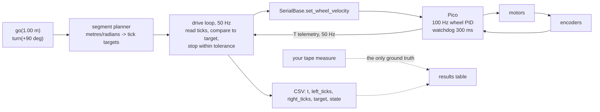

# P03 — Project 3 — Encoder-based movement

<!-- glance:start -->
<!-- generated by tools/build.py from curriculum/syllabus.yaml — edit the syllabus, not this block -->

| | |
|---|---|
| **Track** | Project |
| **Difficulty** | Beginner |
| **Time** | 3 h |
| **Hardware** | Stage 1 robot: Pi 5, Pico, encoder motors, driver, chassis, battery, distance sensors (stage 1) |
| **Software** | none |
| **Prerequisites** | [01.12 Use encoders to drive exact distances and angles — drive a square](../01-first-robot/01.12-encoder-distance-and-square.md) |

<!-- glance:end -->

## Goal

Your robot gains two primitives it did not have before: `go(distance)` and `turn(angle)`. You say
"forward 1.00 m" and it goes 1.00 m — not "about a metre", but a distance you have measured with a
tape over five trials and can quote with a mean, a spread and a worst case. You say "left 90°" and
it turns 90°, with the same evidence. Then you compose them into a 1 m square and measure how far
from the start it lands.

The deliverable is not really the square. It is the table at the end that separates **bias** (the
robot is wrong the same way every time — a wrong constant, and calibration removes it) from
**spread** (the robot is wrong differently every time — slip and surface, and no calibration
touches it). Every estimation lesson in the rest of the course is built on that distinction.

## Why this project

[P01](P01-manual-drive.md) and [P02](P02-obstacle-avoidance.md) gave the robot reflexes. This one
gives it *intent*: the ability to go somewhere specific. Everything afterwards is a better version
of the same idea — [P04](P04-pid-movement.md) makes the motion accurate under disturbance,
[P05](P05-autonomous-square-path.md) chains segments into a path, [P08](P08-odometry.md) turns the
same arithmetic into a continuous pose estimate, and Nav2 in module 12 asks for a pose instead of a
distance.

The second reason is more subtle and is the one worth the four hours. At the end of this project
your robot will report, honestly and confidently, that it came back to within 1 cm of where it
started — while your tape measure says 9 cm. **A wrong constant produces a repeatable lie**, and
re-running the experiment can never reveal it. Only an independent measurement can. Internalise
that here, with a tape measure, and the Kalman filter in
[10.06](../10-localization/10.06-extended-kalman-filter.md) will make sense when you meet it.

## Prerequisites

| Comes from | What it contributes |
|---|---|
| [01.12 Use encoders to drive exact distances and angles](../01-first-robot/01.12-encoder-distance-and-square.md) | ticks ↔ metres and radians, `drive_square.py`, `square_repeatability.py`, the six error sources |
| [01.09 Reading encoders](../01-first-robot/01.09-reading-encoders.md) | quadrature counting, signs, what a tick is |
| [FM.02 Angles, degrees and radians](../optional-foundations/mathematics/FM.02-angles-and-radians.md) (optional) | radians as the working unit, if they are still not automatic |
| [SAFETY.md](../SAFETY.md) | rules 1, 2, 7 — this project runs open-loop motions with nobody steering |

Check your readiness: `python course.py why P03`

## Hardware and software

| Item | Catalog id | Notes |
|---|---|---|
| Assembled robot with working encoders | `robot-base` ([Stage 1](../HARDWARE.md)) | both channels of both encoders counting, signs correct |
| Tape measure (3 m or longer) | `tools` | **the only ground truth in this project** |
| Digital calipers | `tools` (optional, recommended) | measuring the wheel diameter to 0.1 mm changes your answer by 1–2 % |
| Masking tape, a plumb bob or a weighted string, a large protractor or a printed 360° disc | — | marking the start pose and measuring heading |
| A flat floor, at least 2.5 × 2.5 m, one surface type | — | tile *or* rug, not both — record which |

Software: the course repo on the Pi, `robotlab` installed, `labs/config/karmel.yaml` edited to hold
**your** measured numbers.

**No-hardware alternative.** Every milestone except the tape measurements runs against the fake
Pico, which reports ground truth alongside the robot's own belief — which is exactly the comparison
this project is about:

```bash
python labs/robot/drive_square.py --fake --side 1.0
python 01-first-robot/code/square_repeatability.py --fake --realistic --runs 5 --side 1.0
```

The simulator's "realistic" mode gives you wheel-radius mismatch, slip and noise, so the bias/spread
analysis is genuine. You lose only the humbling part: on the simulator you can *see* the truth, and
on the floor you have to go and measure it.

## Architecture



The conversion is the whole planner, and it is worth writing out once with your robot's numbers.
For karmel's defaults (11 pulses per motor revolution × 56:1 gearing × 4 quadrature edges =
**2464 ticks per wheel revolution**, wheel radius 45 mm, wheel separation 200 mm):

$$
\text{metres per tick} = \frac{2\pi r}{N} = \frac{2\pi \times 0.045}{2464} = 1.1475\times10^{-4}\ \text{m}
$$

$$
\text{ticks for } d = \frac{d}{1.1475\times10^{-4}},\qquad
\text{ticks per wheel for a spin of } \theta = \frac{(b/2)\,\theta}{1.1475\times10^{-4}}
$$

| Command | Arithmetic | Ticks |
|---|---|---|
| forward 1.000 m | $1.000 / 1.1475\times10^{-4}$ | **8 715** per wheel, both positive |
| turn +90° (left, in place) | $(0.100 \times 1.5708) / 1.1475\times10^{-4}$ | **1 369**: left −1 369, right +1 369 |
| turn +180° | as above, doubled | **2 738** per wheel |
| one full spin, +360° | | **5 476** per wheel |

One tick is 0.115 mm. Quantisation is *not* your problem; the constants are.

## Milestones

### Milestone 1 — Measure your robot, don't trust the catalog

1. Measure the wheel **diameter** with calipers, with the wheel on the robot and the robot's weight
   on it. A 90 mm wheel squashed under 1.6 kg is not a 90 mm wheel. Take three measurements at
   different rotations and average them.
2. Measure the **track width** — the distance between the two wheels' contact patches, not the
   outsides of the tyres. Measure outside-to-outside and subtract one tyre width.
3. Confirm the **ticks per wheel revolution** empirically: mark the tyre and the floor, roll the
   robot forward by hand for exactly 10 wheel revolutions, and read the tick delta. It should be
   within 1 % of 10 × 2464 = 24 640. If it is out by a factor of 2 or 4, your quadrature decoding
   is counting one edge instead of four (or vice versa) — fix that before going further.
4. Put your numbers in your own copy of `karmel.yaml`.

**Done when** the rolled-by-hand tick count matches your computed `ticks_per_wheel_rev` within 1 %,
and you have written down the diameter and track you measured, with the uncertainty of the
measurement (`±0.5 mm` is honest for a tape; `±0.1 mm` for calipers).

### Milestone 2 — `go(distance)`

> [!CAUTION]
> **Safety:** wheels in the air for the first run of any new motion code
> ([SAFETY.md](../SAFETY.md) rule 1). Then the floor, at 0.15 m/s, with a clear 3 m, a hand on the
> battery switch, and nothing in the path. The robot will drive with nobody steering it.

1. Write (or adapt from [`drive_square.py`](../labs/robot/drive_square.py)) a `go(distance_m)` that
   converts to ticks, drives at a fixed wheel velocity, and stops when *both* wheels have reached
   their target. Ramp the speed up over ~0.3 s; a step command slips the wheels and you will be
   measuring your ramp, not your constants.
2. Wheels up: command 1.00 m and check the tick counts hit 8 715 ± the tolerance you chose.
3. Floor: tape a start line, align the wheel axle with it, command 1.00 m, and measure from the
   line to the axle. **Five trials**, realigning each time.
4. Record `trial,distance_error_cm` (signed: positive = went too far) in
   `projects/evidence/P03/straight_1m.csv`.

```bash
python projects/code/report.py projects/evidence/P03/straight_1m.csv --column distance_error_cm \
    --criterion "abs_mean<=3" --criterion "sd<=1.5" --criterion "abs_max<=5" --criterion "n>=5" \
    --unit cm --title "P03 - forward 1.00 m"
```

**Done when** the table passes, and you can say whether your error is bias (`mean` far from zero,
`sd` small) or spread (`mean` near zero, `sd` large).

### Milestone 3 — `turn(angle)`

1. `turn(angle_rad)` spins in place: one wheel forward, one back, same tick magnitude.
2. Measuring the heading is the hard part. The cheapest reliable method: tape a long straight line
   on the floor, align the robot's wheel axle with it, turn +90°, and measure the perpendicular
   offset of a point 0.50 m ahead of the robot's centre using a second taped line at exactly 90°.
   A 1° error shows up as 8.7 mm at 0.5 m, which a tape measure resolves easily.
3. **Five trials of +90°**, five of −90°, five of +180°. Record signed error in degrees in
   `projects/evidence/P03/turn_90.csv`.

```bash
python projects/code/report.py projects/evidence/P03/turn_90.csv --column error_deg \
    --criterion "abs_mean<=5" --criterion "sd<=2" --criterion "abs_max<=8" --criterion "n>=5" \
    --unit deg --title "P03 - turn +90 deg in place"
```

**Done when** both tables exist and you have noticed something: turning in place has a **much**
larger spread than driving straight, because a spin is the worst case for wheel slip. That is
physics, not a bug.

### Milestone 4 — The square, and the lie

> [!CAUTION]
> **Safety:** a 2.5 × 2.5 m clear area, stairs blocked, pets out, hand near the switch. A square
> that goes wrong goes wrong sideways.

1. Compose four `go(1.00)` and four `turn(+90°)` into a counter-clockwise square.
2. Before the first run, **predict**: given your per-turn error from milestone 3, how far from the
   start will the robot land? A constant +2° per corner on a 1 m square puts it **9.7 cm** away; +1°
   puts it 4.9 cm away. Write your prediction down before you look.
3. Run it **five times counter-clockwise**, then five times clockwise. Mark the start pose with
   tape (a cross for the axle centre, a line for the heading) so you can measure both position and
   final heading.
4. For each run record: what the robot's *own* ticks say the closing error was, and what the tape
   says. `projects/evidence/P03/square_ccw.csv` with `run,odom_closing_cm,measured_closing_cm,measured_heading_deg`.

```bash
python projects/code/report.py projects/evidence/P03/square_ccw.csv --column measured_closing_cm \
    --criterion "abs_mean<=12" --criterion "sd<=6" --criterion "abs_max<=20" --criterion "n>=5" \
    --unit cm --title "P03 - 1 m square, counter-clockwise (tape measured)"

python projects/code/report.py projects/evidence/P03/square_ccw.csv --column odom_closing_cm \
    --unit cm --title "P03 - 1 m square, what the robot believes"
```

**Done when** you have both tables side by side and the gap between them is written in your
write-up in one sentence, in your own words.

### Milestone 5 — Bias versus spread, and who fixes what

1. Look at the two directions. If the counter-clockwise and clockwise squares miss in *opposite*
   directions by a similar amount, the dominant error is **wheel-radius mismatch** (one wheel is
   effectively bigger, so the robot curves the same way regardless of the plan). If they miss in
   the *same* direction, the dominant error is the **track width** being wrong (every turn is
   systematically too big or too small). This is the core insight of Borenstein's UMBmark test,
   which [09.05](../09-odometry/09.05-calibrating-odometry.md) turns into a calibration procedure.
2. Compute what a 2 % wheel-radius error costs: **2 cm on a 1 m straight**. And a 3 % track error:
   **2.7° on every 90° turn**, which is 10.8° around the square. Compare those to what you measured.
3. Fill in the table:

| Error source | What I measured | Systematic or random | Fixed in |
|---|---|---|---|
| Wheel radius wrong | | systematic | [09.05](../09-odometry/09.05-calibrating-odometry.md) |
| Track width wrong | | systematic | [09.05](../09-odometry/09.05-calibrating-odometry.md) |
| Left/right wheels differ | | systematic | [08.10](../08-control/08.10-straight-line-heading-control.md) |
| Stop tolerance and coasting | | systematic | [P04](P04-pid-movement.md) |
| Slip, especially in turns | | random | an IMU — [08.11](../08-control/08.11-rotate-exactly-90.md), [P05](P05-autonomous-square-path.md) |
| Tick quantisation (0.115 mm) | negligible | random | nothing |

> [!TIP]
> **Ask your teacher:** "Here are my clockwise and counter-clockwise square results. Walk me
> through how to tell wheel-radius error from track-width error, and show me the arithmetic with my
> numbers."

**Done when** every row has a number or an explicit "too small to see in my data", and you can name
the single biggest error source in your robot.

### Milestone 6 — Demo and write-up

Record a continuous video of one counter-clockwise square with the start mark and the tape measure
visible at the end, and one clockwise square. Then write `projects/evidence/P03/README.md`: your
measured constants, the four tables, the bias/spread verdict, and one sentence on what you will do
about it (the answer is "09.05", and stating that on purpose is the point).

**Done when** the write-up would let someone else predict your robot's square error before running
it.

## Acceptance criteria

- [ ] **Constants verified:** rolled-by-hand tick count within **1 %** of the computed
      `ticks_per_wheel_rev`; measured wheel diameter and track width recorded with their
      uncertainty.
- [ ] **Straight 1.00 m, 5 trials:** `abs_mean` ≤ **3 cm**, `sd` ≤ **1.5 cm**, worst ≤ **5 cm**.
- [ ] **Turn +90°, 5 trials:** `abs_mean` ≤ **5°**, `sd` ≤ **2°**, worst ≤ **8°**. Same for −90°.
- [ ] **1 m square, 5 runs each direction:** tape-measured closing error `abs_mean` ≤ **12 cm**,
      `sd` ≤ **6 cm**, worst ≤ **20 cm**.
- [ ] **The gap is documented:** the robot's own closing-error estimate and the tape-measured one,
      side by side, with the ratio between them stated.
- [ ] **Bias separated from spread:** for each of straight, turn and square, you state whether the
      dominant term is `mean` or `sd`, with the numbers that justify it.
- [ ] **Direction comparison done:** clockwise versus counter-clockwise, with a stated conclusion
      about which constant is most wrong.
- [ ] **Prediction beaten or explained:** your pre-run prediction of the square's closing error is
      recorded, and the difference between it and reality is explained.
- [ ] **Evidence exists:** four CSVs, four tables, two videos, the write-up.

## Safety

Read [SAFETY.md](../SAFETY.md). Open-loop timed motions have a specific hazard: the robot commits
to a distance and executes it whatever happens.

- **Rule 1 — wheels in the air** for the first run of `go`, `turn` and the composed square. The
  tick targets are easy to get wrong by a factor of 2, and a factor-of-2 error on the floor is a
  robot in the skirting board.
- **Rule 2 — a switch you can reach.** A `go(10.0)` typo is a robot leaving the room.
- **Rule 6 — software limits.** Cap the commanded wheel velocity well below
  `max_wheel_speed_rad_s` (17.0 rad/s) and cap the segment length in the code — refuse anything over
  3 m, refuse a turn over 2π.
- **Rule 7 — clear the area.** Stairs blocked, no cables, pets out. Five squares in a row is five
  chances for one to go sideways.

| Hazard | Control |
|---|---|
| A tick-conversion bug sends the robot metres too far | Wheels up first; a hard limit on the commanded segment; a timeout that stops the segment after `distance / speed × 2` seconds |
| The robot drives off a step while executing a committed segment | One level, stairs blocked. The encoders cannot see a drop |
| A stalled wheel makes the loop wait forever (targets never reached) | A per-segment timeout that stops and reports, plus the Pico's 300 ms watchdog as the backstop |
| Fingers near the wheels while checking alignment between trials | Power off between trials, or at minimum stop the program before touching the robot |

## Troubleshooting

### Symptom: the tick counts are wrong by a factor of 2 or 4

This is the most common encoder bug and it has a signature: your distances are out by exactly 2×,
4× or 0.5×, not by a few percent.

1. Roll the wheel by hand through exactly one revolution and read the delta. Compare with 2464.
2. A factor of 2 usually means one channel is being counted on one edge instead of both. A factor
   of 4 means only one channel is wired or decoded at all.
3. Check `encoder_cpr_motor`, `gear_ratio` and `quadrature_multiplier` in your config against the
   motor you actually bought — the Yahboom 520 comes in 205 RPM (1:56) and 333 RPM (1:30) versions
   and they are visually identical.

### Symptom: one wheel consistently overshoots its target

1. **Is the stop condition "both wheels reached target" or "either"?** With "either", the faster
   wheel stops the segment and the slower one is short. With "both", the faster one overshoots
   while waiting. Neither is right; the fix is controlling them together ([P04](P04-pid-movement.md)).
2. **Is the deadband biting?** Below `duty_deadband` (0.12) a motor does not turn at all. If your
   ramp-down goes below it, the wheel stops early and the tick target is never reached. Stop on
   "within tolerance", not on "exactly equal".
3. **Is one motor simply stronger?** Log the per-wheel speeds during a straight run. A 3 % constant
   difference is normal and is exactly what the heading loop in
   [08.10](../08-control/08.10-straight-line-heading-control.md) exists to remove.

### Symptom: the robot turns a different amount every time

Spread, not bias. Work through it in this order:

1. **Surface.** Turning in place scrubs the tyres sideways. Tile, laminate and a rug will give you
   three different numbers. Pick one surface and say which in the write-up.
2. **Speed.** Turn slower. Slip grows with the lateral force, which grows with the turn rate.
3. **Caster.** The ball caster at `caster_offset_x_m = -0.10` has to swivel at the start of every
   turn, and a dirty or sticky caster adds a random kick. Clean it, spin it by hand, check it is
   free.
4. **Weight distribution.** Battery over the wheels rather than over the caster keeps the drive
   wheels loaded and reduces slip.
5. **Still noisy?** That is the answer: encoders cannot observe slip, by construction. The fix is an
   IMU, which is why [08.11](../08-control/08.11-rotate-exactly-90.md) and
   [P05](P05-autonomous-square-path.md) need one.

### Symptom: the robot's own numbers say the square closed perfectly and the tape disagrees

Working as designed, and the most important result in the project. The robot computes its position
from ticks and its constants; if a constant is wrong, the computation is wrong in a consistent,
confident way. Do not "fix" it by trusting the robot.

1. Confirm it is a constant and not a bug: the error should scale linearly with the distance driven.
   Drive 2 m and check that the error doubles.
2. Run the square both directions. The comparison tells you *which* constant.
3. Do not calibrate yet — [09.05](../09-odometry/09.05-calibrating-odometry.md) does it properly
   with the UMBmark procedure. Record the numbers you will feed it.

### Symptom: results drift over a long session

Check the battery voltage against trial number. Below about 10.8 V the motors are noticeably slower,
the ramp takes longer, and the coast at the end changes. Log voltage per trial from now on — it is
one column and it answers this question forever.

## Stretch goals

1. **Add the obstacle reflex from [P02](P02-obstacle-avoidance.md).** `go(2.0)` that aborts and
   reports the distance actually travelled when something is in the way. That is the real contract
   every motion primitive in robotics has: goals can fail, and failing must be reportable.
2. **Drive a 2 m square and a 0.5 m square.** Plot closing error against side length. A linear
   relationship means a systematic constant; a flat one means fixed per-corner error.
3. **Repeat on three surfaces** — tile, laminate, a thin rug — with five runs each. Produce one
   table. This is the cheapest lesson in sim-to-real transfer you will ever get
   ([06.10](../06-simulation/06.10-sim-to-real-gap.md)).
4. **Drive a triangle and a pentagon.** Equilateral, same perimeter. Which closes best and why?
   (Hint: count the turns, and remember which primitive had the larger `sd`.)
5. **Blind-guess calibration.** From your clockwise/counter-clockwise data, estimate corrected
   values for `wheel_radius_m` and `wheel_separation_m`, apply them, and re-run. Then do
   [09.05](../09-odometry/09.05-calibrating-odometry.md) properly and compare your guess with
   UMBmark's answer.

## Evidence to keep

Everything in `projects/evidence/P03/`:

| File | What it holds |
|---|---|
| `README.md` | measured constants with uncertainties, the four tables, the bias/spread verdict, the biggest error source |
| `constants.md` | wheel diameter, track width, ticks/rev, how you measured each, and the surface you tested on |
| `straight_1m.csv` | `trial,distance_error_cm,battery_v` |
| `turn_90.csv` | `trial,error_deg,battery_v` (and the −90° and 180° files) |
| `square_ccw.csv`, `square_cw.csv` | `run,odom_closing_cm,measured_closing_cm,measured_heading_deg` |
| `tables.md` | the `report.py` output for all four |
| `square.mp4` | one clockwise and one counter-clockwise square, tape measure visible (git-ignored) |

[P04](P04-pid-movement.md) will re-measure the straight-line result after adding feedback control,
and the comparison only means something if today's numbers are honest. Do not round them in your
favour.

## Progress checkpoint

```bash
python course.py project P03 start
python course.py project P03 done
```

Next: [P04 — PID-controlled movement](P04-pid-movement.md), after module
[08 — Control](../08-control/08.01-open-vs-closed-loop.md) through
[08.10](../08-control/08.10-straight-line-heading-control.md). P04 attacks the spread you just
measured; [09.05](../09-odometry/09.05-calibrating-odometry.md) attacks the bias. You need both, and
knowing which is which is what you bought with this project.
