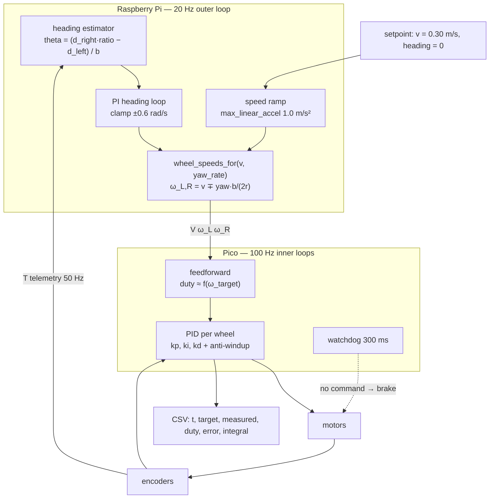

# P04 — Project 4 — PID-controlled movement

<!-- glance:start -->
<!-- generated by tools/build.py from curriculum/syllabus.yaml — edit the syllabus, not this block -->

| | |
|---|---|
| **Track** | Project |
| **Difficulty** | Intermediate |
| **Time** | 4 h |
| **Hardware** | Stage 1 robot: Pi 5, Pico, encoder motors, driver, chassis, battery, distance sensors (stage 1) |
| **Software** | python, matplotlib |
| **Prerequisites** | [08.10 Hold a straight line — cascaded heading control](../08-control/08.10-straight-line-heading-control.md)<br>[P03 Project 3 — Encoder-based movement](P03-encoder-movement.md) |

<!-- glance:end -->

## Goal

Your robot holds a commanded wheel speed and drives a straight line, and you can prove both with
plots rather than adjectives. Command 0.30 m/s and it does 0.30 m/s — on tile, on a rug, with a
full battery and with a nearly empty one, with a book on top and with your hand briefly pushing
against it. Command "3 m straight" and it lands within a few centimetres of a taped line, five runs
in a row.

Every gain in your final configuration is traceable to a measurement: a logged step response, a
fitted time constant, a documented tuning step. "I turned it up until it looked good" is not a
result, and the acceptance criteria are written so that it cannot pass.

## Why this project

[P03](P03-encoder-movement.md) left you with two numbers: a **bias** (the robot is consistently
wrong) and a **spread** (the robot is inconsistently wrong). Calibration in
[09.05](../09-odometry/09.05-calibrating-odometry.md) attacks the bias. Feedback control — this
project — attacks the spread, and it is the only tool that does. A tired battery, a rug, a slope, a
finger on the chassis: open loop, each of those is a different robot; closed loop, they are all the
same robot doing more work.

The structural idea here is the **cascade**, and it is worth more than the straight line:

```text
  slowest, on the Pi        20 Hz   heading  ->  a yaw-rate correction
  fastest, on the Pico     100 Hz   wheel speed  ->  duty, with feedforward
```

You will meet this exact layering again as joint-position-inside-velocity-inside-torque on the arm
in [module 14](../14-robotic-arm/14.01-arm-anatomy.md), and as Nav2's controller-inside-`cmd_vel`
in [module 12](../12-navigation/12.06-nav2-architecture.md). Getting the rate ratio and the
responsibilities right once, here, is the transferable skill.

And there is a trap in this project that you should walk into on purpose. Closing a heading loop on
the *encoders* does not make your robot drive straighter than the firmware already does — the outer
loop is controlling the same quantity the inner loops already control, using a sensor that shares
the same error. You will measure a controller that reports perfect success while the robot curves
28 cm off the line. That single experiment is worth the whole afternoon.

## Prerequisites

| Comes from | What it contributes |
|---|---|
| [08.10 Hold a straight line — cascaded heading control](../08-control/08.10-straight-line-heading-control.md) | the cascade, `straight_line.py`, the encoder-vs-gyro heading result, the radius-ratio calibration |
| [08.09 Feedforward + PID: drive at exactly 0.5 m/s](../08-control/08.09-feedforward-exact-speed.md) | the motor model and why feedforward does most of the work |
| [08.08 Tuning PID](../08-control/08.08-tuning-pid.md) | a tuning procedure you can defend, instead of knob-twiddling |
| [08.02 Motor step response](../08-control/08.02-motor-step-response.md) | measuring $K$ and $\tau$ from a log |
| [P03 Encoder-based movement](P03-encoder-movement.md) | the baseline numbers this project has to beat, and your measured constants |
| [SAFETY.md](../SAFETY.md) | rules 1, 6, 8 — new gains run wheels-up first, always |

Check your readiness: `python course.py why P04`

## Hardware and software

| Item | Catalog id | Notes |
|---|---|---|
| Assembled robot | `robot-base` ([Stage 1](../HARDWARE.md)) | encoders verified in P03; firmware with the wheel-speed PID and the `P <key> <value>` parameter command |
| A stand for the wheels | `tools` | used a lot in this project |
| 4 m × 1 m of clear floor, masking tape or chalk | — | the straight-line lane |
| Tape measure, a steel rule | `tools` | measuring lateral offset to the centimetre |
| A ~500 g weight (a book) and a 5° ramp (a plank on a book) | — | the disturbance tests |
| Multimeter | `tools` | battery voltage under load |

**No IMU in this project.** That is deliberate: `imu` is a Stage 2 part and it belongs to
[P05](P05-autonomous-square-path.md). Here you get as far as encoders and calibration can take you,
and you measure exactly where that wall is.

**No-hardware alternative.** The full tuning workflow runs in the simulator, including the
realistic wheel-radius mismatch that produces the headline result:

```bash
python 08-control/code/motor_step_response.py --plot step.png
python 08-control/code/pid_tuning.py --plot tuning.png
python 08-control/code/straight_line.py --plot straight_line.png
python 08-control/code/straight_line.py --metres 3 --speed 0.4 --kp 5 --ki 2
```

What simulation will not give you: a sagging battery, a rug, a sticky caster, and the moment you
push the robot with your hand and watch the integrator argue with you.

## Architecture



The rules that make a cascade work, and the number attached to each:

| Rule | Here | Why |
|---|---|---|
| Inner loop at least 5× faster than the outer | 100 Hz vs 20 Hz; bandwidth ≈ 12 rad/s vs 3 rad/s | If they are comparable, they fight and the path develops an S-wobble |
| Feedforward does the bulk, feedback does the correction | `ff` scale on the motor model | A PID starting from zero has to build the whole output through its integrator, slowly |
| Each loop owns one quantity | inner: wheel speed. outer: heading | Two loops controlling the same thing is the trap of this project |
| Saturation is handled where it happens | anti-windup in the Pico's PID; ±0.6 rad/s clamp on the yaw correction | An integrator that winds up during a stall lurches when the stall clears |

## Milestones

### Milestone 1 — Model one wheel

> [!CAUTION]
> **Safety:** the whole of milestones 1–3 is done with the robot on a stand, wheels clear. You are
> changing controller gains, and a badly tuned gain is a robot that leaves the bench
> ([SAFETY.md](../SAFETY.md) rules 1 and 6).

1. Log a step response per wheel: from rest, command a duty step, log wheel speed at 100 Hz for
   1 s. [`motor_step_response.py`](../08-control/code/motor_step_response.py) does this.
2. Fit the first-order model $\omega(t) = K u\,(1 - e^{-t/\tau})$. Read off $K$ (rad/s per unit
   duty) and $\tau$ (the time to reach 63 % of final). karmel's nominal $\tau$ is **0.08 s**.
3. Do both wheels and compare. A 3–6 % difference in $K$ is normal and is the thing your straight
   line will be fighting all afternoon.
4. Find the deadband: raise the duty in 0.01 steps until the wheel starts moving. karmel's nominal
   is **0.12**.

**Done when** you have $K$, $\tau$ and the deadband for each wheel, from plots, and the two wheels'
$K$ values differ by a number you have written down.

### Milestone 2 — Tune the inner wheel-speed loop, from data

1. Start with feedforward only (`P <seq> ff 1.0`, `kp/ki/kd` at zero). Command 8.89 rad/s
   (= 0.40 m/s) and measure the steady-state error. Feedforward alone typically lands within
   5–15 %.
2. Add $k_p$ using the procedure from [08.08](../08-control/08.08-tuning-pid.md) — not by feel.
   Raise it until the step response just begins to overshoot, then back off.
3. Add $k_i$ to remove the remaining steady-state error. Verify the anti-windup: hold the wheel
   with your finger for two seconds (gloved, at low speed — see the safety note), release, and look
   for a lurch. A lurch means the integrator wound up.
4. $k_d$ is usually unnecessary on a geared DC motor with a noisy 11-count encoder. Try it; if it
   makes the log noisier without making the response faster, leave it at zero and say so.
5. Log five step responses with your final gains and measure: **rise time, overshoot, 2 % settling
   time, steady-state error**.

> [!CAUTION]
> **Safety:** stalling a wheel with your finger is a deliberate test, not a casual one. Do it at
> a low setpoint (≤ 3 rad/s), with the wheel on the stand, using a wooden stick or a gloved hand,
> never bare fingers near the gearbox, and for no more than two seconds — a stalled 520 motor draws
> 3–4 A and heats up fast.

**Done when** the five step responses give: settling ≤ **0.5 s**, overshoot ≤ **15 %**,
steady-state error ≤ **3 %**, and you can point at the plot that justifies each gain.

### Milestone 3 — Speed holding under a dying battery

1. With the wheels up, command 6.67 rad/s (0.30 m/s) and log the measured speed and the battery
   voltage continuously while the pack drains from full (≈12.4 V) to the low warning (10.5 V). This
   takes a while; let it run and go do something else, but stay in the room.
2. Plot measured speed against battery voltage. Open loop, this line has a visible slope. Closed
   loop, it should be flat until the duty saturates.
3. Find the voltage at which the controller can no longer hold the setpoint (the duty hits 1.0).
   That voltage is your real low-battery cutoff for this speed — probably higher than 10.5 V.

**Done when** you have the plot and a stated voltage below which 0.30 m/s is no longer achievable.

### Milestone 4 — The straight line, and the trap

> [!CAUTION]
> **Safety:** the robot now drives on the floor at 0.40 m/s with nobody steering. Clear 4 m × 1 m,
> no cables, no pets, no children, no stairs, nothing fragile at the far end, and **do not aim it at
> a wall** — the 300 ms watchdog still lets it travel 12 cm after commands stop. Hand on the switch,
> `Ctrl-C` ready.

1. Tape a 3 m line on the floor and a start mark across it.
2. Run **five times open loop** (inner loops only, no heading correction) at 0.40 m/s and measure
   the lateral offset at 3 m with a steel rule.
3. Run **five times with an encoder-based heading loop**, uncalibrated. Predict the result before
   you run it.
4. Compare. On most robots the two are the same within the run-to-run spread, and the heading
   estimate reported ≈0.0° for every single run. The controller is controlling a quantity that the
   inner loops already control, through a sensor that shares its error.
5. Now recover the **radius ratio**: drive 3 m in a way you know is straight (nudge it along the
   tape line by hand at constant speed, or use the calibrated run from
   [08.10-E4](../08-control/08.10-straight-line-heading-control.md)), log the tick counts, and
   compute the ratio that would have made the encoder heading read zero. karmel's simulated robot
   needs **1.0131**; yours will be within a percent or two of 1.
6. Feed the ratio into the estimator and run five more times.

**Done when** you have three sets of five runs (open loop, uncalibrated heading loop, calibrated
heading loop) with lateral offsets measured by rule, and the third set is dramatically better than
the first two.

```bash
python projects/code/report.py projects/evidence/P04/straight_3m_calibrated.csv \
    --column offset_cm --criterion "abs_mean<=8" --criterion "abs_max<=15" \
    --criterion "sd<=5" --criterion "n>=5" --unit cm \
    --title "P04 - 3 m straight, calibrated encoder heading, 0.40 m/s"
```

### Milestone 5 — Disturbances

The point of feedback is what happens when the world is not as planned. Five tests, all at
0.30 m/s on the 3 m lane, three trials each:

| Disturbance | How | What to measure |
|---|---|---|
| Hand push | a firm sideways tap on the chassis mid-run | peak heading error, time and distance to return to the line |
| Extra mass | a 500 g book strapped on | steady-state speed error, settling time change |
| Surface change | half the lane on tile, half on a thin rug | speed dip at the transition, recovery time |
| Slope | a 5° ramp (a plank on a book) | can it hold the setpoint uphill? at what duty? |
| Low battery | repeat the run at 10.8 V | speed error and offset compared with a full pack |

Log every run. A disturbance test without a log is an anecdote.

**Done when** all five have three logged trials and a one-line conclusion each.

### Milestone 6 — Beat P03, or explain why not

1. Re-run [P03](P03-encoder-movement.md)'s straight 1.00 m trials with the tuned controller.
2. Re-run P03's 1 m square, five runs each direction.
3. Compare, honestly, with the same `report.py` criteria.

Expect the **spread** (`sd`) to shrink noticeably and the **bias** (`mean`) to stay roughly where it
was. That is the whole message of the project: control fixes repeatability, calibration fixes
correctness, and they are different problems. If your bias improved too, work out which constant
your tuning accidentally corrected.

**Done when** the before/after tables are side by side with a one-paragraph conclusion.

> [!TIP]
> **Ask your teacher:** "My `sd` dropped from 1.4 cm to 0.4 cm but my `mean` is still −2.6 cm.
> Explain, with my numbers, exactly which physical quantity is still wrong and why no controller can
> fix it."

## Acceptance criteria

- [ ] **Motor model measured:** $K$, $\tau$ and the deadband for each wheel, from logged step
      responses, with the plots kept.
- [ ] **Inner-loop step response, 5 trials at 8.89 rad/s:** 2 % settling ≤ **0.5 s**, overshoot
      ≤ **15 %**, steady-state error ≤ **3 %**.
- [ ] **Anti-windup demonstrated:** a 2 s stall at ≤ 3 rad/s followed by release produces no lurch;
      the integrator trace in the log stays bounded.
- [ ] **Speed holding:** commanded 0.30 m/s held within **±5 %** from a full pack down to the
      voltage where the duty saturates, with the plot and that voltage recorded.
- [ ] **3 m straight, calibrated, 5 runs:** lateral offset `abs_mean` ≤ **8 cm**, worst ≤ **15 cm**,
      `sd` ≤ **5 cm**.
- [ ] **The trap documented:** open loop versus uncalibrated encoder-heading loop, five runs each,
      with the measured offsets and the heading the controller *believed* it had. The conclusion is
      written in your own words.
- [ ] **Radius ratio identified** and recorded, with the method you used to obtain it.
- [ ] **Disturbance recovery:** after a sideways push producing at least 15° of heading error, the
      robot returns to within **10 cm** of the line within **1.5 s**, 3 trials.
- [ ] **Every gain is traceable:** for each of $k_p$, $k_i$, $k_d$, $ff$ and the outer $k_p$, $k_i$,
      a sentence saying what measurement set it, with the plot referenced.
- [ ] **P03 comparison:** before/after tables for the 1 m straight and the 1 m square, with the
      bias/spread conclusion.

## Safety

Read [SAFETY.md](../SAFETY.md). Tuning a controller is the single easiest way to build a robot that
runs away, because a wrong sign or a gain that is ten times too high makes the robot accelerate
*away* from its setpoint.

- **Rule 1 — wheels in the air.** Every new gain set runs on the stand first. Every single one. A
  sign error in the heading loop turns a straight line into a spiral at full speed.
- **Rule 6 — software limits before hardware limits.** Clamp the commanded wheel speed to well
  under `max_wheel_speed_rad_s` (17.0), clamp the yaw correction to ±0.6 rad/s, clamp the
  integrator. Raise limits one at a time, never two.
- **Rule 8 — one hand for the stop.** For the first floor run of any gain set, be ready before you
  press Enter.
- **Rule 3 — watchdogs.** Do not disable the 300 ms firmware watchdog to "get a cleaner step
  response". If it is interfering, your command loop is too slow, and that is the bug.

| Hazard | Control |
|---|---|
| A sign error makes the loop drive the error *up* | Wheels up; watch the direction of the correction before the floor; a clamp on every output |
| A high gain makes the robot oscillate violently and jump off the stand | Raise gains in ×1.5 steps, not ×10; keep a hand on the switch; secure the stand |
| Stalled motor during the anti-windup test draws 3–4 A and overheats | ≤ 3 rad/s, ≤ 2 s, a stick not a finger, let it cool between trials |
| Robot at 0.40 m/s reaches the end of the lane | 4 m of lane for a 3 m run, nothing solid at the end, `Ctrl-C` ready |
| Integrator wind-up during the ramp makes a lurch at release | Anti-windup verified in milestone 2 before any floor run |
| Sagging battery during a long tuning session makes results incomparable | Log voltage in every run; compare only runs within the same voltage band |

## Troubleshooting

### Symptom: the wheel speed oscillates around the setpoint

1. **Look at the period of the oscillation in the log.** A period close to $2\pi/\omega_{BW}$ of
   your inner loop means $k_p$ is too high — halve it. A much slower oscillation (seconds) means the
   *outer* loop is the one oscillating.
2. **Is $k_d$ non-zero on a noisy encoder?** 11 counts per motor revolution differentiated at
   100 Hz is mostly noise. Set $k_d = 0$ and re-check.
3. **Is the speed estimate itself noisy?** [08.03](../08-control/08.03-wheel-speed-estimation.md)'s
   point: at low speeds, counting ticks per fixed interval gives a quantised, jumpy estimate. A
   controller cannot be better than its measurement.

### Symptom: the robot still curves, with the heading loop enabled

This is the expected result until you calibrate. Confirm it rather than fighting it:

1. **What heading does the controller report at the end of the run?** If it is ≈0.0° while the
   robot is clearly 25 cm off the line, the estimator is the problem, not the controller.
2. **Compare with open loop over five runs each.** If they agree within the spread, the outer loop
   is redundant — it is controlling what the inner loops already control.
3. **Find the radius ratio** (milestone 4, step 5) and apply it. A 0.6 mm difference in wheel radius
   is 3.8° per metre of heading estimate error and half a metre of offset over 4 m.
4. **If calibrating does not fix it**, the remaining error is not geometric: check for a dragging
   caster, an unbalanced load, or a floor that is not level.

### Symptom: the step response is slow but has no overshoot however high I raise $k_p$

1. **Is feedforward doing anything?** Check the commanded duty at $t = 0$. If it starts at zero, the
   `ff` parameter is off and the PID is building the entire output through its integrator.
2. **Is the duty saturating?** A setpoint near `max_wheel_speed_rad_s` leaves the controller no
   headroom; it is not slow, it is out of authority. Test at half speed.
3. **Is the deadband eating small corrections?** Below duty 0.12 the wheel does not turn at all, so
   small errors produce no response until they grow. Some firmware adds a deadband compensation
   term; if yours does not, expect a small dead zone around the setpoint.

### Symptom: it works perfectly on the stand and badly on the floor

The load changed. That is the whole point of feedback, so investigate rather than retune blindly:

1. **Compare the duty at the same speed**, stand versus floor. The floor needs more duty; how much
   more tells you the rolling resistance.
2. **Check for saturation on the floor** that did not happen on the stand.
3. **Re-check the ramp.** A step command on the floor slips the wheels; slip is invisible to the
   encoders, so the controller believes it succeeded. Ramp over ~0.3 s.
4. **Check the surface.** Retuning for a rug and then demoing on tile is a classic
   self-inflicted wound; state the surface in every result.

### Symptom: after a stall, the robot lurches when released

Anti-windup is missing or wrong. In the log, the integrator term should stop growing the moment the
output saturates. If it keeps climbing during the stall, clamp it — the conditional-integration form
in [08.11](../08-control/08.11-rotate-exactly-90.md) is the one this course uses. Verify the fix by
repeating the stall test, not by reasoning about the code.

### Symptom: two loops fight — the path has a regular S-wobble

Your outer loop is too fast relative to the inner one. The rule of thumb is a factor of 5 in
bandwidth; the course's default is 100 Hz inner and 20 Hz outer with $k_p = 3$. Raising the outer
$k_p$ from 3 to 30 puts its bandwidth above the inner loop's ≈12 rad/s and produces exactly this
wobble, with the average path still straight. Lower the outer gain; do not raise the inner one to
compensate.

## Stretch goals

1. **Add the cross-track layer.** Heading control alone will happily hold the robot 15 cm to the
   left of the line forever (it has no error to see). Add a third cascade layer: cross-track error
   → heading setpoint (clamped to ±30°) → the heading loop you already have. You have just built a
   simplified pure-pursuit controller ([12.05](../12-navigation/12.05-local-planning-obstacle-avoidance.md)),
   and [`path_error.py`](code/path_error.py) will measure it for you.
2. **Identify the model properly.** Fit $K$ and $\tau$ by least squares over the whole step response
   rather than reading 63 % off the plot, then predict the closed-loop response analytically and
   compare with the measurement.
3. **Gain scheduling for the battery.** Feedforward that scales with the measured pack voltage. Does
   it flatten the speed-versus-voltage plot from milestone 3?
4. **Automate the tuning sweep.** A script that runs a grid of $(k_p, k_i)$, scores each by settling
   time and overshoot, and writes the table. Ten minutes of robot time replaces an hour of yours —
   and the table is better evidence than your memory.
5. **Repeat the whole project in simulation and compare.** Which numbers transferred and which did
   not? That gap is the subject of [06.10 The sim-to-real gap](../06-simulation/06.10-sim-to-real-gap.md).

## Evidence to keep

Everything in `projects/evidence/P04/`:

| File | What it holds |
|---|---|
| `README.md` | the write-up: final gains with the measurement that set each one, all tables, the trap explained in your words |
| `gains.yaml` | $k_p$, $k_i$, $k_d$, $ff$ per wheel, outer $k_p$, $k_i$, clamps, radius ratio — the configuration you will reuse in P05 and P06 |
| `step_response.csv`, `step_response.png` | the motor model: raw log and the fit, per wheel |
| `tuning_log.md` | every gain you tried, what you measured, what you concluded. This is the project's real deliverable |
| `speed_vs_battery.csv`, `.png` | milestone 3 |
| `straight_3m_open.csv`, `_uncalibrated.csv`, `_calibrated.csv` | `run,offset_cm,reported_heading_deg,battery_v` for each of the three sets |
| `disturbance.md` | the five disturbance tests, three trials each, with conclusions |
| `p03_comparison.md` | before/after tables for the 1 m straight and the 1 m square |
| `straight.mp4` | one open-loop and one calibrated run, side by side if you can (git-ignored) |

`gains.yaml` is the file [P05](P05-autonomous-square-path.md) and [P06](P06-ros2-robot.md) will
load. Keep it honest and keep it in Git.

## Progress checkpoint

```bash
python course.py project P04 start
python course.py project P04 done
```

Next: [P05 — Autonomous square and path following](P05-autonomous-square-path.md), after
[08.11](../08-control/08.11-rotate-exactly-90.md) and
[09.04](../09-odometry/09.04-odometry-from-scratch.md). P05 adds the IMU — the independent heading
sensor whose absence you have just spent an afternoon measuring — and turns your two primitives into
a path the robot follows on its own.
