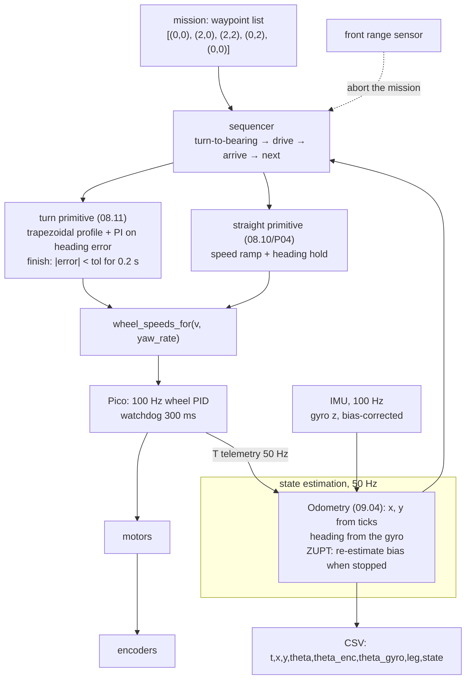

# P05 — Project 5 — Autonomous square and path following

<!-- glance:start -->
<!-- generated by tools/build.py from curriculum/syllabus.yaml — edit the syllabus, not this block -->

| | |
|---|---|
| **Track** | Project |
| **Difficulty** | Intermediate |
| **Time** | 4 h |
| **Hardware** | Stage 1 robot: Pi 5, Pico, encoder motors, driver, chassis, battery, distance sensors (stage 1), IMU breakout (stage 2) |
| **Software** | none |
| **Prerequisites** | [08.11 Rotate exactly 90° — motion profiles and IMU feedback](../08-control/08.11-rotate-exactly-90.md)<br>[09.04 Build an odometry system from scratch (tested against the simulator)](../09-odometry/09.04-odometry-from-scratch.md)<br>[P04 Project 4 — PID-controlled movement](P04-pid-movement.md) |

<!-- glance:end -->

## Goal

You give the robot a list of waypoints, it drives them on its own, and it comes back. A 2 m square
closes within 15 cm on average over five runs in each direction; an arbitrary four-waypoint path is
followed with a worst cross-track error you can quote. The robot maintains its own pose estimate
the whole time — odometry from [09.04](../09-odometry/09.04-odometry-from-scratch.md) for position,
a bias-corrected gyro for heading — and logs it, so you can plot what it *thought* it did on top of
what the tape measure says it did.

This is the last project before ROS 2, and it is the one where the robot stops being a machine you
operate and becomes a machine you give a mission to.

## Why this project

Everything up to here produced a primitive. P05 composes them, and composition is where errors stop
being independent and start accumulating. A 1° heading error per corner puts a 2 m square **9.8 cm**
off; 2° puts it **19.4 cm** off; 3° puts it **28.8 cm** off. Nothing in the straight segments can
recover that, because a heading loop that has reached its setpoint has no error left to see.

Three things you take forward:

- **An independent heading sensor.** In [P04](P04-pid-movement.md) you measured a controller that
  reported perfect success while the robot curved 28 cm off the line, because its only heading
  sensor shared the error it was trying to correct. The IMU breaks that circle. It also introduces
  its own problem — **bias** — and you will measure that too: an uncorrected 0.64 °/s bias becomes
  **24°** over a 38-second square, and one second of standing still removes it.
- **Waypoint following as a state machine.** `turn to bearing → drive → arrive → next` is the
  skeleton of every navigation stack. Nav2's controller server in module 12 is this, with a planner
  in front and a costmap underneath.
- **Evidence that is a trajectory, not a number.** From here on your results are logged paths. The
  `t,x,y,theta` CSV you produce in this project is the same format
  [`path_error.py`](code/path_error.py) wants, the same shape a rosbag will hold, and the same thing
  you will compare against a map in [P10](P10-localization.md).

## Prerequisites

| Comes from | What it contributes |
|---|---|
| [08.11 Rotate exactly 90° — motion profiles and IMU feedback](../08-control/08.11-rotate-exactly-90.md) | the trapezoidal profile, angle wrapping, the gyro heading loop, "when is a turn finished" |
| [09.04 Build an odometry system from scratch](../09-odometry/09.04-odometry-from-scratch.md) | `tick_delta`, `ticks_to_distance`, `integrate_pose`, the `Odometry` class |
| [P04 PID-controlled movement](P04-pid-movement.md) | tuned inner loops, the cascade, `gains.yaml`, the radius ratio |
| [07.05 IMU fundamentals](../07-sensors/07.05-imu-fundamentals.md) | gyro bias, drift, what a MEMS gyro actually measures |
| [09.05 Calibrating odometry](../09-odometry/09.05-calibrating-odometry.md) (strongly recommended) | UMBmark; removes the bias this project would otherwise carry into every run |
| [SAFETY.md](../SAFETY.md) | rules 1, 3, 6, 7, 8 — a mission the robot executes alone |

Check your readiness: `python course.py why P05`

## Hardware and software

| Item | Catalog id | Notes |
|---|---|---|
| Assembled robot, tuned | `robot-base` ([Stage 1](../HARDWARE.md)) | with P04's gains loaded |
| IMU breakout | `imu` ([Stage 2](../HARDWARE.md)) | BNO055 preferred (on-chip fusion, apt driver); ICM-20948 also fine. Mounted **rigidly**, level, at the position in `karmel.yaml` (x 0, y 0, z 0.04) |
| 3 × 3 m of clear, flat floor, one surface | — | a 2 m square needs 3 m of room to be safe |
| Masking tape, tape measure, a chalk line or a long straight edge | `tools` | marking the square's corners and the start pose |
| Phone camera, ideally on a tripod above the area | `tools` | a top-down video is worth ten written observations |

**No-hardware alternative.** Everything runs against the simulator, whose gyro has a configurable
bias and whose ground truth you can plot against your estimate:

```bash
python 08-control/code/rotate_90.py --solution --trials 20 --plot rotate_90.png
python 09-odometry/code/odometry_live.py --plot run.png
python labs/robot/drive_square.py --fake --side 2.0
```

The simulator gives you real work on the profile, the wrapping, the bias estimation and the path
analysis. What it does not give you is a rug, a sticky caster and an IMU that warms up.

## Architecture



The division of labour is the interesting part:

| Quantity | Comes from | Why not the other one |
|---|---|---|
| Position (x, y) | encoders, integrated | An IMU's accelerometer integrated twice is useless over 30 s — the error grows as $t^2$ |
| Heading (θ) | gyro, bias-corrected, with ZUPT | Encoder heading is biased by wheel-radius mismatch and blind to slip, and a spin is where slip is worst |
| Bias | measured while stationary, ≥ 1 s, before every mission and at every stop | It moves with temperature; a value from yesterday is not your bias |
| Turn completion | heading error inside tolerance **and** the profile finished **and** staying there for 0.2 s | Any one of those alone lets the robot declare victory mid-swing |

**Why not fuse heading properly?** You could, and [10.07](../10-localization/10.07-fusing-imu-and-odometry.md)
does — a complementary or Kalman filter that uses the gyro for the short term and the encoders for
the long term. For a 38-second mission, a bias-corrected gyro alone is good enough and much easier
to reason about. Log both estimates and you will see exactly when that stops being true.

## Milestones

### Milestone 1 — Odometry that logs

1. Put your [09.04](../09-odometry/09.04-odometry-from-scratch.md) `Odometry` class on the robot and
   run [`odometry_live.py`](../09-odometry/code/odometry_live.py) against it.
2. Write a logger that appends `t,x,y,theta` at 20 Hz to a CSV. This exact format is what
   [`path_error.py`](code/path_error.py) reads.
3. Sanity check on the floor: push the robot by hand along a taped 2 m line and check the logged
   `x` ends near 2.0 and `y` near 0.

**Done when** `python projects/code/path_error.py <your csv> --waypoints "0,0; 2,0"` runs and the
numbers match what you see on the floor.

### Milestone 2 — The gyro, and its bias

> [!CAUTION]
> **Safety:** the IMU is a 3.3 V device on the I²C bus. Power off before wiring it
> ([SAFETY.md](../SAFETY.md) rule 9), check polarity with the multimeter, and do not connect a 5 V
> module's signal lines to the Pico without checking the logic levels
> ([02.05](../02-robot-electronics/02.05-logic-levels-and-protection.md)).

1. Mount the IMU rigidly and level. "Rigidly" means screws or a printed bracket, not tape — a gyro
   on a flexing mount measures the flex.
2. With the robot perfectly still, log the yaw rate for 30 s. The mean is your **bias**; the
   standard deviation is your noise floor.
3. Compute what the bias costs over a 38-second mission:

| Bias | Heading error over 38 s |
|---|---|
| 0.64 °/s (uncorrected, typical) | **24°** |
| 0.10 °/s | 3.8° |
| 0.05 °/s | 1.9° |
| 0.02 °/s (residual after ZUPT) | 0.8° |

4. Re-measure the bias after the robot has been powered for 10 minutes, and again after 30. It will
   have moved — a MEMS gyro's bias tracks temperature. This is why you re-estimate it at every stop
   rather than storing it in a config file.
5. Implement the **zero-velocity update**: whenever the commanded velocity is zero and both wheel
   speeds read zero for ≥ 0.5 s, fold the current yaw rate into a running bias estimate.

**Done when** you can integrate the gyro for 60 s while the robot stands still and the heading drifts
by less than **2°**, and you can state your measured bias and how much it moved in 30 minutes.

### Milestone 3 — The turn primitive, 10 trials

1. Build the turn from [08.11](../08-control/08.11-rotate-exactly-90.md): a trapezoidal profile
   (v_max 1.5 rad/s, a_max 3.0 rad/s² gives a 90° turn in **1.55 s**), the profile's velocity fed
   forward, a PI on the wrapped heading error, and a completion test that requires the profile to
   be finished **and** `|error| < tolerance` **and** that to hold for 0.2 s.
2. Check the wrap explicitly: command a +190° turn and a −190° turn. Without wrapping, one of them
   goes the long way around; with it, both take the short path.
3. **Ten trials of +90°**, measured against a taped reference line the same way you did in
   [P03](P03-encoder-movement.md) — the perpendicular offset of a point 0.5 m ahead; 1° is 8.7 mm.
4. Compare with P03's open-loop turn numbers.

```bash
python projects/code/report.py projects/evidence/P05/turn_90.csv --column error_deg \
    --criterion "abs_mean<=2" --criterion "sd<=1" --criterion "abs_max<=3" --criterion "n>=10" \
    --unit deg --title "P05 - turn +90 deg, gyro feedback, trapezoidal profile"
```

**Done when** the table passes and the improvement over P03 is written down as a ratio.

### Milestone 4 — The 2 m square, both directions

> [!CAUTION]
> **Safety:** a 2 m square needs 3 × 3 m of genuinely clear floor. Stairs blocked, no cables, no
> pets or children, nothing fragile within a metre of the path. The robot executes the whole
> mission alone — be ready with the switch and `Ctrl-C` for the first three runs, and keep the
> speed capped at 0.25 m/s in the code ([SAFETY.md](../SAFETY.md) rules 6, 7 and 8).

1. Mark the start pose: a cross for the wheel-axle centre and a line for the heading. Mark the
   other three corners too — you want per-corner evidence, not just the closing error.
2. Run the mission: four 2.00 m legs at 0.25 m/s and four +90° turns. That is about **38 s** of
   driving.
3. Five runs counter-clockwise, five clockwise. For each run record: the tape-measured closing
   error, the tape-measured final heading, and the robot's own belief about both.
4. Analyse each run's pose log:

```bash
python projects/code/path_error.py projects/evidence/P05/square_ccw_pose.csv \
    --waypoints "0,0; 2,0; 2,2; 0,2; 0,0" --final-heading-deg 0
```

5. Then the acceptance table across the five runs:

```bash
python projects/code/report.py projects/evidence/P05/square_ccw.csv --column closing_cm \
    --criterion "abs_mean<=15" --criterion "sd<=7" --criterion "abs_max<=25" --criterion "n>=5" \
    --unit cm --title "P05 - 2 m square, counter-clockwise"
```

**Done when** both directions pass, and you have compared the two: a similar miss in opposite
directions still points at wheel-radius mismatch; the same direction points at the turn.

### Milestone 5 — An arbitrary path

A square is a special case — every turn is the same, and the errors can cancel. A path with unequal
legs and unequal turns cannot hide anything.

1. Define four waypoints that are not a square, for example
   `(0,0) → (1.5,0) → (1.5,1.0) → (0.5,1.8) → (0,0)`. Two of those legs are diagonal, so the turns
   are not multiples of 90°.
2. Implement go-to-waypoint properly: compute the bearing with `atan2(dy, dx)`, wrap the difference,
   turn, then drive the remaining distance. Declare arrival when within a stated radius (5 cm is a
   reasonable start) — and log what that tolerance costs you.
3. Run it five times, logging the pose.
4. Analyse the cross-track error per leg:

```bash
python projects/code/path_error.py projects/evidence/P05/path_run1_pose.csv \
    --waypoints "0,0; 1.5,0; 1.5,1.0; 0.5,1.8; 0,0"
```

Read the `mean XTE` column: a constant non-zero mean on a leg means the robot drove *parallel* to
the path, offset to one side. A heading loop cannot see that error, by construction. Only a
cross-track layer removes it — and that is the stretch goal.

**Done when** you have per-leg cross-track statistics for five runs and can say which legs were
worst and why.

### Milestone 6 — Mission abort

1. Wire in the reflex from [P02](P02-obstacle-avoidance.md): if the front range reading drops below
   the braking threshold, stop, abort the mission, and report *which leg* and *how far along it*
   the abort happened.
2. Test it: walk into the path mid-mission. Three trials.
3. Confirm the pose log still makes sense after an abort — an aborted mission that corrupts the
   estimate is worse than no abort.

**Done when** three aborts stop the robot cleanly with a useful report and an intact log.

> [!TIP]
> **Ask your teacher:** "My square closes to 12 cm counter-clockwise and 19 cm clockwise, and the
> misses point in roughly opposite directions. Walk me through what that says about my wheel radius
> and my track width, using the UMBmark reasoning and my actual numbers."

### Milestone 7 — Demo and write-up

A single top-down video of one counter-clockwise square and one clockwise square, with the start
mark and the final tape measurement visible. Then a plot with three traces: the planned path, the
robot's believed path (from the log), and the corner positions you measured with the tape. The gap
between the second and the third is the whole project.

## Acceptance criteria

- [ ] **Gyro bias handled:** stationary heading drift ≤ **2° over 60 s**; the bias is re-estimated
      at every stop (ZUPT); you can state your bias and how much it moved over 30 minutes.
- [ ] **Turn primitive, 10 trials of +90°:** `abs_mean` ≤ **2°**, `sd` ≤ **1°**, worst ≤ **3°**.
- [ ] **Angle wrapping proven:** a +190° and a −190° command each take the short way round.
- [ ] **2 m square, 5 runs counter-clockwise and 5 clockwise:** tape-measured closing error
      `abs_mean` ≤ **15 cm**, `sd` ≤ **7 cm**, worst ≤ **25 cm** in each direction.
- [ ] **Final heading:** tape-measured final heading error ≤ **10°** in every run.
- [ ] **Belief versus truth:** for every run, the robot's own closing-error estimate and the
      tape-measured one, with the ratio stated. (Expect the robot to be optimistic.)
- [ ] **Arbitrary path, 5 runs:** worst per-leg cross-track error ≤ **10 cm**, and a stated reason
      for the worst leg.
- [ ] **Mission abort:** 3 trials, each stopping within the P02 braking distance and reporting the
      leg and distance travelled, with an intact pose log afterwards.
- [ ] **Both heading estimates logged:** `theta_enc` and `theta_gyro` in every run, with a plot of
      their difference over the mission. This plot is what
      [10.07](../10-localization/10.07-fusing-imu-and-odometry.md) exists to fix.
- [ ] **Evidence exists:** pose CSVs for every run, the tables, the overlay plot, the video.

## Safety

Read [SAFETY.md](../SAFETY.md). This is the longest autonomous run in the course so far — about
38 seconds during which the robot covers 8 metres with nobody steering.

- **Rule 6 — software limits.** Cap linear speed at 0.25 m/s, yaw rate at 1.5 rad/s, and cap the
  *mission*: refuse a leg longer than 3 m and refuse more than a stated number of waypoints. A
  waypoint typo is the most likely way this project ends badly.
- **Rule 7 — clear the area.** 3 × 3 m, genuinely clear, one level, stairs blocked. Tape the
  corners so you and any onlookers know where the robot is going.
- **Rule 8 — one hand for the stop** for the first three runs of every mission change.
- **Rule 3 — watchdogs.** The mission sequencer must keep feeding the lease; if the sequencer
  hangs, the Pico stops the robot in 300 ms. Verify that still works before the first floor run.
- **Rule 1 — wheels in the air** for the first run of the sequencer, so you can watch the state
  transitions without the robot going anywhere.

| Hazard | Control |
|---|---|
| A waypoint typo (2.0 vs 20.0) sends the robot across the room | Hard limit on leg length in code; a mission-total distance limit; print the plan and confirm it before executing |
| An angle-wrap bug turns a −10° correction into a 350° spin | Test +190°/−190° explicitly (milestone 3) before any multi-leg mission |
| The robot drives into someone who walked in mid-mission | The P02 abort reflex (milestone 6), tape-marked path, supervised runs |
| A stuck wheel makes the sequencer wait forever on a leg | Per-leg timeout = planned duration × 2, then stop and report |
| The IMU comes loose and the heading loop chases the noise | Screw it down, and add a sanity check: reject yaw rates above 5 rad/s as impossible for this mission |
| Battery sags across ten runs, changing the results | Log voltage per run; recharge between the CCW and CW sets and note it |

## Troubleshooting

### Symptom: the square closes well in one direction and badly in the other

That is a signal, not a fault. Follow it:

1. **Plot the two believed paths on top of each other.** If they curve the same way in world terms,
   you have a wheel-radius mismatch (one wheel is effectively bigger, so the robot always curves the
   same way). If the miss flips with direction, the turn is systematically wrong.
2. **Check the turn trials from milestone 3** for a *signed* mean. A +1.5° mean per turn is 6° per
   square and about 15 cm of closing error on a 2 m square.
3. **If the turns are clean and the straights curve**, you are back in [P04](P04-pid-movement.md)
   territory: the radius ratio.
4. **Do [09.05](../09-odometry/09.05-calibrating-odometry.md)** if you have not. UMBmark is exactly
   this experiment turned into two corrected constants.

### Symptom: the heading estimate drifts during the mission

1. **Did you measure the bias on this power cycle, at this temperature?** Re-measure and compare.
   A 0.1 °/s change is ordinary and is 3.8° over a 38-second square.
2. **Is the ZUPT firing?** Log a flag. If the robot never stops long enough (0.5 s) between legs,
   the bias is never refreshed. Add a deliberate 1 s pause at each corner — it costs 4 s per square
   and it is worth it.
3. **Is the IMU rigidly mounted and level?** A gyro tilted by 10° measures 98.5 % of the yaw rate
   plus a slice of the roll rate. Check with a spirit level or the accelerometer itself.
4. **Compare `theta_gyro` with `theta_enc`.** If they diverge smoothly, it is bias. If they diverge
   in steps at the turns, it is wheel slip (and the gyro is the one telling the truth).

### Symptom: the robot overshoots each turn and corrects back

1. **Is the completion test requiring the profile to be finished?** If it only checks the error, it
   can declare victory while still rotating at 1.5 rad/s.
2. **Is there latency between command and measurement?** The outer loop lives on the Pi with a 20 ms
   period plus telemetry delay. [`rotate_90.py`](../08-control/code/rotate_90.py) models this with
   `DELAY_STEPS = 1`; if your real overshoot is much bigger than the simulation's, look for extra
   latency you have not accounted for.
3. **Is the deceleration ramp actually being commanded?** Plot the commanded yaw rate. A profile
   that is computed but not fed forward gives you a PI trying to stop a moving robot with no
   warning.

### Symptom: the robot arrives at a waypoint, then wanders before the next leg

Your arrival tolerance and your turn tolerance are fighting. Check the sequence: arrival should stop
the robot, *then* the bias update, *then* the turn. If turning starts while the robot is still
rolling, the turn primitive's profile begins from a non-zero state it does not know about.

### Symptom: cross-track error has a constant non-zero mean on one leg

Expected, and worth understanding rather than tuning away. A heading controller that has reached its
setpoint has zero error; if the robot is 6 cm to the left of the line and pointing exactly along it,
the controller is satisfied forever. The fix is a third cascade layer: cross-track error → heading
setpoint (clamped) → the heading loop. That is the stretch goal, and it is a simplified pure-pursuit
controller ([12.05](../12-navigation/12.05-local-planning-obstacle-avoidance.md)).

### Symptom: the logged path looks nothing like the floor

1. **Check the sign conventions.** REP-103: x forward, y **left**, θ counter-clockwise positive. A
   y-axis pointing right mirrors the whole path and you will chase it for an hour.
2. **Check the units.** Degrees leaking into a radians pipeline produces a path that is wrong by a
   factor of 57.
3. **Check the first sample.** The classic odometry bug is integrating cumulative totals instead of
   deltas on the first call, which teleports the robot on startup
   ([09.04](../09-odometry/09.04-odometry-from-scratch.md)).

## Stretch goals

1. **Add the cross-track layer** and re-measure milestone 5. This turns waypoint-to-waypoint
   driving into path *following*, and it is the single biggest improvement available to you.
2. **Fuse the two headings.** A complementary filter — gyro for the short term, encoders for the
   long term — and a plot of all three traces. Then read
   [10.07](../10-localization/10.07-fusing-imu-and-odometry.md) and see how close your intuition got.
3. **Run a 10-minute mission.** Ten laps of the square. Plot closing error against lap number; the
   growth rate is your drift, and it is the number that motivates SLAM in
   [P09](P09-mapping.md).
4. **Calibrate first, then repeat.** Do [09.05](../09-odometry/09.05-calibrating-odometry.md) with
   the data you just collected, apply the corrected constants, and re-run the acceptance tests.
   Quantify the improvement.
5. **Different speeds.** Run the square at 0.15, 0.25 and 0.40 m/s. Closing error usually gets worse
   with speed (slip) *and* better with speed (less time for bias to accumulate). Find your minimum.
6. **A figure-of-eight.** Continuous curvature instead of stop-turn-go, which means the heading
   setpoint changes continuously. It is much harder and it is what Nav2 actually does.

## Evidence to keep

Everything in `projects/evidence/P05/`:

| File | What it holds |
|---|---|
| `README.md` | the write-up: bias numbers, all tables, the belief-versus-truth gap, the direction comparison |
| `imu_bias.md` | measured bias at 0, 10 and 30 minutes; the drift table; your ZUPT design |
| `turn_90.csv` | `trial,error_deg,battery_v` — the 10 turn trials |
| `square_ccw.csv`, `square_cw.csv` | `run,closing_cm,heading_deg,odom_closing_cm,battery_v` |
| `square_ccw_pose.csv` (and one per run) | `t,x,y,theta,theta_enc,theta_gyro,leg,state` at 20 Hz |
| `path_run1_pose.csv` … | the arbitrary-path runs |
| `path_error.md` | the `path_error.py` output per run: closing error, per-leg cross-track, waypoint misses |
| `tables.md` | the `report.py` acceptance tables |
| `overlay.png` | planned path, believed path, tape-measured corners, on one set of axes |
| `heading_divergence.png` | `theta_gyro − theta_enc` over the mission |
| `square.mp4` | top-down video of one square in each direction (git-ignored) |

The pose logs are the first real trajectories you have produced. [P08](P08-odometry.md) will produce
the same thing through ROS 2 and compare; keep these so the comparison is possible.

## Progress checkpoint

```bash
python course.py project P05 start
python course.py project P05 done
```

Next: [P06 — Your robot on ROS 2](P06-ros2-robot.md), after module
[04](../04-ros2/04.01-why-middleware.md). P06 does not add a capability — it re-homes everything you
have built behind a standard interface, so that the mapping, localization and navigation stacks in
modules 11–12 can plug into your robot without knowing anything about your serial protocol.
