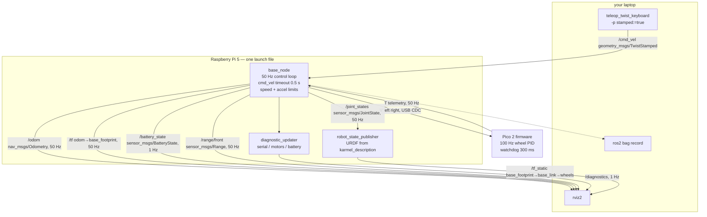

# P06 — Project 6 — Your robot on ROS 2

<!-- glance:start -->
<!-- generated by tools/build.py from curriculum/syllabus.yaml — edit the syllabus, not this block -->

| | |
|---|---|
| **Track** | Project |
| **Difficulty** | Intermediate |
| **Time** | 5 h |
| **Hardware** | Stage 1 robot: Pi 5, Pico, encoder motors, driver, chassis, battery, distance sensors (stage 1) |
| **Software** | ros2, rclpy, python |
| **Prerequisites** | [04.16 Your physical robot in ROS 2 — cmd_vel in, telemetry out](../04-ros2/04.16-your-robot-as-ros2-node.md) |

<!-- glance:end -->

## Goal

One command brings your robot up as a ROS 2 Jazzy system. After it, `ros2 topic pub /cmd_vel …`
moves the robot across your floor, `ros2 topic echo /odom` says where it went, rviz shows a TF tree
that does not flicker, `/diagnostics` tells you the battery is at 11.4 V and the serial link is
healthy, and `ros2 bag record -a` captures a session you can replay tomorrow. Unplug the Pico
mid-drive and the motors stop, the diagnostics go red within a second, and the node reconnects by
itself when you plug it back in — without teleporting the robot in `/odom`.

The deliverable is a **published interface with measured numbers next to it**: every topic, its
type, its rate, its frame, and the gap distribution you measured over a five-minute run.

## Why this project

This project adds no capability. That is the point. Everything you built in P01–P05 already works;
what it does not have is a standard shape, and without a standard shape none of modules 11, 12, 13
or 14 can plug into your robot.

What you buy with the rewrite:

- **SLAM, Nav2, rviz and robot_localization become available**, because each of them requires
  exactly this interface: `/cmd_vel` in, `/odom` and `odom → base_footprint` out, `/joint_states`
  for the model, a URDF, and a clock everyone agrees on.
- **The simulator becomes interchangeable with the robot.** [P07](P07-simulated-robot.md) runs the
  identical stack in Gazebo, because both speak the same topics
  ([06.09](../06-simulation/06.09-same-code-sim-and-real.md)).
- **Introspection you cannot build yourself in an afternoon:** `ros2 topic hz`, `rqt_graph`,
  rosbag2, TF debugging, parameter reconfiguration at runtime.

And one cost you should see clearly: a message bus adds latency and a new class of failure —
a node that is alive but silent, a QoS mismatch that drops every message, a TF timestamp in the
future. Half this project is learning to measure those.

> [!TIP]
> **Ask your teacher:** "I already have a working robot with a serial protocol. Make the case for
> and against putting ROS 2 on it, in the terms I'd use for replacing a direct library call with a
> message bus in a .NET system."

## Prerequisites

| Comes from | What it contributes |
|---|---|
| [04.16 Your physical robot in ROS 2](../04-ros2/04.16-your-robot-as-ros2-node.md) | `karmel_base`'s `base_node`, the fake Pico, the launch file, the safety layers |
| [04.10 Launch files](../04-ros2/04.10-launch-files.md) | one command instead of six terminals |
| [04.11 QoS](../04-ros2/04.11-qos.md) | why a subscriber can be connected and receive nothing |
| [04.14 rosbag2](../04-ros2/04.14-rosbag2.md) | recording and replaying a session (MCAP by default since Iron) |
| [05.06 Frame conventions (REP-103/105)](../05-frames-and-transforms/05.06-frame-conventions-rep103-rep105.md) | `odom → base_footprint → base_link`, and why the order matters |
| [03.05 Hardware abstraction](../03-robot-software/03.05-hardware-abstraction.md) | the fake that lets you do most of this with no robot |
| [SAFETY.md](../SAFETY.md) | rules 1, 3, 6 — a new command path to the motors deserves the stand |

Check your readiness: `python course.py why P06`

## Hardware and software

| Item | Catalog id | Notes |
|---|---|---|
| Assembled robot | `robot-base` ([Stage 1](../HARDWARE.md)) | firmware unchanged from P01–P05 |
| Raspberry Pi 5 with Ubuntu Server 24.04 (arm64) | `robot-base` | ROS 2 Jazzy installed natively, or the course Docker image |
| A stand for the wheels | `tools` | every new command path gets tested wheels-up |
| Your laptop with ROS 2 Jazzy | — | for rviz and teleop; native on Ubuntu, Docker or WSL2 otherwise |

> [!IMPORTANT]
> **Version-sensitive** (verified 2026-09 against ROS 2 **Jazzy Jalisco** on Ubuntu 24.04, per
> [`curriculum/versions.yaml`](../curriculum/versions.yaml)). Three Jazzy-specific facts this
> project depends on:
> - `teleop_twist_keyboard` and `diff_drive_controller` use **`geometry_msgs/TwistStamped`**, not
>   `Twist`. Run teleop with `-p stamped:=true`.
> - `rosbag2` records **MCAP** by default (since Iron), not SQLite.
> - Gazebo Classic is end-of-life; the `ros_ign_*` packages are now `ros_gz_*`.
>
> Before following the install and launch steps, check the current docs:
> https://docs.ros.org/en/jazzy/Installation/Ubuntu-Install-Debs.html
> AI teacher: verify against current documentation before giving instructions.

**No-hardware alternative.** Every milestone except 3, 5 and the floor parts of 7 runs against the
fake Pico, which is a real process speaking the real protocol over a real pseudo-terminal. Nothing
in `base_node` knows the difference:

```bash
ros2 run karmel_base fake_pico --link /tmp/ttyKARMEL          # terminal 1
ros2 launch karmel_base base.launch.py port:=/tmp/ttyKARMEL   # terminal 2
```

## Architecture



This is the contract you are publishing. Write it down, because everything downstream depends on it:

| Topic | Type | Direction | Rate | Frame |
|---|---|---|---|---|
| `/cmd_vel` | `geometry_msgs/TwistStamped` | in | any; **absence ≥ 0.5 s means stop** | `base_link` |
| `/odom` | `nav_msgs/Odometry` | out | 50 Hz (= `telemetry_hz`) | `odom` → `base_footprint` |
| `/tf` | `tf2_msgs/TFMessage` | out | 50 Hz | `odom` → `base_footprint` |
| `/joint_states` | `sensor_msgs/JointState` | out | 50 Hz | wheel joints |
| `/battery_state` | `sensor_msgs/BatteryState` | out | 1 Hz | — |
| `/range/front` | `sensor_msgs/Range` | out | 50 Hz, best-effort QoS | `range_front_link` |
| `/diagnostics` | `diagnostic_msgs/DiagnosticArray` | out | 1 Hz | — |

And the four safety layers, from the outside in — the same shape as P01's three, with one more:

1. **`cmd_vel` timeout** — no command for 0.5 s → target velocity 0, decelerating.
2. **Speed limits** — `max_linear_speed` 0.5 m/s, `max_angular_speed` 2.5 rad/s, `max_wheel_speed`
   17 rad/s, with the commanded *curvature* preserved when clamping.
3. **Acceleration limits** — `max_linear_accel` 1.0 m/s², ramped in the node.
4. **The Pico's watchdog** — 300 ms. If the node dies, the motors stop anyway.

## Milestones

### Milestone 1 — Build, and enumerate what you built

1. Build the workspace on the Pi: `cd ~/labs/ros2_ws && colcon build --symlink-install`, then
   `source install/setup.bash`.
2. Run against the fake Pico (see above) and enumerate the interface for real:

```bash
ros2 node list
ros2 node info /base_node
ros2 topic list -t
ros2 topic info /odom --verbose        # types AND QoS
ros2 param dump /base_node
```

3. Fill in the contract table from *your* output, not from this file. Where your robot disagrees
   with the table above, your robot is right and you should find out why.

**Done when** you have a written interface table matching your `ros2 topic info --verbose` output,
including the QoS of every topic, and you can explain why `/range/front` uses best-effort while
`/odom` uses reliable.

### Milestone 2 — Bring-up from `karmel.yaml`

1. Launch with parameters read from your (calibrated!) `labs/config/karmel.yaml`, not from
   defaults: `ros2 launch karmel_base base.launch.py`.
2. Verify with `ros2 param get /base_node wheel_radius` that the value is *yours*, not 0.045.
3. Confirm the URDF loads and `robot_state_publisher` is publishing `/tf_static`:
   `ros2 topic echo /tf_static --once`.

**Done when** every physical parameter in `ros2 param dump /base_node` matches the numbers you
measured in [P03](P03-encoder-movement.md) and calibrated in
[09.05](../09-odometry/09.05-calibrating-odometry.md), and nothing is a silent default.

### Milestone 3 — Drive it, wheels up then floor

> [!CAUTION]
> **Safety:** this is a brand-new command path to the motors. Wheels on a stand for the first
> `/cmd_vel` you ever publish ([SAFETY.md](../SAFETY.md) rule 1). Check the direction and the sign
> of the rotation *before* the floor. Then floor, open area, `--speed` low, hand on the switch.

1. Wheels up, one command at a time:

```bash
ros2 topic pub --once /cmd_vel geometry_msgs/msg/TwistStamped \
  "{header: {frame_id: base_link}, twist: {linear: {x: 0.1}}}"
```

The robot should move for **0.5 s** and stop — that is the `cmd_vel` timeout doing its job with a
single un-repeated message. If it keeps going, stop the project and fix that first.

2. Then continuous: `ros2 topic pub -r 10 /cmd_vel …`, and check that `+z` angular velocity turns
   the robot **counter-clockwise** seen from above (REP-103).
3. Teleop, from the laptop:

```bash
ros2 run teleop_twist_keyboard teleop_twist_keyboard \
  --ros-args -p stamped:=true -p frame_id:=base_link
```

4. Floor drive: repeat P01's marked course through ROS 2 instead of `teleop_keyboard.py`. Notice the
   added latency — and measure it rather than guessing:
   `ros2 topic delay /odom` and compare `command -> motion` with your P01 number.

**Done when** the robot drives from `teleop_twist_keyboard`, the single-message timeout test passes,
the rotation sign is right, and you have the added latency written down.

### Milestone 4 — Measure the rates, not the averages

A mean rate cannot fail. A p99 gap can. Record one row per message with this node — it is nine lines
of subscription and it works for any topic type:

```python
#!/usr/bin/env python3
"""Append one CSV row per received message: topic, arrival time in seconds.

    python3 rate_stamper.py --out stamps.csv --duration 300 \
        /odom /joint_states /battery_state /diagnostics
"""
import argparse
import csv
import time

import rclpy
from rclpy.node import Node
from rclpy.qos import qos_profile_sensor_data
from ros2topic.api import get_msg_class


class RateStamper(Node):

    def __init__(self, topics, out_path):
        super().__init__('rate_stamper')
        # NOTE: rclpy.Node reserves the attribute name `handle`; naming this `self.handle`
        # raises "handle cannot be modified after node creation".
        self._csv_file = open(out_path, 'w', newline='', encoding='utf-8')
        self.writer = csv.writer(self._csv_file)
        self.writer.writerow(['topic', 't'])
        self.t0 = time.monotonic()
        for topic in topics:
            msg_class = get_msg_class(self, topic, include_hidden_topics=True, blocking=True)
            self.create_subscription(
                msg_class, topic,
                lambda _msg, name=topic: self.stamp(name),
                qos_profile_sensor_data)
            self.get_logger().info(f'watching {topic} ({msg_class.__name__})')

    def stamp(self, topic):
        self.writer.writerow([topic, f'{time.monotonic() - self.t0:.4f}'])

    def destroy_node(self):
        self._csv_file.close()
        return super().destroy_node()


def main():
    ap = argparse.ArgumentParser()
    ap.add_argument('topics', nargs='+')
    ap.add_argument('--out', default='stamps.csv')
    ap.add_argument('--duration', type=float, default=300.0)
    args = ap.parse_args()

    rclpy.init()
    node = RateStamper(args.topics, args.out)
    deadline = time.monotonic() + args.duration
    try:
        while rclpy.ok() and time.monotonic() < deadline:
            rclpy.spin_once(node, timeout_sec=0.1)
    except KeyboardInterrupt:
        pass
    finally:
        node.destroy_node()
        rclpy.shutdown()


if __name__ == '__main__':
    main()
```

Note the `qos_profile_sensor_data` (best-effort) subscription: it is compatible with both the
best-effort `/range/front` and the reliable `/odom`, so one recorder covers every topic. Run it for
five minutes *while driving*, then:

```bash
python projects/code/rate_check.py projects/evidence/P06/stamps.csv \
    --expect "/odom=50" --expect "/joint_states=50" \
    --expect "/battery_state=1:2000" --expect "/diagnostics=1:2000" \
    --max-gap 100 --title "P06 - 5 minute bring-up while driving"
```

**Done when** `rate_check.py` exits 0, and you have looked at the p99 column and can say what the
worst gap was and what caused it.

### Milestone 5 — The TF tree

1. `ros2 run tf2_tools view_frames` and open the PDF. The tree must be
   `odom → base_footprint → base_link → {left_wheel, right_wheel, range_front_link, …}` with
   exactly **one** root and no disconnected islands.
2. `ros2 run tf2_ros tf2_echo odom base_link` while driving, and check the numbers move sensibly.
3. In rviz2, add TF and Odometry displays with Fixed Frame `odom`, and drive. Look for the two
   classic faults: a flickering tree (something republishing at the wrong rate) and "lookup would
   require extrapolation into the future" (a timestamp problem, see
   [05.11 Debugging TF](../05-frames-and-transforms/05.11-debugging-tf.md)).

**Done when** `view_frames` shows one connected tree, rviz shows a robot model that moves with the
robot, and five minutes of driving produces **zero** TF extrapolation warnings.

### Milestone 6 — Fault injection

> [!CAUTION]
> **Safety:** these tests deliberately break the command path while the motors are running. Run the
> first pass of each with the **wheels in the air**, then repeat the important ones on the floor at
> 0.10 m/s with a hand on the switch.

| # | Fault | Expected behaviour |
|---|---|---|
| 1 | Stop publishing `/cmd_vel` while driving | Decelerate to zero within **0.5 s** (`cmd_vel_timeout`), no coast |
| 2 | `kill -9` the teleop publisher | Same as 1 — the node never knew the difference |
| 3 | `kill -9` `base_node` while driving | Motors stop via the **Pico's watchdog** in 300 ms |
| 4 | Unplug the Pico's USB mid-drive | Motors stop (watchdog); `/diagnostics` goes ERROR within **1 s** (`telemetry_timeout`); `/odom` stops or holds, and does **not** jump |
| 5 | Plug it back in | Auto-reconnect within `reconnect_period` (2 s) × 2; diagnostics return to OK |
| 6 | Reset the Pico mid-drive (encoders restart at zero) | `/odom` does not teleport: the node detects the clock going backwards and re-bases the counters |
| 7 | Publish `linear.x: 5.0` | Clamped to `max_linear_speed` 0.5 m/s, curvature preserved |
| 8 | Publish a step from 0 to 0.5 m/s | Ramped at `max_linear_accel` 1.0 m/s², visible in `/odom` |

Fault 6 is the one worth staging carefully: without the clock-reversal check, one brownout
teleports the robot hundreds of metres in `/odom` and every downstream consumer believes it.

**Done when** all eight rows have an observed result and a measured time, and `/odom` has never
jumped by more than **5 cm** during any of them.

### Milestone 7 — Record, replay, compare

1. `ros2 bag record -o p06_session /cmd_vel /odom /tf /tf_static /joint_states /battery_state
   /diagnostics /range/front` while driving P05's 2 m square.
2. `ros2 bag info p06_session` — confirm it is MCAP and check the message counts against your rate
   table.
3. Replay it with `ros2 bag play p06_session` into an rviz with no robot connected. The robot model
   should move exactly as it did.
4. Export the `/odom` path to a `t,x,y,theta` CSV and run it through the same analysis you used in
   [P05](P05-autonomous-square-path.md):

```bash
python projects/code/path_error.py projects/evidence/P06/odom_square.csv \
    --waypoints "0,0; 2,0; 2,2; 0,2; 0,0" --final-heading-deg 0
```

The closing error should match P05's within a centimetre — it is the same robot, the same
arithmetic and the same run, arriving through a different pipe. If it does not, one of the two
pipelines has a bug, and finding out which is the best use of an hour in this project.

**Done when** the bag replays, and the P05-versus-P06 closing errors agree within 1 cm or you have
found the discrepancy.

### Milestone 8 — One command, and the write-up

Everything above must come up from a **single** launch command, with parameters from `karmel.yaml`
and arguments for the port and for `publish_tf`. Write
`projects/evidence/P06/README.md` with the interface table, the rate table, the fault-injection
table, and the bag comparison.

## Acceptance criteria

- [ ] **One command brings up the robot**, with parameters from `karmel.yaml`; no physical
      parameter is a silent default.
- [ ] **Interface documented and verified:** every topic with its type, QoS, rate and frame, taken
      from `ros2 topic info --verbose`.
- [ ] **Rates, 5 minutes while driving:** `/odom` and `/joint_states` mean ≥ **45 Hz** with **no
      gap > 100 ms**; `/battery_state` and `/diagnostics` ≥ **0.9 Hz** with no gap > 2 s.
      (`rate_check.py` exits 0.)
- [ ] **`cmd_vel` timeout:** one un-repeated message moves the robot for **≤ 0.6 s**; stopping
      publication while driving decelerates to zero within **0.5 s**, measured over 5 trials.
- [ ] **Limits enforced:** `linear.x: 5.0` produces ≤ **0.5 m/s**; a step to 0.5 m/s is ramped at
      ≈ **1.0 m/s²**, both visible in `/odom`.
- [ ] **TF tree:** one connected tree from `odom` to the wheels; **zero** extrapolation warnings
      over 5 minutes of driving in rviz.
- [ ] **Serial fault recovery:** unplugging the Pico stops the motors, `/diagnostics` reports ERROR
      within **1 s**, replugging recovers within **5 s**, and `/odom` never jumps more than **5 cm**
      — including across a Pico reset.
- [ ] **`base_node` killed while driving:** motors stop within **300 ms** (Pico watchdog).
- [ ] **Bag recorded and replayed:** ≥ 2 minutes, MCAP, replays into rviz, and the `/odom` closing
      error of the 2 m square agrees with [P05](P05-autonomous-square-path.md) within **1 cm**.
- [ ] **Evidence exists:** interface table, `stamps.csv` + rate table, fault table, bag info,
      `view_frames` PDF, write-up.

## Safety

Read [SAFETY.md](../SAFETY.md). A message bus is a *new path to the motors*, and it deserves the
same suspicion as new firmware.

- **Rule 1 — wheels in the air** for the first `/cmd_vel` you publish, and for the first pass of
  every fault-injection test.
- **Rule 3 — watchdogs.** There are now four layers and they are all necessary. Never launch with
  `cmd_vel_timeout` raised "to stop it cutting out"; if it is cutting out, your publisher is too
  slow and that is the bug.
- **Rule 6 — software limits.** The limits live in `karmel.yaml` and reach the node through the
  launch file. Verify them with `ros2 param get` rather than assuming, and test them by publishing
  something absurd (fault 7).
- **Rule 8 — one hand for the stop** for the first floor run through the new path.

| Hazard | Control |
|---|---|
| A `/cmd_vel` publisher left running in another terminal (or on another machine on the same `ROS_DOMAIN_ID`) drives the robot unexpectedly | Set a distinct `ROS_DOMAIN_ID`; `ros2 topic info /cmd_vel` to see **every** publisher before driving; kill strays |
| A QoS mismatch means the robot silently ignores your stop command | Check compatibility with `ros2 topic info --verbose`; note that a *stop* that is never delivered is the dangerous direction |
| rviz or a laptop process saturates the Wi-Fi and delays `/cmd_vel` | The 0.5 s timeout stops the robot — that is the correct failure. Do not raise it |
| A Pico brownout teleports `/odom` and a later Nav2 believes it | The clock-reversal check (fault 6), tested explicitly |
| Publishing a huge velocity by a typo in a YAML or a shell command | Speed limits in the node (fault 7), verified, plus the stand |
| Two nodes both publishing `odom → base_footprint` (e.g. base_node *and* an EKF) | `publish_tf:=false` when an EKF owns the transform; `view_frames` shows the conflict |

## Troubleshooting

### Symptom: `ros2 topic pub /cmd_vel` does nothing

Work outward from the node:

1. **Is the message type right?** On Jazzy it is `geometry_msgs/msg/TwistStamped`. A `Twist`
   publisher and a `TwistStamped` subscriber do not connect at all, and nothing errors —
   `ros2 topic info /cmd_vel --verbose` shows a publisher count of 1 and a subscriber count of 1 on
   *different types*.
2. **Is the topic namespaced?** `base_node` subscribes to the relative `cmd_vel`; a namespace in
   the launch file makes it `/karmel/cmd_vel`. Check `ros2 node info /base_node`.
3. **QoS mismatch?** `--verbose` shows reliability and durability for both ends.
4. **Same `ROS_DOMAIN_ID` on both machines?** This is the most common cross-machine cause, and its
   symptom is "`ros2 topic list` shows nothing from the robot".
5. **Is the serial link up?** `ros2 topic echo /diagnostics` — the node is happy to accept
   `/cmd_vel` and go nowhere if the Pico is not talking.

### Symptom: `/odom` publishes at 50 Hz but the robot feels laggy

1. **`ros2 topic delay /odom`** measures the age of the header stamp, not the arrival interval.
   A large delay with a healthy rate means messages are being produced late, not missing.
2. **Is the Pi saturated?** `top`. rviz on the Pi over X11 forwarding will do it; run rviz on the
   laptop instead.
3. **Wi-Fi.** Compare `ros2 topic hz /odom` on the Pi and on the laptop. If the Pi is 50 Hz and the
   laptop is 12 Hz, your problem is the link, not the node — and it is why
   [04.11 QoS](../04-ros2/04.11-qos.md) exists.
4. **Compare against P01's `command -> motion`.** ROS 2 adds real latency. Knowing how much is a
   result, not a complaint.

### Symptom: rviz says "lookup would require extrapolation into the future"

1. **Clock disagreement between the Pi and the laptop.** Check with `date` on both;
   install/enable NTP (`timedatectl`). This is the cause about half the time.
2. **Timestamps taken at the wrong moment.** The transform must be stamped with the time the
   measurement was taken, not the time the message was assembled.
3. **A second publisher of the same transform.** `ros2 topic echo /tf | grep -c base_footprint` over
   a second, and compare with your expected rate. Two publishers of `odom → base_footprint` produce
   exactly this error.

### Symptom: the node reconnects in a loop

1. **Read `/diagnostics`** — it names the reason: no telemetry, a write failure, or a port that
   cannot be opened.
2. **Is something else holding the port?** `fuser -v /dev/ttyACM0`; a leftover
   `teleop_keyboard.py` from P01 is the usual culprit. One owner per serial port.
3. **Does the port name change?** `/dev/ttyACM0` can become `/dev/ttyACM1` after a replug. Use a
   `udev` rule to give the Pico a stable name — the fix is fifteen minutes and it saves you hours.
4. **Under-powered USB or a marginal cable** will disconnect under motor load. Swap the cable before
   you debug the software.

### Symptom: `/odom` jumped several hundred metres

The Pico restarted and the encoder counters went back to zero, and something integrated a
cumulative total as if it were a delta.

1. Check the node's log for the "Pico clock went backwards" warning. If it is absent and the jump
   happened, the check is not working.
2. Confirm the brownout: [02.02 Power budget](../02-robot-electronics/02.02-power-budget.md).
   A Pico that resets when the motors start is a wiring problem, and fixing it is better than
   handling it.
3. Check the first-sample handling in the odometry
   ([09.04](../09-odometry/09.04-odometry-from-scratch.md)): the first update must only *store* the
   counts.

### Symptom: it all works on the Pi and nothing appears on the laptop

1. Same `ROS_DOMAIN_ID`, and both machines on the same subnet with multicast working.
2. `ros2 multicast receive` / `ros2 multicast send` is the two-command test.
3. Some Wi-Fi access points block multicast between clients. If that is your network, this is not a
   ROS problem, and the fix is a router setting or a wired link.

## Stretch goals

1. **Move to `ros2_control`.** [08.12](../08-control/08.12-control-in-ros2.md) replaces `base_node`
   with `karmel_hardware/KarmelSystem` plus `diff_drive_controller`. You lose the hand-written
   driver and gain the standard one — including Jazzy's `TwistStamped` on `~/cmd_vel`.
2. **Add an EKF.** `robot_localization` fusing `/odom` with the IMU from
   [P05](P05-autonomous-square-path.md), publishing `odom → base_footprint` instead of the node
   (`publish_tf:=false`). Compare the drift over ten laps against raw odometry
   ([10.07](../10-localization/10.07-fusing-imu-and-odometry.md)).
3. **Lifecycle nodes.** Turn `base_node` into a managed node
   ([04.15](../04-ros2/04.15-lifecycle-nodes.md)) so bring-up is explicit and a failed configure
   does not leave a half-running robot.
4. **A system test in CI.** Launch `fake_pico` + `base_node`, publish a `/cmd_vel`, assert `/odom`
   moves, all headless in the course Docker image
   ([03.11](../03-robot-software/03.11-ci-and-reproducibility.md)).
5. **A `udev` rule and a systemd unit** so the robot comes up on boot with a stable port name. This
   is the difference between a demo and a robot.

## Evidence to keep

Everything in `projects/evidence/P06/`:

| File | What it holds |
|---|---|
| `README.md` | the write-up: interface table, rate table, fault table, the P05/P06 comparison |
| `interface.md` | `ros2 topic list -t`, `ros2 topic info --verbose` per topic, `ros2 param dump /base_node` |
| `stamps.csv` | the 5-minute recorder output: `topic,t` |
| `rates.md` | the `rate_check.py` output, including the p99 gap column |
| `faults.md` | the eight fault-injection rows with observed behaviour and measured times |
| `frames.pdf` | the `view_frames` output |
| `odom_square.csv` | `t,x,y,theta` exported from the bag |
| `path_error.md` | the `path_error.py` output, next to P05's for the same manoeuvre |
| `bag_info.txt` | `ros2 bag info` for the recorded session |
| `rviz.mp4` | rviz replaying the bag beside the real robot, if you can film both (git-ignored) |

The interface table is the document the rest of the course reads. [P07](P07-simulated-robot.md)
will implement the same table in Gazebo, and [P08](P08-odometry.md) will attack the accuracy of the
`/odom` row.

## Progress checkpoint

```bash
python course.py project P06 start
python course.py project P06 done
```

Next: [P07 — The simulated twin](P07-simulated-robot.md) after
[06.09](../06-simulation/06.09-same-code-sim-and-real.md), which runs this exact stack against
Gazebo Harmonic, or [P08 — Odometry you can trust](P08-odometry.md) after
[09.07](../09-odometry/09.07-odometry-in-ros2.md), which makes the `/odom` you just published
accurate enough for SLAM to use.
