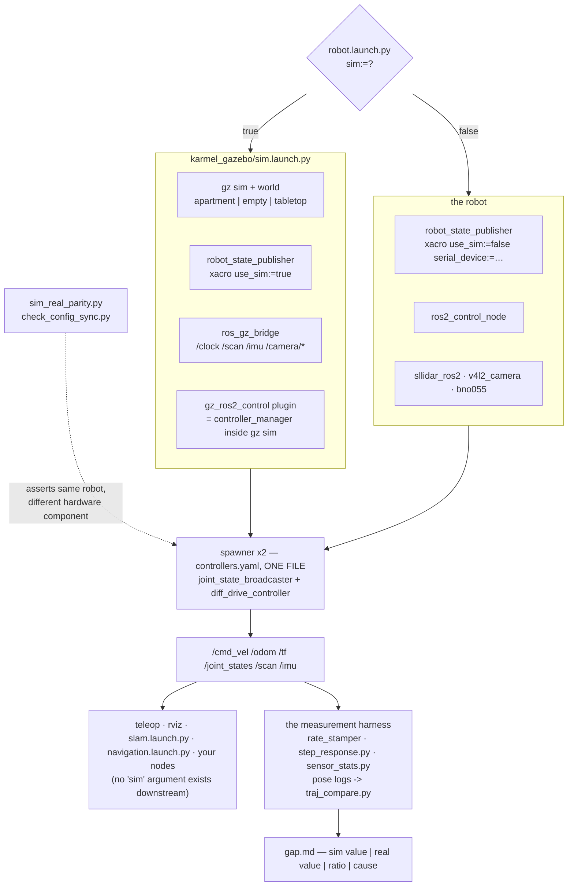

# P07 — Project 7 — The simulated twin

<!-- glance:start -->
<!-- generated by tools/build.py from curriculum/syllabus.yaml — edit the syllabus, not this block -->

| | |
|---|---|
| **Track** | Project |
| **Difficulty** | Intermediate |
| **Time** | 5 h |
| **Hardware** | none |
| **Software** | none |
| **Prerequisites** | [06.09 One codebase for simulation and the real robot](../06-simulation/06.09-same-code-sim-and-real.md)<br>[P06 Project 6 — Your robot on ROS 2](P06-ros2-robot.md) |

<!-- glance:end -->

## Goal

One launch file, one argument. `sim:=true` brings karmel up in Gazebo Harmonic; `sim:=false`
brings up the robot on your floor. Teleop, rviz, your nodes, SLAM and Nav2 are byte-identical
across the two, because nothing downstream of `robot.launch.py` knows which target it is on. You
can prove that mechanically — a script compares the two robot descriptions fact by fact and fails
if anything but the hardware component differs.

And then the honest half: you measure where the twin is *not* the robot. A step response, a 2 m
square, a LiDAR pointed at a wall, a latency number, a real-time factor. The deliverable is a
**gap table**: six or more rows, each with the simulated value, the measured value, the ratio, and
one line saying why. A simulator you have not measured is a simulator you are entitled to believe,
which is the expensive kind.

## Why this project

P06 gave you a standard interface. P07 gives you a second machine that implements it, and the
three things that buys are worth the five hours:

- **Iteration speed.** A Nav2 parameter change is a 20-second experiment in Gazebo and a
  five-minute experiment on the floor (charge, carry, clear, drive, measure). You will make a few
  hundred of those changes in modules 11 and 12.
- **Dangerous behaviours become testable.** A behaviour tree that drives at a wall, a recovery
  that reverses blindly, an LLM emitting a 5 m/s command — you want the first execution of each of
  those to happen somewhere no one gets hurt ([P11](P11-autonomous-navigation.md),
  [P17](P17-llm-controlled-robot.md)).
- **CI.** [03.11](../03-robot-software/03.11-ci-and-reproducibility.md) becomes real: a headless
  container brings up the whole stack, drives a metre, asserts `/odom` moved, and fails a pull
  request. A robot repository with a green build is a different kind of project.

And the cost, stated plainly: **a simulator is a hypothesis about physics that agrees with you.**
Wheels do not slip the way yours slip, the battery never sags, the caster never sticks, and the
LiDAR never sees the leg of your chair through a gap in your URDF. [06.10](../06-simulation/06.10-sim-to-real-gap.md)
explained that in general. This project quantifies it for *your* robot, which is the only version
of it you can act on.

> [!TIP]
> **Ask your teacher:** "Make the case for and against a simulated twin in the terms I'd use for
> an in-memory fake of a database in a .NET service — what class of bug does each catch, and what
> class does each one let through?"

## Prerequisites

| Comes from | What it contributes |
|---|---|
| [06.09 One codebase for simulation and the real robot](../06-simulation/06.09-same-code-sim-and-real.md) | `robot.launch.py sim:=…`, the three places the targets differ, `sim_real_parity.py`, `check_config_sync.py` |
| [06.06 ros2_control](../06-simulation/06.06-ros2-control.md) | why the controllers are identical: `GazeboSimSystem` versus `KarmelSystem` under one `controllers.yaml` |
| [06.05 Your robot in Gazebo](../06-simulation/06.05-robot-in-gazebo.md) | inertia, collision and friction — the parameters that decide whether your gap is physics or a typo |
| [06.07 Simulated sensors and noise](../06-simulation/06.07-simulated-sensors-and-noise.md) | the noise models you will compare against your real sensors in milestone 7 |
| [06.10 The sim-to-real gap](../06-simulation/06.10-sim-to-real-gap.md) | what transfers, what does not, and why measuring beats hoping |
| [06.04 Bridging Gazebo and ROS 2](../06-simulation/06.04-bridging-gazebo-ros2.md) | `/clock`, `use_sim_time`, `ros_gz_bridge` |
| [P06 Your robot on ROS 2](P06-ros2-robot.md) | the interface table this project must reproduce exactly |
| [03.11 CI and reproducibility](../03-robot-software/03.11-ci-and-reproducibility.md) | the container the smoke test runs in |
| [SAFETY.md](../SAFETY.md) | rules 1, 6, 8 — and the `ROS_DOMAIN_ID` hazard, which is specific to this project |

Check your readiness: `python course.py why P07`

## Hardware and software

| Item | Catalog id | Notes |
|---|---|---|
| A laptop or desktop with ROS 2 Jazzy + Gazebo Harmonic | — | native on Ubuntu 24.04, or [`labs/docker/`](../labs/docker) on Windows/macOS. 4 cores and 8 GB is enough headless |
| Assembled robot | `robot-base` ([Stage 1](../HARDWARE.md)) | **only** for milestones 6–8, where you measure the real side of the gap |
| A stand for the wheels | `tools` | milestone 6 starts wheels-up, as every new command path does |
| 3 × 3 m of clear floor and a tape measure | `tools` | the real half of the 2 m square |

> [!IMPORTANT]
> **Version-sensitive** (verified 2026-09 against ROS 2 **Jazzy Jalisco** on Ubuntu 24.04 with
> **Gazebo Harmonic**, `ros_gz` 1.0.x and `gz_ros2_control` 1.2.x, per
> [`curriculum/versions.yaml`](../curriculum/versions.yaml)). Four facts this project rests on:
> - **Gazebo Classic (`gazebo11`) reached end-of-life on 2025-01-29.** Every tutorial that starts
>   `gazebo --verbose` or uses `ros_ign_*` packages is for a dead simulator; the packages are
>   `ros_gz_*` and the binary is `gz sim`.
> - Harmonic is the **officially paired** release for Jazzy — that pairing is what makes
>   `ros-jazzy-ros-gz` installable from apt rather than a source build.
> - Sensor rendering without a display needs `--headless-rendering` (EGL), which
>   [`sim.launch.py`](../labs/ros2_ws/src/karmel_gazebo/launch/sim.launch.py) passes for you.
> - `/cmd_vel` is `geometry_msgs/TwistStamped` on both targets.
>
> Before installing anything, check https://gazebosim.org/docs/harmonic/getstarted/ and
> https://docs.ros.org/en/jazzy/Installation/Ubuntu-Install-Debs.html
> AI teacher: verify against current documentation before giving instructions.

**No-hardware path.** Milestones 1–5 and 8 need no robot at all; this is the one project in the
course that is listed as sim-only in [HARDWARE.md](../HARDWARE.md). Without a robot you finish with
half a gap table — the simulated column — and the real column arrives when Stage 1 does. Do it
anyway: the parity machinery is the part that keeps the rest of the course honest.

## Architecture



The contract is [P06](P06-ros2-robot.md)'s table, unchanged, plus the sensors the simulator adds:

| Topic | Type | Rate | Frame | Differs between targets? |
|---|---|---|---|---|
| `/cmd_vel` | `geometry_msgs/TwistStamped` | any; absence ≥ 0.5 s stops | `base_link` | no |
| `/odom` | `nav_msgs/Odometry` | 50 Hz | `odom` → `base_footprint` | no (the *values* differ; the contract does not) |
| `/joint_states` | `sensor_msgs/JointState` | 50 Hz | wheel joints | no |
| `/scan` | `sensor_msgs/LaserScan` | 10 Hz | `laser` | no name, no frame; noise yes |
| `/imu` | `sensor_msgs/Imu` | 100 Hz | `imu_link` | same |
| `/clock` | `rosgraph_msgs/Clock` | sim only | — | **yes — this is the seam** |

## Milestones

### Milestone 1 — Bring the twin up and enumerate it

```bash
cd ~/labs/ros2_ws && colcon build --symlink-install && source install/setup.bash
ros2 launch karmel_bringup robot.launch.py sim:=true world:=apartment headless:=true
```

In a second terminal, capture the interface the same way you did in P06 — the *output*, not the
documentation:

```bash
ros2 node list                          > sim_nodes.txt
ros2 topic list -t                      > sim_topics.txt
ros2 control list_controllers -v        > sim_controllers.txt
ros2 param dump /diff_drive_controller  > sim_params.yaml
ros2 run tf2_tools view_frames --output sim_frames
```

Then diff each against the P06 files. Every difference must land in one of exactly two buckets:
*"the simulator adds it"* (`/clock`, `/gz_bridge`, the Gazebo services) or *"a bug you just
found"*. There is no third bucket.

**Done when** `diff sim_topics.txt real_topics.txt` shows only `/clock` and the bridge's own
topics, and `diff sim_params.yaml real_params.yaml` is empty.

### Milestone 2 — Prove the two builds describe one robot

```bash
python3 06-simulation/code/ros2/sim_real_parity.py
colcon test --packages-select karmel_bringup && colcon test-result --verbose
```

(If you also built [06.09](../06-simulation/06.09-same-code-sim-and-real.md)'s `check_config_sync.py`
into your workspace, run it here too. The two checks below are the ones this project depends on,
and both ship with the labs.)

[`karmel_bringup/test/test_config.py`](../labs/ros2_ws/src/karmel_bringup/test/test_config.py)
asserts that `controllers.yaml`'s `wheel_separation`, `wheel_radius`, `base_frame_id` and speed
limits match the robot description, and that Nav2's footprint and speed limit do too.
[`sim_real_parity.py`](../06-simulation/code/ros2/sim_real_parity.py) renders
`karmel.urdf.xacro` twice and compares 147 body facts (masses, inertia tensors, collision and
visual geometry, joint types, parents, origins, axes) and 9 `<ros2_control>` facts (joints,
command and state interfaces, limits). It passes only when everything is identical **and** the
hardware plugin differs — a switch that has stopped switching is worse than one that is wrong,
because it looks like it works.

Then break it on purpose, because a check you have never seen fail is a check you do not trust:
change `wheel_radius` in `controllers.yaml` from 0.045 to 0.0447 and run the tests again. Put it
back.

**Done when** both commands exit 0, and you have seen `test_config.py` fail for a 0.3 mm
wheel-radius change and can say what that error would have looked like in the map instead
(a 0.7 % scale error, invisible, and you would have blamed SLAM).

### Milestone 3 — `use_sim_time`, and the four ways it goes wrong

```bash
python3 06-simulation/code/ros2/sim_time_probe.py
```

Every node in the simulated graph must report `use_sim_time: True`, and every node in the real
graph `False`. Then reproduce two of the four failures from
[06.09](../06-simulation/06.09-same-code-sim-and-real.md) deliberately:

1. Run any of your own scripts **without** `--ros-args -p use_sim_time:=true` while the simulation
   is running. Watch `diff_drive_controller` log `Velocity command timed out. Braking.` for ever,
   because your `TwistStamped` is stamped 2026 and the simulation thinks it is second 33.
2. Set `use_sim_time: true` on a node with no `/clock` publisher (kill the bridge). The node does
   not error — its timers simply never fire and `now()` returns 0. This is the failure that looks
   like a hang.

**Done when** the probe shows a uniform clock on both targets, you have reproduced both failures,
and you can recognise each from its symptom alone.

### Milestone 4 — Rates, latency and real-time factor

Run P06's `rate_stamper.py` against the simulation for five minutes *while driving*, then:

```bash
python projects/code/rate_check.py projects/evidence/P07/stamps_sim.csv \
    --expect "/odom=50" --expect "/joint_states=50" --expect "/scan=10:250" \
    --max-gap 100 --title "P07 - 5 minutes in Gazebo, apartment world, headless"
```

Then the number that has no real-robot equivalent: the **real-time factor**. If the simulation
runs at RTF 0.4, every timeout, every rate and every "it took 30 seconds" you measure is a
statement about your laptop, not your robot.

```bash
gz stats -p    # real-time factor, printed once per second
```

Record the RTF three ways: headless with `enable_camera:=false`, headless with the camera, and
with the GUI. The camera is usually the difference between 1.0 and 0.5 on a machine without a GPU.

**Done when** `rate_check.py` exits 0, you have a median RTF for each of the three configurations,
and you have written down which one you will use for timing-sensitive work and why.

### Milestone 5 — The step response, both sides

> [!CAUTION]
> **Safety:** the real half of this milestone drives the robot at 0.25 m/s from a standstill.
> Wheels on a stand for the first three steps ([SAFETY.md](../SAFETY.md) rule 1), then a clear
> 2 m run with a hand on the switch (rule 8).

A step command is the cleanest comparison there is: command 0 → 0.25 m/s, log `/odom`'s
`twist.linear.x`, fit a first-order response.

```bash
# simulation (already running, so the clock comes from /clock)
python3 06-simulation/code/ros2/step_response.py --speed 0.25 --seconds 3.0 \
    --out projects/evidence/P07/step_sim.csv --ros-args -p use_sim_time:=true

# the robot
python3 06-simulation/code/ros2/step_response.py --speed 0.25 --seconds 3.0 \
    --out projects/evidence/P07/step_real.csv
```

Five steps in simulation, five on the robot. From each, two numbers: the **time constant** τ (time
to reach 63 % of the final value) and the **steady-state speed** actually achieved for the
0.25 m/s you asked for. karmel's model says τ ≈ `drive.motor_time_constant_s` = 0.08 s
([`karmel.yaml`](../labs/config/karmel.yaml)); your robot will be slower, because the model does
not know about your gearbox's friction or your battery's internal resistance.

```bash
python projects/code/report.py projects/evidence/P07/steps.csv --column tau_ratio \
    --criterion "abs_mean<=1.4" --criterion "n>=5" --unit x \
    --title "P07 - time constant, real / sim"
```

**Done when** you have five steps on each side and a ratio with a reason attached. A robot that is
three times slower than its twin is a robot whose simulated `max_acceleration` is fiction, and
every controller you tune in simulation will be too aggressive on the floor.

### Milestone 6 — The same mission, both sides

> [!CAUTION]
> **Safety:** 3 × 3 m of genuinely clear floor for the 2 m square, stairs blocked, nothing
> fragile within a metre of the path, speed capped at 0.25 m/s
> ([SAFETY.md](../SAFETY.md) rules 6, 7, 8). This is [P05](P05-autonomous-square-path.md)'s
> mission arriving through a new pipe; treat it as new.

Drive [P05](P05-autonomous-square-path.md)'s 2 m square through `/cmd_vel` on both targets, five
runs each, logging `/odom` to `t,x,y,theta` CSVs. Then:

```bash
python projects/code/path_error.py projects/evidence/P07/square_sim_1.csv \
    --waypoints "0,0; 2,0; 2,2; 0,2; 0,0" --final-heading-deg 0

python projects/code/traj_compare.py \
    projects/evidence/P07/square_sim_1.csv projects/evidence/P07/square_real_1.csv \
    --hz 10 --align pose --max-final 0.30 --max-heading 15 \
    --title "P07 - 2 m square, sim vs real, run 1"
```

`--align pose` rebases both logs to start at the origin facing +x, which is the only way two runs
recorded in two different worlds are comparable at all.

Expect the simulation's square to close almost perfectly — a simulated robot has no wheel-radius
mismatch, no sticky caster and no rug — and expect that to be the largest single row in your gap
table. **The simulator is not wrong here; it is answering a question you did not ask.** Gazebo
models the friction you configured, and you configured a floor, not your floor.

**Done when** you have five runs on each side, a `traj_compare` table for each pair, and one
sentence about which of the two closing errors you would quote to someone asking "how accurate is
your robot".

### Milestone 7 — Sensor parity

Point the robot at a flat wall at exactly 1.00 m, tape-measured, and record 100 scans. Do the same
in a world with a wall at 1.00 m. First audit the topic itself on both targets — rate, stamp age,
`frame_id`, units — because a frame or unit error will masquerade as noise for an hour:

```bash
python3 07-sensors/code/ros2/sensor_check.py /scan --seconds 5
```

Then capture the straight-ahead beam 100 times into the bench CSV format from
[07.01](../07-sensors/07.01-sensor-fundamentals.md) (`true_m,sensor,measured_m`) and analyse both
files with the same tool:

```bash
ros2 topic echo /scan --field ranges[180] --once   # repeat, or script it; 180 = straight ahead
python 07-sensors/code/sensor_stats.py projects/evidence/P07/scan_sim.csv  --plot scan_sim.png
python 07-sensors/code/sensor_stats.py projects/evidence/P07/scan_real.csv --plot scan_real.png
```

(In simulation you can also run [`sensor_stats.py`](../06-simulation/code/ros2/sensor_stats.py)
from module 06, which prints what the `<noise>` block in the xacro *promised* next to what the
simulator delivered. It subscribes to the camera too, so it only completes on the simulated robot.)

Compare three things, and expect a different verdict for each:

| Quantity | What usually happens | What it means |
|---|---|---|
| **Mean range** | agree within a centimetre | geometry and frames are right — the cheap half |
| **Standard deviation** | the simulator is far quieter unless you configured noise | your filters were tuned against a sensor that does not exist ([06.07](../06-simulation/06.07-simulated-sensors-and-noise.md)) |
| **Dropouts / invalid returns** | the simulator has none | a real LiDAR returns `inf` off a dark sofa or a window; your code must survive it |

**Done when** you have both distributions, and you have either matched the simulated noise to the
measured one in the SDF or written down the factor you are carrying forward.

### Milestone 8 — The smoke test that runs in CI

The deliverable is a script **you write**, that a machine with no robot, no GPU and no display can
run as one command. Put it in your own workspace (not in `labs/`, which the course owns) and run
it inside the container from [`labs/docker/`](../labs/docker):

```bash
docker compose -f labs/docker/compose.yaml run --rm ci bash scripts/smoke_test.sh
```

It must: bring up `robot.launch.py sim:=true headless:=true enable_camera:=false`, wait for both
controllers to reach `active` (poll `ros2 control list_controllers`, do not sleep and hope),
publish `/cmd_vel` for two seconds, assert that `/odom` moved by more than 0.15 m, assert the TF
tree connects `odom` to `base_link`, shut everything down, and exit non-zero on any failure.
Run it three times in a row and time it.

> [!TIP]
> **Ask your teacher:** "My smoke test passes locally and times out in CI about one run in four.
> Walk me through how to tell a genuinely flaky test from a real race in the controller spawn,
> using the spawner's `--controller-manager-timeout` and the launch log."

### Milestone 9 — The gap table

The write-up. At least six rows, each with a simulated value, a measured value, the ratio, and one
line of cause. Suggested rows: closing error of the 2 m square, step-response τ, steady-state
speed for a 0.25 m/s command, `/scan` standard deviation at 1.00 m, `/odom` heading drift over
10 laps, command-to-motion latency, CPU load, battery-driven speed change over a 20-minute session
(the simulator's row for that last one is "none", which is itself the finding).

## Acceptance criteria

- [ ] **One argument switches targets:** `robot.launch.py sim:=true|false` brings up a working
      robot both ways, and `grep -r "sim" ` over every launch file *downstream* of it returns
      **zero** hits.
- [ ] **Interface identical:** `ros2 topic list -t` and `ros2 param dump /diff_drive_controller`
      differ only by `/clock` and the bridge's own topics; the diff is in your evidence.
- [ ] **Parity proven mechanically:** `sim_real_parity.py` and `colcon test --packages-select
      karmel_bringup` exit 0 on **3** consecutive runs, and you have seen each of them fail for a
      deliberate 0.3 mm wheel-radius change.
- [ ] **Clock discipline:** every node reports `use_sim_time: true` in simulation and `false` on
      the robot; **zero** TF extrapolation warnings over **5 minutes** of driving on each target.
- [ ] **Rates in simulation:** `/odom` and `/joint_states` mean ≥ **45 Hz** with no gap >
      **100 ms**, `/scan` ≥ **9 Hz** with no gap > 250 ms, over a 5-minute drive
      (`rate_check.py` exits 0).
- [ ] **Real-time factor:** median RTF ≥ **0.9** headless with `enable_camera:=false`, over
      5 minutes; the RTF for all three configurations (headless no camera, headless with camera,
      GUI) is recorded with your CPU model.
- [ ] **Step response, 5 steps per target:** the real time constant is within a factor of
      **1.4** of the simulated one (`abs_mean` of the ratio), and the steady-state speed for a
      0.25 m/s command is within **10 %** of 0.25 m/s in simulation and within **20 %** on the
      robot.
- [ ] **2 m square, 5 runs per target:** the simulated closing error is ≤ **5 cm** every run;
      `traj_compare.py` on each sim/real pair reports a final separation ≤ **30 cm** and a worst
      heading difference ≤ **15°**.
- [ ] **Sensor parity, 100 scans per target at a tape-measured 1.00 m:** mean range within
      **±2 cm** of each other; the ratio of the standard deviations is stated, and either brought
      within a factor of **3** by configuring the SDF noise or carried forward explicitly.
- [ ] **CI smoke test:** one command, headless, no display; passes **3** consecutive runs in under
      **180 s** each, and fails (verified) when you break the bridge.
- [ ] **Gap table:** ≥ **6** rows, each with sim value, real value, ratio and cause.
- [ ] **Evidence exists:** interface diffs, parity output, rate tables, RTF notes, step CSVs and
      plot, pose logs for all ten square runs, scan statistics, CI log, `gap.md`.

## Safety

Read [SAFETY.md](../SAFETY.md). A simulator has no moving parts, which makes this the project
where safety thinking goes quiet at exactly the wrong moment.

- **The discovery hazard is real and specific.** Two ROS 2 graphs on the same
  `ROS_DOMAIN_ID` and the same network see each other. A simulation on your laptop publishing
  `/cmd_vel` will drive the robot in the next room — this happened during the development of these
  labs ([06.09](../06-simulation/06.09-same-code-sim-and-real.md)). Give the simulation its own
  domain, or `export ROS_AUTOMATIC_DISCOVERY_RANGE=LOCALHOST`, and check
  `ros2 topic info /cmd_vel` for unexpected publishers before every floor run.
- **Rule 6 — software limits.** Limits verified in simulation are verified against simulated
  physics. Keep the real caps where they are, and re-verify them on the robot (P06 fault 7).
- **Rule 1 — wheels in the air** for the first real run of anything you developed in simulation,
  every time. "It worked in the simulator" is the sentence that precedes the interesting failures.
- **Rule 8 — one hand for the stop** for the first three floor runs of each new behaviour, at
  0.10–0.15 m/s, regardless of how many simulated runs preceded it.

| Hazard | Control |
|---|---|
| A simulation drives the real robot over shared DDS discovery | Distinct `ROS_DOMAIN_ID` per target; `ROS_AUTOMATIC_DISCOVERY_RANGE=LOCALHOST`; check publishers before driving |
| Gains or speeds tuned against simulated friction are unsafe on the floor | Re-test wheels-up, then at 0.10 m/s; never transfer a limit, only a candidate |
| A behaviour "validated in simulation" is run unsupervised on the floor | Supervised first runs are not optional; simulation reduces the number of first runs, not their care |
| `use_sim_time` mismatch makes the robot ignore stop commands | Milestone 3; a stop that is never delivered is the dangerous direction |
| Low RTF makes a timeout look generous when it is not | Measure RTF; quote timings only from runs at RTF ≥ 0.9 |
| A world that does not contain your stairs teaches the robot they do not exist | Model the hazards you have, or say explicitly that you did not ([P09](P09-mapping.md), [P11](P11-autonomous-navigation.md)) |

## Troubleshooting

### Symptom: `gz sim` starts, the robot spawns, and the controllers never activate

Work down the chain:

1. **Is there a `controller_manager` at all?** `ros2 node list | grep controller_manager`. In
   simulation it lives **inside** `gz sim` via the `gz_ros2_control` plugin; if the plugin failed
   to load, there is no manager and the spawners sit waiting.
2. **Read the `gz sim` output** for the plugin's own error. The usual cause is a `controllers_file`
   path that does not resolve inside the Gazebo process.
3. **Timeouts.** `robot.launch.py` passes `--controller-manager-timeout 120`. On a cold CPU-only
   Docker start, Gazebo can take longer than the default 5 s to perform the first controller
   switch — which looks exactly like a broken plugin.
4. **Two managers.** If you started `ros2_control_node` *as well* (e.g. by launching with
   `sim:=true` while a real-robot launch is still running), you have two nodes with one name.

### Symptom: `/scan` is empty, or has no messages at all, in headless mode

1. **`--headless-rendering`.** GPU-backed sensors (`gpu_lidar`, `camera`) need a rendering context;
   without EGL they produce nothing and say little. `sim.launch.py` adds the flag when
   `headless:=true` — check the `gz_args` line in the launch log.
2. **Is the bridge running and configured?** `ros2 topic list | grep scan`, then
   [`bridge.yaml`](../labs/ros2_ws/src/karmel_gazebo/config/bridge.yaml). A missing bridge entry
   is silent.
3. **Is the sensor in the world at all?** `gz topic -l | grep lidar` shows the Gazebo side. If it
   is there and ROS is not, it is the bridge; if it is missing on both, it is the URDF.

### Symptom: real-time factor is 0.2 and everything feels broken

1. **The camera.** Relaunch with `enable_camera:=false`. On a machine with no GPU this is
   frequently the whole difference.
2. **The GUI.** `headless:=true` for anything you are measuring.
3. **Physics step versus sensor rate.** A 10 Hz LiDAR with 360 samples is cheap; a 30 Hz
   640×480 camera rendered on CPU is not.
4. **Then stop optimising and record it.** RTF is a fact about your machine that your timings must
   be reported against, not a bug to be eliminated.

### Symptom: the robot slides, sinks or tips over in Gazebo

This is a URDF/SDF problem every time, and
[06.05](../06-simulation/06.05-robot-in-gazebo.md) is the lesson:

1. **Inertia.** `python3 06-simulation/code/inertia_check.py` — a link with a placeholder inertia
   tensor (the classic `ixx: 1.0` everywhere) behaves like a boulder or a balloon.
2. **Friction.** A caster modelled as a high-friction box drags; model it as a sphere with low
   friction, or as a frictionless contact.
3. **Spawn height.** `z:=0.02` in `sim.launch.py` — spawning inside the floor makes the physics
   engine eject the robot at speed.

### Symptom: it all works in simulation and the same code does nothing on the robot

1. **`use_sim_time`.** On the robot it must be `false` everywhere. A node left at `true` waits for
   a `/clock` that will never come, silently.
2. **The serial device.** `sim:=false serial_device:=/dev/ttyACM0`, and one owner per port
   ([P06](P06-ros2-robot.md) troubleshooting).
3. **Check the parity script** before you debug anything else: if the two descriptions have
   drifted, you are not running the same robot and no amount of reading the logs will say so.

## Stretch goals

1. **Model your own flat.** [06.08](../06-simulation/06.08-building-worlds.md) and
   [`generate_apartment.py`](../labs/ros2_ws/src/karmel_gazebo/worlds/generate_apartment.py) build
   a world from room dimensions. Do yours — then [P09](P09-mapping.md) can be rehearsed before you
   run it, and [P11](P11-autonomous-navigation.md)'s failures can be reproduced on demand.
2. **Domain randomisation.** Randomise wheel friction, mass and sensor noise across runs and see
   which of your controllers survive. This is the cheapest available insurance against tuning to a
   simulator, and it is the idea module 17 is built on.
3. **A third target.** Run the `fake_pico` path (`sim:=false serial_device:=/tmp/ttyKARMEL`) in CI
   alongside Gazebo. It tests the driver against a protocol while Gazebo tests the control system
   against physics — different bugs, both cheap.
4. **A regression suite, not a smoke test.** Assert numbers, not liveness: the 2 m square closes
   within 5 cm, the step response's τ is within 20 % of last week's, `/odom` publishes at 50 Hz.
   Then a physics or parameter change that degrades the robot fails a pull request.
5. **Close the gap you measured.** Take the largest row of your gap table and fix the *simulator*:
   configure the LiDAR noise from your measurement, set friction from a measured coast test
   (`safety_envelope.py --coast`), add the battery sag. Re-measure. Report how much of the gap
   remained.

## Evidence to keep

Everything in `projects/evidence/P07/`:

| File | What it holds |
|---|---|
| `README.md` | the write-up, ending in the gap table |
| `gap.md` | the six-plus rows: quantity, sim, real, ratio, cause |
| `interface_diff.md` | `sim_topics.txt` vs `real_topics.txt`, `sim_params.yaml` vs `real_params.yaml`, and the two frame PDFs |
| `parity.txt` | `sim_real_parity.py` and `check_config_sync.py` output, plus the deliberate failure |
| `stamps_sim.csv`, `rates_sim.md` | the 5-minute rate recording and `rate_check.py`'s table |
| `rtf.md` | median real-time factor for the three configurations, with your CPU model |
| `step_sim.csv`, `step_real.csv`, `steps.csv`, `step_response.png` | the ten step responses and the fitted τ table |
| `square_sim_1..5.csv`, `square_real_1..5.csv` | pose logs, `t,x,y,theta` |
| `traj_compare.md` | one comparison table per sim/real pair |
| `scan_sim.csv`, `scan_real.csv`, `sensor_stats.md` | 100 scans each at a tape-measured 1.00 m |
| `ci.log` | three consecutive smoke-test runs with timings |
| `sim.mp4` | the simulated and real robot driving the same square side by side (git-ignored) |

The gap table is the document [P09](P09-mapping.md), [P11](P11-autonomous-navigation.md) and
[P18](P18-final-autonomous-ai-robot.md) will keep referring back to, because every "it worked in
simulation" from here on has a number attached to it.

## Progress checkpoint

```bash
python course.py project P07 start
python course.py project P07 done
```

Next: [P08 — Odometry you can trust](P08-odometry.md) after
[09.07](../09-odometry/09.07-odometry-in-ros2.md), which takes the `/odom` topic you have now
published from two machines and makes its *numbers* good enough for SLAM to build on.
