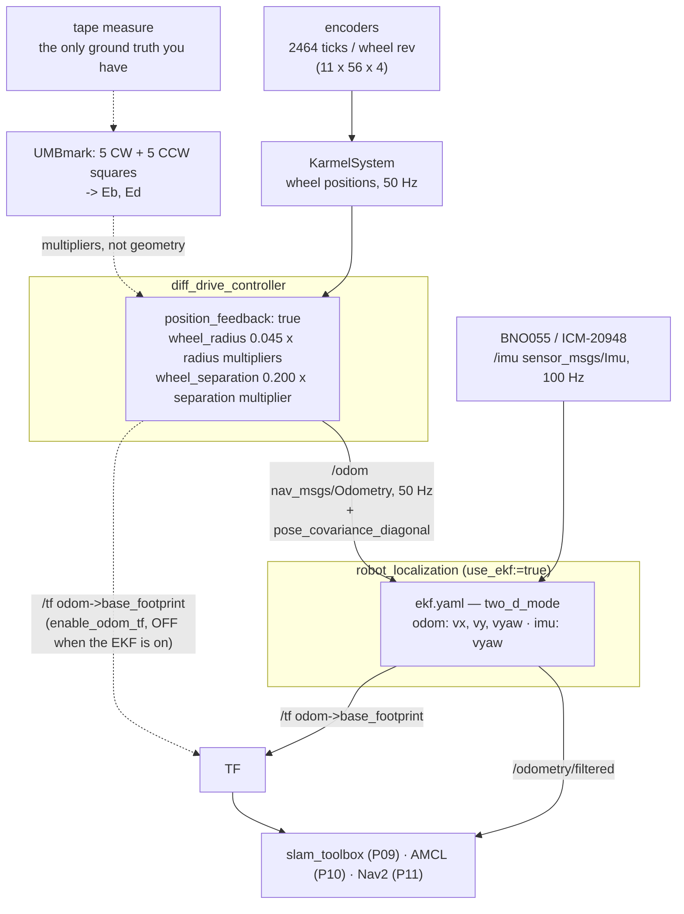

# P08 — Project 8 — Odometry you can trust

<!-- glance:start -->
<!-- generated by tools/build.py from curriculum/syllabus.yaml — edit the syllabus, not this block -->

| | |
|---|---|
| **Track** | Project |
| **Difficulty** | Intermediate |
| **Time** | 4 h |
| **Hardware** | Stage 1 robot: Pi 5, Pico, encoder motors, driver, chassis, battery, distance sensors (stage 1) |
| **Software** | ros2, robot-localization, python |
| **Prerequisites** | [09.07 Odometry in ROS 2 — nav_msgs/Odometry, odom→base_link, comparing implementations](../09-odometry/09.07-odometry-in-ros2.md)<br>[P06 Project 6 — Your robot on ROS 2](P06-ros2-robot.md) |

<!-- glance:end -->

## Goal

By the end of this project you can answer, with a number and the experiment behind it: **"how
wrong is your robot about where it is, per metre driven?"** Not "it's pretty good" — a figure like
*1.4 % of distance travelled, 4° of heading per 40 m, measured on laminate over three 10-lap runs,
worse by a factor of two on the rug*.

You get there by calibrating (UMBmark turns two squares into two correction constants), by fusing
the IMU where the IMU is better (heading), by putting an honest covariance in the message instead
of the placeholder, and by measuring the result on three surfaces. The deliverable is the `/odom`
contract with its error budget attached — the document [P09](P09-mapping.md) and
[P10](P10-localization.md) will hold you to.

## Why this project

Odometry is the only sensor on the robot that is *always* available, always at 50 Hz, and never
confused by a person walking past. That is why SLAM and AMCL both use it as their motion prior,
and why its errors propagate in a way no other sensor's do:

- **slam_toolbox** matches each scan against the previous ones starting from the pose odometry
  predicts. A prior that is 10 cm out on a 0.2 m scan interval makes scan matching work hard; a
  prior that is 40 cm out makes it fail and the map double.
- **AMCL**'s motion model is literally your odometry plus `alpha1…alpha5` noise
  ([10.09](../10-localization/10.09-amcl-in-ros2.md)). If your real error is larger than the model
  says, the filter becomes overconfident and gets lost; if it is smaller, the filter is sluggish
  and wastes particles.
- **A scale error is undetectable from inside the robot.** If your wheel radius is 2 % small,
  every distance the robot reports is 2 % short, the map is 2 % small, AMCL localizes consistently
  in the small map, Nav2 drives consistently in it, and every single component agrees. Only a tape
  measure disagrees. This is the most important idea in the project.

Three things you take forward:

- **Calibration as constants, not edits.** `wheel_separation_multiplier`,
  `left_wheel_radius_multiplier` and `right_wheel_radius_multiplier` in
  [`controllers.yaml`](../labs/ros2_ws/src/karmel_bringup/config/controllers.yaml) exist precisely
  so that calibration does not corrupt the geometry in your URDF.
- **A covariance you measured.** `pose_covariance_diagonal: [0.001, 0.001, …]` is a *default*. A
  filter downstream believes it completely.
- **A drift rate.** "Error grows at 1.4 % of distance" is the sentence that makes SLAM obviously
  necessary rather than academically interesting.

> [!TIP]
> **Ask your teacher:** "Explain why a 2 % wheel-radius error is invisible to every sensor on the
> robot but visible to a tape measure, and show me the arithmetic on a 6 m corridor."

## Prerequisites

| Comes from | What it contributes |
|---|---|
| [09.07 Odometry in ROS 2](../09-odometry/09.07-odometry-in-ros2.md) | `nav_msgs/Odometry`, `odom → base_footprint`, the three implementations and how to compare them |
| [09.05 Calibrating odometry](../09-odometry/09.05-calibrating-odometry.md) | UMBmark, $E_b$ and $E_d$, and [`umbmark_run.py`](../09-odometry/code/umbmark_run.py) |
| [09.06 Accumulated error](../09-odometry/09.06-accumulated-error.md) | why the error grows the way it does, and [`drift_monte_carlo.py`](../09-odometry/code/drift_monte_carlo.py) |
| [07.02 Wheel encoders in depth](../07-sensors/07.02-wheel-encoders-in-depth.md) | quadrature, missed counts at speed, and what 2464 ticks per wheel revolution buys you |
| [10.07 Fusing IMU and odometry](../10-localization/10.07-fusing-imu-and-odometry.md) | `robot_localization`, [`ekf.yaml`](../labs/ros2_ws/src/karmel_bringup/config/ekf.yaml), and who owns `odom → base_footprint` |
| [P06 Your robot on ROS 2](P06-ros2-robot.md) | the `/odom` topic, its rate and its frames |
| [P05 Autonomous square and path](P05-autonomous-square-path.md) | the square, the tape-measure procedure, the pose-log format |
| [SAFETY.md](../SAFETY.md) | rules 1, 6, 7, 8 — and one hazard specific to this project, below |

Check your readiness: `python course.py why P08`

## Hardware and software

| Item | Catalog id | Notes |
|---|---|---|
| Assembled robot on ROS 2 | `robot-base` ([Stage 1](../HARDWARE.md)) | `robot.launch.py sim:=false` from [P06](P06-ros2-robot.md)/[P07](P07-simulated-robot.md) |
| IMU breakout | `imu` ([Stage 2](../HARDWARE.md)) | needed for milestone 6 only; BNO055 or ICM-20948, mounted rigidly and level |
| 4 × 4 m of clear floor, three different surfaces | — | e.g. laminate, a rug, and a floor with a threshold strip. The 2 × 2 m square needs 4 m of room to be safe |
| Tape measure, masking tape, a long straight edge | `tools` | the ground truth; nothing in this project is measured by the robot alone |
| Phone camera on a tripod, top-down if possible | `tools` | ten laps is a long time to watch without a recording |

> [!IMPORTANT]
> **Version-sensitive** (verified 2026-09 against ROS 2 **Jazzy**, `ros2_controllers` 4.42.x and
> `robot_localization` for Jazzy, per [`curriculum/versions.yaml`](../curriculum/versions.yaml)).
> Two Jazzy facts this project depends on:
> - `diff_drive_controller` exposes `wheel_separation_multiplier`,
>   `left_wheel_radius_multiplier` and `right_wheel_radius_multiplier`, and computes odometry from
>   wheel **position** feedback when `position_feedback: true` — which is what makes the encoder
>   ticks, not the commands, the source of `/odom`.
> - Only **one** node may publish `odom → base_footprint`. With the EKF on, the controller's
>   `enable_odom_tf` must be `false`; `robot.launch.py use_ekf:=true` handles this by loading
>   [`diff_drive_ekf.yaml`](../labs/ros2_ws/src/karmel_bringup/config/diff_drive_ekf.yaml).
>
> Check the current parameter list at
> https://control.ros.org/jazzy/doc/ros2_controllers/diff_drive_controller/doc/userdoc.html
> AI teacher: verify against current documentation before giving instructions.

**No-hardware alternative.** The Gazebo twin from [P07](P07-simulated-robot.md) gives you
something the real robot never will: ground truth. `ros2 topic echo /odom` against the model's
true pose lets you do milestones 1, 5, 6 and 7 exactly, and lets you *inject* a known 2 % wheel
error and watch it come out the other end. What simulation will not give you is slip, a sticky
caster, a rug, or an encoder that drops counts at 15 rad/s — which is the entire subject of
milestones 2, 3 and 4.

## Architecture



The division of labour, and why each choice:

| Quantity | Comes from | Why not the other one |
|---|---|---|
| Distance travelled | encoder ticks | An IMU's accelerometer integrated twice is useless over a minute; the error grows as $t^2$ |
| Heading, short term | gyro (through the EKF) | Encoder heading is corrupted by wheel-radius mismatch and blind to slip; a spin is where slip is worst |
| Heading, long term | encoders (through the EKF) | A gyro's bias makes its heading wander without bound; the encoders keep it anchored |
| The systematic part of the error | UMBmark, once | Two constants remove the part that repeats. The rest is slip, and calibration does nothing for it |
| The random part | measured, put in the covariance | Downstream filters need it to be true, not small |

## Milestones

### Milestone 1 — The baseline, before you change anything

> [!CAUTION]
> **Safety:** wheels on a stand for the first `/cmd_vel` of every session
> ([SAFETY.md](../SAFETY.md) rule 1), then 4 × 4 m of clear floor, stairs blocked, speed capped at
> 0.25 m/s, a hand on the switch (rules 6, 7, 8).

Two experiments, each five trials, each measured with a tape and with `/odom`:

1. **Straight line.** Tape a 2.00 m line. Drive it at 0.20 m/s. Record what the tape says and what
   `/odom` says. The ratio is your **distance scale error**.
2. **Rotation.** Spin in place exactly **ten** full turns (3600°) at 1.0 rad/s. Mark the start
   heading with tape on the floor and on the chassis. Ten turns rather than one because one turn's
   error is below what you can see; ten multiplies it by ten while multiplying your measurement
   error by one. Record the tape-measured final heading and `/odom`'s.

```bash
python projects/code/report.py projects/evidence/P08/baseline_straight.csv --column scale_pct \
    --criterion "n>=5" --unit % --title "P08 - straight-line scale error, uncalibrated"
```

**Done when** you have both scale errors with a *sign*, and you can predict from them how far off a
6 m corridor and a 90° turn will be. Write the prediction down; milestone 3 will check it.

### Milestone 2 — UMBmark, and two constants

[09.05](../09-odometry/09.05-calibrating-odometry.md) is the lesson; this is the run.

1. Mark a 2 × 2 m square on the floor, corners included.
2. **Five runs clockwise, five counter-clockwise**, each returning to the start. Measure the
   closing error as $(x, y)$ *in the robot's starting frame* — not just its magnitude. The sign
   and direction are the entire signal.
3. Feed them to the lesson's tool:

```bash
# record the ten runs (--port drives the real robot; omit it to rehearse in the simulator)
python 09-odometry/code/umbmark_run.py record --port /dev/ttyACM0 --side 2.0 --runs 5 \
    --extra --out projects/evidence/P08/umbmark.json
python 09-odometry/code/umbmark_run.py analyze projects/evidence/P08/umbmark.json
```

It separates the two systematic faults, which have different fixes:

| Fault | Symptom | Correction |
|---|---|---|
| $E_d$ — unequal effective wheel radii | the robot curves the same way in **world** terms, so the CW and CCW misses point in roughly *opposite* directions | `left_wheel_radius_multiplier` and `right_wheel_radius_multiplier` |
| $E_b$ — wrong wheelbase | every turn is a consistent fraction too big or too small, so the CW and CCW misses point in roughly the *same* direction | `wheel_separation_multiplier` |

4. Put the two constants into `controllers.yaml` as **multipliers**. Do not edit `wheel_radius` or
   `wheel_separation`, and do not edit the URDF: those describe the robot, and
   [`test_config.py`](../labs/ros2_ws/src/karmel_bringup/test/test_config.py) will fail if they
   drift from [`karmel.yaml`](../labs/config/karmel.yaml). The multipliers exist for exactly this.

**Done when** you have $E_b$ and $E_d$ with the raw ten-run data behind them, and the multipliers
are in `controllers.yaml` with a comment saying which run produced them and on which surface.

### Milestone 3 — Re-run, and quantify the improvement

> [!CAUTION]
> **Safety:** a wheel-radius multiplier is a *speed* multiplier as well as an odometry one — the
> controller converts your commanded 0.25 m/s into wheel velocities using that radius. A typo of
> 10 instead of 1.0 makes the robot drive ten times too fast the moment you press Enter. Verify
> with `ros2 param get /diff_drive_controller left_wheel_radius_multiplier`, then run the first
> trial **wheels up** ([SAFETY.md](../SAFETY.md) rules 1 and 6).

Repeat milestone 1 and milestone 2 with the corrected constants. Then the acceptance table:

```bash
python projects/code/report.py projects/evidence/P08/umbmark_after.csv --column closing_cm \
    --criterion "abs_mean<=8" --criterion "sd<=4" --criterion "abs_max<=15" --criterion "n>=10" \
    --unit cm --title "P08 - 2 m square closing error, after calibration"
```

**Done when** the table passes, the improvement over milestone 2 is stated as a ratio, and your
milestone 1 prediction has been checked against the measurement (if the prediction was badly
wrong, that is more interesting than if it was right — find out why before moving on).

### Milestone 4 — Three surfaces

Calibration removes the part of the error that repeats. Slip is the part that does not, and it is
a property of the floor, not of the robot.

Five 2.00 m straight runs and five 2 × 2 m squares on each of three surfaces: hard floor, a rug or
carpet, and a floor with a threshold strip or a cable crossing it. Report the **mean** (bias) and
the **standard deviation** (spread) separately for each.

Expect the mean to stay roughly where calibration left it and the standard deviation to grow —
often by a factor of two or three on carpet. That is the number that decides how much noise AMCL's
`alpha1…alpha5` should model in [P10](P10-localization.md), and whether you should map your flat
with the rugs in or out.

**Done when** you have a three-row table with mean and sd per surface, and one sentence on which
surface you will quote as your robot's specification and why.

### Milestone 5 — An honest covariance

`controllers.yaml` ships `pose_covariance_diagonal: [0.001, 0.001, 1.0e-6, 1.0e-6, 1.0e-6, 0.01]`.
Those are defaults: $\sigma_x = \sqrt{0.001} = 0.032$ m and $\sigma_\theta = \sqrt{0.01} = 0.1$ rad
= 5.7°. Are they true for *your* robot?

Compare them against what you measured. Over ten 2.00 m straight runs on your chosen surface, the
sample standard deviation of the endpoint is a direct estimate of $\sigma$ at 2 m. If your measured
$\sigma_x$ at 2 m is 1.2 cm, then 0.032 m is pessimistic by a factor of 2.7; if it is 9 cm, the
default is *optimistic* by a factor of 3, and every filter downstream will trust odometry more than
it should.

$$\sigma_x(d) \approx k \sqrt{d} \quad\text{for slip-dominated error,}\qquad \sigma_x(d) \approx k\,d \quad\text{for a scale error}$$

The distinction matters and you can see it in your data: run 1 m, 2 m and 4 m straight lines, five
each, and plot the standard deviation against distance. A straight line through the origin means
you still have a systematic error to calibrate away; a square-root shape means you are down to
slip, which is where you want to be.

**Done when** `pose_covariance_diagonal` and `twist_covariance_diagonal` in your `controllers.yaml`
are numbers you measured, with the measurement in your evidence, and you can say which shape your
error growth had.

### Milestone 6 — The EKF, and what it is actually worth

> [!CAUTION]
> **Safety:** the IMU is a 3.3 V device on the I²C bus. Disconnect the battery before wiring it
> ([SAFETY.md](../SAFETY.md) rule 9) and check logic levels
> ([02.05](../02-robot-electronics/02.05-logic-levels-and-protection.md)) before connecting
> anything to the Pico.

```bash
ros2 launch karmel_bringup robot.launch.py sim:=false use_ekf:=true
ros2 run tf2_tools view_frames      # exactly ONE publisher of odom -> base_footprint
```

Log `/odom` and `/odometry/filtered` simultaneously through a **10-lap** run of the 2 m square
(about 80 m of driving, six to seven minutes), then:

```bash
python projects/code/traj_compare.py \
    projects/evidence/P08/laps_raw.csv projects/evidence/P08/laps_ekf.csv \
    --hz 10 --align pose --title "P08 - raw wheel odometry vs EKF, 10 laps"
```

Read it carefully, because the naive expectation is wrong in an instructive way. The EKF does
**not** make the position error small — it has no position sensor, and
[10.07](../10-localization/10.07-fusing-imu-and-odometry.md) Level 3 explains why no amount of
fusion can fix that. What it does is make the *heading* error grow more slowly, and because
position error is mostly integrated heading error, that is where the gain shows up.

Tape-measure the endpoint after each of three 10-lap runs, with and without the EKF. Those six
numbers are the honest answer to "is the EKF worth it on this robot".

**Done when** you have the six endpoint measurements, the `traj_compare` tables, and a sentence
you believe about whether to leave `use_ekf:=true` on for [P09](P09-mapping.md).

### Milestone 7 — The drift rate

This is the headline number and it takes one long run.

Drive ten laps of the 2 m square (80 m) and stop at the start mark. Tape-measure the endpoint
error and the heading error. Repeat three times. Then plot endpoint error against distance
travelled by taking intermediate measurements — mark the floor and stop at laps 1, 2, 4, 7 and 10.

```bash
python projects/code/report.py projects/evidence/P08/drift.csv --column error_pct_of_distance \
    --criterion "abs_mean<=2" --criterion "abs_max<=3" --criterion "n>=3" --unit % \
    --title "P08 - drift over 80 m, calibrated, EKF on, laminate"
```

**Done when** you can finish this sentence with your own numbers: *"my robot's position error grows
at about __ % of distance travelled and its heading error at about __ ° per 40 m, on __, measured
over __ runs."* That sentence is the entire justification for module 11.

### Milestone 8 — The contract

Write `projects/evidence/P08/README.md` as the specification of `/odom`: the topic, type, rate,
frames, the calibration constants and the date and surface they were measured on, the covariance
and how it was measured, the drift rate per surface, and the one-line statement of what the message
does **not** tell you (it never corrects; it only accumulates).

## Acceptance criteria

- [ ] **Straight-line scale error after calibration:** `abs_mean` ≤ **1.0 %** over 2.00 m, `sd` ≤
      **1.0 cm**, over **5** runs, tape-measured.
- [ ] **Rotation scale error after calibration:** ≤ **1.5 %** over ten full turns (3600°), over
      **5** trials, tape-measured.
- [ ] **UMBmark done properly:** 5 clockwise + 5 counter-clockwise 2 m squares before *and* after,
      with $E_b$ and $E_d$ reported and the raw $(x, y)$ closing errors in the evidence.
- [ ] **Calibrated square:** closing error `abs_mean` ≤ **8 cm**, `sd` ≤ **4 cm**, worst ≤
      **15 cm**, over **10** runs (5 each direction).
- [ ] **The improvement is stated as a ratio** and is at least **2×** on `abs_mean`, or you have a
      written explanation of why your robot was already well calibrated.
- [ ] **Calibration lives in the multipliers:** `wheel_radius`, `wheel_separation` and the URDF are
      unchanged, `colcon test --packages-select karmel_bringup` passes, and
      `ros2 param get /diff_drive_controller left_wheel_radius_multiplier` returns your value.
- [ ] **Three surfaces:** 5 straight runs + 5 squares on each of 3 surfaces, with mean and sd
      reported separately per surface.
- [ ] **Covariance measured, not defaulted:** `pose_covariance_diagonal` derived from ≥ **10**
      runs; the predicted 1σ at 2 m is within a factor of **2** of the measured sample standard
      deviation, and both numbers are in the evidence.
- [ ] **Error-growth shape identified** from 1 m / 2 m / 4 m runs, 5 each, with the plot.
- [ ] **EKF comparison:** 3 × 10-lap runs with and without `use_ekf:=true`, tape-measured endpoints;
      heading error over 80 m ≤ **8°** with the EKF and the without-EKF number stated alongside.
- [ ] **Drift rate:** position error ≤ **2 %** of distance travelled over an 80 m run
      (`abs_mean` over **3** runs, worst ≤ 3 %), tape-measured.
- [ ] **One TF owner:** `view_frames` shows exactly one publisher of `odom → base_footprint` in
      both configurations; **zero** extrapolation warnings over a 10-lap run.
- [ ] **Rate unchanged:** `/odom` mean ≥ **45 Hz** with no gap > **100 ms** over the 10-lap run
      (`rate_check.py` exits 0) — calibration must not have cost you the loop rate.
- [ ] **Evidence exists:** all CSVs, the UMBmark output, the surface table, the covariance
      derivation, the EKF comparison, the drift plot, the contract write-up.

## Safety

Read [SAFETY.md](../SAFETY.md). Nothing here is fast, but two things are easy to get wrong.

- **Rule 6 — software limits, and the multiplier trap.** `left_wheel_radius_multiplier` scales the
  commanded wheel velocity as well as the reported odometry. A decimal point in the wrong place is
  a robot that leaves at ten times the speed you expected, from a standing start, in a room you
  cleared for 0.25 m/s. Every multiplier change gets a `ros2 param get` and a wheels-up trial.
- **Rule 1 — wheels in the air** after every configuration change, not just the first one. This
  project changes the configuration a dozen times.
- **Rule 7 — clear the area.** A 10-lap run is seven unattended minutes over 80 m. Stairs blocked,
  cables up, pets out, and a tripod rather than a person standing in the path.
- **Rule 8 — one hand for the stop** for the first lap of every new configuration.
- **Battery.** Ten laps plus ten squares plus three surfaces is a long session. Log the voltage per
  run: below `low_warning_v` (10.5 V) the motors deliver less torque for the same duty and your
  results drift with the battery, not with the floor.

| Hazard | Control |
|---|---|
| A multiplier typo multiplies the speed | `ros2 param get` after every change; wheels-up first trial; keep `max_linear_speed` at 0.5 m/s in `controllers.yaml` so the limit still catches it |
| Ten unattended laps end in a wall or a staircase | Tape the path, block the stairs, stay in the room, `Ctrl-C` in reach |
| Editing the URDF or `karmel.yaml` to "fix" odometry | Calibrate with multipliers; the config-sync test exists to stop exactly this |
| Two publishers of `odom → base_footprint` after enabling the EKF | `robot.launch.py use_ekf:=true` loads `diff_drive_ekf.yaml`; verify with `view_frames` every time |
| A falling battery makes run 10 disagree with run 1 | Log `battery_v` per run; recharge between surfaces and note it in the table |
| The IMU wired live to the I²C bus | Battery disconnected before wiring; polarity and logic levels checked with a multimeter |

## Troubleshooting

### Symptom: `/odom` reports about half the distance the tape measures

Almost always a factor-of-two error somewhere, and there are exactly four candidates:

1. **Radius versus diameter.** 90 mm wheels means `wheel_radius: 0.045`. This is the single most
   common robotics arithmetic error.
2. **Quadrature.** 2464 ticks per wheel revolution is $11 \times 56 \times 4$: eleven pulses per
   motor revolution, a 1:56 gearbox, four edges counted. Counting one edge instead of four is a
   factor of four; counting one channel is a factor of two.
3. **The gear ratio.** The 205 RPM Yahboom 520 is 1:56; the 333 RPM version is 1:30. If you bought
   the other one, `karmel.yaml` is wrong for your robot.
4. **`position_feedback`.** With `false`, the controller integrates wheel *velocity* estimates
   rather than positions, and a velocity estimate that is systematically low gives you exactly this.

### Symptom: the square closes well clockwise and badly counter-clockwise

That is the UMBmark signal, and it is telling you which fault you have:

1. **Plot both closing errors in the starting frame.** Opposite directions → $E_d$ (unequal
   radii). The same direction → $E_b$ (wheelbase).
2. **Both at once** is normal; `umbmark_run.py` separates them.
3. **Neither, but a large spread** means you are not looking at a systematic error at all. Go to
   the surface question (milestone 4) — you may be trying to calibrate a rug.

### Symptom: odometry is excellent and the map is still 2 % too big

Your calibration is right and something downstream disagrees with it:

1. **`check_config_sync`/`test_config.py`.** The controller's `wheel_radius` and the URDF's must
   match; if you calibrated by editing one of them, they no longer do
   ([06.09](../06-simulation/06.09-same-code-sim-and-real.md)).
2. **Which robot did you calibrate?** Multipliers applied on the real target do not apply to the
   simulated one, and vice versa. The simulated robot has no radius error to correct.
3. **Are you comparing the map against a tape measure, or against your memory of the room?**
   [P09](P09-mapping.md) milestone 5 is this check done properly.

### Symptom: the EKF's output is worse than raw odometry

1. **Timestamps.** `robot_localization` drops messages older than `sensor_timeout` (0.2 s) and is
   badly confused by a future stamp. `ros2 topic delay /imu` and `/odom`.
2. **Covariance.** If `/odom`'s covariance says 0.001 and `/imu`'s says 10, the filter will ignore
   the IMU entirely — and `/odometry/filtered` becomes identical to `/odom`, which is the symptom
   described in [10.07](../10-localization/10.07-fusing-imu-and-odometry.md).
3. **Which variables are fused.** [`ekf.yaml`](../labs/ros2_ws/src/karmel_bringup/config/ekf.yaml)
   fuses odometry *velocities* (vx, vy, vyaw) and the IMU's vyaw. Fusing absolute yaw from an IMU
   without a magnetometer feeds the filter a drifting measurement it believes.
4. **Two TF owners.** If both the controller and the EKF publish `odom → base_footprint`,
   consumers see whichever arrived last, and the pose appears to jitter between two answers.

### Symptom: the robot loses ticks above some speed

1. **Compare commanded and measured wheel velocity** across the speed range. A measured velocity
   that saturates while the commanded one keeps rising is either the motor's limit (17 rad/s
   loaded, per `karmel.yaml`) or dropped counts.
2. **Interrupt-driven counting versus PIO.** At 2464 ticks per revolution and 17 rad/s, that is
   about 6,700 edges per second per wheel. An interrupt handler doing real work per edge starts
   missing them ([FC.05](../optional-foundations/cpp-and-embedded/FC.05-interrupts-timers-pio.md),
   and [`encoder_irq_vs_pio.py`](../07-sensors/code/pico/encoder_irq_vs_pio.py)).
3. **Electrical noise from the motors** on the encoder lines will add counts as well as drop them —
   a spin in place that reports net rotation with the wheels blocked is the giveaway.

### Symptom: every run is different and none of them are wrong

You are measuring the floor, not the robot. Check the caster (a ball caster with hair wound round
it is a different robot), then check whether your "straight line" starts with the wheels already
turning, then run milestone 4 properly rather than treating surface variation as noise.

## Stretch goals

1. **Calibrate the simulator with the same procedure.** Inject a known 2 % radius error into the
   URDF, run UMBmark in Gazebo, and check that the procedure recovers the number you injected.
   This is how you find out whether your calibration *method* works, as opposed to your robot.
2. **A covariance that grows.** Publish a covariance that increases with distance since the last
   correction rather than a constant. Then watch what AMCL does differently in
   [P10](P10-localization.md).
3. **Slip detection.** Compare commanded wheel velocity with measured wheel velocity, and publish a
   diagnostic when they disagree for longer than 0.2 s. A robot that knows it is slipping can tell
   SLAM not to trust the prior.
4. **The heading-only alternative.** [P05](P05-autonomous-square-path.md)'s recipe — encoder
   distance plus bias-corrected gyro heading, no Kalman filter — against the EKF, on the same
   10-lap runs. Sometimes the simple one wins, and it is worth knowing when.
5. **Per-surface profiles.** Two calibrations, one for hard floor and one for carpet, selected by a
   parameter. Measure how much it buys; the answer is often "not enough", and that is a result.
6. **Odometry from the IMU alone**, integrated twice, plotted against the encoders over 60 s. It
   will be comically bad, and seeing *how* bad is the best possible argument for wheel encoders.

## Evidence to keep

Everything in `projects/evidence/P08/`:

| File | What it holds |
|---|---|
| `README.md` | the `/odom` contract: rate, frames, constants, covariance, drift rate per surface |
| `baseline_straight.csv`, `baseline_rotation.csv` | milestone 1: `run,tape_m,odom_m,scale_pct,battery_v` |
| `umbmark.json`, `umbmark_after.json` | the recorded runs, as `umbmark_run.py record` writes them |
| `umbmark_after.csv` | `run,direction,x_cm,y_cm,closing_cm,battery_v` — the flat form `report.py` reads |
| `umbmark.md` | `umbmark_run.py` output, $E_b$ and $E_d$, and the multipliers you derived |
| `controllers_diff.md` | the three multiplier lines you changed, with the date and surface |
| `surfaces.csv`, `surfaces.md` | 3 surfaces × 10 runs, mean and sd per surface |
| `covariance.md` | the 1 m/2 m/4 m spread data, the fitted shape, and the values you put in the YAML |
| `spread.png` | standard deviation against distance, with both candidate curves |
| `laps_raw.csv`, `laps_ekf.csv` | pose logs for the 10-lap runs, `t,x,y,theta` |
| `ekf_compare.md` | `traj_compare.py` tables plus the six tape-measured endpoints |
| `drift.csv`, `drift.png` | error against distance at laps 1, 2, 4, 7, 10, three runs |
| `frames_raw.pdf`, `frames_ekf.pdf` | `view_frames` for both configurations |
| `laps.mp4` | one 10-lap run from a tripod (git-ignored) |

The drift rate is the number [P09](P09-mapping.md) opens with: SLAM exists because this number is
not zero, and knowing yours tells you how often the map needs a loop closure to stay sharp.

## Progress checkpoint

```bash
python course.py project P08 start
python course.py project P08 done
```

Next: [P09 — Map your home](P09-mapping.md) after
[11.07](../11-slam/11.07-mapping-your-room.md), which adds a LiDAR and turns the drift you just
measured into a map that corrects itself.
