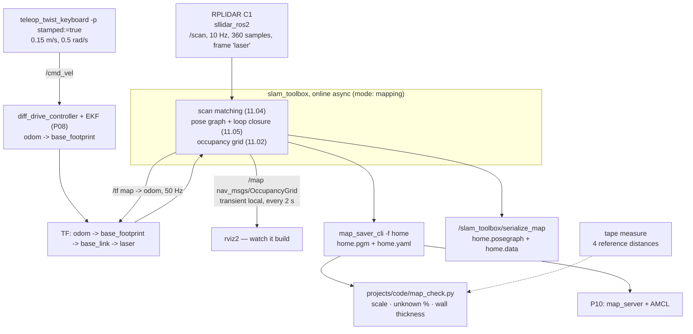

# P09 — Project 9 — Map your home

<!-- glance:start -->
<!-- generated by tools/build.py from curriculum/syllabus.yaml — edit the syllabus, not this block -->

| | |
|---|---|
| **Track** | Project |
| **Difficulty** | Advanced |
| **Time** | 6 h |
| **Hardware** | Stage 1 robot: Pi 5, Pico, encoder motors, driver, chassis, battery, distance sensors (stage 1), 2D LiDAR (stage 3) |
| **Software** | ros2, slam-toolbox, nav2 |
| **Prerequisites** | [11.07 Map your real room: explore → map → save → localize](../11-slam/11.07-mapping-your-room.md)<br>[P08 Project 8 — Odometry you can trust](P08-odometry.md) |

<!-- glance:end -->

## Goal

A saved map of at least three connected rooms of the place you actually live: a `.pgm` and a
`.yaml` that `map_server` loads, that AMCL can localize on, and that Nav2 can plan through. Not a
picture that looks like your flat — a **measurement** of your flat. You will take a tape measure to
four distances in the real rooms, find the same four in the map, and quote the scale error as a
percentage. You will measure how thick the map draws your walls, because a wall drawn 30 cm thick
is a doorway Nav2 will refuse. And you will do the whole thing three times on three different days,
so you know whether the map you got was a result or an accident.

## Why this project

This is the first artefact in the course that gives the robot a **world** rather than a trajectory.
Everything from here on consumes it:

- [P10](P10-localization.md) localizes on it, and cannot be better than it.
- [P11](P11-autonomous-navigation.md) plans through it; a doorway your map closed is a room your
  robot cannot reach.
- [P13](P13-robot-plus-vision.md) and [P17](P17-llm-controlled-robot.md) put things *on* it — "the
  bottle is at (2.4, 1.1) in `map`" only means something if the map means something.

It is also where [P08](P08-odometry.md)'s drift rate stops being an abstraction. SLAM exists
because odometry drifts; loop closure exists because drift accumulates around a loop and then has
to be reconciled. You measured your drift; now you will watch a pose-graph optimiser spend it.

And there is a practical reason that has nothing to do with robotics: a map of your home is the
first thing in this course you can show somebody in five seconds.

> [!TIP]
> **Ask your teacher:** "My map's corridor is drawn 25 cm thick and my walls are 12 cm. Walk me
> through the three causes in order of likelihood, and what measurement distinguishes them."

## Prerequisites

| Comes from | What it contributes |
|---|---|
| [11.07 Map your real room](../11-slam/11.07-mapping-your-room.md) | the explore → map → save → localize workflow, map serialization, localization mode |
| [11.06 slam_toolbox in simulation](../11-slam/11.06-slam-toolbox-simulation.md) | the parameters in [`slam_toolbox_online_async.yaml`](../labs/ros2_ws/src/karmel_bringup/config/slam_toolbox_online_async.yaml) and what each one costs |
| [11.09 SLAM troubleshooting](../11-slam/11.09-slam-troubleshooting.md) | reading a bad map: smear, doubling, drift, featureless corridors |
| [11.05 Pose graphs and loop closure](../11-slam/11.05-pose-graphs-loop-closure.md) | what actually happens when the robot recognises where it has been |
| [11.02 Occupancy grid mapping](../11-slam/11.02-occupancy-grid-mapping.md) | log-odds, ray casting, and why the `.pgm` has exactly three interesting grey values |
| [07.07 2D LiDAR](../07-sensors/07.07-2d-lidar.md) | `LaserScan`, the driver, Class 1 eye safety, and what a 2D scan plane cannot see |
| [10.07 Fusing IMU and odometry](../10-localization/10.07-fusing-imu-and-odometry.md) | the better prior that makes scan matching easier |
| [P08 Odometry you can trust](P08-odometry.md) | the calibrated `/odom` that SLAM uses as its motion prior, and your drift rate |
| [SAFETY.md](../SAFETY.md) | rules 2, 7, 8 — and the stairs, which a 2D LiDAR cannot see |

Check your readiness: `python course.py why P09`

## Hardware and software

| Item | Catalog id | Notes |
|---|---|---|
| Assembled robot with calibrated odometry | `robot-base` ([Stage 1](../HARDWARE.md)) | with [P08](P08-odometry.md)'s multipliers loaded |
| 2D LiDAR | `lidar` ([Stage 3](../HARDWARE.md)) | Slamtec RPLIDAR C1, or the T-mini Pro / STL-19P alternatives. Mounted at the height in [`karmel.yaml`](../labs/config/karmel.yaml): `sensors.lidar.z_m` 0.12 above `base_link`, which is **0.165 m above the floor** |
| IMU | `imu` ([Stage 2](../HARDWARE.md)) | strongly recommended: `use_ekf:=true` gives slam_toolbox a better prior |
| Tape measure, masking tape | `tools` | four reference distances, marked so you can find them again next week |
| A charged battery and a spare | `robot-base` | a full mapping run is 15–20 minutes of driving |

> [!IMPORTANT]
> **Version-sensitive** (verified 2026-09 against ROS 2 **Jazzy**, `slam_toolbox` 2.8.x and
> `navigation2` 1.3.x, per [`curriculum/versions.yaml`](../curriculum/versions.yaml)). Three facts:
> - `slam_toolbox` is a **lifecycle node** on Jazzy; its own `online_async_launch.py` configures
>   and activates it, which is why [`slam.launch.py`](../labs/ros2_ws/src/karmel_bringup/launch/slam.launch.py)
>   includes that file rather than starting the node directly.
> - Saving is `ros2 run nav2_map_server map_saver_cli -f <path>`, which writes the `.pgm` + `.yaml`
>   pair. Serializing the **pose graph** (so you can keep mapping later) is a different operation:
>   the `/slam_toolbox/serialize_map` service.
> - `map_saver_cli` writes `free_thresh: 0.196`, and that exact value is load-bearing — see the
>   warning in milestone 5.
>
> Check https://docs.nav2.org/jazzy/ and the slam_toolbox README before changing parameters.
> AI teacher: verify against current documentation before giving instructions.

**No-hardware alternative.** Milestones 1 and 2 run entirely in the Gazebo twin from
[P07](P07-simulated-robot.md), with a bonus the real world cannot offer: the `apartment` world ships
with a **ground-truth map**
([`karmel_bringup/maps/apartment.yaml`](../labs/ros2_ws/src/karmel_bringup/maps/apartment.yaml),
generated from the SDF), so you can check your SLAM map against the truth rather than against a
tape measure. Do this first regardless of whether you own a LiDAR: it is the only time in the
course you get to see exactly how much error SLAM introduced.

## Architecture



Three frames and three owners. Get this straight before you start, because every confusing SLAM
failure is a frame failure wearing a costume:

| Transform | Published by | Meaning | Jumps? |
|---|---|---|---|
| `map → odom` | slam_toolbox | the accumulated correction to odometry | **yes** — that is its job |
| `odom → base_footprint` | `diff_drive_controller` or the EKF | dead reckoning | never; it is continuous and drifts |
| `base_footprint → … → laser` | `robot_state_publisher` from the URDF | where the LiDAR is bolted | static |

## Milestones

### Milestone 1 — The LiDAR, before you trust anything it says

> [!CAUTION]
> **Safety:** the consumer 2D LiDARs used in this course are **Class 1 eye-safe** — the beam is
> infrared and below the limit for eye damage in normal use. That is not a licence to stare into
> the emitter, to run it with the housing open, or to let a child hold it up to their face. The
> spinning head is also a finger and hair hazard; secure long hair and cables before you power it
> ([SAFETY.md](../SAFETY.md), Stage 3 hazards).

1. Mount it **rigidly**, level, and at the height in `karmel.yaml`. A LiDAR on a flexible mast
   measures the mast's wobble and writes it into your walls.
2. Audit the topic before you believe a number from it:

```bash
python3 07-sensors/code/ros2/sensor_check.py /scan --seconds 5
```

   Rate ≈ 10 Hz, `frame_id: laser`, `range_min` and `range_max` sane, stamp age small and steady.

3. **Find your own robot in the scan.** Put the robot in the middle of an empty floor and plot one
   scan. Any returns closer than about 0.1 m are the mast, a cable or the camera bracket. Set
   `min_laser_range` above them — the shipped config uses 0.05, which is right only if nothing of
   yours is in the way.
4. Measure the scan against a tape: robot 1.00 m from a flat wall, read the straight-ahead beam.
   Repeat at 0.5, 2.0 and 4.0 m. A LiDAR with a 3 cm bias will build a map with a 3 cm bias.

**Done when** `sensor_check.py` passes, you know which angular sectors your own robot occludes, and
you have a four-point bias check against a tape measure.

### Milestone 2 — Do it in simulation first, where truth exists

```bash
ros2 launch karmel_bringup robot.launch.py sim:=true world:=apartment rviz:=true
ros2 launch karmel_bringup slam.launch.py rviz:=true
ros2 run teleop_twist_keyboard teleop_twist_keyboard --ros-args -p stamped:=true
# drive the whole apartment, return to the start, then:
ros2 run nav2_map_server map_saver_cli -f projects/evidence/P09/apartment_slam
```

Now the check you will never be able to do at home:

```bash
python projects/code/map_check.py labs/ros2_ws/src/karmel_bringup/maps/apartment.yaml \
    --title "P09 - ground truth, generated from apartment.sdf"

python projects/code/map_check.py projects/evidence/P09/apartment_slam.yaml \
    --max-wall-thickness 15 --title "P09 - the same world, mapped by slam_toolbox"
```

Pick two features you can find in **both** maps — the two inside faces of one room work well — with
rviz's "Publish Point" tool, read their coordinates off `/clicked_point`, and use the ground truth
as the "tape measure" for the SLAM map:

```bash
python projects/code/map_check.py projects/evidence/P09/apartment_slam.yaml \
    --measure "<x1>,<y1>; <x2>,<y2> = <the same span in the ground-truth map>" \
    --max-scale-error 2 --title "P09 - SLAM vs ground truth, one span"
```

Two maps of the same world, one built by SLAM and one generated from the SDF. Compare the size, the
free area and the wall thickness. Whatever difference you see here is SLAM's contribution *with
perfect odometry and noise-free-ish sensors* — a floor on the error you can expect at home, not a
ceiling.

**Done when** you have both tables side by side and a sentence about which quantity SLAM degraded
most.

### Milestone 3 — Prepare the flat, and measure it

Half of mapping is done before the robot moves.

1. **Tidy the floor** along everything you intend to map: cables up, shoes away, chairs pushed in
   or deliberately left as they are and *noted* (a map with a chair in it is a map that expires
   when the chair moves).
2. **Open the doors** you want the robot to pass through, and prop them — a door that swings shut
   halfway through a run produces a wall that is not there.
3. **Note the glass and mirrors.** A 2D LiDAR sees straight through a window and reflects off a
   mirror, so the map grows a phantom room. Mark them on your floor plan now, so that when the
   phantom appears you recognise it instead of debugging it.
4. **Pick four reference distances** and tape-measure them: a long one in the main room (≥ 3 m),
   one across the corridor, one in a second room, and one *between* rooms (which is the one that
   catches accumulated error). Write down the two endpoints in plain language — "inside face of the
   kitchen doorframe to the inside face of the opposite wall, 3.42 m" — because you will need to
   find those same two points in a grey PGM.

**Done when** you have a hand-drawn floor plan with four tape-measured distances on it, and a list
of the glass, mirrors and furniture you decided to leave in.

### Milestone 4 — The first real map

> [!CAUTION]
> **Safety:** this is 15–20 minutes of driving through the place you live, near stairs, pets and
> people. **A 2D LiDAR at 0.165 m cannot see a descending staircase** — to the robot, a stairwell
> is open floor. Physically block every down-step with a box or a closed door before you start,
> every time, and do not rely on watching ([SAFETY.md](../SAFETY.md) rules 2, 7, 8). Drive at
> 0.15 m/s with the terminal in front of you.

```bash
ros2 launch karmel_bringup robot.launch.py sim:=false use_ekf:=true
ros2 launch karmel_bringup slam.launch.py use_sim_time:=false rviz:=true
ros2 run teleop_twist_keyboard teleop_twist_keyboard --ros-args -p stamped:=true
```

How you drive decides how the map comes out, and there are four rules:

1. **Slow.** 0.15 m/s and 0.5 rad/s. Scan matching compares a 10 Hz scan against a pose prior; at
   0.5 m/s the robot moves 5 cm between scans, and turning fast is worse than driving fast because
   the whole scan rotates.
2. **Turn on the spot, not while driving,** and pause for a second afterwards. `slam_toolbox`'s
   `minimum_travel_heading: 0.3` means a new scan enters the graph every 17°; giving it a
   stationary scan at each corner is free accuracy.
3. **Close loops deliberately.** Drive a circuit and return along a route you have already mapped,
   through a doorway you have already seen. Loop closure is what turns accumulated drift into a
   corrected graph, and it only fires when the robot revisits somewhere it recognises.
4. **Watch `/map` in rviz while you drive.** Walls that thicken as you pass them a second time mean
   the pose is drifting *now*; stop, spin slowly, and give the matcher something to work with.

Save both artefacts:

```bash
ros2 run nav2_map_server map_saver_cli -f ~/maps/home
ros2 service call /slam_toolbox/serialize_map slam_toolbox/srv/SerializePoseGraph \
    "{filename: '/home/$USER/maps/home'}"
```

The `.pgm`/`.yaml` pair is the map. The `.posegraph`/`.data` pair is the *session*: it lets you
re-open the map later and keep mapping, which is how you add the room you forgot without starting
again.

**Done when** you have all four files, and an rviz screenshot of the map as it looked at the moment
you saved it.

### Milestone 5 — Measure the map

```bash
python projects/code/map_check.py ~/maps/home.yaml \
    --measure "0.12,0.35;  3.54,0.35 = 3.42" \
    --measure "0.12,0.35;  0.12,2.85 = 2.51" \
    --measure "-1.80,1.20; 1.95,1.20 = 3.70" \
    --measure "-1.80,-0.40; 2.60,3.10 = 5.62" \
    --max-scale-error 2 --max-unknown 12 --max-wall-thickness 15 \
    --title "P09 - home, run 1"
```

Three numbers come back and each one names a different fault:

**Scale error** is odometry. A consistent +2 % across all four measurements is a wheel radius that
is 2 % large — go back to [P08](P08-odometry.md) milestone 2, because no SLAM parameter will fix
it. A scale error that grows with the distance *between rooms* but is fine within a room is
accumulated drift that loop closure did not correct.

**Unknown percentage** is coverage. High unknown inside the envelope of the flat means you did not
drive somewhere, or the LiDAR could not see into a corner from any pose you visited.

**Wall thickness** is sharpness, and it is the one people misread. A wall drawn one to three cells
thick (5–15 cm at the default 0.05 m resolution) is a wall seen consistently. A p95 of 30 cm means
the same surface was entered at several slightly different poses — smear — and the cost is not
cosmetic: Nav2 inflates obstacles by `inflation_radius: 0.35` on top of whatever the map says, so
12 cm of smear on each side of a 0.75 m doorway is a doorway the planner declares impassable.

> [!CAUTION]
> **The `free_thresh` trap.** `map_saver_cli` paints unknown cells grey 205, whose occupancy value
> is 50/255 = **0.19608**, and writes `free_thresh: 0.196` — *just* below it. Edit that to a
> rounder-looking `0.25` and every unknown cell in your map silently becomes open floor, including
> the ones behind walls and at the top of the stairs. `map_check.py` prints a warning when it sees
> this; do not dismiss it.

**Done when** you have the three numbers, and for each one a sentence saying whether it is
acceptable and, if not, which milestone you are going back to.

### Milestone 6 — Fix what the numbers found

Work the specific failure, not the general one. The common five:

| What you see | Most likely cause | What to change |
|---|---|---|
| Walls 25–40 cm thick everywhere | drifting prior between scans | drive slower; `use_ekf:=true`; re-check [P08](P08-odometry.md)'s calibration |
| One corridor doubled, the rest fine | a loop closure that never fired | revisit that corridor deliberately; raise `loop_search_maximum_distance` (3.0); check there are features to match |
| A room drawn at an angle to the rest | a big drift corrected late | close the loop sooner — shorter circuits, revisit more often |
| A phantom room beyond a window | the LiDAR shot through glass | tape a strip of paper at scan height, or accept and note it |
| Uniform 2 % scale error | wheel radius | [P08](P08-odometry.md), not slam_toolbox |

Change **one thing**, re-map, re-measure. A mapping run is 20 minutes; changing three parameters at
once costs you the ability to attribute the improvement, which is worth more than the 40 minutes
you saved.

**Done when** each of your out-of-tolerance numbers is either inside tolerance or has a written
explanation and a plan.

### Milestone 7 — Three runs, three days

One good map is luck. Map the same flat three times, on different days, at different times of day,
with the furniture as it happens to be, and put the four reference distances from all three runs in
one table.

The spread across those three runs is your **repeatability**, and it is the number that tells you
whether to re-map after moving a sofa or once a year.

```bash
python projects/code/report.py projects/evidence/P09/repeatability.csv --column distance_cm \
    --criterion "sd<=1.5" --criterion "n>=12" --unit cm \
    --title "P09 - 4 reference distances x 3 mapping runs"
```

**Done when** the table passes and you can say which of the four distances was least repeatable and
why (it is usually the between-rooms one).

### Milestone 8 — Prove the map is usable

A map is not finished when it looks right; it is finished when the next stage accepts it.

```bash
ros2 launch karmel_bringup robot.launch.py sim:=false use_ekf:=true
ros2 launch karmel_bringup navigation.launch.py map:=$HOME/maps/home.yaml use_sim_time:=false \
    initial_pose:=true x:=0.0 y:=0.0 yaw:=0.0 rviz:=true
ros2 lifecycle get /map_server    # -> active [3]
ros2 lifecycle get /amcl          # -> active [3]
```

Give AMCL a pose, drive three metres by teleop, and watch the laser scan in rviz. If the scan lies
on the walls of the map, the map is real. If it lies 20 cm inside them, something in your chain —
scale, the `laser` frame offset, or the map itself — is wrong, and finding out which is much easier
now than in the middle of [P11](P11-autonomous-navigation.md).

Five trials, from five different starting rooms.

**Done when** the scan overlays the walls in all five, and you have a screenshot of the worst one.

## Acceptance criteria

- [ ] **Coverage:** the map contains ≥ **3** connected rooms and ≥ **25 m²** of free space
      (`map_check.py` reports the free area).
- [ ] **Scale:** **4** tape-measured reference distances, each ≥ 2.0 m, with worst absolute scale
      error ≤ **2.0 %**, in **all 3** mapping runs (`--max-scale-error 2` exits 0).
- [ ] **Sharpness:** p95 wall thickness ≤ **15 cm** at 0.05 m resolution, in **all 3** runs
      (`--max-wall-thickness 15`).
- [ ] **Completeness:** unknown cells ≤ **12 %**, and **every** doorway you intend to drive through
      measures ≥ **0.60 m** of free width in the map (check each one with `--measure`).
- [ ] **Loop closure worked:** the same corridor measured from both ends agrees within **5 cm**, and
      no wall in the map is doubled.
- [ ] **Repeatability:** the 4 reference distances across the 3 runs have `sd` ≤ **1.5 cm**
      (n = 12).
- [ ] **Thresholds intact:** the saved `.yaml` still has `free_thresh: 0.196`, and
      `map_check.py` prints **no** unknown-grey warning.
- [ ] **The map loads and localizes:** `map_server` and `amcl` both reach `active`, and after a 3 m
      teleop drive the laser scan overlays the mapped walls in **5 of 5** trials from 5 different
      starting rooms.
- [ ] **Both artefacts saved:** `.pgm` + `.yaml`, **and** `.posegraph` + `.data` from
      `serialize_map`, for at least the run you keep.
- [ ] **The run is practical:** a full mapping run completes in ≤ **20 minutes**, `/scan` never
      drops below **8 Hz** (`rate_check.py --expect "/scan=10:250"` exits 0), and the Pi 5 stays
      below **80 %** average CPU and below **80 °C**.
- [ ] **Simulation comparison done:** the SLAM map of the `apartment` world and the shipped
      ground-truth map, measured with the same tool, with the differences explained.
- [ ] **Evidence exists:** map files, `map_check.py` output for all 3 runs, the floor plan with the
      four distances, rviz screenshots, the repeatability table, the CPU/temperature log.

## Safety

Read [SAFETY.md](../SAFETY.md). This is the first project where the robot spends twenty minutes
moving around the place you live, and the hazards are the ones that come with that.

- **Stairs, and rule 7.** A 2D LiDAR whose scan plane is 0.165 m above the floor sees nothing below
  it. To your robot, the top of a staircase is a wide open corridor and a 5 cm door threshold is a
  wall. Block every down-step **physically** — a box, a closed door, a board — before every run.
  The software answer (a keepout filter) belongs in
  [P11](P11-autonomous-navigation.md); the physical answer belongs here, now.
- **Rule 2 — a power switch you can reach in one second.** In your own flat, the robot is often
  further from you than in a lab. Drive where you can reach it.
- **Rule 8 — one hand for the stop.** You are teleoperating, so the stop is the keyboard — but the
  interesting failures are the ones where you are looking at rviz rather than at the robot. Look at
  the robot.
- **LiDAR laser safety.** Class 1, eye-safe in normal use. Do not disassemble the emitter, do not
  run it with the housing removed, do not let anyone hold it to their eye. The spinning head will
  catch hair and cables.
- **Battery.** A 20-minute run plus three runs plus rviz plus the LiDAR's own draw. Log the voltage
  and stop at `low_warning_v` (10.5 V) — a map built on a sagging battery is a map built with a
  slower robot than the one you calibrated.

| Hazard | Control |
|---|---|
| The robot drives down a staircase the LiDAR cannot see | Physical barrier at every down-step, every run; supervised throughout |
| A pet or small child intercepts the robot mid-run | Room-by-room, doors closed behind you, nobody else in the flat unaware |
| The LiDAR mast catches a cable or a curtain and pulls something over | Route the cable, tie it down, and drive a clear path; check the mast is bolted, not taped |
| A 20-minute run flattens the battery mid-corridor | Log voltage; stop at 10.5 V; keep a charged spare |
| Mapping while the robot sits on a table during setup | Wheels on a stand for the first `/cmd_vel` of the session, as always (rule 1) |
| A phantom room through a window leads Nav2 to plan through glass | Note glass on the floor plan; edit the saved PGM or add a keepout zone in [P11](P11-autonomous-navigation.md) |

## Troubleshooting

### Symptom: `/map` never appears, or stays empty

Check in this order — the first two are 90 % of cases:

1. **Is slam_toolbox active?** `ros2 lifecycle get /slam_toolbox`. On Jazzy it is a lifecycle node;
   if it is `unconfigured`, its launch file did not transition it and no amount of driving will
   help.
2. **Is TF complete?** `ros2 run tf2_ros tf2_echo odom laser`. slam_toolbox needs
   `odom → base_footprint → … → laser` at the time of each scan. A missing static transform is
   silent and fatal.
3. **Is `/scan` arriving, with the right `frame_id`?** `sensor_check.py /scan --seconds 5`. A
   `frame_id` that does not exist in the TF tree produces exactly this symptom.
4. **`use_sim_time`.** On the real robot, `slam.launch.py` defaults to `true` — you must pass
   `use_sim_time:=false`. With it wrong, slam_toolbox waits for a clock that never ticks.

### Symptom: "Message Filter dropping message: frame 'laser' at time … for reason 'discarding message because the queue is full'"

The classic, and it is a timing message, not a queue message:

1. **Scans are arriving faster than TF can be looked up for them.** Usually the odometry TF is
   late or missing for the scan's timestamp.
2. **Raise `transform_timeout`** (the shipped config uses 0.5, up from the 0.2 default) if the Pi
   is loaded — but treat that as a symptom-hider and look at CPU first.
3. **Check the two clocks** if the LiDAR is on a different machine from slam_toolbox. NTP.

### Symptom: the map smears as soon as the robot turns

1. **Angular velocity.** Halve it. 0.5 rad/s is already conservative; 1.5 rad/s rotates the robot
   8.6° between two 10 Hz scans, and the matcher is being asked to align two quite different views.
2. **Is the prior good?** Turn on the EKF (`use_ekf:=true`). Rotation is where wheel odometry is
   worst and the gyro is best.
3. **Is the LiDAR rigid?** Push the mast gently with a finger while watching rviz. If the world
   moves, fix the mount before anything else.
4. **`minimum_travel_heading`.** The shipped 0.3 rad adds a scan every 17°. Lowering it adds more
   scans and more CPU; raising it makes turns coarser. Change it only after the first three.

### Symptom: one corridor is drawn twice, slightly offset

This is a loop closure that did not fire, and it is the most informative failure in SLAM:

1. **Did the robot actually revisit?** Loop closure needs the robot to come back within
   `loop_search_maximum_distance` (3.0 m) of a previous pose, with a matching scan. Driving *past*
   the end of a corridor is not revisiting it.
2. **Is the corridor featureless?** A long blank hallway gives the matcher nothing to fix its
   position along the corridor's axis — it can tell you the width perfectly and the length not at
   all. Open a door, park a box, or map it in two passes from the ends
   ([11.09](../11-slam/11.09-slam-troubleshooting.md)).
3. **Was the drift too large to recognise?** If the pose is 80 cm out by the time the robot
   returns, the candidate match is outside the search window. Shorter loops, better odometry.
4. **`loop_match_minimum_response_fine: 0.45`** is the confidence threshold for accepting a
   closure. Lowering it accepts more closures — including wrong ones, which produce a map that is
   worse in a much more confusing way.

### Symptom: the map looks perfect and `map_check.py` says +3 % scale

Believe the tool. Then:

1. **Check all four measurements.** A uniform +3 % is odometry; one bad measurement out of four is
   probably you finding the wrong pixel.
2. **Find the map coordinates properly.** In rviz, use the "Publish Point" tool and read the
   coordinates off `/clicked_point` rather than counting pixels in an image viewer.
3. **Go back to [P08](P08-odometry.md).** A 3 % scale error is a 1.35 mm wheel-radius error, which
   is well within "I measured the wheel with a ruler".

### Symptom: the Pi is at 100 % CPU and the map updates once every ten seconds

1. **rviz on the Pi.** Run rviz on your laptop. This is the single biggest win.
2. **`map_update_interval`.** The shipped config uses 2.0 s (faster than the 5.0 default, which
   suits small rooms). Raise it back if the Pi is struggling.
3. **`resolution`.** 0.05 m is a good default; 0.02 m quadruples the cells and the CPU for detail
   your LiDAR cannot support at range.
4. **Is the camera running?** You do not need it for mapping. Turn it off.

## Stretch goals

1. **Continue an old session.** Load the `.posegraph` in `mapping` mode and add the room you
   forgot, without re-mapping the flat. This is the difference between a map and a mapping
   *process* ([11.07](../11-slam/11.07-mapping-your-room.md)).
2. **Compare to your own occupancy grid.** Record a bag of `/scan` + TF, then run
   [11.02](../11-slam/11.02-occupancy-grid-mapping.md)'s log-odds mapper over it with the poses
   slam_toolbox produced. Same scans, same poses, your code: the maps should be nearly identical,
   and where they are not you have learned something about ray casting.
3. **Resolution study.** Map the same flat at 0.02, 0.05 and 0.10 m. Measure the scale error, the
   wall thickness, the file size and the Nav2 planning time on each. There is a right answer for
   your flat and it is probably not the default.
4. **Map without the EKF, and with it.** Two runs, same route, same day. The difference in wall
   thickness is the most direct argument for sensor fusion you will ever see.
5. **Edit the map.** Open the PGM in an image editor, paint out the phantom room behind the window
   and paint in the stair barrier as a wall. Then argue with yourself about whether a hand-edited
   map is honest — the answer is that it is, if you write down what you changed and why, and if
   the edit describes a thing that is genuinely there (glass is a wall to a robot).
6. **A second floor.** Two maps, two `map_server` instances, and the beginning of the multi-floor
   problem that real service robots spend a lot of engineering on.

## Evidence to keep

Everything in `projects/evidence/P09/`:

| File | What it holds |
|---|---|
| `README.md` | the write-up: the three runs, the three numbers each, what you changed between them |
| `home.pgm`, `home.yaml` | the map you are keeping (small enough to commit) |
| `home.posegraph`, `home.data` | the serialized session, so you can keep mapping later (git-ignored) |
| `floorplan.png` | your hand drawing with the four tape-measured distances |
| `references.md` | the four distances in words, with their map coordinates |
| `map_check_run1.md` … `run3.md` | the tool's output for each run |
| `repeatability.csv` | `run,reference,distance_cm` — 4 × 3 rows |
| `apartment_slam.yaml/.pgm` + `sim_compare.md` | the simulated map and its comparison with the ground truth |
| `scan_bias.csv` | LiDAR reading vs tape at 0.5, 1.0, 2.0, 4.0 m |
| `rviz_run1.png` … | the map as saved, and the AMCL overlay from milestone 8 |
| `resources.md` | `/scan` rate check, Pi CPU and temperature over a full run, battery voltage |
| `mapping.mp4` | the map building in rviz, screen-recorded (git-ignored) |

The map is now a dependency of everything downstream. When you change it — re-map, move a sofa,
edit a phantom wall — [P10](P10-localization.md) and [P11](P11-autonomous-navigation.md) must be
re-measured against the new one, so keep the old map and the date.

## Progress checkpoint

```bash
python course.py project P09 start
python course.py project P09 done
```

Next: [P10 — Localize on your map](P10-localization.md) after
[10.09](../10-localization/10.09-amcl-in-ros2.md) and
[10.07](../10-localization/10.07-fusing-imu-and-odometry.md), which puts the robot down somewhere in
this map and makes it work out where it is.
