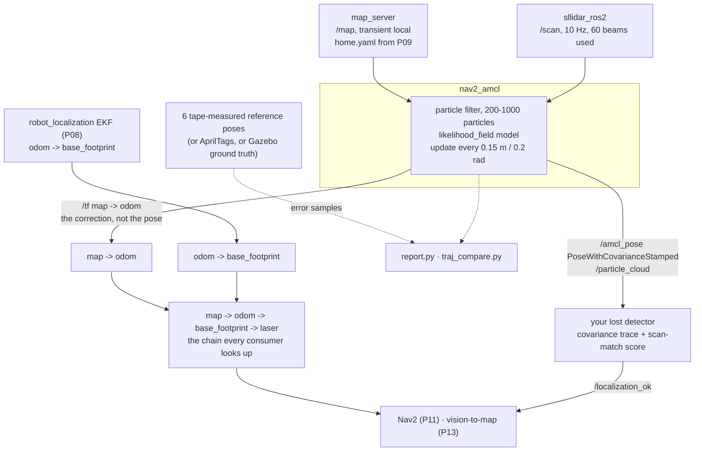

# P10 — Project 10 — Localize on your map

<!-- glance:start -->
<!-- generated by tools/build.py from curriculum/syllabus.yaml — edit the syllabus, not this block -->

| | |
|---|---|
| **Track** | Project |
| **Difficulty** | Advanced |
| **Time** | 5 h |
| **Hardware** | Stage 1 robot: Pi 5, Pico, encoder motors, driver, chassis, battery, distance sensors (stage 1), 2D LiDAR (stage 3), IMU breakout (stage 2) |
| **Software** | ros2, nav2, robot-localization |
| **Prerequisites** | [10.09 AMCL in ROS 2 — localizing on a known map](../10-localization/10.09-amcl-in-ros2.md)<br>[10.07 Sensor fusion — IMU + wheel odometry with robot_localization](../10-localization/10.07-fusing-imu-and-odometry.md)<br>[P09 Project 9 — Map your home](P09-mapping.md) |

<!-- glance:end -->

## Goal

Put the robot down in your flat, roughly where you think it is, and within three metres of driving
it knows where it is to within 15 cm and 8°. Take away the hint entirely — scatter the particles
across the whole map — and it still works it out most of the time, and you can say exactly how
often and why the rest fail. Drive it around for ten minutes and its belief stays within 20 cm of
the truth at the p95. Pick it up and move it three metres, and it either recovers or **tells you it
is lost** rather than confidently driving into a wall.

The deliverable is a localization system with an error distribution attached: not "AMCL works", but
*"mean 7 cm, p95 16 cm, worst 24 cm over 22 samples against tape-measured reference poses, and the
reported covariance is honest to within a factor of two."*

## Why this project

`map → odom` is the transform that makes everything in module 12 possible, and it is also the
single most common cause of navigation failure. Nav2's error code **205 START_OCCUPIED** — "the
robot is inside a lethal cell" — almost never means the robot is touching something; it means the
robot believes it is somewhere it is not ([12.10](../12-navigation/12.10-recovery-and-navigation-safety.md)).

Three things you take forward:

- **The distinction between accuracy and honesty.** A filter that is 30 cm out and *says so* is
  usable: the planner can slow down, the robot can re-localize, a skill can refuse to act. A filter
  that is 30 cm out and reports a 2 cm covariance is dangerous, and it is the more common failure.
  You will measure both.
- **A lost detector.** Every autonomous layer above this one — Nav2 in [P11](P11-autonomous-navigation.md),
  the vision-to-map pipeline in [P13](P13-robot-plus-vision.md), the LLM's skills in
  [P17](P17-llm-controlled-robot.md) — needs a trustworthy "I do not know where I am" signal, and
  none of them can produce it themselves.
- **The kidnapped-robot experiment.** karmel's `nav2_params.yaml` ships `recovery_alpha_slow: 0.0`
  and `recovery_alpha_fast: 0.0`, which **disables** AMCL's recovery-injection entirely. That is a
  deliberate default with a real cost, and this project is where you measure both sides of it
  instead of copying a number from a tutorial.

> [!TIP]
> **Ask your teacher:** "Explain the difference between AMCL being wrong and AMCL being
> overconfident, in the terms I'd use for a cache that returns stale data versus one that lies
> about its TTL — and tell me which of my measurements distinguishes them."

## Prerequisites

| Comes from | What it contributes |
|---|---|
| [10.09 AMCL in ROS 2](../10-localization/10.09-amcl-in-ros2.md) | the three nodes, the lifecycle, karmel's `amcl` parameters, `/set_initial_pose` and `/reinitialize_global_localization` |
| [10.08 Particle filters and MCL](../10-localization/10.08-particle-filter-mcl.md) | what the particles are doing, and why 60 beams instead of 360 |
| [10.07 Fusing IMU and odometry](../10-localization/10.07-fusing-imu-and-odometry.md) | the EKF that owns `odom → base_footprint`, so AMCL only has to correct the slow part |
| [10.02 Uncertainty and Gaussians](../10-localization/10.02-uncertainty-gaussians.md) | reading a covariance ellipse, and what 2σ means |
| [05.06 Frame conventions (REP-105)](../05-frames-and-transforms/05.06-frame-conventions-rep103-rep105.md) | why `map → odom → base_footprint` and not `map → base_footprint` |
| [P09 Map your home](P09-mapping.md) | the map, and its measured scale error — AMCL cannot beat the map |
| [P08 Odometry you can trust](P08-odometry.md) | the motion model AMCL's `alpha1…alpha5` are supposed to describe |
| [SAFETY.md](../SAFETY.md) | rules 2, 7, 8, and one rule about picking up a powered robot |

Check your readiness: `python course.py why P10`

## Hardware and software

| Item | Catalog id | Notes |
|---|---|---|
| Assembled robot, calibrated | `robot-base` ([Stage 1](../HARDWARE.md)) | [P08](P08-odometry.md)'s multipliers, [P06](P06-ros2-robot.md)'s interface |
| 2D LiDAR | `lidar` ([Stage 3](../HARDWARE.md)) | the same mounting as [P09](P09-mapping.md) — if you move it, re-map |
| IMU | `imu` ([Stage 2](../HARDWARE.md)) | `use_ekf:=true`; AMCL's job gets much easier with a good `odom` frame |
| Your map from [P09](P09-mapping.md) | — | `.pgm` + `.yaml`, with the measured scale error written down |
| Tape measure, masking tape, a square or a long straight edge | `tools` | six reference poses on the floor, position **and** heading |
| Optional: printed AprilTags | `camera` ([Stage 2](../HARDWARE.md)) | [10.10](../10-localization/10.10-fiducial-landmarks.md) gives you a ground truth that does not require a tape measure per sample |

> [!IMPORTANT]
> **Version-sensitive** (verified 2026-09 against ROS 2 **Jazzy** and `navigation2` **1.3.x**, per
> [`curriculum/versions.yaml`](../curriculum/versions.yaml)). Three facts:
> - AMCL, `map_server` and the Nav2 servers are **lifecycle** nodes brought up by
>   `nav2_lifecycle_manager`. `ros2 lifecycle get /amcl` must say `active [3]` before any other
>   diagnosis is meaningful.
> - `ros2 service call /set_initial_pose nav2_msgs/srv/SetInitialPose …` and
>   `ros2 service call /reinitialize_global_localization std_srvs/srv/Empty` are the two services
>   this project is built on; both are available once AMCL is active.
> - `robot_model_type: "nav2_amcl::DifferentialMotionModel"` — the `::` plugin naming is the Jazzy
>   form; older `/`-separated names silently fail to load.
>
> Check https://docs.nav2.org/jazzy/configuration_and_development/configuration_guide/others/configuring_amcl/
> before changing parameters. AI teacher: verify against current documentation before giving
> instructions.

**No-hardware alternative.** The Gazebo twin plus the `apartment` world and its ground-truth map
gives you something better than a tape measure: the simulator knows the true pose exactly, so every
error sample is free and you can take a thousand instead of twenty. Build the whole measurement
harness there — the convergence test, the error sampler, the kidnapping test — and then run the
same harness on the floor with tape-measured reference poses instead of ground truth. Milestones 1,
3, 4, 6 and 7 all work in simulation; only the numbers change.

## Architecture



The division of responsibility is the thing to hold onto:

| Transform | Owner | Continuous? | What it means |
|---|---|---|---|
| `odom → base_footprint` | the EKF | **yes**, always smooth | where the robot has driven since it started. Drifts, never jumps |
| `map → odom` | AMCL | **no**, jumps on every correction | the accumulated error in the above, as best AMCL can tell |
| `map → base_footprint` | nobody — it is the composition | jumps | where the robot actually is, as far as the system believes |

A controller must consume the **continuous** frame for anything short-term, or a correction jump
becomes a steering command. That is why Nav2's local costmap is in `odom` and its global costmap is
in `map` ([12.04](../12-navigation/12.04-costmaps.md)).

## Milestones

### Milestone 1 — Ground truth on your floor

You cannot measure an error without a truth, and "it looked about right in rviz" is not one.

Mark **six reference poses** spread across the map — one per room plus two in the corridor.
For each: a tape cross on the floor for the wheel-axle centre, a line for the heading, and its
coordinates in the map frame. Getting those coordinates is the fiddly part; the reliable recipe is:

1. Drive the robot precisely onto the mark by hand, wheels centred on the cross, chassis aligned
   with the heading line.
2. Give AMCL a good initial pose elsewhere, drive to the mark under teleop, and let it settle.
3. In rviz, use "Publish Point" on the two ends of your heading line and read `/clicked_point`.
4. Cross-check by tape-measuring the distance between two adjacent marks and comparing it with the
   distance between their map coordinates. If those disagree by more than your [P09](P09-mapping.md)
   scale error, one of the coordinates is wrong.

**Done when** you have six poses as `(name, x, y, yaw)` with a note on how each was obtained, and
the cross-check between at least two pairs agrees within 3 cm.

### Milestone 2 — Bring it up, and check the frames before anything else

> [!CAUTION]
> **Safety:** the robot will be driven around your flat repeatedly over several hours. Stairs
> physically blocked, floor clear, speed capped at 0.20 m/s, nobody else in the flat unaware
> ([SAFETY.md](../SAFETY.md) rules 2, 7, 8). This project also involves **picking the robot up**
> (milestone 7): stop the motors and switch off motor power before your hands go near the wheels.

```bash
ros2 launch karmel_bringup robot.launch.py sim:=false use_ekf:=true
ros2 launch karmel_bringup navigation.launch.py map:=$HOME/maps/home.yaml \
    use_sim_time:=false initial_pose:=true x:=0.0 y:=0.0 yaw:=0.0 rviz:=true

ros2 lifecycle get /map_server         # active [3]
ros2 lifecycle get /amcl               # active [3]
ros2 run tf2_tools view_frames
ros2 topic echo /amcl_pose --once
```

Three checks, in this order:

1. **Exactly one publisher of `map → odom`** (AMCL) and **exactly one** of
   `odom → base_footprint` (the EKF, because `use_ekf:=true` turns off the controller's). Two
   publishers of either produce a robot that flickers between two beliefs, and the symptom looks
   like noise.
2. **The scan lies on the walls.** Add LaserScan and Map displays in rviz with Fixed Frame `map`.
   If the scan is rotated relative to the map, your `laser` frame's yaw in the URDF is wrong. If it
   is uniformly scaled, go back to [P09](P09-mapping.md).
3. **`/particle_cloud` is a cloud, not a dot.** Add it in rviz. You will spend the rest of this
   project reading it, and it tells you more than the covariance does.

**Done when** all three pass and you have the `view_frames` PDF.

### Milestone 3 — Convergence with a hint, 20 trials

This is the everyday case: you switch the robot on, you know roughly where it is, you tell it.

For each trial: place the robot on one of the six marks, seed AMCL with a pose **deliberately
wrong** by about 0.5 m and 20° (a realistic human estimate), then drive forward under teleop and
record the distance travelled until the pose is within 15 cm and 8° of the mark and stays there.

```bash
ros2 service call /set_initial_pose nav2_msgs/srv/SetInitialPose \
  "{pose: {header: {frame_id: map}, pose: {pose: {position: {x: 1.5, y: 0.8}, orientation: {w: 1.0}}}}}"
```

Twenty trials, spread over all six marks. Log `trial,mark,seed_error_m,converge_m,final_err_cm,final_yaw_deg,outcome`.

```bash
python projects/code/mission_report.py projects/evidence/P10/converge_hint.csv \
    --group mark --min-success-rate 0.9 --min-trials 20 \
    --title "P10 - convergence from a 0.5 m / 20 deg hint"

python projects/code/report.py projects/evidence/P10/converge_hint.csv --column converge_m \
    --criterion "abs_mean<=1.5" --criterion "abs_max<=3.0" --criterion "n>=20" --unit m \
    --title "P10 - distance driven to converge"
```

Watch `/particle_cloud` while it happens. In a corridor you will see the cloud collapse *across*
the corridor immediately and remain stretched *along* it for metres — the scan constrains the
width, not the length. That picture explains most of what follows.

**Done when** both tables pass and you can describe, from the particle cloud, which direction
converged last at each mark.

### Milestone 4 — Global localization, 10 trials

No hint at all. `reinitialize_global_localization` scatters particles over the entire free space:

```bash
ros2 service call /reinitialize_global_localization std_srvs/srv/Empty
```

Then drive — under teleop, deliberately, through doorways and past corners rather than along a
corridor — and record the distance driven until convergence, with a 15 m cap after which you
declare it failed.

Expect this to be much harder, and expect the failures to be **informative rather than random**:

- **Symmetry.** Two identically sized bedrooms, or a corridor that looks the same from both ends,
  give the filter two equally good hypotheses. It will pick one, and it may pick wrong. That is not
  a bug in AMCL; it is a genuine property of your flat as seen by a 2D LiDAR at 16.5 cm.
- **Featureless openings.** A large open living room gives the scan little to lock onto.
- **Doorways are the cure.** Driving through a door is the single most informative thing the robot
  can do, because a doorway is a distinctive local shape.

```bash
python projects/code/mission_report.py projects/evidence/P10/converge_global.csv \
    --min-success-rate 0.7 --min-trials 10 --title "P10 - global localization, no hint"
```

**Done when** you have 10 trials, and for **every** failure a named cause (which two places the
robot confused, and why they look the same to a 2D scan).

### Milestone 5 — Steady-state accuracy over a ten-minute patrol

Drive a route that visits all six marks, three times, stopping precisely on each mark and recording
AMCL's belief against the tape. That is 18 error samples; add a few en-route stops for 20+.

```bash
python projects/code/report.py projects/evidence/P10/patrol_error.csv --column pos_err_cm \
    --criterion "abs_mean<=10" --criterion "p95<=20" --criterion "abs_max<=30" \
    --criterion "n>=20" --unit cm --title "P10 - position error at reference marks"

python projects/code/report.py projects/evidence/P10/patrol_error.csv --column yaw_err_deg \
    --criterion "abs_mean<=5" --criterion "abs_max<=12" --criterion "n>=20" --unit deg \
    --title "P10 - heading error at reference marks"
```

Also log the raw odometry pose alongside, and compare the two trajectories:

```bash
python projects/code/traj_compare.py projects/evidence/P10/patrol_odom.csv \
    projects/evidence/P10/patrol_amcl.csv --hz 5 --align time \
    --title "P10 - what AMCL corrected over ten minutes"
```

`--align time` here, not `--align pose`: both logs are already in a common world and the absolute
difference *is* the result. The final separation is exactly the drift AMCL removed — the same
number [P08](P08-odometry.md) predicted from your drift rate, arriving from the other direction.

**Done when** both tables pass and the `traj_compare` final separation agrees with the drift
[P08](P08-odometry.md) predicts for that distance within a factor of two.

### Milestone 6 — Is the covariance honest?

AMCL publishes a 6×6 covariance on `/amcl_pose`. Take the 2×2 position block, compute the
1σ ellipse, and ask: **how often does the truth fall outside the 2σ ellipse?**

For a correctly calibrated filter, about **5 %** of the time. In practice, particle filters with
few beams and cheerful motion noise are usually *over*confident, and you will see 20–40 %.

Using your 20+ samples from milestone 5: for each, compute the Mahalanobis distance of the true
pose from the reported mean. The fraction with $d > 2$ is the number.

$$d = \sqrt{(\mathbf{x}_{\text{true}} - \boldsymbol{\mu})^\top \Sigma^{-1} (\mathbf{x}_{\text{true}} - \boldsymbol{\mu})}$$

Worked example: AMCL reports $\mu = (2.10, 1.40)$ with $\sigma_x = \sigma_y = 0.05$ m and no
correlation; the tape says the robot is at $(2.22, 1.44)$. Then $d = \sqrt{(0.12/0.05)^2 +
(0.04/0.05)^2} = \sqrt{5.76 + 0.64} = 2.53$. That sample is outside 2σ: the filter is 12.6 cm wrong
and claims 5 cm of uncertainty.

If your fraction is far above 5 %, the two parameters to reach for are `alpha1…alpha5` (raise them
so the motion model spreads the cloud more per metre — and you now have [P08](P08-odometry.md)'s
measured spread to justify a value) and `max_beams` (60 by default; more beams are *more*
overconfident, not less, because adjacent LiDAR beams are correlated and the filter treats them as
independent evidence — this is the counter-intuitive result in [10.08](../10-localization/10.08-particle-filter-mcl.md)).

**Done when** you can state the fraction outside 2σ before and after one parameter change, with 20+
samples each time.

### Milestone 7 — Kidnapping, and the cost of recovery

> [!CAUTION]
> **Safety:** you are about to pick up a powered robot with exposed wheels. Stop the motors
> (`Ctrl-C` the teleop, confirm the wheels are stationary), switch **motor power** off at the
> switch, then lift it by the chassis — not by the LiDAR mast, not with fingers near the wheels
> ([SAFETY.md](../SAFETY.md) rules 2 and 9).

The experiment, five trials each way:

1. Localize normally on mark A.
2. Power the motors down, carry the robot to mark C three metres away, set it down, power up.
3. Drive forward under teleop and record whether, and after how far, AMCL recovers.

**With the shipped `recovery_alpha_slow: 0.0` / `recovery_alpha_fast: 0.0`, it will not recover** —
ever. Those parameters disable random particle injection, which is the only mechanism AMCL has for
escaping a confident wrong belief. The particle cloud will sit calmly in the wrong room while the
scan disagrees with the map entirely. Watch that happen at least once; it is the most useful five
minutes in this project.

Then set the values Nav2 suggests (`0.001` / `0.1`), repeat, and measure both sides of the trade:

| | recovery off (0.0 / 0.0) | recovery on (0.001 / 0.1) |
|---|---|---|
| Recovers from a 3 m kidnap | count of 5 | count of 5, and metres driven |
| Spurious pose jumps > 20 cm in a healthy 10-minute drive | count | count |
| CPU | % of one core | % of one core |

The second row is the cost, and it is why the course ships the feature disabled: injected particles
in a symmetric flat can capture the filter and teleport a robot that was perfectly fine.

**Done when** you have the table filled in with your own numbers and a decision, written down, for
which setting your robot runs with and in what circumstances you would change it.

### Milestone 8 — The lost detector

Nothing above matters unless the rest of the system can find out. Write a small node that watches
`/amcl_pose` and `/scan` and publishes a boolean `/localization_ok`, going false when either:

- the trace of the position covariance exceeds a threshold you choose from milestone 6's data, or
- the fraction of scan points that land on a mapped obstacle drops below a threshold (the cheap
  version of a scan-match score: transform each of ~60 beams into the map and check the cell).

Then test it, because an untested alarm is decoration:

| Induced failure | Expected |
|---|---|
| Cover the LiDAR with a cloth while driving | false within 5 s |
| Kidnap the robot 3 m | false within 5 s of resuming driving |
| Seed a deliberately wrong initial pose in the wrong room | false within 5 s |
| Drive normally for 10 minutes | **never** false |

**Done when** the detector fires in 5 of 5 induced failures within 5 s and produces zero false
alarms in a 10-minute healthy run.

> [!TIP]
> **Ask your teacher:** "My lost detector fires twice in a healthy ten-minute run, both times as
> the robot passes the glass balcony door. Is that a false positive or is it correct, and what
> should the robot do about it?"

## Acceptance criteria

- [ ] **Ground truth exists:** **6** reference poses `(x, y, yaw)` marked on the floor and
      expressed in the map frame; two independent pairs cross-checked against a tape within
      **3 cm**.
- [ ] **Frames correct:** exactly one publisher each of `map → odom` and `odom → base_footprint`;
      `view_frames` PDF in evidence; **zero** TF extrapolation warnings over a 10-minute drive.
- [ ] **Convergence with a 0.5 m / 20° hint:** converges to within **15 cm** and **8°** within
      **3.0 m** of driving in **18 of 20** trials, spread over all 6 marks; the Wilson interval is
      reported.
- [ ] **Global localization:** converges within **15 m** of driving in **≥ 7 of 10** trials, and
      **every** failure has a named cause.
- [ ] **Steady-state accuracy, n ≥ 20 samples at reference marks:** position error `abs_mean` ≤
      **10 cm**, `p95` ≤ **20 cm**, worst ≤ **30 cm**; heading error `abs_mean` ≤ **5°**, worst ≤
      **12°**.
- [ ] **AMCL is correcting something:** `traj_compare.py` between the odometry-only and AMCL
      trajectories over the ten-minute patrol shows a final separation consistent with
      [P08](P08-odometry.md)'s drift rate within a factor of **2**.
- [ ] **Honesty:** the fraction of samples with the truth outside the 2σ ellipse is measured on
      ≥ 20 samples and is ≤ **15 %**, or you state the parameter you changed, the before and after
      fractions, and what it cost.
- [ ] **Kidnapping, 5 trials each configuration:** with `recovery_alpha 0.0/0.0`, the recovery
      count is recorded (expected 0 of 5); with `0.001/0.1`, **≥ 3 of 5** recover within **10 m**,
      and the spurious-jump count over a healthy 10-minute drive is recorded for both.
- [ ] **Lost detector:** fires within **5 s** in **5 of 5** induced failures; **zero** false alarms
      in a **10-minute** healthy run.
- [ ] **It runs on the Pi:** AMCL below **35 %** of one core at your chosen `max_particles`, `/scan`
      never below **8 Hz**, `/amcl_pose` at ≥ **1 Hz** while driving
      (`rate_check.py` exits 0); the `max_particles` you settled on is stated with the reason.
- [ ] **Evidence exists:** the reference-pose table, all three trial CSVs, both `report.py` tables,
      the covariance analysis, the kidnapping table, the detector test log, rviz screenshots of the
      particle cloud converging and of a failure.

## Safety

Read [SAFETY.md](../SAFETY.md). The robot is autonomous only in its beliefs here — you are still
driving — but two hazards are specific to this project.

- **Picking up a powered robot (milestone 7).** Motors stopped, motor power off at the switch, lift
  by the chassis. Wheels that spin up while the robot is in your hands are how people lose skin off
  a knuckle, and a robot that slips is a LiDAR that lands on a hard floor.
- **Confidently wrong is worse than lost.** Everything this project measures exists because a robot
  that believes it is in the corridor when it is in the kitchen will, in
  [P11](P11-autonomous-navigation.md), drive a path planned for the corridor. Do not carry a
  localization system into P11 whose honesty you have not measured.
- **Rule 7 — clear the area**, for hours this time. This project involves many short drives in
  many rooms; the discipline slips around trial fourteen.
- **Rule 2 — reachable power switch.** In your own flat the robot gets further away than you
  expect.
- **Stairs, still.** The LiDAR still cannot see them ([P09](P09-mapping.md)); a localization
  experiment near a stairwell is a driving experiment near a stairwell.

| Hazard | Control |
|---|---|
| Hands near the wheels while lifting for a kidnap test | Motors stopped and motor power off before lifting; lift by the chassis |
| A confidently-wrong pose is carried into P11 | Milestone 6 and the lost detector are acceptance criteria, not optional extras |
| Repeated short runs erode the "clear the floor" discipline | Re-check the room at the start of each session; keep the stair barrier in place all day |
| The robot drives while you are looking at rviz | Teleop only while watching the robot; use a second person or a tripod camera for rviz |
| Battery sag across a long session changes the motion model under you | Log voltage per trial; recharge between milestones and note where |
| A dropped LiDAR silently changes its mounting angle | After any knock, re-run [P09](P09-mapping.md) milestone 1's checks before trusting a single sample |

## Troubleshooting

### Symptom: no `/amcl_pose`, and the log says "Please set the initial pose"

1. **Is AMCL active?** `ros2 lifecycle get /amcl`. A configured-but-not-activated lifecycle node
   looks exactly like a broken one.
2. **Has it been given a pose?** Either `set_initial_pose: true` with `initial_pose.*` in the YAML,
   rviz's "2D Pose Estimate", or the `/set_initial_pose` service. Until then AMCL deliberately
   publishes nothing.
3. **Is `/map` there?** `ros2 topic echo /map --once`. It is published `transient local`, so a
   subscriber that starts late still receives it — unless `map_server` never activated.

### Symptom: the scan does not lie on the walls

Work from the static end inward:

1. **The `laser` frame.** `ros2 run tf2_ros tf2_echo base_link laser` and compare with your tape
   measure and `karmel.yaml`. A 5° yaw error in the URDF rotates the scan around the robot and
   makes every match slightly wrong.
2. **Timing.** A scan matched against a pose from 200 ms ago is offset in the direction of travel.
   `ros2 topic delay /scan`, and check the two machines' clocks.
3. **The map's scale.** If the scan fits at one end of a room and not at the other, this is
   [P09](P09-mapping.md)'s scale error, not AMCL's.
4. **`base_frame_id`.** karmel's AMCL uses `base_footprint`, matching the controller and the URDF
   root. A mismatch here offsets everything by the wheel radius.

### Symptom: AMCL is confidently in the wrong place and never comes back

This is the designed behaviour with `recovery_alpha_* = 0.0`, and milestone 7 is where you meet it
on purpose. If it is happening when you did not ask for it:

1. **Check the particle cloud.** Tight and wrong is a captured filter. Spread and wandering is a
   filter that has not converged, which is a different problem.
2. **How did it get there?** Usually a bad initial pose, or a kidnap you did not think of (someone
   nudged the robot, a wheel slipped badly on a threshold).
3. **The cure is a `reinitialize_global_localization`, not patience.** Then look at whether
   recovery injection should be on for your flat.
4. **Symmetry.** If it consistently confuses the same two rooms, your flat is ambiguous to a 2D
   scan and no parameter fixes that — AprilTags ([10.10](../10-localization/10.10-fiducial-landmarks.md))
   do.

### Symptom: the robot jitters or teleports in rviz

1. **Two publishers of a transform.** `view_frames` again. This is the first thing to rule out
   every time.
2. **Which frame is Fixed Frame?** In `map`, you *should* see the robot jump when AMCL corrects —
   that is the correction being applied. In `odom` it should be perfectly smooth. Confusing these
   two costs people an afternoon.
3. **`transform_tolerance: 1.0`.** AMCL stamps `map → odom` into the future by this amount. Too
   small on a loaded Pi produces gaps; too large hides a real timing problem.

### Symptom: the Pi is pinned and everything lags

1. **`max_particles`.** karmel ships 1000 (half the Nav2 default). Halve it again and measure the
   accuracy cost — often there is none in a small flat.
2. **rviz on the Pi.** Run it on the laptop.
3. **`update_min_d: 0.15`.** AMCL only updates when the robot has moved this far. Raising it to
   0.25 costs responsiveness and saves real CPU.
4. **Measure before tuning.** `top -H` tells you whether the cost is AMCL, the LiDAR driver or the
   costmaps you are about to add in [P11](P11-autonomous-navigation.md).

### Symptom: the EKF and AMCL seem to fight

They cannot, by construction, and if it looks like they do then something is publishing the wrong
transform:

1. **The EKF must own `odom → base_footprint` and nothing else** (`world_frame: odom` in
   [`ekf.yaml`](../labs/ros2_ws/src/karmel_bringup/config/ekf.yaml)). If you configured a second
   EKF instance with `world_frame: map`, it publishes `map → odom` too, and now two things do.
2. **`enable_odom_tf`** on the controller must be `false` when the EKF is on;
   `robot.launch.py use_ekf:=true` does this for you via `diff_drive_ekf.yaml`.

## Stretch goals

1. **AprilTags as ground truth.** [10.10](../10-localization/10.10-fiducial-landmarks.md) plus the
   camera turns every frame into an error sample instead of one per tape measurement. Three tags at
   known poses give you thousands of samples and a much better covariance calibration.
2. **Your own MCL, on the same data.** Record a bag of `/scan` + `/odom`, run
   [10.08](../10-localization/10.08-particle-filter-mcl.md)'s particle filter over it offline, and
   compare with AMCL's trace. Same inputs, your code — the most direct way to find out whether you
   really understood the lesson.
3. **Adaptive particle counts.** Log the particle count AMCL actually uses (KLD sampling varies it
   between `min_particles` and `max_particles`) against the covariance. You will see it spend
   particles exactly when the robot is confused, which is the whole point of the "A" in AMCL.
4. **Measure the ambiguity of your flat.** For each of the six marks, compute how similar the
   expected scan is to the expected scan at every other pose. The places where that similarity is
   high are the places global localization fails, and now you can predict them instead of
   discovering them.
5. **Localization at speed.** Repeat milestone 5 at 0.15, 0.25 and 0.40 m/s. Error usually grows
   with speed (motion model, scan distortion) — quantify the cost so [P11](P11-autonomous-navigation.md)
   can choose a speed for a reason.
6. **Re-localize after a map change.** Move a sofa, re-run milestone 5 without re-mapping, and
   measure how much accuracy a stale map costs. That is the number that decides your re-mapping
   schedule.

## Evidence to keep

Everything in `projects/evidence/P10/`:

| File | What it holds |
|---|---|
| `README.md` | the write-up: the error distribution, the honesty fraction, the recovery decision |
| `references.md` | the 6 marks: name, `(x, y, yaw)`, how obtained, the cross-check |
| `converge_hint.csv` | 20 trials: `trial,mark,seed_error_m,converge_m,final_err_cm,final_yaw_deg,outcome` |
| `converge_global.csv` | 10 trials, same columns plus the named cause of each failure |
| `patrol_error.csv` | 20+ samples: `sample,mark,pos_err_cm,yaw_err_deg,cov_xx,cov_yy,cov_xy,mahalanobis` |
| `patrol_odom.csv`, `patrol_amcl.csv` | the two trajectories over the ten-minute patrol, `t,x,y,theta` |
| `tables.md` | every `report.py` and `mission_report.py` table |
| `covariance.md` | the 2σ analysis, before and after the parameter change |
| `kidnap.md` | the five-by-two table and your decision on `recovery_alpha_*` |
| `lost_detector.md` | the node's thresholds, the four induced-failure results, the healthy-run log |
| `frames.pdf` | `view_frames` with both transforms and their single owners |
| `cloud_converging.png`, `cloud_lost.png` | the particle cloud doing the right thing and the wrong thing |
| `resources.md` | AMCL CPU at your `max_particles`, `/scan` and `/amcl_pose` rates, battery log |
| `kidnap.mp4` | one kidnap trial, with rviz beside the robot (git-ignored) |

The error distribution is the input to [P11](P11-autonomous-navigation.md)'s tuning: a p95 of 20 cm
is why `xy_goal_tolerance` is 0.15 and not 0.05, and why the costmap inflation has the value it
does.

## Progress checkpoint

```bash
python course.py project P10 start
python course.py project P10 done
```

Next: [P11 — Go to the kitchen: autonomous navigation](P11-autonomous-navigation.md) after
[12.10](../12-navigation/12.10-recovery-and-navigation-safety.md), which finally lets the robot
choose its own path across the map you built and the pose you can now trust.
