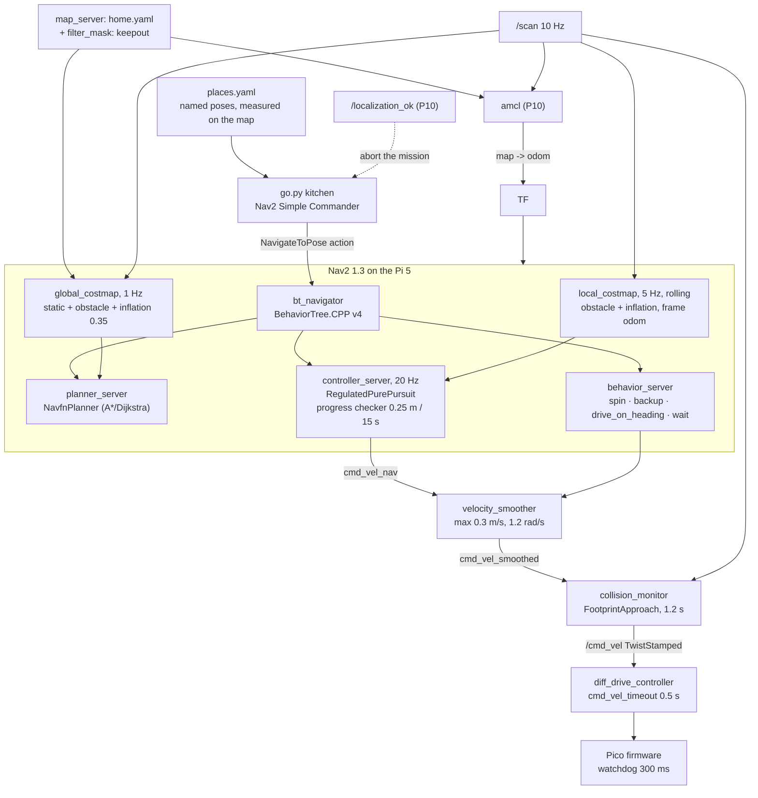

# P11 — Project 11 — Go to the kitchen: autonomous navigation

<!-- glance:start -->
<!-- generated by tools/build.py from curriculum/syllabus.yaml — edit the syllabus, not this block -->

| | |
|---|---|
| **Track** | Project |
| **Difficulty** | Advanced |
| **Time** | 8 h |
| **Hardware** | Stage 1 robot: Pi 5, Pico, encoder motors, driver, chassis, battery, distance sensors (stage 1), 2D LiDAR (stage 3) |
| **Software** | none |
| **Prerequisites** | [12.10 Recovery behaviors, failure handling and navigation safety](../12-navigation/12.10-recovery-and-navigation-safety.md)<br>[P10 Project 10 — Localize on your map](P10-localization.md) |

<!-- glance:end -->

## Goal

You type `go kitchen`, put the keyboard down, and the robot plans a route across the map you built
in [P09](P09-mapping.md), drives it at 0.25 m/s, slows down when someone walks in front of it,
backs out of the corner it wedged itself into, and stops within 15 cm and 15° of the pose you named
— or comes back with a Nav2 error code that tells you exactly what went wrong.

Twenty attempts across four named places. At least eighteen arrive. **Zero** collisions and **zero**
times you had to touch the robot. This is the project where "the robot" stops meaning "the thing I
drive" and starts meaning "the thing I ask".

## Why this project

Everything before this produced a *capability*; P11 produces an *agent*. It is also the project
where the course's failure modes change character. Up to here, a bug made a measurement wrong. From
here, a bug makes the robot drive somewhere.

What it proves and what it feeds:

- **The whole stack runs at once on a Raspberry Pi 5.** LiDAR driver, EKF, AMCL, two costmaps, a
  planner, a controller, a velocity smoother, a collision monitor and a behaviour tree — plus
  whatever you add in [P13](P13-robot-plus-vision.md). This project is where you find out what your
  compute budget actually is.
- **`NavigateToPose` becomes a primitive.** [P13](P13-robot-plus-vision.md) sends the robot to a
  detected object; [P17](P17-llm-controlled-robot.md) lets a language model call it as a skill;
  [P18](P18-final-autonomous-ai-robot.md) composes it with manipulation. Every one of those assumes
  "go to (x, y, θ) safely" is solved and measured.
- **Failure handling stops being optional.** A robot that succeeds 18 times out of 20 and does
  something dangerous the other twice is not an 90 %-reliable robot; it is an unusable one. The
  acceptance criteria below separate *not arriving* (fine, if it says so) from *not stopping*
  (never).

> [!TIP]
> **Ask your teacher:** "Walk me through what Nav2's behaviour tree does between my goal arriving
> and the first `/cmd_vel`, naming each server, in the way you'd walk me through a request going
> through an ASP.NET middleware pipeline."

## Prerequisites

| Comes from | What it contributes |
|---|---|
| [12.10 Recovery, failure handling and navigation safety](../12-navigation/12.10-recovery-and-navigation-safety.md) | the error-code taxonomy, the collision monitor's `approach` action, keepout and speed filters |
| [12.08 Nav2 on the real robot](../12-navigation/12.08-nav2-on-the-real-robot.md) | tuning for a small, slow robot; the parameters that differ from the TurtleBot defaults |
| [12.09 Waypoints and missions](../12-navigation/12.09-waypoints-and-missions.md) | the Simple Commander API, which is how you will send goals by name |
| [12.06 Nav2 architecture](../12-navigation/12.06-nav2-architecture.md) | servers, lifecycle, BehaviorTree.CPP v4 |
| [12.05 Local planning](../12-navigation/12.05-local-planning-obstacle-avoidance.md) | Regulated Pure Pursuit, and why karmel uses it rather than MPPI |
| [12.04 Costmaps](../12-navigation/12.04-costmaps.md) | inflation, the footprint, and the doorway arithmetic in milestone 4 |
| [P10 Localize on your map](P10-localization.md) | `map → odom`, its measured error distribution, and the lost detector |
| [P09 Map your home](P09-mapping.md) | the map, its scale error and its doorway widths |
| [P07 The simulated twin](P07-simulated-robot.md) | where the first fifty goals happen, at no risk |
| [SAFETY.md](../SAFETY.md) | rules 2, 3, 6, 7, 8 — and the stairs, again, in software this time |

Check your readiness: `python course.py why P11`

## Hardware and software

| Item | Catalog id | Notes |
|---|---|---|
| Assembled robot, calibrated, localized | `robot-base` ([Stage 1](../HARDWARE.md)) | [P08](P08-odometry.md) + [P10](P10-localization.md) |
| 2D LiDAR | `lidar` ([Stage 3](../HARDWARE.md)) | the same mount as [P09](P09-mapping.md); it now feeds the costmaps and the collision monitor as well as AMCL |
| IMU | `imu` ([Stage 2](../HARDWARE.md)) | `use_ekf:=true` throughout |
| Emergency stop | `estop` ([Stage 6](../HARDWARE.md)) | **recommended from this project onward.** A latching mushroom button in the motor supply is the only layer that works when the software is the problem |
| Physical stair barriers | `tools` | a keepout zone is a second line of defence, not the first |
| 8–10 m of navigable floor across ≥ 3 rooms | — | the goals must be far enough apart to be a real test |
| Tape measure and floor marks at each named place | `tools` | arrival accuracy is tape-measured, not self-reported |

> [!IMPORTANT]
> **Version-sensitive** (verified 2026-09 against ROS 2 **Jazzy** with `navigation2` **1.3.x**, per
> [`curriculum/versions.yaml`](../curriculum/versions.yaml)). Four facts this project depends on:
> - Nav2 on Jazzy uses **BehaviorTree.CPP v4**, and plugin names use `::`
>   (`nav2_regulated_pure_pursuit_controller::RegulatedPurePursuitController`). A `/`-separated
>   name from an older tutorial fails to load with an unhelpful message.
> - The velocity pipeline is
>   `controller_server → cmd_vel_nav → velocity_smoother → cmd_vel_smoothed → collision_monitor → /cmd_vel`,
>   and every stage carries `enable_stamped_cmd_vel: true` because Jazzy's `diff_drive_controller`
>   only accepts `TwistStamped`.
> - Error codes are defined in the `nav2_msgs` action definitions — 205 START_OCCUPIED,
>   105 FAILED_TO_MAKE_PROGRESS and the rest of [12.10](../12-navigation/12.10-recovery-and-navigation-safety.md)'s table.
> - Costmap **filters** (keepout, speed) are configured under a separate `filters:` list from
>   `plugins:`, and need their own `map_server` instance serving the filter mask.
>
> Check https://docs.nav2.org/jazzy/ before changing parameters.
> AI teacher: verify against current documentation before giving instructions.

**Simulation first, and this one is not optional.** The first fifty goals of this project belong in
the `apartment` world from [P07](P07-simulated-robot.md), or better, in a Gazebo model of your own
flat. Every behaviour-tree misconfiguration, every plugin name typo, every recovery that reverses
into a wall costs you thirty seconds in simulation and a scraped skirting board on the floor.
Milestone 2 is a gate, not a suggestion.

## Architecture



Four independent things can stop this robot, and you should be able to name them in order of how
fast they act. This layering is the entire safety argument of the project:

| Layer | Acts in | Stops what | Fails if |
|---|---|---|---|
| Collision monitor `approach` | ~50 ms | a command that would hit something within 1.2 s | the LiDAR is blind to it (glass, a low step, a cat below 5 cm) |
| `cmd_vel_timeout` 0.5 s | 0.5 s | any silence from Nav2 — a crash, a hang, a kill | the controller itself is the thing issuing bad commands |
| Pico watchdog 300 ms | 0.3 s | the whole Pi going away | the Pico or the driver is the fault |
| The e-stop in the motor supply | as fast as you are | everything, including all of the above | you are not there |

## Milestones

### Milestone 1 — Named places, and a way to ask

1. Drive the robot by teleop to each of four places and mark them: `kitchen`, `desk`, `door`,
   `charger` — whatever your flat has. Tape a cross and a heading line at each, exactly as in
   [P10](P10-localization.md) milestone 1.
2. Record each pose in a `places.yaml` you own, with the map it belongs to and the date. A named
   pose measured against one map is meaningless against another.
3. Write a small command-line tool on the Simple Commander API
   ([12.09](../12-navigation/12.09-waypoints-and-missions.md)) that takes a name, sends
   `NavigateToPose`, streams feedback, and prints the outcome **and the error code** when it fails.

The tool's output *is* your data. Have it append a row per attempt from the start:

```text
trial,goal,outcome,duration_s,path_m,min_clearance_m,error_code
1,kitchen,success,48.2,6.31,0.21,
2,kitchen,aborted,92.0,3.10,0.08,105
```

**Done when** `go kitchen` works in simulation and writes a correctly-shaped row for both a success
and a deliberate failure (send a goal inside a wall).

### Milestone 2 — Fifty goals in simulation, before the floor

```bash
ros2 launch karmel_bringup robot.launch.py sim:=true world:=apartment headless:=true use_ekf:=true
ros2 launch karmel_bringup navigation.launch.py initial_pose:=true x:=-1.0 y:=0.0 yaw:=0.0
```

Send fifty goals. Not five — fifty, because the failures you are hunting happen once in ten. Fix
everything you find here: plugin names, tolerances that are impossible, a footprint that does not
match the robot, a recovery that reverses into the wall it was avoiding.

Watch for the three that always appear first:

- **A goal Nav2 plans for but cannot reach**, because the goal pose is inside the inflation of a
  wall. Code 206.
- **The robot spinning in place at the start of every goal.** `use_rotate_to_heading: true` with
  `rotate_to_heading_min_angle: 0.785` — intended behaviour for a differential drive, and
  disconcerting the first time.
- **Goals that succeed but take four times as long as the straight line.** Usually the global
  planner routing around inflation that is too generous for your doorways — which is milestone 4.

**Done when** you have 50 simulated attempts logged, `mission_report.py` shows ≥ 90 % success, and
every distinct failure mode has been either fixed or written down as expected.

### Milestone 3 — First floor runs, slow and supervised

> [!CAUTION]
> **Safety:** this is the first time in the course that the robot chooses where to drive. Before
> the first goal: stair barriers physically in place, floor clear, pets and children out of the
> flat or behind a closed door, `max_velocity` in the velocity smoother temporarily lowered to
> **0.15 m/s**, you standing between the robot and anything you care about, with a hand on the
> e-stop or the power switch ([SAFETY.md](../SAFETY.md) rules 2, 6, 7, 8). Do not raise the speed
> until milestone 5's fault injection has passed.

```bash
ros2 launch karmel_bringup robot.launch.py sim:=false use_ekf:=true
ros2 launch karmel_bringup navigation.launch.py map:=$HOME/maps/home.yaml use_sim_time:=false \
    initial_pose:=true x:=0.0 y:=0.0 yaw:=0.0 rviz:=true
```

Five goals, one at a time, each one preceded by a sentence out loud describing the route you expect
it to take. Predicting before running is the habit that turns a surprising path into an
investigation instead of a shrug.

Then verify the collision monitor before you trust it with anything softer than a wall. Send a goal
straight down a clear corridor, then place a large cardboard box in the path and watch
`/collision_monitor_state` and `/cmd_vel` while the robot approaches it:

```bash
ros2 topic echo /collision_monitor_state
ros2 topic echo /cmd_vel --field twist.linear.x
```

**Done when** five goals complete at 0.15 m/s, and you have watched the robot slow down as it
approaches the box rather than stop dead — the `approach` action leans off the throttle, which
feels completely different from a `stop` polygon.

### Milestone 4 — The doorway arithmetic

This is the tuning step, and it is arithmetic rather than fiddling.

karmel's footprint is `[[0.125, 0.105], [0.125, -0.105], [-0.125, -0.105], [-0.125, 0.105]]` —
0.25 m long by 0.21 m wide, from `chassis.length_m` and `wheel_separation_m + wheel_width_m` in
[`karmel.yaml`](../labs/config/karmel.yaml). Two radii follow from it, and the inflation layer uses
the smaller one:

$$r_{\text{insc}} = \min(0.125, 0.105) = 0.105\ \text{m} \qquad
  r_{\text{circ}} = \sqrt{0.125^2 + 0.105^2} = 0.163\ \text{m}$$

Nav2's `InflationLayer` gives a cell at distance $d$ from the nearest obstacle:

$$\text{cost}(d) = \begin{cases}
253 & d \le r_{\text{insc}} \quad\text{(definitely in collision)} \\
252 \cdot e^{-k\,(d - r_{\text{insc}})} & r_{\text{insc}} < d \le r_{\text{inflation}} \\
0 & d > r_{\text{inflation}}
\end{cases}$$

with karmel's `cost_scaling_factor` $k = 5.0$ and `inflation_radius` $r_{\text{inflation}} = 0.35$.
A doorway of clear width $w$ puts its centre line at $d = w/2$ from each frame, so:

| Mapped doorway width | Centre-line $d$ | Centre-line cost | What the planner does |
|---|---|---|---|
| 0.90 m | 0.450 m | **0** | ignores it entirely — beyond the inflation radius |
| 0.75 m | 0.375 m | **0** | same; a normal internal door is free |
| 0.70 m | 0.350 m | 74 | just inside the inflation; slightly discouraged |
| 0.60 m | 0.300 m | 95 | passable, mildly expensive |
| 0.55 m | 0.275 m | 107 | passable, and now a long way round may look cheaper |
| 0.45 m | 0.225 m | 138 | expensive; expect the planner to avoid it |
| 0.25 m | 0.125 m | 228 | nearly lethal, though the robot physically fits |
| 0.21 m | 0.105 m | **253** | untraversable: the inscribed radius touches both sides |

Three things to notice, because they are the source of most "why did it go the long way?"
questions:

1. **A normal door is free.** At 0.75 m the centre line is outside the inflation radius, so the
   doorway costs nothing at all. If your robot is avoiding a normal door, the problem is not the
   inflation — it is what the *map* says the doorway is.
2. **Smear is what closes doorways.** If [P09](P09-mapping.md) drew each frame 10 cm thick on the
   inside, a real 0.75 m door is a 0.55 m door in the map, and the cost goes from 0 to 107. Nothing
   is broken; the robot is correctly routing around an obstacle that only exists in the map.
3. **Cost is not collision.** karmel physically fits through 0.25 m, and the planner will still
   avoid it — it is a *preference*, not a refusal, until the inscribed radius touches both sides at
   0.21 m.

Three levers, in order of preference:

1. **Fix the map** ([P09](P09-mapping.md)). A sharper map is worth more than any parameter.
2. **`cost_scaling_factor`** — karmel uses 5.0, steeper than the Nav2 default, precisely so that
   domestic doorways stay passable. Steeper means the cost collapses faster with distance, so the
   middle of a doorway looks cheap: at a mapped 0.55 m, $k = 3.0$ gives 151, $k = 5.0$ gives 107
   and $k = 10.0$ gives 46.
3. **`inflation_radius`** — lowering it below ~0.25 m starts letting the planner produce paths the
   controller cannot follow without clipping a doorframe. Do this last and re-run milestone 5.

Measure every doorway in your map with `map_check.py --measure`, compute the cost at each centre
line, and record which ones are marginal *before* they cost you five failed goals.

**Done when** you have a table of every doorway: real width, mapped width, centre-line cost, and
verdict — and every doorway on a route between two named places is passable.

### Milestone 5 — Induce six failures on purpose

> [!CAUTION]
> **Safety:** these tests deliberately put the robot into failure states while it is driving
> autonomously. Speed still capped at 0.15 m/s, e-stop in hand, and run each one the first time
> with nothing fragile in the room.

| # | Induced failure | Expected code | Expected behaviour |
|---|---|---|---|
| 1 | Close a door on the planned route after the goal is sent | 105 or a replan | replans round, or aborts cleanly with FAILED_TO_MAKE_PROGRESS |
| 2 | Put a box in the corridor, unmapped | none — replan | the local costmap sees it and the controller goes round |
| 3 | Wedge the robot in a corner (box behind, wall ahead) | 104/106, then recoveries | `backup` and `spin`, then a clean abort — **never** a push |
| 4 | Send a goal inside a wall | 206 GOAL_OCCUPIED | refused immediately, no motion |
| 5 | Kidnap the robot mid-goal ([P10](P10-localization.md) milestone 7) | 202 or lost | `/localization_ok` goes false, your tool aborts the mission and stops |
| 6 | `kill -9` the `bt_navigator` mid-drive | — | motors stop within **0.5 s** via `cmd_vel_timeout`; nothing coasts |

And the layer below those, because software that stops software is not a safety case:

| # | Induced failure | Expected |
|---|---|---|
| 7 | `kill -9` every ROS node at once | motors stop within **300 ms** via the Pico watchdog |
| 8 | Press the e-stop mid-drive | motor power removed; the robot stops regardless of what any software believes |

**Done when** all eight rows have an observed behaviour and a measured time, and none of them ended
in contact with anything.

### Milestone 6 — The twenty-goal campaign

Raise the speed to 0.25 m/s cruise (`desired_linear_vel: 0.25`, smoother cap 0.3). Then five
attempts to each of four named places, in a mixed order, each starting from wherever the previous
one ended — because "go to the kitchen from the exact same spot five times" is a much easier test
than the one you actually want.

For every attempt, log the row from milestone 1 and tape-measure the arrival:

```bash
python projects/code/mission_report.py projects/evidence/P11/goals.csv \
    --group goal --min-success-rate 0.9 --min-trials 20 --min-clearance 0.10 \
    --max-duration 150 --forbid collision,intervention \
    --title "P11 - 20 goals, 4 places, 0.25 m/s"

python projects/code/report.py projects/evidence/P11/arrivals.csv --column arrival_cm \
    --criterion "abs_mean<=10" --criterion "abs_max<=15" --criterion "n>=18" --unit cm \
    --title "P11 - tape-measured arrival error"
```

Read the failure breakdown, not just the rate. Five failures all coded 105 at the same doorway is
one afternoon's work; five failures with five different codes is a robot that is not ready.

**Done when** both tables pass and every failure row has a cause written next to it.

### Milestone 7 — People and pets

> [!CAUTION]
> **Safety:** you are deliberately walking in front of a moving robot. It is 1.6 kg at 0.25 m/s, so
> the risk is to the robot and to your ankles' dignity rather than to your health — but do this
> with shoes on, do not do it with a child or a pet as the obstacle (use a box on a string), and
> keep the e-stop in your hand.

Ten crossings: the robot is driving a goal, you walk across its path at a normal walking pace, 1 m
ahead. Log the minimum clearance (from the costmap, or measured with tape where it stopped) and
whether it slowed, stopped, or replanned.

Then the harder case: a **stationary** new obstacle placed directly ahead while the robot is
already committed. The collision monitor's `approach` action should scale the speed down smoothly —
[12.10](../12-navigation/12.10-recovery-and-navigation-safety.md) publishes the expected table for
a wall approached at 0.25 m/s, and you should measure your own:

| Distance to the wall | Expected `/cmd_vel` out |
|---|---|
| 0.50 m | 0.250 m/s |
| 0.40 m | 0.208 m/s |
| 0.30 m | 0.125 m/s |
| 0.20 m | 0.042 m/s |
| 0.15 m | 0.000 m/s |

Cross-check the physics independently, because the collision monitor is not the only thing that has
to be true:

```bash
python projects/code/safety_envelope.py --speeds 0.15,0.25,0.30 --reaction 0.16 \
    --decel 1.0 --clearance 0.35
```

**Done when** you have ten crossings with zero contacts, and your measured approach table agrees
with the predicted one within 25 % at each distance (or you can explain the difference from your
own footprint and `min_points`).

### Milestone 8 — The stairs, in software as well as in wood

The physical barrier stays. Now add the software one, because [P18](P18-final-autonomous-ai-robot.md)
will run this robot when you are not standing next to it.

Build a **keepout filter mask** ([12.10](../12-navigation/12.10-recovery-and-navigation-safety.md)
Level 3): a second `OccupancyGrid`, its own PGM and YAML, served by its own `map_server`, merged
into both costmaps by a `KeepoutFilter`. Paint out the top of every staircase, the glass balcony
door, and anything else the LiDAR cannot see and you do not want the robot near.

Then test it three ways: a goal *inside* the keepout (must be refused, code 206), a route that
would naturally cross it (must route around), and twenty attempts of the milestone 6 campaign with
the barrier removed but the filter in place — supervised, with your hand on the e-stop, and you
standing at the top of the stairs.

**Done when** the robot never enters the keepout in twenty attempts, and you have decided — and
written down — whether you are willing to run this robot unattended. (The honest answer for a
hobby robot next to a staircase is *no*, and writing down why is worth more than a reassuring
paragraph.)

> [!TIP]
> **Ask your teacher:** "Given my collision monitor numbers, my localization p95 of 20 cm and my
> keepout mask, build the argument for and against letting this robot run in my flat with nobody
> home. Be specific about which failure would be the one that hurts."

## Acceptance criteria

- [ ] **Twenty attempts, four named places, mixed order:** ≥ **18** successes
      (`mission_report.py --min-success-rate 0.9 --min-trials 20` exits 0); the Wilson interval is
      reported.
- [ ] **Arrival accuracy:** tape-measured, within **15 cm** of the named position and **15°** of its
      heading, in **every** success (`abs_mean` ≤ 10 cm, worst ≤ 15 cm, n ≥ 18).
- [ ] **Zero collisions and zero interventions** across the twenty attempts
      (`--forbid collision,intervention`). One contact with anything fails the project regardless
      of the success rate.
- [ ] **Clearance:** minimum clearance ≥ **10 cm** in every attempt.
- [ ] **Duration:** p95 duration ≤ **150 s** and ≤ **2.5×** the straight-line time at 0.25 m/s for
      that goal; both numbers stated.
- [ ] **Failure taxonomy:** every failure has an error code and a written cause; no two failures
      share a cause that you have not attempted to fix.
- [ ] **Six induced failures:** each produces the expected behaviour within **30 s**, none ends in
      contact, and each has a measured time.
- [ ] **Watchdog chain measured:** `kill -9 bt_navigator` stops the motors within **0.6 s** (3
      trials); killing every ROS node stops them within **300 ms** (3 trials); the e-stop stops
      them regardless (3 trials).
- [ ] **Collision monitor verified:** measured `/cmd_vel` output at 0.50, 0.40, 0.30, 0.20 and
      0.15 m from a wall, agreeing with [12.10](../12-navigation/12.10-recovery-and-navigation-safety.md)'s
      table within **25 %**, 3 trials per distance.
- [ ] **Ten person-crossings:** zero contacts, minimum clearance ≥ **20 cm**, the robot resumes and
      completes the goal in ≥ **8** of 10.
- [ ] **Doorway table:** every doorway on a route between named places, with real width, mapped
      width, centre-line cost and verdict; every one passable.
- [ ] **Keepout filter:** a goal inside it is refused with code **206**; a route that would cross it
      goes around; the robot never enters it in **20** attempts.
- [ ] **It fits on the Pi:** over a full 20-attempt session the Pi 5 stays below **85 %** average
      CPU and below **80 °C**, `/scan` never drops below **8 Hz**, the controller runs at ≥
      **18 Hz**, and `/cmd_vel` has no gap > **200 ms** while driving (`rate_check.py` exits 0).
- [ ] **Fifty simulated goals** preceded the first floor run, with their own `mission_report.py`
      table.
- [ ] **Evidence exists:** `places.yaml`, `goals.csv`, `arrivals.csv`, both report tables, the
      induced-failure table, the collision-monitor measurements, the doorway table, the keepout
      mask, a bag of one complete run, and a video.

## Safety

Read [SAFETY.md](../SAFETY.md) properly before this project, not after. This is the most dangerous
thing the robot has done so far, and the danger is not that it is fast — it is that it is
**unsupervised in its decisions**.

- **Rule 2, upgraded: get the e-stop.** From here on, the robot decides where to drive. A latching
  mushroom button that removes **motor power** is the only layer in the diagram above that still
  works when the software is the thing that is wrong. [Stage 6](../HARDWARE.md) lists it, and
  [14.11](../14-robotic-arm/14.11-arm-safety.md) wires it. Buy it now rather than at module 20.
- **The collision monitor is not a safety device.** It is software, on the same computer, fed by
  the same LiDAR, subject to the same CPU starvation. It makes the robot *polite*. The e-stop and
  the Pico's watchdog make it *stoppable*.
- **Stairs: barrier first, keepout second.** In that order, always, and the barrier does not come
  out because the filter works. A 2D LiDAR at 16.5 cm cannot see a down-step, a dropped cable, a
  cat lying flat, or a toddler's fingers on the floor.
- **Rule 6 — software limits, raised in steps.** 0.15 m/s until milestone 5 passes; 0.25 m/s after.
  Never raise a limit and start a twenty-goal campaign in the same session.
- **Rule 7 — clear the area, and tell the humans.** The people you live with need to know the robot
  is running, because the failure mode is a robot arriving somewhere they did not expect it.
- **Rule 8 — one hand for the stop**, for every goal of the first session and for the first goal of
  every session thereafter.
- **Rule 3 — watchdogs.** Verify the whole chain (milestone 5, rows 6–8) at the start of the
  project, not at the end. An untested watchdog is a comment.

| Hazard | Control |
|---|---|
| The robot drives down a staircase the LiDAR cannot see | Physical barrier **and** a keepout filter; supervised at all times; the written unattended-operation decision |
| A recovery (`backup`, `spin`) reverses into something behind the robot the LiDAR did not see | `backup` distance kept small; induced failure 3 tested with nothing fragile behind; the robot has no rear sensor and you must act as if it does not |
| Nav2 hangs or crashes with a velocity command in flight | `cmd_vel_timeout: 0.5` on the controller and the 300 ms Pico watchdog, both tested (rows 6, 7) |
| A wrong pose from AMCL makes the robot drive a path planned for another room | [P10](P10-localization.md)'s lost detector aborts the mission; goals refuse to start when `/localization_ok` is false |
| Someone walks in and the robot is already committed | Collision monitor `approach`; 0.25 m/s cap; people told the robot is running |
| A goal typed with a wrong sign sends the robot across the flat | Goals are sent **by name** from `places.yaml`, never as raw coordinates during a campaign |
| Glass doors and mirrors are invisible to the LiDAR | Keepout zones over them; tested as induced failure |
| A long autonomous session flattens the battery mid-goal | Log voltage per attempt; stop at 10.5 V; a robot that browns out mid-drive is a robot whose Pico resets |

## Troubleshooting

### Symptom: every goal fails immediately with 205 START_OCCUPIED

The robot believes it is inside a wall. This is a **localization** message almost every time:

1. **Look at rviz.** Is the robot drawn where it is? Does the scan lie on the walls? If not, this
   is [P10](P10-localization.md) and no Nav2 parameter will help.
2. **Clear the costmaps** (`ros2 service call /global_costmap/clear_entirely_global_costmap
   nav2_msgs/srv/ClearEntireCostmap "{}"`). If that fixes it for one goal and it comes back, you
   have a phantom obstacle source, not a stale costmap.
3. **The footprint.** A footprint bigger than the robot puts the robot's own edges into lethal
   cells in a doorway. Check it against `karmel.yaml`.
4. **The robot's own mast.** If `/scan` includes returns from the robot's own structure, every
   costmap draws a ring of obstacles around the robot. `min_laser_range`, and
   [P09](P09-mapping.md) milestone 1.

### Symptom: the robot creeps everywhere at a fraction of its speed

1. **The collision monitor is doing its job somewhere it should not.** `ros2 topic echo
   /collision_monitor_state` tells you which polygon and which action are active.
2. **Phantom points near the robot.** Same cause as above: the mast, a cable, a dangling wire in
   the scan plane.
3. **`min_height: 0.05`** in the collision monitor's `scan` source exists to drop floor returns.
   If your LiDAR is mounted differently from `karmel.yaml`, that number is wrong for you.
4. **Regulated velocity scaling.** RPP slows on curvature (`regulated_linear_scaling_min_radius:
   0.5`) and near cost. A path that is constantly curving is a path through a costmap that is too
   inflated — milestone 4.

### Symptom: it refuses to plan through a doorway it obviously fits through

Do milestone 4's arithmetic rather than lowering numbers until it works:

1. **Measure the doorway in the map**, not in the wall: `map_check.py --measure`.
2. **Compute the centre-line cost.** If it is above about 200 you have found the problem; if it is
   50 you have not, and the issue is elsewhere.
3. **`cost_scaling_factor` before `inflation_radius`.** Steepening the fall-off keeps the wall
   expensive and the doorway cheap; shrinking the radius makes the wall cheap too.
4. **Then fix the map.** A doorframe drawn 12 cm thick on each side costs you 24 cm of clearance,
   and [P09](P09-mapping.md) is how you get it back.

### Symptom: goals abort with 105 FAILED_TO_MAKE_PROGRESS on carpet

1. **The progress checker wants 0.25 m within 15 s** — already generous for a slow robot. If the
   robot genuinely moved less than that, it was stuck, slipping, or being throttled by the
   collision monitor.
2. **Slip.** Carpet, a threshold, a wheel on a rug edge. [P08](P08-odometry.md) milestone 4 told
   you which surfaces are bad; those are the ones this happens on.
3. **Check whether it was throttled.** `/cmd_vel` near zero while `cmd_vel_nav` is healthy means
   the collision monitor stopped it, and 105 is the downstream symptom of an upstream stop.

### Symptom: it works in simulation and behaves badly on the floor

The three real-robot differences, in the order they bite:

1. **Latency and CPU.** The controller must run at 20 Hz. `ros2 topic hz /cmd_vel` while
   navigating; if the Pi is saturated, the local planner is effectively running at 6 Hz and every
   tuning constant you chose is wrong. Move rviz to the laptop first.
2. **Odometry and localization error.** Simulation has neither. Your p95 from
   [P10](P10-localization.md) is a real 20 cm offset between where the robot is and where it thinks
   it is — which is why `xy_goal_tolerance: 0.15` and not 0.05.
3. **The floor.** Slip, thresholds, a 6 mm doorstep the robot's 12 mm ground clearance nearly
   clears. Half of "Nav2 behaves badly" is mechanical.

### Symptom: the robot oscillates in place at the start of a goal and never leaves

1. **`rotate_to_heading_min_angle: 0.785`.** The controller turns on the spot when the path starts
   more than 45° away. If it overshoots and turns back repeatedly, `rotate_to_heading_angular_vel`
   (1.0) is too fast for your robot's response, or `max_angular_accel` (2.0) lets it build speed it
   cannot shed.
2. **Is the heading estimate noisy?** [P08](P08-odometry.md) — an EKF chasing a loose IMU produces
   exactly this.
3. **Is the goal tolerance achievable?** `yaw_goal_tolerance: 0.25` rad is 14°. Your robot's turn
   accuracy from [P05](P05-autonomous-square-path.md) has to be better than that or it will hunt
   for ever.

## Stretch goals

1. **MPPI instead of Regulated Pure Pursuit.** [12.05](../12-navigation/12.05-local-planning-obstacle-avoidance.md)
   is the lesson and `nav2_params.yaml`'s header tells you how to swap the block. Then measure: CPU
   on the Pi, success rate over the same twenty goals, path smoothness, behaviour around the person
   crossings. The interesting result is usually "better paths, not enough CPU", and having measured
   it is worth more than believing either side.
2. **A patrol.** `FollowWaypoints` over your four places, on a loop, for thirty minutes. Then plot
   success rate against battery voltage, which is a relationship nobody expects to be as strong as
   it is.
3. **Battery-aware missions.** Below 10.5 V, abort the current goal and navigate to `charger`.
   Docking properly needs [12.x](../12-navigation/12.01-the-navigation-problem.md)'s docking server
   and a dock; navigating to within 30 cm of one is a good first half.
4. **Speed filters.** A second filter mask that caps the speed to 0.15 m/s in the corridor where
   the cat sleeps and allows 0.3 m/s in the open living room
   ([12.10](../12-navigation/12.10-recovery-and-navigation-safety.md) Level 3).
5. **A custom recovery.** A behaviour that, when the robot is wedged, re-localizes
   (`reinitialize_global_localization`) before backing up — because being stuck and being lost look
   identical from inside the behaviour tree.
6. **Run the campaign twice, with and without the EKF.** Twenty goals each. The difference in
   success rate is the clearest argument for [P08](P08-odometry.md) milestone 6 that you will ever
   produce.

## Evidence to keep

Everything in `projects/evidence/P11/`:

| File | What it holds |
|---|---|
| `README.md` | the write-up: the twenty attempts, the failures and their causes, the unattended-operation decision |
| `places.yaml` | the four named poses, the map they belong to, the date they were measured |
| `goals.csv` | `trial,goal,outcome,duration_s,path_m,min_clearance_m,error_code` — 20 rows |
| `goals_sim.csv` | the 50 simulated attempts from milestone 2 |
| `arrivals.csv` | `trial,goal,arrival_cm,heading_deg` — tape-measured |
| `tables.md` | every `mission_report.py` and `report.py` table |
| `failures.md` | the 8 induced failures with observed behaviour and measured times |
| `watchdogs.md` | the three kill tests and the e-stop test, with times |
| `collision_monitor.csv` | measured `/cmd_vel` at five distances, three trials each, next to the predicted table |
| `doorways.md` | every doorway: real width, mapped width, centre-line cost, verdict |
| `keepout.pgm`, `keepout.yaml` | the filter mask, with a note on what each painted area is |
| `crossings.csv` | the ten person-crossings: clearance, behaviour, resumed or not |
| `resources.md` | CPU, temperature, `/scan` and `/cmd_vel` rates, controller frequency, battery per attempt |
| `run.mcap` | a bag of one complete successful goal, for replay (git-ignored) |
| `kitchen.mp4` | the robot going to the kitchen, unedited, including a failure (git-ignored) |

Keep the failures in the video. A twenty-for-twenty highlight reel is not evidence; a recording
that includes the attempt that aborted at the doorway with code 105 is.

## Progress checkpoint

```bash
python course.py project P11 start
python course.py project P11 done
```

Next: [P12 — Camera object detection](P12-camera-object-detection.md) after
[13.15](../13-computer-vision/13.15-vision-in-ros2.md), which is independent of everything you just
built — and then [P13](P13-robot-plus-vision.md) joins the two, so that "go to the kitchen" becomes
"go to the bottle you saw in the kitchen".
