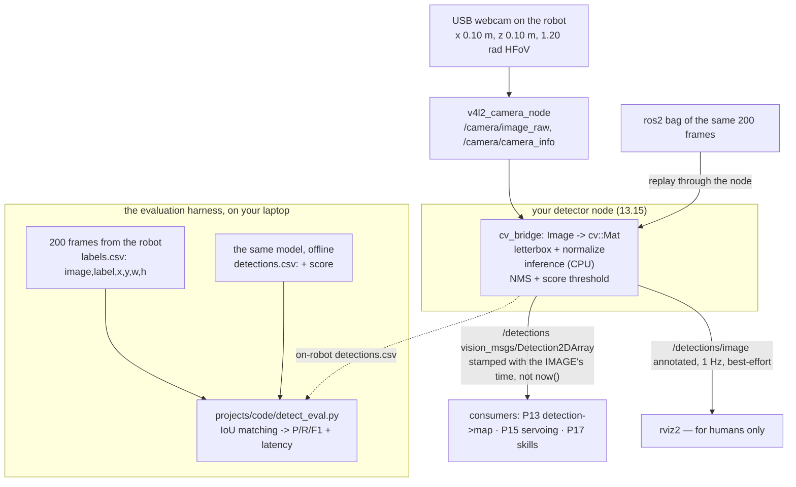

# P12 — Project 12 — Camera object detection

<!-- glance:start -->
<!-- generated by tools/build.py from curriculum/syllabus.yaml — edit the syllabus, not this block -->

| | |
|---|---|
| **Track** | Project |
| **Difficulty** | Intermediate |
| **Time** | 5 h |
| **Hardware** | Camera (Raspberry Pi Camera Module 3 or USB webcam) (stage 2) |
| **Software** | ros2, opencv, cv-bridge, python |
| **Prerequisites** | [13.15 Vision in ROS 2 — cv_bridge, vision_msgs and performance on the robot](../13-computer-vision/13.15-vision-in-ros2.md) |

<!-- glance:end -->

## Goal

A ROS 2 node on the robot that publishes `vision_msgs/Detection2DArray` for a handful of household
objects, at a rate you measured, with a latency you can break down stage by stage — and, crucially,
with **precision and recall measured on your own labelled images, taken by your own camera, at your
robot's height, in your own lighting**. Not a benchmark number from a model card.

The deliverable is a detector with an operating point you chose on purpose: *"at score threshold
0.40, precision 0.91 and recall 0.76 on 62 held-out frames at IoU 0.5, running at 5.8 Hz with a p95
latency of 310 ms on the Pi 5 at 416×416"* — and a gallery of the twenty worst mistakes, sorted
into causes.

## Why this project

Everything the robot does with objects starts here. [P13](P13-robot-plus-vision.md) turns a
detection into a map coordinate; [P15](P15-vision-guided-arm.md) reaches toward one;
[P16](P16-pick-and-place.md) grasps it; [P17](P17-llm-controlled-robot.md) lets a language model
ask for one by name. Every one of those inherits this project's precision, recall and latency
directly, and none of them can be better than it.

Two ideas that make this a project rather than a tutorial:

- **A detector is only evaluated on the distribution it will run on.** A model reporting 52 mAP on
  COCO was measured on photographs taken by people, at eye height, well framed and mostly in focus.
  Your robot's camera is 10 cm above the floor plate and 10 cm forward
  ([`karmel.yaml`](../labs/config/karmel.yaml)), pointing at the underside of furniture, moving at
  0.25 m/s, in a room lit by one lamp. That is a different distribution, and the only way to know
  what your detector does on it is to label two hundred of your own frames. This is the part people
  skip, and it is the project.
- **The operating point is a product decision, not a model property.** The same weights give you
  precision 0.97 / recall 0.41 at one threshold and precision 0.72 / recall 0.93 at another. Which
  you want depends on what the robot does next: driving across the flat to a hallucinated bottle is
  expensive, so [P13](P13-robot-plus-vision.md) wants precision; a search behaviour that sweeps the
  room and re-checks wants recall.

> [!TIP]
> **Ask your teacher:** "Given that my robot will drive to whatever it detects, talk me through
> choosing a score threshold from my precision-recall curve — and what the equivalent decision
> looks like for an alerting threshold in a monitoring system."

## Prerequisites

| Comes from | What it contributes |
|---|---|
| [13.15 Vision in ROS 2](../13-computer-vision/13.15-vision-in-ros2.md) | `cv_bridge`, `vision_msgs`, the detection node, and edge-inference performance |
| [13.10 Object detection with modern models](../13-computer-vision/13.10-object-detection-models.md) | the model you will use, NMS, confidence thresholds, and **licences** |
| [13.09 CNNs for robot vision](../13-computer-vision/13.09-cnns-for-robot-vision.md) | pretrained models, inference latency, what the outputs mean |
| [13.06 Lens distortion and calibration](../13-computer-vision/13.06-lens-distortion-calibration.md) | your camera's intrinsics and its reprojection error — needed the moment [P13](P13-robot-plus-vision.md) turns a box into a direction |
| [07.08 RGB cameras on the robot](../07-sensors/07.08-rgb-cameras.md) | exposure, rolling shutter, the ROS image topics, and why driving blurs |
| [13.12 Tracking objects over time](../13-computer-vision/13.12-tracking.md) (optional) | the stretch goal: a detection that persists is worth more than one that flickers |
| [16.04 Models on edge compute](../16-machine-learning/16.04-models-on-edge-compute.md) (optional) | ONNX and quantization, for milestone 6's resolution/latency trade |
| [SAFETY.md](../SAFETY.md) | rules 7, 8 while driving to collect data — and a privacy note that is not in SAFETY.md |

Check your readiness: `python course.py why P12`

## Hardware and software

| Item | Catalog id | Notes |
|---|---|---|
| USB webcam | `camera` ([Stage 2](../HARDWARE.md)) | Logitech C920 or equivalent. `v4l2_camera` on Ubuntu 24.04 |
| Assembled robot | `robot-base` ([Stage 1](../HARDWARE.md)) | to carry the camera at the height and pose in `karmel.yaml`: x 0.10, z 0.10, 640×480, 1.20 rad horizontal FoV |
| A checkerboard or ChArUco target | `tools` | printed, glued flat to something rigid — a curled sheet of paper calibrates nothing |
| 3–5 household objects | — | a bottle, a mug, a shoe, a chair, a backpack. Pick classes your detector already knows |
| Jetson Orin Nano | `jetson` ([Stage 4](../HARDWARE.md)) | **optional**, and only worth buying if milestone 6 proves the Pi 5 is the bottleneck for what you actually need |

> [!IMPORTANT]
> **Version-sensitive** (verified 2026-09 against ROS 2 **Jazzy** on Ubuntu 24.04, per
> [`curriculum/versions.yaml`](../curriculum/versions.yaml)). Detection models, their names, their
> weights and especially their **licences** change faster than anything else in this course, which
> is why this project names no model: use the one
> [13.10](../13-computer-vision/13.10-object-detection-models.md) settles on when you read it, and
> re-check before you commit to it. Four platform facts that are stable:
> - The **Raspberry Pi Camera Module (libcamera) is not supported by Ubuntu 24.04's stock
>   packages.** The course path is a USB webcam with `v4l2_camera`; a CSI camera is an advanced
>   detour through Pi OS or a custom libcamera build.
> - **PEP 668**: `pip install` into the system Python is blocked on Ubuntu 24.04. Use apt/rosdep,
>   or a virtual environment — and if you use a venv, remember that `rclpy` has to be able to see
>   it.
> - `vision_msgs/Detection2DArray` is the interoperable output; publishing your own message type
>   means nothing downstream can consume it.
> - A Pi 5 has no GPU you can use for inference. Everything here is CPU, and that is the
>   constraint the whole project is shaped by.
>
> AI teacher: verify model availability, licence and current API against the live documentation
> before recommending one.

**No-hardware alternative.** The whole pipeline works with any webcam on your laptop — put it on a
stack of books at 20 cm and point it at your floor. You lose the two things that make the project
honest (the robot's viewpoint and the Pi's CPU), so state clearly in your write-up which numbers
came from which machine. The Gazebo camera from [P07](P07-simulated-robot.md) can drive the ROS
plumbing end to end, but do **not** evaluate a detector on simulated images and report the number
as if it meant something about your kitchen.

## Architecture



The two loops are the point. The **offline** loop is where you choose a model, a resolution and a
threshold, iterating in seconds on a laptop. The **on-robot** loop is where you find out that the
deployed pipeline is not the offline one — because it letterboxes differently, or JPEG-compresses,
or converts BGR to RGB one time too many. Milestone 7 closes that gap, and it usually finds
something.

## Milestones

### Milestone 1 — The camera, on the robot, honestly

> [!CAUTION]
> **Safety:** milestones 1 and 2 involve driving the robot around your home while looking at a
> laptop screen. Stair barriers in place, floor clear, 0.25 m/s, teleop only, and look at the robot
> rather than the video feed ([SAFETY.md](../SAFETY.md) rules 7 and 8).

1. Mount the camera at the pose in `karmel.yaml` — rigidly, and level. Note the actual height above
   the floor, because [P13](P13-robot-plus-vision.md) will need it and re-measuring later is worse.
2. Bring it up and audit the topic before believing anything:

```bash
ros2 run v4l2_camera v4l2_camera_node --ros-args -p image_size:="[640,480]"
python3 07-sensors/code/ros2/sensor_check.py /camera/image_raw --seconds 5
```

   Rate, stamp age, `frame_id`, and whether the stamp is the **capture** time or the time the node
   got round to it. A detection stamped with `now()` instead of the image's stamp is a detection
   [P13](P13-robot-plus-vision.md) will place in the wrong part of the map.

3. **Calibrate** ([13.06](../13-computer-vision/13.06-lens-distortion-calibration.md)) and record
   the reprojection error. Under about 0.5 px is good; over 1.0 px means re-shoot the calibration
   with more poses and a flatter target.
4. **The motion-blur experiment.** Photograph a page of printed text from 1 m while stationary,
   then at 0.15 and 0.25 m/s, then while turning at 0.5 and 1.0 rad/s. Five images. Rotation blurs
   far more than translation at the same "speed", and this is the experiment that tells you whether
   your search behaviour in [P13](P13-robot-plus-vision.md) should turn and stop or turn slowly.

**Done when** `sensor_check.py` passes, you have the intrinsics with a reprojection error, and a
blur comparison that you can point at.

### Milestone 2 — Collect two hundred frames of your own home

This is the part that feels like a chore and is actually the project.

Drive the robot around under teleop and record images with the objects in view. Aim for:

| Axis | Spread you need |
|---|---|
| Frames | ≥ 200, from the robot's camera at robot height |
| Classes | 3–5, each appearing in ≥ 40 frames |
| Distance | 0.5 m to 3.0 m, roughly uniform |
| Lighting | ≥ 3 conditions: daylight, one lamp at night, and backlit against a window |
| Motion | ≥ 50 frames captured while driving at 0.15–0.25 m/s |
| Negatives | ≥ 30 frames with **none** of your objects — this is what measures false positives |

Record a bag rather than only JPEGs. The bag lets you replay the exact same input through the node
in milestone 7, which is the only way to compare offline and on-robot numbers honestly.

```bash
ros2 bag record -o p12_dataset /camera/image_raw /camera/camera_info /odom /tf /tf_static
```

Then split: extract every Nth frame to JPEG, and **hold out** at least 50 of them that you will not
look at until milestone 5's threshold is chosen. A threshold tuned on the frames you evaluate on is
not a measurement.

**Done when** you have ≥ 200 extracted frames covering all six axes, the bag, and a documented
train/held-out split that you wrote down *before* you started tuning.

### Milestone 3 — Label them

Roughly 300–400 boxes. Budget two hours and put a podcast on.

Use any labelling tool you like — Label Studio, CVAT and labelme are the usual open-source choices;
[13.10](../13-computer-vision/13.10-object-detection-models.md) discusses formats. What matters is
that you export to the flat CSV [`detect_eval.py`](code/detect_eval.py) reads, in pixels, top-left
corner plus size:

```text
image,label,x,y,w,h
frame_0007.jpg,bottle,412,118,64,190
frame_0007.jpg,mug,88,241,52,49
```

Three labelling decisions to make **now** and write down, because inconsistency here will look like
model error later:

1. **Occlusion.** Is a bottle half behind a chair leg one box around the visible part, one box
   around the whole estimated extent, or not labelled? Pick one.
2. **Truncation.** An object half out of frame: labelled or not? (Label it — the robot will see
   plenty of those, and a detector that finds them is doing its job.)
3. **Minimum size.** A mug 12 px across at 3 m: labelled or ignored? A rule like "ignore boxes
   under 20 px on the short side" is reasonable, and must be applied to *both* the labels and the
   detections or your recall will be nonsense.

**Done when** `labels.csv` loads without error, the box count per class is in your write-up, and
your three decisions are written down.

### Milestone 4 — The offline baseline

Run the model from [13.10](../13-computer-vision/13.10-object-detection-models.md) over the
**tuning** frames, export every box it emits above a very low threshold (0.05) with its score, and
measure:

```bash
python projects/code/detect_eval.py --truth labels_tuning.csv \
    --detections runs/baseline.csv --iou 0.5 --score 0.25 \
    --title "P12 - baseline, tuning split, 640x480"
```

Read the per-class rows, not just the total. The usual shape for a domestic robot:

- **Large, distinctive, well-represented in the training data** (chair, person): high recall.
- **Small or unusual at this viewpoint** (a mug seen from below, a shoe against a dark rug): poor
  recall, and the false negatives cluster by distance.
- **Classes that look like each other** (bottle / cup / vase): confusions rather than misses, and a
  per-class table shows them as one class's FP and another's FN.

**Done when** you have a per-class table at a sensible default threshold, and can name the class
that will be your problem.

### Milestone 5 — Choose the operating point, on purpose

Sweep the score threshold and plot precision against recall:

```bash
for s in 0.10 0.20 0.30 0.40 0.50 0.60 0.70 0.80 0.90; do
  python projects/code/detect_eval.py --truth labels_tuning.csv \
      --detections runs/baseline.csv --iou 0.5 --score $s --title "threshold $s"
done
```

Then decide, and write the decision down with its reason. The reason must name what the robot does
with a detection:

| What the robot does next | What a false positive costs | What a false negative costs | Prefer |
|---|---|---|---|
| Drives across the flat to it ([P13](P13-robot-plus-vision.md)) | a 40-second wasted trip and a confused user | it looks again next sweep | **precision** |
| Sweeps the room building a list | a wrong item in the list, corrected later | the object is never found | **recall** |
| Closes a gripper on it ([P16](P16-pick-and-place.md)) | a collision, or a grasp on nothing | a retry | **precision**, heavily |

Then, and only then, run the **held-out** frames once at the chosen threshold. That number is your
result. If you are tempted to go back and re-tune after seeing it, note that temptation in the
write-up — it is the whole reason the held-out split exists.

**Done when** you have a precision-recall curve from ≥ 7 thresholds, a chosen operating point with
a written justification, and a single held-out evaluation at that point.

### Milestone 6 — On the robot, where the CPU is

Now the node ([13.15](../13-computer-vision/13.15-vision-in-ros2.md)), running on the Pi 5, and the
three numbers that decide whether this is usable.

**Rate.** Stamp every `/detections` message with P06's `rate_stamper.py` for five minutes while the
robot drives:

```bash
python projects/code/rate_check.py projects/evidence/P12/stamps.csv \
    --expect "/detections=4:500" --expect "/camera/image_raw=15:200" \
    --title "P12 - detector on the Pi 5, 5 minutes while driving"
```

**Latency**, measured properly: the difference between the image's `header.stamp` and the wall
clock when the detection is published. Not the inference time — the robot experiences the whole
path.

```bash
python projects/code/detect_eval.py --truth labels_heldout.csv \
    --detections runs/pi5_416.csv --latency runs/pi5_416_latency.csv \
    --iou 0.5 --score 0.40 --max-p95-latency 400 \
    --min-precision 0.85 --min-recall 0.70 \
    --title "P12 - Pi 5, 416x416, threshold 0.40"
```

**A latency budget.** Instrument five stages and check that they sum to the measured total:

| Stage | How to measure |
|---|---|
| capture → topic | image `header.stamp` vs arrival time in a bare subscriber |
| transport | publish time vs subscribe time inside the node |
| preprocess | `cv_bridge` conversion + resize + normalize, timed in the node |
| inference | the model call alone |
| postprocess + publish | NMS, message construction, publish |

If the five stages sum to 180 ms and the end-to-end p95 is 420 ms, the difference is queueing, and
queueing means you are running the model slower than frames arrive. The fix is to **drop frames
deliberately** rather than let them pile up: subscribe with a depth-1 best-effort QoS and process
the newest, which is almost always what a robot wants.

**Then trade resolution for latency.** Measure at three settings (for example 640×480, 416×416 and
320×240, or a quantized model from [16.04](../16-machine-learning/16.04-models-on-edge-compute.md))
and build the table:

| Setting | p95 latency | sustained Hz | Precision | Recall | CPU | Temp |
|---|---|---|---|---|---|---|

**Done when** the table has at least three rows, and the setting you chose is the one you can
defend given what [P13](P13-robot-plus-vision.md) needs.

### Milestone 7 — Does the deployed pipeline match the offline one?

Replay the bag from milestone 2 through the running node and export its detections:

```bash
ros2 bag play p12_dataset --clock
```

Evaluate them against the same held-out labels, at the same threshold, and compare with milestone
5's numbers. They should be close. When they are not — and the first time, they usually are not —
the cause is always one of five things:

1. **Resize without scaling back.** The model saw 416×416; the boxes must be mapped back to
   640×480, including the letterbox padding. This produces boxes that are systematically offset and
   slightly wrong in size, which shows up as IoU just below threshold and therefore as
   simultaneously bad precision *and* bad recall.
2. **Colour order.** OpenCV is BGR, most models want RGB. This costs a few points of recall and is
   invisible to the eye in the annotated image if you convert twice.
3. **Compression.** If your offline frames were PNG and the bag carries `compressed` JPEG, you are
   evaluating different pixels.
4. **A different preprocessing normalization** between your offline script and the node.
5. **Dropped frames.** If the node processes 4 of every 15 frames, the "same 200 frames" were not
   the same 200 frames.

**Done when** the on-robot precision and recall are within **0.05** of the offline numbers, or the
difference is explained and the explanation is verified by fixing it.

### Milestone 8 — Look at the twenty worst mistakes

Numbers tell you *how much*; the gallery tells you *what*. Export the twenty highest-scoring false
positives and the twenty false negatives with the largest ground-truth boxes (the ones you cannot
excuse as "too small"), put them in a contact sheet, and sort them into causes:

| Cause | Typical fix |
|---|---|
| Motion blur | slow down, or shorten exposure (milestone 1's experiment told you how much) |
| Backlit / silhouetted | exposure compensation; or accept and note the condition |
| Scale — object too small at 3 m | a higher input resolution, or a "drive closer and re-check" behaviour |
| Occlusion | tracking ([13.12](../13-computer-vision/13.12-tracking.md)) rather than a better detector |
| Class confusion (bottle/cup/vase) | a threshold per class, or an open-vocabulary model ([13.13](../13-computer-vision/13.13-embeddings-open-vocabulary.md)) |
| Viewpoint — the underside of things | more data from the robot's height; this is the one that is genuinely yours |

**Done when** every one of the forty is in a named category, and you have written the one change
you would make next and what you expect it to be worth.

> [!TIP]
> **Ask your teacher:** "Half my false negatives are the mug at over 2 m, and half my false
> positives are the vase being called a bottle. Which of those should I fix first given that P13
> will drive to whatever I detect, and what does each fix cost me?"

## Acceptance criteria

- [ ] **Dataset:** ≥ **200** frames from the robot's camera at robot height, ≥ **3** classes each
      in ≥ 40 frames, ≥ **300** labelled boxes, ≥ **3** lighting conditions, ≥ **50** frames
      captured while driving, ≥ **30** negative frames.
- [ ] **A held-out split of ≥ 50 frames**, defined before tuning and evaluated exactly once at the
      chosen threshold.
- [ ] **Labelling rules** for occlusion, truncation and minimum box size, written down and applied
      consistently to labels and detections.
- [ ] **Camera calibrated:** intrinsics recorded with a reprojection error ≤ **1.0 px**.
- [ ] **Offline result, held-out split, IoU ≥ 0.5:** precision ≥ **0.85** and recall ≥ **0.70**
      overall at the chosen threshold; per-class precision and recall reported even where a class
      fails.
- [ ] **The operating point is justified:** a precision-recall sweep over ≥ **7** thresholds, and a
      written reason naming what the robot does with a detection.
- [ ] **On-robot parity:** replaying the same frames through the node gives precision and recall
      within **0.05** of the offline numbers, or a verified explanation.
- [ ] **Rate on the Pi 5:** `/detections` mean ≥ **4 Hz** with no gap > **500 ms** over a 5-minute
      drive (`rate_check.py` exits 0), and `/camera/image_raw` ≥ **15 Hz** with no gap > 200 ms.
- [ ] **Latency:** p95 end-to-end (image stamp → detection published) ≤ **400 ms** over ≥ **1000**
      frames.
- [ ] **A latency budget** of ≥ **5** stages whose sum is within **15 %** of the measured
      end-to-end median, with the queueing component identified.
- [ ] **A resolution/latency table** with ≥ **3** settings, each with p95 latency, sustained Hz,
      precision, recall, CPU % and temperature.
- [ ] **Thermals:** over a 10-minute run the Pi 5 stays below **80 °C** and shows no frequency
      throttling (`vcgencmd get_throttled` or `/sys/class/thermal`); state the sustained CPU %.
- [ ] **Motion cost measured:** recall on the moving subset is within **0.15** of recall on the
      static subset, or you state the difference, its cause, and the speed you would drive at while
      searching.
- [ ] **Failure gallery:** ≥ **20** false positives and ≥ **20** false negatives, each assigned a
      cause, with the single next change named.
- [ ] **Interoperable output:** the node publishes `vision_msgs/Detection2DArray` stamped with the
      **image's** time, in the camera's frame, and an annotated debug image on a separate,
      throttled, best-effort topic.
- [ ] **Evidence exists:** dataset and bag, `labels.csv`, all `detections.csv` runs, every
      `detect_eval.py` table, the PR curve, the latency budget, the resolution table, the gallery.

## Safety

Read [SAFETY.md](../SAFETY.md). The hazards here are mild and two of them are not on the usual
list.

- **Rules 7 and 8 while collecting data.** You will spend an hour driving the robot around while
  looking at a laptop, which is exactly the situation the "look at the robot" rule exists for.
  Stair barriers stay in place for this project too.
- **Power, and the brownout.** A saturated Pi 5 draws considerably more than an idle one, and it is
  doing it while the motors are also drawing current. A Pico that resets mid-run teleports `/odom`
  ([P06](P06-ros2-robot.md) fault 6) and the cause will look like a software bug for an hour.
  [02.02](../02-robot-electronics/02.02-power-budget.md) is the lesson; the symptom is the Pi
  rebooting or the Pico's watchdog flag appearing when inference starts.
- **Heat.** Ten minutes of CPU inference on a Pi 5 without the Active Cooler will throttle, and a
  throttled Pi produces a latency distribution with a long tail that you will spend an afternoon
  attributing to the model. Fit the cooler; log the temperature.
- **Cables.** The camera's USB cable is now in the moving parts of the robot. Route it, secure it,
  and check it after every session — a cable in a wheel is how a webcam dies.
- **Privacy, which is a safety property of this project.** You are about to record two hundred
  photographs of the inside of your home, and quite possibly of the people who live in it. Keep the
  dataset local. Do not commit it to a public repository. Do not upload it to a labelling service
  you have not read the terms of. Tell the people you live with that the robot has a camera and
  that it is recording, before it records — not afterwards. If a frame has someone's face in it and
  they would rather it did not exist, delete it; you need two hundred frames of your kitchen, not
  of them.

| Hazard | Control |
|---|---|
| Driving while watching the video feed | Teleop with eyes on the robot; a second person for the laptop, or stop to review |
| Inference load browns out the Pico | Log `/diagnostics` and battery voltage during inference; [02.02](../02-robot-electronics/02.02-power-budget.md); a healthy 5 V rail under load |
| Thermal throttling silently skews every latency number | Active Cooler fitted; temperature logged next to every latency measurement |
| The USB cable gets caught in a wheel | Routed and secured; checked each session |
| Images of your home and the people in it leave your machine | Local storage, `.gitignore`d, no third-party upload, household informed in advance |
| A model with a licence that forbids your use | [13.10](../13-computer-vision/13.10-object-detection-models.md) covers this; record the licence next to the weights in your evidence |

## Troubleshooting

### Symptom: `v4l2_camera` will not open the device, or gives 2 fps

1. **Permissions.** Is your user in the `video` group? `ls -l /dev/video*`.
2. **Which `/dev/videoN`?** A C920 presents several nodes and only one is the capture device.
   `v4l2-ctl --list-devices`.
3. **Pixel format.** At 640×480 over USB 2.0, uncompressed YUYV is bandwidth-limited to a few
   frames per second; MJPG is not. This is the single most common cause of "my camera is 2 fps",
   and it is a bus problem, not a CPU problem.
4. **Another process holds it.** One owner per camera, same as one owner per serial port.

### Symptom: the annotated image looks right and the numbers are terrible

Suspect the coordinate transform before you suspect the model:

1. **Are the boxes being drawn in the same space they are being published in?** Drawing on the
   resized image and publishing coordinates as if they were full-resolution looks perfect and
   evaluates badly.
2. **Letterbox padding.** If you pad to square before resizing, undoing it needs the pad offsets as
   well as the scale factor.
3. **Check one box by hand.** Take one frame, one detection, and compute the mapping on paper. Ten
   minutes, and it either finds the bug or rules the whole class out.
4. **IoU threshold.** Systematically offset boxes sit just under 0.5 and vanish from the results.
   Re-run `detect_eval.py --iou 0.3`: a large jump in both precision and recall is diagnostic of a
   coordinate bug, not of a weak model.

### Symptom: detections lag the image visibly

1. **QoS depth.** A reliable subscription with depth 10 on `/camera/image_raw` builds a queue when
   the model is slower than the camera, and the robot ends up acting on a frame from two seconds
   ago. Depth 1, best-effort, process the newest.
2. **Are you stamping with `now()`?** Then the message *claims* to be current and the lag is
   invisible in the data while being obvious to the eye — and [P13](P13-robot-plus-vision.md) will
   project it from the wrong robot pose.
3. **Measure the budget** (milestone 6) rather than guessing which stage it is.

### Symptom: it works on the laptop and is hopeless on the Pi

1. **Thread count.** A model defaulting to all four cores leaves nothing for the LiDAR driver, the
   EKF and Nav2. Cap it — and measure the cost.
2. **Resolution.** The single biggest lever. Inference cost is roughly quadratic in input side
   length: 640→416 is about 2.4× less work, 640→320 about 4×.
3. **Quantization / ONNX** ([16.04](../16-machine-learning/16.04-models-on-edge-compute.md)) is the
   next lever, and usually costs a little recall — measure it rather than assuming.
4. **Only then consider a Jetson.** [HARDWARE.md](../HARDWARE.md) is explicit that no lesson
   requires one, and "the Pi 5 was the measured bottleneck for a requirement I can state" is the
   only good reason to buy one.

### Symptom: recall collapses on the frames captured while driving

That is motion blur, and milestone 1 measured it:

1. **Exposure time.** In a dim room the camera compensates with a long exposure; at 0.25 m/s and
   1/30 s the image smears several centimetres. Force a shorter exposure and accept the noise, or
   add light.
2. **Rotation is much worse than translation.** A search behaviour that turns at 1.0 rad/s and
   detects continuously is mostly detecting on blurred frames. Turn, stop, look — it is slower per
   sweep and far more effective per sweep.
3. **Rolling shutter** ([07.08](../07-sensors/07.08-rgb-cameras.md)) additionally skews the image
   while turning, so the boxes are wrong as well as soft.

### Symptom: the same object is detected twice, or flickers on and off between frames

1. **NMS threshold.** Two boxes on one object is an NMS problem, and
   [`detect_eval.py`](code/detect_eval.py) scores it exactly as you should want: one TP and one FP.
2. **Flicker is a threshold sitting on top of the score distribution** for that object. Either
   lower the threshold and accept the false positives, or add tracking
   ([13.12](../13-computer-vision/13.12-tracking.md)), which is the real answer: a detection that
   persists across five frames is worth far more than a single confident one.

## Stretch goals

1. **Add tracking.** [13.12](../13-computer-vision/13.12-tracking.md): persistent IDs across
   frames, and a rule that only promotes a track to "seen" after N consistent detections. Re-run
   the evaluation per *track* rather than per frame and watch precision rise sharply — this is the
   cheapest real improvement available to you, and it is what [P13](P13-robot-plus-vision.md)
   actually wants.
2. **Open-vocabulary detection.** [13.13](../13-computer-vision/13.13-embeddings-open-vocabulary.md)
   lets you detect "the blue mug" by text instead of by a fixed class list, which is what
   [P17](P17-llm-controlled-robot.md) will need when someone asks for something your class list
   never had. Measure it on the same held-out frames and compare — expect worse precision and much
   better coverage.
3. **A per-class threshold.** One number for all classes is a simplification. Pick a threshold per
   class from the same sweep and re-measure; the gain is usually worth the extra config line.
4. **Fine-tune on your own data.** Two hundred labelled frames of your home is small but not
   nothing. [13.09](../13-computer-vision/13.09-cnns-for-robot-vision.md)'s transfer learning on
   your three classes, evaluated on the same held-out split, is the most direct answer to "is my
   viewpoint the problem".
5. **A confusion matrix, not just P/R.** Which class gets called which. The bottle/cup/vase cluster
   will be obvious and you will know exactly how much of your error is one confusion.
6. **Detect with the depth camera** ([07.09](../07-sensors/07.09-depth-cameras-and-point-clouds.md),
   [13.08](../13-computer-vision/13.08-depth-and-3d-vision.md)) if you have one, and compare the
   distance estimate you get for free against the one [P13](P13-robot-plus-vision.md) will have to
   derive from geometry.

## Evidence to keep

Everything in `projects/evidence/P12/`:

| File | What it holds |
|---|---|
| `README.md` | the write-up: the operating point, the numbers, the gallery's conclusions |
| `dataset/` | the extracted frames (git-ignored — see the privacy note in Safety) |
| `p12_dataset.mcap` | the bag, for the milestone 7 replay (git-ignored) |
| `labels.csv`, `labels_tuning.csv`, `labels_heldout.csv` | the labels and the split, with the split's definition date |
| `labelling_rules.md` | occlusion, truncation, minimum size — the three decisions |
| `runs/*.csv` | one detections file per configuration, plus the latency CSVs |
| `eval/*.md` | every `detect_eval.py` table: per class, per threshold, offline and on-robot |
| `pr_curve.png` | precision against recall over the sweep, with the chosen point marked |
| `operating_point.md` | the threshold, the reason, and what the robot does with a detection |
| `latency_budget.md` | five stages, their sum, the measured end-to-end, the queueing component |
| `resolutions.md` | the three-plus settings with latency, rate, P/R, CPU and temperature |
| `parity.md` | offline vs on-robot numbers and the explanation of the difference |
| `gallery/` | the twenty worst false positives and false negatives, with causes |
| `calibration.yaml` | camera intrinsics and reprojection error |
| `model.md` | which model, which weights, which **licence**, and the date you checked |
| `blur/` | the five motion-blur images from milestone 1 |

The operating point and the latency are what [P13](P13-robot-plus-vision.md) inherits: a 400 ms p95
means a detection is projected from where the robot was 400 ms ago, which at 0.25 m/s is 10 cm of
error before any of the geometry is even considered.

## Progress checkpoint

```bash
python course.py project P12 start
python course.py project P12 done
```

Next: [P13 — Find objects and put them on the map](P13-robot-plus-vision.md), after
[13.16](../13-computer-vision/13.16-detection-to-map-position.md), which joins this project to
[P11](P11-autonomous-navigation.md): a bounding box plus a camera model plus a TF lookup becomes a
coordinate in `map`, and the robot can go there.
