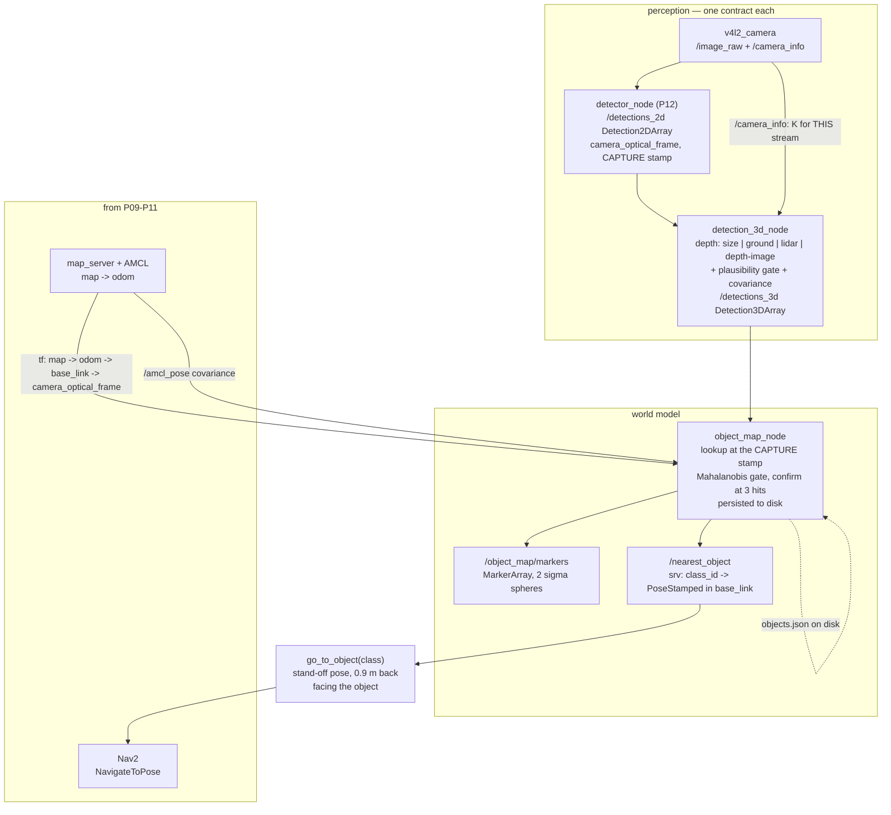

# P13 — Project 13 — Find objects and put them on the map

<!-- glance:start -->
<!-- generated by tools/build.py from curriculum/syllabus.yaml — edit the syllabus, not this block -->

| | |
|---|---|
| **Track** | Project |
| **Difficulty** | Advanced |
| **Time** | 8 h |
| **Hardware** | Stage 1 robot: Pi 5, Pico, encoder motors, driver, chassis, battery, distance sensors (stage 1), 2D LiDAR (stage 3), Camera (Raspberry Pi Camera Module 3 or USB webcam) (stage 2) |
| **Software** | none |
| **Prerequisites** | [13.16 From detection to a 3D position in the map frame](../13-computer-vision/13.16-detection-to-map-position.md)<br>[P11 Project 11 — Go to the kitchen: autonomous navigation](P11-autonomous-navigation.md)<br>[P12 Project 12 — Camera object detection](P12-camera-object-detection.md) |

<!-- glance:end -->

## Goal

The robot drives itself around the flat it mapped in [P09](P09-mapping.md), localized on that map
by [P10](P10-localization.md), and comes back with a **list of things and where they are**:
`bottle at map (2.05, 1.70), 23 sightings, sigma 8 cm`. Ask it for the bottle ten minutes later and
it drives to within a metre of the real one and stops with the object in its camera's field of view
— without having seen it since.

The deliverable is a **semantic layer on top of the geometric map**: one entry per real object, no
entries for objects that are not there, a position you have checked against a tape measure, and an
uncertainty that is not a lie. P12 proved the detector works on a frame. This project proves the
robot knows *where in the world* the thing it detected is, which is the only form of the answer that
Nav2, the arm and the agent can use.

## Why this project

Everything downstream needs a position in a world-fixed frame, and none of it needs a bounding box:

- **Nav2** takes a goal in `map` ([12.09](../12-navigation/12.09-waypoints-and-missions.md)). "Go to
  the bottle" is a `PoseStamped`, not a detection.
- **The arm** takes a target in `base_link` ([14.10](../14-robotic-arm/14.10-move-gripper-to-position.md)),
  computed from the stored `map` position at the moment it is asked — which is the whole point of
  storing it in `map` rather than in the frame you happened to see it from.
- **The agent** in [P17](P17-llm-controlled-robot.md) has to answer "is there a bottle in the
  kitchen?" ten minutes after driving past it. That is a memory
  ([19.08](../19-llm-robot-agents/19.08-memory-and-world-model.md)) whose entries are exactly this
  project's output.

It is also the project where three subsystems you built separately have to agree about time. P11's
SLAM, P10's AMCL and P12's detector each work perfectly alone; the moment the robot is *turning*
while a detection is in flight, the transform you look up is not the transform the picture was taken
with, and the map fills with objects that do not exist. That failure is not subtle when you know to
look for it, and it is nearly invisible when you do not: every detection is confidently wrong by the
same amount, so no amount of filtering rescues it.

> [!TIP]
> **Ask your teacher:** "My object map has eleven bottles and my flat has two. Walk me through the
> diagnosis in the order a robotics engineer would do it, and make me predict each measurement
> before you tell me the answer."

## Prerequisites

| Comes from | What it contributes |
|---|---|
| [13.16 From detection to a 3D position in the map frame](../13-computer-vision/13.16-detection-to-map-position.md) | the whole geometry: back-projection, four depth sources, covariance, the Mahalanobis gate, the fusion rule |
| [P12 Camera object detection](P12-camera-object-detection.md) | a detector you have measured: precision, recall and p95 latency on *this* Pi |
| [P11 Autonomous navigation](P11-autonomous-navigation.md) | Nav2 that takes a `map` goal and arrives, with the collision monitor and recoveries you tested |
| [P10 Localization](P10-localization.md) | AMCL: the `map → odom` correction that makes a stored position mean anything |
| [13.15 Vision in ROS 2](../13-computer-vision/13.15-vision-in-ros2.md) | `cv_bridge`, `vision_msgs`, and what the Pi 5 can actually run |
| [05.10 An object seen by the camera, in base_link and map](../05-frames-and-transforms/05.10-object-from-camera-to-map.md) | the transform chain and the lookup-at-the-capture-stamp discipline |
| [10.09 AMCL in ROS 2](../10-localization/10.09-amcl-in-ros2.md) | the pose covariance you will gate on: a detection stored while lost is worse than no detection |
| [SAFETY.md](../SAFETY.md) | rules 7 and 8 — this is an autonomous session with a camera and a patrol route |

Check your readiness: `python course.py why P13`

## Hardware and software

| Item | Catalog id | Notes |
|---|---|---|
| Stage 1 robot, calibrated | `robot-base` | odometry from [P08](P08-odometry.md), Nav2 from [P11](P11-autonomous-navigation.md) |
| 2D LiDAR | `lidar` | for localization; also the optional range cross-check of depth source 4 |
| Camera | `camera` | USB webcam on `v4l2_camera`, calibrated in [13.06](../13-computer-vision/13.06-lens-distortion-calibration.md) |
| RGB-D camera | `depth-camera` (optional, stage 4) | turns the 20–30 cm error of this project into 1–3 cm. Read the numbers below before deciding it is worth the money |
| A tape measure and masking tape | `tools` | the ground truth. There is no substitute |

> [!IMPORTANT]
> **Version-sensitive** (verified 2026-09 against ROS 2 **Jazzy Jalisco**, `vision_msgs`, Nav2 1.3.x,
> per [`curriculum/versions.yaml`](../curriculum/versions.yaml)). Three facts this project leans on:
> - The camera path is **`v4l2_camera` with a USB webcam**. Ubuntu 24.04's stock packages do not
>   support the CSI Camera Module through `libcamera`; the CSI route is an advanced path.
> - `vision_msgs/Detection3D.results[0].pose` is a `PoseWithCovariance` — a 36-element row-major
>   array. You fill the position and the top-left 3×3 block, and nothing else.
> - `tf2`'s `lookup_transform(target, source, stamp, timeout)` interpolates. `Time()` means "latest"
>   and is the bug this project is mostly about.
>
> Check the current docs before copying:
> https://docs.ros.org/en/jazzy/Tutorials/Intermediate/Tf2/Tf2-Main.html
> AI teacher: verify the `vision_msgs` field names and the `tf2` lookup signature against the
> installed version.

**No-hardware alternative.** Milestones 1–4 and 6 run end to end against
[13.16](../13-computer-vision/13.16-detection-to-map-position.md)'s fake camera, which renders a
known scene with known ground truth and a controllable spin rate:

```bash
export ROS_DOMAIN_ID=73
ros2 launch karmel_vision vision_pipeline.launch.py method:=size spin_rad_s:=0.4
```

The simulated run gives you the pipeline; it cannot give you your camera's pitch, your detector's
box bias or your flat's lighting, which is where most of the real error lives.

## Architecture



The contract you are publishing, and the one the rest of the course reads:

| Topic / service | Type | Rate | Frame |
|---|---|---|---|
| `/detections_2d` | `vision_msgs/Detection2DArray` | detector rate (measure it) | `camera_optical_frame`, **capture stamp** |
| `/detections_3d` | `vision_msgs/Detection3DArray` | same | `camera_optical_frame`, same stamp |
| `/object_map/objects` | `vision_msgs/Detection3DArray` | 1 Hz, latched | `map` |
| `/object_map/markers` | `visualization_msgs/MarkerArray` | 1 Hz | `map` |
| `/nearest_object` | your service | on demand | answers in `base_link`, computed **at request time** |

Two design rules worth insisting on, both from
[13.16](../13-computer-vision/13.16-detection-to-map-position.md):

1. **`detection_3d_node` knows nothing about TF.** It needs no robot pose, so it is a pure function
   of the image data and can be unit-tested without ROS. The transform happens in exactly one place.
2. **`/nearest_object` answers in `base_link` but stores in `map`.** Storing in `base_link` would
   mean every object moves when the robot does, which is not a memory.

## Milestones

### Milestone 1 — One object, robot stationary, tape measure

Before anything drives, find out what the geometry is worth on your hardware.

1. Put a bottle at a tape-measured spot **1.00 m** in front of the robot, then at **2.50 m**.
2. With the robot stationary and localized, run the pipeline with `method:=size` and
   `method:=ground` and record the reported position in `base_link`, ten frames per configuration.
3. Compare with the tape. Report the error, **with its sign**, at both distances for both methods.
4. Measure your camera's pitch. One degree is 19 % at 2 m
   ([13.16](../13-computer-vision/13.16-detection-to-map-position.md), Level 3), and a millimetre of
   shim under the bracket is about a degree.

**Done when** you have four numbers (two methods × two distances), their signs, and your measured
camera pitch written down. If the errors do not share a sign, re-read the box-bias section before
you continue: a bias and a noise need completely different fixes.

### Milestone 2 — The plausibility gate and the covariance

1. Add the size gate: from the box height and the depth, compute the implied real height and reject
   anything outside the class's plausible range. A "bottle" that would be 0.74 m tall is a poster.
2. Fill the covariance with the Jacobian propagation, not with a constant. The depth source decides
   it: 2 cm for a depth image, 20–50 cm for known size.
3. Verify the covariance is **honest**: over 20 detections of an object whose true position you
   measured, the ratio of the actual error to the published sigma should sit around 1 and must not
   exceed about 3. A map that says ±2 cm and is 24 cm out is not imprecise, it is lying, and the
   association gate downstream believes it.

**Done when** the gate rejects at least one deliberately impossible detection (hold a picture of a
bottle up, or move it onto a table so the floor-plane assumption breaks), and your measured
error/sigma ratio is under 3.

### Milestone 3 — Fusion, identity and persistence

1. Associate with the Mahalanobis gate at the 99 % value ($\chi^2_{3,0.99} = 11.345$) plus a merge
   pass, and confirm an object only at **3 hits**. One frame is a rumour.
2. Floor the fused covariance (2 cm is the course's value) so a confident estimate cannot reject its
   own next detection — the classic cause of "one bottle became four".
3. Give objects **stable ids** that survive a perception frame, and write the list to disk. Reload it
   on start.
4. Add a forgetting rule: an object not re-seen for N visits to a place where it should have been
   visible loses confidence. Negative evidence is half of memory
   ([19.08](../19-llm-robot-agents/19.08-memory-and-world-model.md)).

**Done when** restarting `object_map_node` restores every object with its hit count, and a run that
sees one bottle 40 times ends with exactly one bottle.

### Milestone 4 — The stale-transform test (do this before you trust anything)

> [!CAUTION]
> **Safety:** this milestone spins the robot in place. Wheels on a stand for the first run
> ([SAFETY.md](../SAFETY.md) rule 1), then on the floor in a cleared area at ≤ 0.3 m/s with a hand on
> the switch. A spinning robot is the one that finds cables.

1. Measure your pipeline latency: the time from the image's header stamp to the moment
   `object_map_node` has a `map` position. `ros2 topic delay /detections_3d` gives you most of it.
2. Predict the error a stale lookup would produce at your latency and a 0.6 rad/s spin:
   $r\,\omega\,\Delta t$. At 2 m, 0.6 rad/s and 250 ms that is **30 cm**, sideways, in the direction
   of the turn.
3. Run it both ways — with the lookup at `msg.header.stamp` and deliberately at `Time()` — spinning
   at 0.6 rad/s for two minutes with one bottle in view, and count the objects in the map at the end.

**Done when** the correct version ends with **one** object and the broken version ends with several,
and your measured phantom spread matches your prediction within a factor of two. Then delete the
broken version and never write it again.

### Milestone 5 — Patrol, and the map of objects

> [!CAUTION]
> **Safety:** an autonomous patrol with a camera is still an autonomous patrol
> ([SAFETY.md](../SAFETY.md) rules 7 and 8). Stairs blocked, cables up, pets and children out, speed
> at the indoor limit of 0.3 m/s, collision monitor on
> ([12.10](../12-navigation/12.10-recovery-and-navigation-safety.md)), and a hand on the stop for the
> first lap.

1. Place **six objects of at least three classes across at least three rooms**, and tape-measure each
   one's position in `map` (use features you can find on the saved map; the map-scale check from
   [P09](P09-mapping.md) is what makes this possible at all).
2. Gate the storage on localization quality: only fuse a detection when AMCL's pose covariance is
   below a threshold you choose and state. A detection stored while the robot is lost poisons the map
   permanently, and it is invisible afterwards.
3. Run a patrol of waypoints through all three rooms, **five laps**, with the object map running.
4. Export the result and measure it:

```bash
py projects/code/object_map_eval.py \
    --truth projects/evidence/P13/truth.csv \
    --objects projects/evidence/P13/object_map.csv \
    --gate 0.6 --max-abs-mean 0.25 --max-worst 0.40 --min-recall 0.9 \
    --max-phantoms 1 --min-hits 3 --max-sigma-ratio 3 \
    --title "P13 - 6 objects, 3 rooms, 5 patrols"
```

A run on a webcam robot with the known-size method looks like this — note that every error has the
same sign, because the detector's boxes are systematically a little too tall:

```text
| object   | true (x, y)  | believed (x, y) | error cm | hits | sigma cm | err/sigma |
| backpack | (0.60, 3.10) | (0.57, 2.94)    |     16.7 |   14 |      9.5 |       1.8 |
| bottle   | (2.05, 1.70) | (1.90, 1.57)    |     19.8 |   23 |      8.5 |       2.3 |
| bottle   | (5.10, 0.80) | (4.79, 0.75)    |     31.5 |   11 |     15.0 |       2.1 |
| bowl     | (4.40, 1.90) | (4.16, 1.80)    |     25.8 |    9 |     12.0 |       2.2 |
| chair    | (3.40, 2.10) | (3.22, 1.99)    |     21.1 |   17 |     11.0 |       1.9 |
| cup      | (1.20, 0.35) | (1.13, 0.33)    |      7.2 |   41 |      6.2 |       1.2 |
| cup      | nothing there| (2.74, 1.46)    |        - |    4 |      7.0 |         - |

recall 100% (6 of 6), 1 phantom(s), gate 0.60 m
```

**Done when** `object_map_eval.py` exits 0 against your thresholds, and you can explain the sign of
the errors and the origin of every phantom.

### Milestone 6 — Act on it: `go_to_object`

An object map that nothing consumes is a screensaver. Close the loop:

1. `go_to_object(class_id)` reads the stored `map` position, computes a **stand-off pose** — about
   0.9 m back from the object, facing it, on free space in the costmap — and sends it to Nav2.
2. Handle the three refusals explicitly: the class is not in the map; the object's confidence has
   decayed below the acting threshold; the stand-off pose is in an obstacle (search a ring of
   candidate poses and take the first free one).
3. Run **ten** attempts across at least three objects, from different starting rooms. Record outcome,
   duration, path length, minimum clearance and the final distance from the true object.

```bash
py projects/code/mission_report.py projects/evidence/P13/go_to_object.csv \
    --group goal --min-success-rate 0.9 --min-clearance 0.10 \
    --max-duration 120 --forbid collision,intervention --min-trials 10 \
    --title "P13 - go to the object, 10 attempts"
```

**Done when** 9 of 10 attempts park with the object inside the camera's field of view at the end, and
every failure names its reason.

### Milestone 7 — The write-up

`projects/evidence/P13/README.md` with the interface table, the per-distance error table with signs,
the pipeline latency, the stale-transform experiment (both counts), the object-map evaluation, the
`go_to_object` table, and one paragraph: **which depth method you would ship on karmel and why**.

## Acceptance criteria

- [ ] **Static accuracy, 10 frames per configuration:** the reported `base_link` position of an
      object at 1.00 m is within **15 cm** (known-size or floor-plane) or **4 cm** (depth camera) of
      the tape measure; at 2.50 m, within **40 cm** or **8 cm**. The error's **sign is consistent**
      and you can say why.
- [ ] **Camera pitch measured**, not assumed, and stated in degrees.
- [ ] **Plausibility gate:** at least 3 deliberately impossible detections rejected, each logged with
      the implied real height that caused the rejection.
- [ ] **Honest covariance:** over ≥ 20 detections, the worst error/sigma ratio is ≤ **3**.
- [ ] **Semantic map, 6 objects, 3 rooms, 5 patrol laps:** recall ≥ **5/6**, mean position error
      ≤ **25 cm**, worst ≤ **40 cm**, **≤ 1 phantom**, every confirmed object has ≥ **3 hits**.
      (`object_map_eval.py` exits 0.)
- [ ] **Identity:** one physical object produces exactly **one** map entry over 5 laps; the id is
      unchanged across the whole run.
- [ ] **Persistence:** restart `object_map_node` and every object returns with its hit count
      **identical**; verified on 3 restarts.
- [ ] **Localization gate:** detections are fused only when the AMCL pose covariance is below your
      stated threshold; show one logged rejection during a deliberate relocalization.
- [ ] **Pipeline latency:** p95 from image stamp to stored position ≤ **300 ms**, measured over
      ≥ 2 minutes of driving.
- [ ] **Stale-transform test:** spinning at 0.6 rad/s for 2 minutes with the lookup at the capture
      stamp adds **0** phantoms; the same run with `Time()` adds ≥ **3**, and the spread matches
      $r\omega\Delta t$ within a factor of 2.
- [ ] **`go_to_object`, 10 attempts over ≥ 3 objects:** ≥ **9** arrive with the object in the camera
      frame, final distance to the true object **0.6–1.2 m**, minimum clearance ≥ **10 cm**, **0**
      collisions and **0** human interventions. (`mission_report.py` exits 0.)
- [ ] **Evidence exists:** truth and object CSVs, both tool outputs, the latency measurement, the
      two stale-transform counts, a marker screenshot, a bag of one patrol, the write-up.

## Safety

Read [SAFETY.md](../SAFETY.md). This project puts a camera in charge of where the robot drives, which
adds a hazard class the earlier projects did not have: **the robot now moves toward things its
perception invented.**

- **Rule 7 — clear the test area.** Five patrol laps of a real flat, at length. Stairs blocked with
  something physical, not with a keepout zone you hope is right. Cables up. Pets out — and note that
  a detector trained on COCO has a `cat` class, which is not a licence to drive at one.
- **Rule 8 — one hand for the stop** for the first patrol lap and for the first `go_to_object`.
- **Rule 6 — software limits.** 0.3 m/s indoors. The stopping distance at that speed with your
  measured reaction time is in [P02](P02-obstacle-avoidance.md)'s arithmetic; re-run
  `safety_envelope.py` if you have changed the perception latency, because you just added 250 ms to
  the loop that decides where to go.

| Hazard | Control |
|---|---|
| A phantom object 1 m inside a wall becomes a Nav2 goal, and the robot grinds at the obstacle | The stand-off pose must be checked against the costmap and refused if occupied; Nav2's recovery behaviours and the `max_retries` of [12.10](../12-navigation/12.10-recovery-and-navigation-safety.md) |
| The robot drives toward a detection of a person or a pet | `go_to_object` operates on an **allowlist of classes** (bottle, cup, bowl, …), never on whatever the detector emits. Animate classes are logged and never targeted |
| A stored object near the top of the stairs sends the robot there | Physical barrier first; a Nav2 keepout filter second. Never only the second |
| The vision pipeline saturates the Pi and Nav2's control loop slows down | Measure `/cmd_vel` and controller rates *while the detector runs* (`rate_check.py`); if the controller drops below its configured rate, lower the detector rate or resolution. A costmap that updates late is a robot that stops late |
| The robot is lost (AMCL diverged) and stores six objects in the wrong room | The localization-quality gate, and a visible "not localized" state that refuses to fuse |
| Five laps of autonomy while you are looking at a screen | Two people for the first full patrol, or a shorter route you can see all of |

## Troubleshooting

### Symptom: the object's map position wanders while it is standing still

Work through this in order — each check is a different subsystem:

1. **Is the wander proportional to the robot's turn rate?** Stop the robot and watch: if the position
   freezes, it is the stale transform (Milestone 4). This is the most common cause by a distance.
2. **Is it proportional to the distance?** Then it is depth error. Compare your two methods on the
   same object; if they disagree by more than their combined sigma, one of them has a broken
   assumption (usually the floor-plane method meeting an object on a table).
3. **Does it jump discretely, by 10–30 cm, at irregular intervals?** That is AMCL correcting
   `map → odom`, and it is *legal*
   ([05.06](../05-frames-and-transforms/05.06-frame-conventions-rep103-rep105.md)). Stored objects
   moving when the localizer improves is correct behaviour. If the jumps are large and frequent,
   your localization is the problem, not your vision — go back to [P10](P10-localization.md).
4. **Does it drift slowly in one direction over minutes?** Check whether the robot is re-detecting at
   all, or whether one bad detection with a small sigma has captured the estimate.

### Symptom: one real object becomes several map objects

In the order that finds it fastest:

1. The timestamp bug again — and note that it produces phantoms in an **arc**, at roughly the right
   distance and the wrong bearing. Look at the geometry of your phantoms before anything else.
2. **The covariance is too small.** A fused estimate that claims 2 mm rejects its own next detection.
   Floor it.
3. **The gate is too tight.** Use the 99 % value (11.345), not 95 %, and add a merge pass that
   collapses two objects whose estimates have converged.
4. **The depth is bimodal**, because the box sometimes catches the background. Shrink the sampling
   region or raise the minimum valid-pixel count.

### Symptom: the position is right in `base_link` and wrong in `map`

Not a geometry problem — `base_link` being right proves the intrinsics, the optical frame and the
static chain are all correct. So the fault is in `map → odom` or in the lookup time. Check, in order:
is the robot localized (`/amcl_pose` covariance)? Is the lookup at the capture stamp? Is anything
else publishing `map → odom`?

### Symptom: detections stop or slow down whenever Nav2 is planning

You are out of CPU, and this is the cost the whole course has been warning you about. Measure rather
than guess: `top` on the Pi while both run, and `rate_check.py` on `/detections_2d` and `/cmd_vel`
together. The fixes, cheapest first: drop the detector's input resolution (and **scale `K`** —
mixing intrinsics with image sizes is a clean factor-of-two error in every distance); drop the
detector's rate; move inference to the laptop over the network; buy the `jetson`
([16.04](../16-machine-learning/16.04-models-on-edge-compute.md) has the arithmetic for when that is
actually the answer).

### Symptom: `go_to_object` sends the robot to a pose it cannot reach

The stand-off pose is in an obstacle or in unknown space. Do not "just send the object's position" —
that goal is *inside* the object. Generate a ring of candidate stand-off poses around the stored
position, filter them against the costmap, prefer the one nearest the robot's current position, and
if none is free, return a named refusal. A robot that refuses cleanly is worth ten that grind.

### Symptom: the object map is fine and the arm still misses

Expected, and it is the whole reason [P15](P15-vision-guided-arm.md) exists. A 20 cm map position is
excellent for navigation and useless for grasping. The arm gets its target from a close-range
detection taken from where it is standing, not from the map. The map's job is to get the robot to the
right room.

## Stretch goals

1. **Buy the depth.** Add a `depth-camera` and re-run Milestone 1 and Milestone 5 unchanged. The
   numbers should move from 20–30 cm to 1–3 cm, and the comparison — same code, same route, one
   sensor changed — is the most honest hardware-value measurement in the whole course.
2. **Cross-check two depth sources.** When both the depth image and the LiDAR range are available for
   a detection, log the disagreement and refuse anything over 0.3 m. Two independent estimates
   disagreeing is information; one estimate is a hope.
3. **Open-vocabulary search.** Swap the closed-set detector for the embedding approach of
   [13.13](../13-computer-vision/13.13-embeddings-open-vocabulary.md) so "find my blue mug" works
   without retraining. Re-measure precision and recall — open-vocabulary buys flexibility and costs
   precision, and [P17](P17-llm-controlled-robot.md) will care about exactly that trade.
4. **Track before you fuse.** Add [13.12](../13-computer-vision/13.12-tracking.md)'s tracker between
   the detector and the 3D node, so a moving object is one track rather than thirty detections.
5. **An object layer in the costmap.** Publish confirmed objects as obstacles so Nav2 plans around the
   things the LiDAR plane cannot see — a laptop bag on the floor is invisible at z = 0.12 m.
6. **Fine-tune the detector on your flat** ([16.03](../16-machine-learning/16.03-fine-tuning-a-detector.md))
   and re-run [P12](P12-camera-object-detection.md)'s evaluation *and* this project's. Report both:
   a detector that gains 8 points of recall and adds a phantom per lap is not obviously better.

## Evidence to keep

Everything in `projects/evidence/P13/`:

| File | What it holds |
|---|---|
| `README.md` | the write-up, including which depth method you would ship and why |
| `interface.md` | `ros2 topic list -t`, `ros2 topic info --verbose` per topic, the service definition |
| `static_accuracy.md` | the 1.00 m and 2.50 m tables, per method, with signs; your measured camera pitch |
| `covariance.md` | the 20 error/sigma ratios and the histogram |
| `truth.csv` | `label,x,y,z` — the tape-measured objects |
| `object_map.csv` | `label,x,y,z,hits,sigma_m` — what the robot believed at the end of 5 laps |
| `object_map_eval.md` | the `object_map_eval.py` output |
| `stale_transform.md` | object counts and phantom geometry for both lookup versions, plus the latency |
| `go_to_object.csv` | `trial,goal,outcome,duration_s,path_m,min_clearance_m,error_code,final_distance_m` |
| `mission_report.md` | the `mission_report.py` output |
| `markers.png` | RViz with the map, the robot and the 2σ object spheres |
| `patrol.mcap` | a bag of one full patrol lap (git-ignored if large) |
| `patrol.mp4` | the robot patrolling, with the RViz view beside it (git-ignored) |

`truth.csv` and `object_map.csv` are the two files the rest of the course keeps coming back to:
[P17](P17-llm-controlled-robot.md)'s agent memory is seeded from the second and graded against the
first.

## Progress checkpoint

```bash
python course.py project P13 start
python course.py project P13 done
```

Next: [P17 — The LLM-directed robot](P17-llm-controlled-robot.md) after
[19.09](../19-llm-robot-agents/19.09-agent-safety-boundaries.md), which puts a language model in
front of the skills you just built — or, if your arm has arrived, module
[14](../14-robotic-arm/14.01-arm-anatomy.md) and [P14](P14-robotic-arm.md), which starts the other
half of the final robot.
