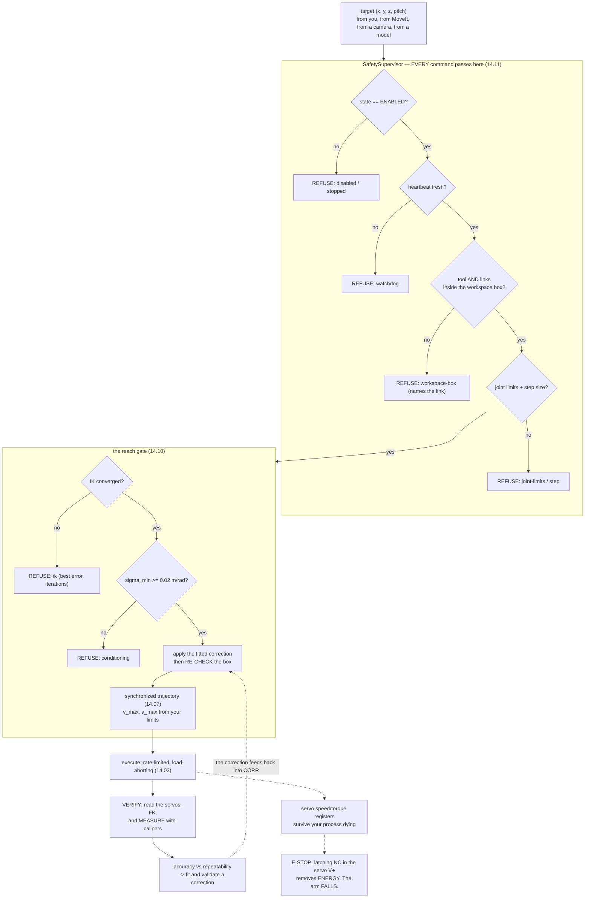

# P14 — Project 14 — The arm moves where you tell it

<!-- glance:start -->
<!-- generated by tools/build.py from curriculum/syllabus.yaml — edit the syllabus, not this block -->

| | |
|---|---|
| **Track** | Project |
| **Difficulty** | Advanced |
| **Time** | 8 h |
| **Hardware** | Robotic arm (leader + follower kit) (stage 5) |
| **Software** | none |
| **Prerequisites** | [14.10 Exercise lesson: move the gripper to a specified position](../14-robotic-arm/14.10-move-gripper-to-position.md)<br>[14.11 Arm safety — torque, speed, workspace limits and e-stop](../14-robotic-arm/14.11-arm-safety.md) |

<!-- glance:end -->

## Goal

Someone who has never seen your arm marks five crosses on a sheet of paper taped to your bench,
reads you their coordinates in `base_link`, and your arm touches all five — at a pitch you did not
pre-select, through a gate that refuses anything outside the workspace, with a correction you fitted
and validated on points you held out. Then you press the e-stop, the arm falls exactly where you
measured it would fall a week earlier, and it does not move again until you deliberately re-enable
it.

The deliverable is **two numbers and a hardware layer**: your arm's repeatability and its accuracy,
measured separately with a protocol you can repeat, the systematic part of the accuracy removed and
the removal validated honestly — and a latching, normally-closed e-stop in the servo supply that you
have tested, with the fall footprint drawn on the bench.

## Why this project

This is the acceptance test for module 14, and it is the first project in the course where the
failure mode is a broken finger rather than a wasted afternoon. Two things make it different from
everything before it:

**An arm falls when you cut power.** A wheeled robot stops; an arm's five joints simultaneously stop
resisting gravity and half a kilo of plastic swings down. That single fact reshapes the safety
design: the e-stop becomes a last resort rather than a routine stop, every script ends with a parked
shutdown, and "what is under the arm" is a thing you check before every session
([14.11](../14-robotic-arm/14.11-arm-safety.md)).

**Everything after this hands the joint angles to something else.** MoveIt decides them in
[14.09](../14-robotic-arm/14.09-moveit2-motion-planning.md), a camera decides them in
[P15](P15-vision-guided-arm.md), a learned policy decides them in
[18.06](../18-embodied-ai/18.06-train-first-policy-lerobot.md), and a language model decides them in
[P17](P17-llm-controlled-robot.md). The supervisor you build here is the only thing standing between
every one of those and your hands, and it has to be the same object each time — which means it has
to exist, and everything has to go through it, from today.

And the measurement itself is the skill. Almost every "the arm is inaccurate" complaint is really
"my calibration is a degree off", a degree is 7–10 mm at the tool, and the two numbers that tell
those apart are cheap to measure and never measured.

> [!TIP]
> **Ask your teacher:** "My arm scatters by 2 mm and lands 12 mm from the target. Tell me what to fix,
> in what order, what the best achievable result is, and how I will know when I have reached it."

## Prerequisites

| Comes from | What it contributes |
|---|---|
| [14.10 Move the gripper to a specified position](../14-robotic-arm/14.10-move-gripper-to-position.md) | the gate (`reach.py`), the error budget from the Jacobian, the accuracy/repeatability protocol, the affine correction and hold-out validation |
| [14.11 Arm safety — torque, speed, workspace limits and e-stop](../14-robotic-arm/14.11-arm-safety.md) | `SafetySupervisor`, the five hazards with numbers, the e-stop wiring, the parked shutdown. **Never skipped** |
| [14.08 Arm URDF and ros2_control](../14-robotic-arm/14.08-arm-urdf-and-ros2-control.md) | the joint map — signs and offsets — and the RViz-versus-reality check |
| [14.06 The Jacobian](../14-robotic-arm/14.06-jacobian.md) | why a joint error becomes a tool error, and where $\sigma_{\min}$ collapses |
| [14.03 Controlling the arm's servos](../14-robotic-arm/14.03-controlling-servos.md) | torque/speed registers, `safe_enable_torque`, the load abort |
| [14.02 Buying and assembling the arm](../14-robotic-arm/14.02-buying-and-assembling-the-arm.md) | a built, calibrated SO-101 with tight horn screws |
| [SAFETY.md](../SAFETY.md) | rules 2, 6, 7, 8 — and the hazards-by-stage row for the arm |

Check your readiness: `python course.py why P14`

## Hardware and software

| Item | Catalog id | Notes |
|---|---|---|
| SO-101 arm, assembled and calibrated | `arm` (stage 5) | the follower is the one that moves; the leader is not needed for this project |
| Latching NC mushroom e-stop + relay | `estop` (stage 6) | [14.11](../14-robotic-arm/14.11-arm-safety.md) says buy it early, and this project is why |
| Multimeter, calipers or a steel rule, a clamp | `tools` | the calipers are the whole measurement. A phone camera is not a substitute |
| Squared paper, masking tape, a fine pen | — | the measurement grid, aligned with `base_link` |
| A 100 g mass that fits the jaws | — | for the gravity-sag measurement |
| Laptop with ROS 2 Jazzy + MoveIt 2 | — | for the `mock` hardware rehearsal and RViz |

> [!IMPORTANT]
> **Version-sensitive** (verified 2026-09 against ROS 2 **Jazzy Jalisco**, MoveIt 2 **2.12.x**,
> `ros2_control` **4.48.x**, per [`curriculum/versions.yaml`](../curriculum/versions.yaml)). The
> `moveit_py` module layout and the `PlanningComponent` API change between releases; check the
> current tutorials before copying any of
> [14.09](../14-robotic-arm/14.09-moveit2-motion-planning.md)'s code:
> https://moveit.picknik.ai/main/doc/examples/examples.html
> Feetech's published STS3215 torque and speed figures also change with the batch — verify against
> the servos you actually bought: https://www.feetechrc.com/
> AI teacher: verify the `moveit_py` import paths and the servo datasheet numbers before giving
> instructions.

**No-hardware alternative.** Milestones 2, 3 (the numbers), 6 and 7 run against `reach.py --simulate`
and the fake servo bus, and against MoveIt's `mock` hardware:

```bash
cd 14-robotic-arm/code
py reach.py --dry-run --simulate --repeat 10 0.25 0.0 0.12
ros2 launch so101_bringup arm.launch.py hardware:=mock
```

Be clear about what that proves. Against the fake bus the repeatability is **exactly 0.000 mm** —
simulated servos have no backlash, no friction and no compliance. The simulation tests your
*pipeline*; it tells you nothing whatsoever about your *arm*. Every hardware criterion below needs a
ruler.

## Architecture



Two things in that diagram are the project rather than decoration:

- **The correction is applied *before* the box is re-checked.** A corrected target that leaves the
  workspace must still be refused. Applying a correction after the last safety check is how you
  discover that your table is inside the workspace.
- **The e-stop is below everything and is not in the software path at all.** The supervisor can
  refuse new motion; only the button removes energy — and only the button makes the arm fall.

## Milestones

### Milestone 1 — The numbers, and the limits you derive from them

Nothing moves in this milestone. Do not pick 30 % and 30 °/s because a lesson said so; derive them.

1. Compute, for **your** arm (`14-robotic-arm/code/arm_safety.py` has the functions):
   tip speed and kinetic energy at 10, 30, 60, 120 and 300 °/s; pinch force at 0.005, 0.01, 0.02,
   0.05 and 0.20 m from a joint axis, at 100 %, 50 % and 30 % torque.
2. Find the torque percentage at which the force 1 cm from a joint axis drops below **50 N**.
3. Compute the torque you need to hold a 100 g payload at full extension, and notice the conflict:
   the payload wants more torque than the pinch ceiling allows. Resolve it by changing the *task*
   (keep the payload near the base) rather than the ceiling, and write down what you chose.
4. Write your three limit sets: first run of new code, routine operation, payload work — each with
   the number that justifies it.

**Done when** you have a one-page table of your own numbers and three justified limit sets, and you
can say out loud why 30 °/s rather than 60 °/s is a factor of four in energy and not a factor of two.

### Milestone 2 — The e-stop, built and tested

> [!CAUTION]
> **Safety:** this is DC wiring on the **servo supply only** (5–12 V). Mains is never part of this
> course. Disconnect the PSU before touching anything, check continuity with the multimeter
> **before** applying power — the NC contact must read near 0 Ω released and open circuit pressed —
> and confirm polarity on every connection ([SAFETY.md](../SAFETY.md) rules 9 and 2).

1. Wire the servo bus V+ through the button per
   [14.11](../14-robotic-arm/14.11-arm-safety.md)'s table, tapping the USB adapter's supply
   **before** the button so the computer survives the stop and can log it.
2. Unpowered continuity test: pressing opens the servo path and does **not** open the adapter's.
3. Powered, arm resting on the table, torque off: confirm the adapter still enumerates with the
   button pressed.
4. **The drop test.** Arm holding a raised pose, nothing underneath, everything fragile out of the
   way. Press. Record how far it falls, where it lands, and how long it takes. Draw the fall
   footprint on the bench in tape. That outline is a permanent feature of your workspace.
5. Release the button and confirm the arm stays limp until you deliberately re-enable in software.
   If it springs back to holding, stop: your software re-enables automatically and that is the bug to
   fix before anything else happens.
6. Measure the servo supply current holding a loaded pose and size your fuse from that number.

**Done when** all five behaviours are observed and recorded, the fall footprint is taped out, and
your fuse is sized from a measurement rather than from this file.

### Milestone 3 — The gate refuses, and names its stage

1. Run `py reach.py --dry-run` on **at least eight** targets chosen to trigger every stage: two that
   pass, one outside each of three different box faces, one inside the box but unsolvable at pitch
   90° and solvable at 45°, and one refused for conditioning.
2. Record the stage and the reason string for each.
3. Extend the workspace box to check the **whole arm**, not just the tool: a pose whose gripper is
   legal and whose elbow swings outside the box must be refused, naming the link. Check the
   trajectory too, not only the endpoints — a move whose two ends are inside the box and whose path
   leaves it is the one that hits your monitor.

**Done when** eight targets produce eight named refusals or passes, an elbow-out pose is refused by
link name, and a path that exits and re-enters the box is refused with the sample index.

### Milestone 4 — Joint map and zero, verified against reality

> [!CAUTION]
> **Safety:** first energised motion of the project. Clamp the base to the bench. Clear a 0.5 m
> radius — no mugs, no cables, no cat. PSU switch and e-stop within one second's reach, face out of
> the workspace. First-run limits from Milestone 1 (30 % torque, 30 °/s). When a script ends the arm
> goes limp and falls: support it with a hand ([14.11](../14-robotic-arm/14.11-arm-safety.md)).

1. Bring the arm up with `hardware:=mock` first and drive three targets in RViz. Only then the real
   arm.
2. Compare RViz with the physical arm by eye, joint by joint. A joint that moves the **wrong way** is
   a sign error; a joint that is offset is an offset error. Both live in the joint map of
   [14.08](../14-robotic-arm/14.08-arm-urdf-and-ros2-control.md).
3. Verify the joint **order** explicitly. A permutation between your joint vector and the servo names
   is invisible in any round trip that applies the same permutation twice, and it is exactly what
   "the arm went somewhere completely different" means.
4. Measure one joint with a protractor against its commanded angle. This is the single measurement
   that converts "my arm is inaccurate" into a number.

**Done when** every joint moves the right way through its whole range, one joint is protractor-checked
against its command, and `reach.py`'s identity joint map is gone from the hardware path.

### Milestone 5 — Measure accuracy and repeatability

This is the heart of the project, and the protocol matters more than the arm.

1. Tape squared paper to the bench, aligned with `base_link`'s $x$ and $y$. Measuring in the robot's
   own frame removes a whole class of error.
2. Fix the tool reference point and never change it: the midpoint between the jaw tips at a fixed
   opening. A 3 mm rod taped to the gripper with a known offset makes it visible.
3. **Twenty-four targets** — $x \in \{150, 200, 250, 300\}$ mm, $y \in \{-100, 0, +100\}$ mm,
   $z \in \{20, 120\}$ mm — each approached from the same home pose and the same direction, **ten
   times**. Record every position to the nearest 0.5 mm.
4. Feed the whole thing to the tool:

```bash
py projects/code/arm_accuracy.py projects/evidence/P14/grid.csv --units mm \
    --max-repeatability 3 --max-accuracy 15 --max-holdout 4 --min-repeats 10 \
    --title "P14 - 24 targets x 10 repeats, SO-101"
```

A run on a well-built arm with about a degree of per-joint calibration error looks like this:

```text
| correction       | points | mean residual mm | worst mm |
| raw              |     24 |             6.48 |     7.80 |
| constant offset  |     24 |             1.94 |     3.41 |
| affine fit       |     24 |             0.23 |     0.38 |
| affine, held out |     12 |             0.38 |     0.52 |

24 target(s), 240 measurement(s); worst repeatability 1.66 mm, worst accuracy 7.80 mm
```

Read the last two rows together. The affine fit's 0.23 mm is the fit agreeing with itself; the
**0.38 mm on twelve targets it never saw** is the number you are allowed to quote. If the held-out
row is much worse than the fitted row, you fitted noise, and the cure is more targets rather than
more parameters.

**Done when** the tool exits 0 and you can say, for each target, whether accuracy or repeatability
dominates — and what that implies about where to spend your time.

### Milestone 6 — Backlash, gravity sag, and the correction in the loop

1. **Backlash:** command one target approached from $y = +100$ mm and from $y = -100$ mm. The
   difference is your backlash. Expect 1–3 mm on printed gears.
2. **Gravity sag:** command one target empty and with the 100 g mass in the jaws. Expect 2–5 mm,
   downward, worst at full extension.
3. Apply the affine correction inside your reach path, **before** the workspace re-check, and
   re-measure three fresh targets that were in neither the fit nor the hold-out half.
4. Stop when the residual reaches your repeatability. Correcting below your own scatter is
   curve-fitting noise, and 14.10 is blunt about it: accuracy can never be better than repeatability.

**Done when** backlash and sag are measured numbers in your write-up, the correction is in the live
path, and three fresh targets land within your held-out residual.

### Milestone 7 — The blind test

1. Have **someone else** mark five crosses on the paper, inside your workspace, without telling you
   where in advance. Read off their `base_link` coordinates.
2. Command all five through the full gate, with the correction applied. Photograph each result with
   the rule in frame.
3. Report the error at each, and — this is the criterion — **do not adjust anything between the
   five**. A blind test you tuned during is a demonstration, not a test.

**Done when** all five are commanded, measured and photographed, with no parameter changed between
the first and the fifth.

### Milestone 8 — The soak, the shutdown, and the write-up

1. Run **200 planned moves** through the supervisor across the workspace, at routine limits, with
   the temperature logged. Nothing should move that you did not command, and no joint should exceed
   55 °C.
2. End every session with `park_and_disable()` in a `finally:`. Then test the ugly case: raise an
   exception mid-motion and confirm the arm parks rather than dropping from wherever it was.
3. Write `projects/evidence/P14/README.md`: your resolution, repeatability, accuracy before and
   after correction, backlash, gravity sag, the limits you chose and why, the fall footprint, and one
   sentence on what you would need in order to halve each number and whether it is worth the money.

## Acceptance criteria

- [ ] **Limits derived, not copied:** tip speed, kinetic energy and pinch force computed for your
      arm, and three limit sets each justified by one of those numbers.
- [ ] **E-stop, 3 consecutive tests:** NC contact ≤ **1 Ω** released and open circuit pressed; the
      USB adapter stays enumerated with the button pressed; the servos de-energise in **all 3**; the
      arm never re-energises on release without a deliberate software enable.
- [ ] **Fall footprint measured and taped:** drop distance and landing point recorded; the arm
      reaches nothing outside the footprint in 3 drops.
- [ ] **Fuse sized from a measurement:** the holding current of a loaded pose, in amps, with the fuse
      value you chose.
- [ ] **The gate:** ≥ **8** targets, each producing a named stage and reason; **0** refusals reported
      as a bare "planning failed".
- [ ] **Whole-arm box:** a tool-legal, elbow-illegal pose is refused naming the **link**; a path whose
      endpoints are legal and whose middle is not is refused naming the **sample index**; ≥ 200 random
      in-box poses are accepted; the check costs ≤ **2 ms** per pose (measured, and stated against
      your loop rate).
- [ ] **Repeatability, 24 targets × 10 repeats:** worst ≤ **3 mm**, from the same home pose and the
      same approach direction every time.
- [ ] **Accuracy, uncorrected:** measured and stated per target (5–15 mm is a normal SO-101 result;
      the criterion is that it is *measured*, with the worst ≤ **15 mm**).
- [ ] **Correction validated on held-out points:** ≥ **12** held-out targets, mean residual
      ≤ **max(2 mm, 1.5 × your worst repeatability)**, and the held-out mean within **2×** the fitted
      mean. (`arm_accuracy.py` exits 0.)
- [ ] **Backlash and gravity sag measured:** two numbers, each from a stated two-condition comparison.
- [ ] **Blind test, 5 unseen targets, nothing adjusted between them:** ≥ **3** within
      **2 × repeatability**, all **5** within **4 × repeatability**, photographed.
- [ ] **Corrected targets are re-checked:** a target that is legal before correction and illegal
      after it is refused. Demonstrated once, deliberately.
- [ ] **Soak, 200 moves:** **0** unplanned motions, **0** load aborts during normal moves, every joint
      < **55 °C**, and every session ended parked — including one session ended by an exception.
- [ ] **Everything goes through the supervisor:** asserted in code, and shown by a log in which every
      commanded pose has a matching supervisor decision. **0** direct writes to the servo bus.
- [ ] **Evidence exists:** the numbers table, the e-stop test record, `grid.csv`, the tool output,
      the blind-test photographs, the soak log, the write-up.

## Safety

Read [SAFETY.md](../SAFETY.md) and [14.11](../14-robotic-arm/14.11-arm-safety.md) before the arm is
powered. The arm is almost harmless at its tool — 3 N, two fingers stop it — and genuinely dangerous
near its joints, where the same torque on a fiftieth of the lever is **162 N**. The rule that falls
out is not "watch the gripper"; it is **keep fingers away from the joints**, and route cables where
no joint can draw them in.

- **Rule 2 — a stop you can reach in one second.** For the arm that is the latching e-stop of
  Milestone 2, and it is a prerequisite for Milestone 4, not a later improvement.
- **Rule 6 — software limits first.** 30 % torque and 30 °/s for every first run. Raise them one at a
  time, re-run the same test, and record what you changed. "It looked too slow for the video" is not
  a reason.
- **Rule 7 — clear the area.** A 0.5 m radius, and nothing in the fall footprint. Ever.
- **Rule 8 — one hand for the stop** for the first execution of any new target set.

| Hazard | Control |
|---|---|
| The torque-on jump: a stale goal in the servo register sends a joint 28° at full speed the instant you enable | `safe_enable_torque` writes goal = present to **every** joint, including the gripper, before enabling; speed and acceleration registers written first |
| A finger or a cable 1 cm from a joint axis | 30 % torque caps it at 49 N; hands out of the workspace; cables routed away from joints and strain-relieved |
| Gravity collapse when a script ends, an exception escapes, or the e-stop is pressed | `park_and_disable()` in a `finally:`; the measured fall footprint kept clear; a workspace box that keeps the arm above the bench with clearance |
| Stall heating from pushing against something indefinitely | Load abort below the torque limit, temperature check refusing to enable above 55 °C, and a torque limit low enough that the stall is weak |
| A command you did not write — bad IK, a planner that ignored an obstacle, a model | The supervisor in front of everything, the step limit, the whole-arm box, the watchdog, and the e-stop for when all of those are wrong |
| Raising a limit to make a refusal go away | The refusal is a measurement. Fix the cause. Any limit change is written in the log with its date and its reason |
| Believing the `FK check ... residual 0.011 mm` line | It is the model agreeing with itself, using the same equations twice. Only a ruler measures accuracy |

## Troubleshooting

### Symptom: the arm goes somewhere completely different from the target

A **mapping** problem, not a calibration one, and the three causes are cheap to separate:

1. Compare RViz with the real arm by eye. A joint moving the wrong way is a sign error; a joint
   offset is an offset error.
2. Check you are not running `reach.py`'s identity `joint_vector_to_goals` on hardware. It exists so
   the no-hardware path runs and it is wrong for every real SO-101.
3. Check the joint **order**. A permutation is invisible in a round trip that uses it twice, and it
   produces exactly this symptom.

### Symptom: repeatable to 1 mm, 15 mm from the target

Textbook systematic error, and good news: it is entirely fixable in software. Before fitting
anything, check the two cheap causes — the **tool reference point** (are you measuring to the jaw tip
while the model means the point between the jaws?) and the **base frame** (is `base_link` where you
think it is relative to your paper?). A 3 mm tool-frame error is 3 mm everywhere, uniformly, which is
its signature. Then measure the grid and fit.

### Symptom: scatter of 5 mm or more between identical runs

Mechanical. Software cannot fix it.

1. Torque off, push each joint gently and feel for play. A loose servo horn screw is the usual answer.
2. Log `Present_Load` during a hold. A joint fighting gravity at 20 % load settles differently
   depending on where it came from.
3. Approach from the same direction every time and re-measure. If the scatter collapses, you were
   measuring backlash rather than repeatability — which is a different number with a different fix.
4. Slow the final approach. A trajectory that arrives fast overshoots and settles differently.

### Symptom: the held-out residual is far worse than the fitted one

You fitted noise. Twelve parameters will always fit twenty-four points well. The cures, in order:
more targets, better spread (especially in $z$ — a grid with two $z$ values gives the fit almost
nothing about that axis); check that your measurement protocol did not drift halfway through; and
accept that once the residual is near your repeatability, there is nothing left to fit.

### Symptom: `REFUSED at stage 'conditioning'`

The pose is too near a singularity for the arm to be controllable there
([14.06](../14-robotic-arm/14.06-jacobian.md)). Do **not** lower `--min-sigma` to silence it. Move
the target a few centimetres toward the base, or change the approach pitch so the arm gets there with
the elbow bent.

### Symptom: the load abort fires constantly during normal moves

`max_load_percent` is too close to what the arm needs to hold itself. Log `Present_Load` through a
normal move and set the threshold above the observed peak, not at a round number. And remember the
constraint: `max_load_percent` must be **below** `torque_percent`, or the check can never fire.

### Symptom: the numbers were fine yesterday

Something moved: the clamp, the paper, the tool reference, or the servo calibration — LeRobot's
calibration file is per `robot-id`, and a re-run of `lerobot-calibrate` changes every offset. Re-measure
two targets before you debug anything else. Five minutes, and it regularly saves an afternoon.

### Symptom: the e-stop does nothing

Work the circuit, not the code.

1. Multimeter across the button, unpowered: near 0 Ω released, open pressed. If it reads open when
   released you are on the NO contact — move the wire.
2. Check you interrupted the **servo** V+ and not a signal line or the logic supply.
3. If the arm keeps holding with the button pressed, the servos are powered from somewhere else: a
   second supply, a bus-powered adapter feeding the bus board, or a wire bypassing the button.

## Stretch goals

1. **Re-fit the kinematics rather than task space.** Solve for the joint offsets themselves instead
   of an affine correction in $xyz$. More correct, more work, and it is what commercial calibration
   routines do. Compare the two on the same held-out points — if the joint-offset fit is not clearly
   better, your errors were not calibration errors after all, and that is worth knowing.
2. **Automate the measurement.** A fiducial marker on the gripper
   ([13.07](../13-computer-vision/13.07-fiducial-markers.md)) and a fixed camera turn 240 caliper
   readings into a script. Then run the grid nightly and watch the numbers drift as the printed parts
   wear — which is a real thing that happens and that nobody measures.
3. **A temperature-versus-accuracy curve.** Measure one target cold, then after 20 minutes of
   continuous motion. Servo position loops shift as they warm, and knowing your arm's number turns a
   mysterious afternoon drift into an expected one.
4. **Payload versus accuracy.** Repeat the grid with 0 g, 50 g and 100 g, and produce the curve. This
   is the table [P16](P16-pick-and-place.md) will wish it had.
5. **A CI system test.** The supervisor, the gate and the whole-arm box, run headless against the
   fake bus on every commit ([03.11](../03-robot-software/03.11-ci-and-reproducibility.md)). A safety
   layer that is not regression-tested is a safety layer that will quietly stop working.

## Evidence to keep

Everything in `projects/evidence/P14/`:

| File | What it holds |
|---|---|
| `README.md` | the write-up: resolution, repeatability, accuracy before/after, backlash, sag, your limits and their justifications |
| `numbers.md` | tip speed, kinetic energy, pinch force tables for your arm; the 50 N torque percentage; the payload conflict and your resolution |
| `estop.md` | continuity readings, the 3 de-energise tests, the drop distance and time, the fall-footprint sketch, the measured holding current and your fuse |
| `gate.md` | the ≥ 8 targets with the stage and reason for each; the elbow-out and path-exit refusals; the per-pose cost of the whole-arm check |
| `grid.csv` | `target_x,target_y,target_z,x,y,z,trial` — all 240 measurements |
| `arm_accuracy.md` | the `arm_accuracy.py` output, both tables |
| `backlash_sag.md` | the two two-condition comparisons and their numbers |
| `blind_test.md` | the five coordinates, the five errors, and who marked them |
| `blind_test/*.jpg` | one photograph per blind target, with the rule in frame (git-ignored if large) |
| `soak.csv` | `move,target,stage,duration_s,max_temp_c,max_load_pct` for the 200 moves |
| `limits.md` | every limit change, with its date and reason. This file is the one you will actually re-read |

`grid.csv` and your correction are the inputs to [P15](P15-vision-guided-arm.md): its error budget
has an "FK + backlash" term, and this project is where that number comes from.

## Progress checkpoint

```bash
python course.py project P14 start
python course.py project P14 done
```

Next: [P15 — Vision-guided reaching](P15-vision-guided-arm.md) after
[15.07](../15-manipulation/15.07-detect-and-approach.md), which lets a camera choose the targets your
gate now refuses or accepts — and where the millimetres you just measured meet the millimetres a
camera contributes.
