# P15 — Project 15 — Vision-guided reaching

<!-- glance:start -->
<!-- generated by tools/build.py from curriculum/syllabus.yaml — edit the syllabus, not this block -->

| | |
|---|---|
| **Track** | Project |
| **Difficulty** | Advanced |
| **Time** | 8 h |
| **Hardware** | Robotic arm (leader + follower kit) (stage 5), Camera (Raspberry Pi Camera Module 3 or USB webcam) (stage 2) |
| **Software** | ros2, moveit2, tf2, python |
| **Prerequisites** | [15.07 Exercise lesson: detect an object and move the gripper toward it](../15-manipulation/15.07-detect-and-approach.md)<br>[P14 Project 14 — The arm moves where you tell it](P14-robotic-arm.md) |

<!-- glance:end -->

## Goal

You put a 30 mm block anywhere on the table in front of the arm. The camera finds it, the pipeline
turns it into a grasp, the grasp into four waypoints, checks all four against IK **before anything
moves**, and the gripper arrives 80 mm above the block with its jaws aligned to the block's short
axis. You measure the lateral offset with a rule. Twenty times, with the block somewhere different
each time.

The deliverable is not the reach — it is **an error budget you can defend and a measurement that
agrees with it**. By the end you can say: "my median lateral error is 5.4 mm and my p90 is 8.9 mm;
the largest term is my object pose, not my hand-eye calibration; the widest object my 45 mm jaw can
grasp open loop is 27 mm; and here is what happened when I halved the largest term."

## Why this project

This is the project where four approximations meet and stop being separate. The hand-eye transform
from [15.03](../15-manipulation/15.03-hand-eye-calibration.md), the object pose from
[15.04](../15-manipulation/15.04-object-pose-estimation.md), the kinematics and backlash you measured
in [P14](P14-robotic-arm.md), and the execution error all arrive at the gripper as millimetres you
can put a rule against.

Two things go wrong here that nobody predicts from the individual lessons.

**A grasp the planner likes is not a grasp the arm can make.** On a 5-DOF arm the *pre-grasp* is the
waypoint that fails, not the grasp, and it fails because of height rather than reach. Discovering
that by checking all four waypoints is a two-line habit; discovering it by watching the arm stop
halfway through a descent is an afternoon.

**The budget is right at the edge of the tolerance.** With a 45 mm jaw and a 30 mm block you have
±7.5 mm of slack and a p90 error of about 9 mm — so open-loop reaching works about four times in
five. That is the most expensive kind of working: reliable enough to convince you the system is
fine, unreliable enough to fail in front of someone. Knowing the number *before*
[P16](P16-pick-and-place.md) is the difference between building verification because you understand
why and building it after a bad demo.

> [!TIP]
> **Ask your teacher:** "Walk me through the frames once more: which transform takes a pixel to a
> base-frame point, where does the hand-eye X sit in that chain, and what exactly breaks if I look up
> TF at 'latest' while the wrist is moving?"

## Prerequisites

| Comes from | What it contributes |
|---|---|
| [15.07 Detect an object and move the gripper toward it](../15-manipulation/15.07-detect-and-approach.md) | the tool-pose convention, the four waypoints, `check_plan`, the Monte-Carlo error budget, the jaw-tolerance arithmetic |
| [P14 The arm moves where you tell it](P14-robotic-arm.md) | the supervisor, the gate, and — critically — your measured repeatability and your fitted correction |
| [15.03 Hand-eye calibration](../15-manipulation/15.03-hand-eye-calibration.md) | the $X$ transform and its consistency residual, which is the first thing you check when everything is off by a constant |
| [15.04 Object pose for grasping](../15-manipulation/15.04-object-pose-estimation.md) | the point cloud to a pose, the table plane fit, and the partial-view bias that makes it the biggest term |
| [15.05 Grasp planning](../15-manipulation/15.05-grasp-planning.md) | the grasp point, the jaw yaw, the width and the clearance term |
| [15.06 Visual servoing](../15-manipulation/15.06-visual-servoing.md) | the answer when the open-loop budget is not good enough — and the reason to know your budget first |
| [14.09 MoveIt 2 motion planning](../14-robotic-arm/14.09-moveit2-motion-planning.md) | pose goals, Cartesian paths, and the planning scene you will fill properly in [P16](P16-pick-and-place.md) |
| [SAFETY.md](../SAFETY.md) | rules 6, 7, 8 — the arm now moves at something a camera chose |

Check your readiness: `python course.py why P15`

## Hardware and software

| Item | Catalog id | Notes |
|---|---|---|
| SO-101 arm, calibrated and corrected | `arm` (stage 5) | with [P14](P14-robotic-arm.md)'s correction in the path and its repeatability number in hand |
| Camera | `camera` (stage 2) | wrist-mounted is the course's default; a fixed overhead camera works and needs better calibration (the rotation is a longer lever) |
| RGB-D camera | `depth-camera` (optional, stage 4) | a plain webcam gives you a grasp point from the table plane; depth makes the object-pose term much smaller |
| e-stop | `estop` | in your hand for every run in which the arm moves at an object |
| Steel rule or calipers, squared paper | `tools` | the measurement, again |
| A 30 mm wooden or foam block, plus a 20 mm and a 40 mm object | — | the three widths in the tolerance table. The foam one is for the first ten runs |

> [!IMPORTANT]
> **Version-sensitive** (verified 2026-09 against ROS 2 **Jazzy Jalisco**, MoveIt 2 **2.12.x**, per
> [`curriculum/versions.yaml`](../curriculum/versions.yaml)). `moveit_py`'s module layout, the
> `PlanningComponent` API and `set_goal_state`'s signature have changed between releases, and
> `compute_cartesian_path`'s return shape is one of them. Check before copying:
> https://moveit.picknik.ai/main/doc/examples/examples.html
> AI teacher: verify the current `moveit_py` import paths and the Cartesian-path return value
> against the installed version.

**No-hardware alternative.** Milestones 3, 5 and 7 run entirely offline against
[15.07](../15-manipulation/15.07-detect-and-approach.md)'s pipeline, which imports 15.05's planner,
15.04's perception and 14's kinematics and needs no camera, no arm and no ROS:

```bash
cd 15-manipulation/code
py reach_pipeline.py --only standoff   # the reachability grid
py reach_pipeline.py --only budget     # where the millimetres come from
py reach_pipeline.py --only tolerance  # what the jaw can absorb
```

Milestone 4's twenty measured reaches can be simulated by injecting the noise you *believe* you
have, and then the interesting result is whether the simulated distribution matches the real one.
It usually does not, and finding out why is the point.

## Architecture

```mermaid
flowchart LR
    CAM["camera driver<br/>/image_raw + /camera_info<br/>(13.06 calibration)"] --> DET["detector + depth -> ObjectPose<br/>(13.16, 15.04)<br/>stamped with the IMAGE time"]
    DET --> POSE["/detected_object<br/>PoseStamped + extents<br/>camera_optical_frame"]
    HE["static_transform_publisher<br/>gripper_frame_link -> camera_optical_frame<br/>the hand-eye X of 15.03"] --> TF2["tf2 buffer"]
    JS["/joint_states (14.08)"] --> TF2
    POSE --> REACH
    TF2 --> REACH
    subgraph REACH["reach node — the contract"]
      TR["transform into base_link<br/>AT THE IMAGE STAMP, with a timeout"] --> GP["grasp_candidates (15.05)<br/>point, jaw yaw, width, score"]
      GP --> WP["grasp_tool_pose + approach_waypoints<br/>pre_grasp / approach / grasp / lift"]
      WP --> CK{"check ALL FOUR<br/>against IK + limits"}
      CK -->|"any fails"| PITCH{"pitch fallback<br/>90 -> 80 -> 70 deg"}
      PITCH -->|"none works"| OUT1["Unreachable(waypoint, reason)<br/>DO NOT MOVE"]
      PITCH -->|"found one"| SUP
      CK -->|"all pass"| SUP["P14's SafetySupervisor<br/>box, limits, step, watchdog"]
    end
    SUP --> MG["move_group: one pose goal per waypoint<br/>LIN / compute_cartesian_path for the last 20 mm"]
    MG --> CTRL["joint_trajectory_controller (14.08)"]
    CTRL --> MEAS["measured final tool pose<br/>+ a rule on the table"]
    OUT1 -.-> LOG[("one record per attempt:<br/>detection, pose, grasp, 4 waypoints,<br/>every IK result, chosen pitch, outcome")]
    MEAS -.-> LOG
```



The tool-frame convention for the whole module, worth a sticky note on the monitor:

```text
 tool z = the APPROACH axis    (the way the gripper travels as it closes)
 tool x = the CLOSING direction (the way the pads travel)
 tool y = z x x

 and for a TILTED approach the closing direction must be PROJECTED perpendicular to z.
 Skip the projection and you hand the planner a matrix that is not a rotation.
 Nothing complains. The arm moves anyway, slightly wrong, forever.
```

And the four waypoints, each of which exists for a reason you must be able to state:

| Waypoint | Where | Why |
|---|---|---|
| `pre_grasp` | 80 mm back along the approach axis | far enough for the wrist camera to see the whole object, close enough that the rest is a short straight line |
| `approach` | 20 mm out, **quarter speed** | the only segment that can hit something, so it is the only slow one, and it is straight so a collision is a stall and not a sweep |
| `grasp` | pads at the closing height 15.05 chose | close the jaws **here**, not on the way |
| `lift` | 60 mm straight up **in the world frame** | if the grasp slipped, the object drops back onto the table rather than into its neighbour |

## Milestones

### Milestone 1 — Hand-eye calibration, with a residual you trust

1. Run the calibration of [15.03](../15-manipulation/15.03-hand-eye-calibration.md) over **at least
   ten** well-spread arm poses — spread in rotation, not just translation, because the rotation is
   what the residual is sensitive to.
2. Report the **consistency residual**, in millimetres and degrees. This one number is the thing you
   come back to every time something is off by a constant.
3. Publish $X$ as a static transform so every node gets it for free:

```bash
# X from 15.03, as x y z roll pitch yaw
ros2 run tf2_ros static_transform_publisher \
  --x 0.0 --y -0.030 --z 0.035 --roll -1.5708 --pitch 0.349 --yaw 0.0 \
  --frame-id gripper_frame_link --child-frame-id camera_optical_frame
```

4. Sanity-check it geometrically: put a fiducial at a tape-measured point, look at it from two very
   different arm configurations, and check the two `base_link` positions agree. They are supposed to
   be the same point.

**Done when** the residual is written down and the two-configuration check agrees to within your
residual. If the two configurations disagree by much more, the calibration is wrong and no amount of
reaching will fix it.

### Milestone 2 — Timestamps, before anything moves

The trap that costs an evening, stated as a test rather than a warning.

1. Stamp every detection with the **image's** timestamp from the camera driver, never `now()`.
2. Transform with that stamp and a timeout, so `tf2` interpolates the arm's pose to match the
   picture.
3. Prove it: move the wrist slowly while a static object is in view and log the reported `base_link`
   position. With the correct stamp it should stay put; with `rclpy.time.Time()` it will move by
   roughly (wrist speed) × (pipeline latency) — at 0.2 m/s and 100 ms that is **20 mm**.
4. Add a staleness check: a detection older than a threshold you choose is **rejected**, not used.

**Done when** the two versions produce visibly different logs, the correct one holds still, and a
deliberately delayed detection is rejected with a named reason.

### Milestone 3 — The plan, offline, before the arm is energised

1. Run the reachability sweep for your table positions: standoff 40–120 mm against approach pitch
   45°–90°, reporting the **first waypoint that fails**.
2. Read the shape of the result rather than the numbers. On an SO-101 with the block at 240 mm the
   `pre_grasp` fails at 90° for every standoff above 40 mm, and the `lift` fails at 40 mm — the two
   failing together is the tell that it is **height**, not reach, and that a better IK seed will not
   help (it fails identically from twenty seeds).
3. Implement the **pitch fallback**: try 90°, then 80°, then 70°, and log which one your workspace
   settled on. That number is a fact about your bench, and it belongs in the write-up.
4. Note what the tilt costs: about 4° of jaw misalignment for 10° of tilt, which is almost nothing in
   width ($30(1/\cos 4° - 1) \approx 0.07$ mm) and slides both contacts off the centre of the flat
   faces, which is the part that matters.

**Done when** the sweep is produced for your geometry, the fallback works, and `check_plan` names the
failing waypoint and its reason — position error, pitch error, jaw error and the solver's own reason,
all four printed. "Planning failed" is not a diagnosis and you will read it a hundred times this
month.

### Milestone 4 — Twenty reaches, measured with a rule

> [!CAUTION]
> **Safety:** this is the first time the arm moves *at a thing you put on the table, from a position
> a camera chose*. Before powering it: torque and speed limits low
> ([14.11](../14-robotic-arm/14.11-arm-safety.md)), the e-stop in your hand, the workspace clear of
> mugs, cables and hands, and a **foam** block for the first ten runs. Run every plan in RViz with
> `hardware:=mock` first and watch the whole trajectory. Never stand a plan's waypoints past the
> joint limits and "see what happens" ([SAFETY.md](../SAFETY.md) rules 6, 7, 8).

1. Put the 30 mm block at a different tape-measured spot, 200–250 mm from the base, for each trial.
2. Command the pre-grasp, **stop there**, and measure two things with the rule: the lateral offset
   between the jaw centreline and the block's centre, and the height above the table.
3. Twenty trials. Record every one, including the failures and what the log said about them.
4. Then measure it:

```bash
py projects/code/reach_budget.py \
    --source "hand-eye=3.24" --source "object pose=4.58" \
    --source "FK + backlash=2.62" --source "execution=1.53" \
    --measured projects/evidence/P15/reaches.csv --column lateral_mm \
    --stroke 45 --object-width 20 --object-width 30 --object-width 40 \
    --max-median 8 --max-p90 12 --min-graspable-width 27 --min-trials 20 \
    --title "P15 - 20 reaches on a 30 mm block"
```

A healthy first result on this hardware:

```text
| source                     | 1 sigma mm | share of variance | total if halved mm | improvement |
| object pose                |       4.58 |               52% |               4.99 |         22% |
| hand-eye                   |       3.24 |               26% |               5.73 |         10% |
| FK + backlash              |       2.62 |               17% |               5.96 |          7% |
| execution                  |       1.53 |                6% |               6.24 |          2% |
| all of it (quadrature)     |       6.38 |              100% |                  - |           - |
| (their plain sum)          |      11.97 |                 - |                  - |           - |

| object width mm | free stroke mm | lateral tolerance mm | verdict                 |
|              20 |           25.0 |            +/- 12.5  | works, with margin      |
|              30 |           15.0 |            +/-  7.5  | works most of the time  |
|              40 |            5.0 |            +/-  2.5  | does not work open loop |

measured over 20 reach(es): median 5.45 mm, p90 8.88 mm, worst 11.20 mm
widest object a 45 mm jaw grasps reliably open loop: 27.2 mm
```

**Done when** the tool exits 0 and the **measured** median is within a factor of 1.5 of the
**predicted** quadrature total. If it is not, one of your assumptions about the robot is wrong — and
that, rather than the reach, is the useful outcome of the milestone.

### Milestone 5 — Attack the dominant term, and re-measure

1. From your own budget, name the largest term. On this hardware it is usually the object pose, not
   the calibration everyone re-runs first.
2. Halve it, for real. For the object pose that means looking from a steeper angle, fitting the table
   plane better, or adding a `depth-camera`. For hand-eye it means more poses with more rotational
   spread. For FK it means [P14](P14-robotic-arm.md)'s correction, which you have.
3. Predict the improvement with quadrature before you measure it. If the object pose (4.58 mm)
   dominates a 6.38 mm total, halving it gives $\sqrt{6.38^2 - 4.58^2 + 2.29^2} \approx 5.0$ mm — a
   22 % improvement for a lot of work.
4. Re-measure **twenty more** reaches and compare with the prediction.

**Done when** you have two distributions, a prediction, and an explanation of any gap between the
prediction and the result. "It improved less than predicted" with a diagnosed reason is a full pass;
"it improved" with no prediction is not.

### Milestone 6 — Diagnose a miss the cheap way

The single experiment that halves your search space, and it takes ten minutes:

1. Command the **same** grasp from two different arm configurations — elbow up and elbow down, or
   approaching from the left and from the right.
2. Same miss both times → the hand-eye $X$ or the tool offset. Different miss → kinematics: FK, joint
   zeros or backlash.
3. Do it once deliberately, record the result, and write the rule into your own troubleshooting
   notes. Then work through the rest of
   [15.07](../15-manipulation/15.07-detect-and-approach.md)'s signature table for any residual
   pattern you see.

**Done when** you have performed the two-configuration test on your own arm and can state, with
evidence, which half of the budget your remaining error lives in.

### Milestone 7 — The component, not the script

Turn it into `reach_for_object(detection) -> ReachOutcome`: the thing you would leave running while
you walk to the kettle.

1. **Tagged outcomes**, not a bool: `Reached`, `NoGrasp(reason)`, `Unreachable(waypoint, reason)`,
   `PlanFailed(waypoint)`, `ExecutionFailed(waypoint)`, `Timeout`, `Aborted`. Every one of the twenty
   trials gets exactly one tag; **none** may be "unknown".
2. The last 20 mm is a **Cartesian** path. A free sampling planner is allowed to arc the gripper over
   the object on its way down, and it will. A path fraction below 1.0 **aborts** rather than
   executing a partial path toward an object.
3. One log record per attempt, containing the detection, the transformed pose, the grasp and its
   terms, all four waypoints, every IK result, the chosen pitch, the plan durations and the measured
   final tool pose. **A failed reach must be explicable from the log alone.**
4. A pytest suite with no hardware and no ROS: an object outside the workspace is refused; the pitch
   fallback finds 80° for the demo block; a stale detection is rejected rather than used; and the
   whole offline chain runs on the demo scene in under 5 s.

**Done when** the suite is green, and twenty trials produce twenty tagged outcomes and twenty log
records you can hand to somebody else.

## Acceptance criteria

- [ ] **Hand-eye calibration:** ≥ **10** poses with rotational spread; consistency residual
      ≤ **3 mm** and ≤ **0.5°**, both stated; the two-configuration fiducial check agrees within the
      residual.
- [ ] **Timestamps:** detections carry the image stamp; the moving-wrist test shows a static object
      holding still (drift ≤ **3 mm** over a 0.2 m/s wrist motion) while the `Time()` version drifts
      ≥ **15 mm**; a stale detection is **rejected** with a named reason.
- [ ] **All four waypoints checked before any motion:** over the whole project, **0** executions of a
      plan with a failed waypoint, shown from the logs.
- [ ] **Reachability sweep produced** for your geometry, and the chosen approach pitch is logged per
      attempt with a stated modal value.
- [ ] **Twenty reaches on a 30 mm block, block moved every trial:** median lateral error ≤ **8 mm**,
      p90 ≤ **12 mm**, worst ≤ **20 mm**; height above the table within **5 mm** of commanded.
      (`reach_budget.py` exits 0.)
- [ ] **Widest reliable object** (`stroke − 2 × p90`) ≥ **27 mm** for a 45 mm jaw.
- [ ] **Budget agrees with measurement:** the predicted quadrature total and the measured median
      within a factor of **1.5**, or a written diagnosis of the gap.
- [ ] **Dominant term attacked:** named from your own budget, halved, prediction made **before** the
      re-measurement, and **20** further trials reported. Either the median improves by ≥ **15 %** or
      you explain, with evidence, why the prediction was wrong.
- [ ] **Two-configuration diagnostic** performed and its verdict stated.
- [ ] **Tagged outcomes:** all 40 trials classified; **0** unknown; every failure traceable from its
      log record alone, verified by having someone else read one.
- [ ] **Cartesian last segment:** the approach→grasp segment is a straight-line path; a fraction
      < 1.0 aborts; at least **1** such abort observed and logged.
- [ ] **Safety:** every commanded pose passed through [P14](P14-robotic-arm.md)'s supervisor; **0**
      direct bus writes; **0** unplanned motions; the e-stop tested at the start of every session.
- [ ] **Evidence exists:** the calibration residual, the timestamp experiment, the sweep, both
      20-trial CSVs, both tool outputs, the log records, the write-up.

## Safety

Read [SAFETY.md](../SAFETY.md) and [14.11](../14-robotic-arm/14.11-arm-safety.md). The hazard that is
new in this project is simple to state: **the target now comes from a camera**, so a perception bug
is a motion bug, and perception is the least reliable thing in the system.

- **Rule 6 — software limits.** Low torque and speed for every first run of new perception code, not
  just new motion code. A detector update is new motion code.
- **Rule 7 — clear the workspace.** The arm sweeps toward whatever it thinks it found. Foam block,
  nothing fragile, no hands, no face.
- **Rule 8 — one hand for the stop**, every run in which either the camera or the reach code has
  changed.

| Hazard | Control |
|---|---|
| A wrong detection puts a waypoint inside the table, and IK converges happily on it | The workspace box is checked **first**, before IK, because it is the only check that knows about the world; and the corrected target is re-checked |
| A stale transform puts the target 20 mm from the object while the wrist is moving | Stamp with the image time, look up with that stamp and a timeout, and reject detections older than your threshold |
| A free planner arcs the gripper down through the object | Cartesian path for the last 20 mm; abort on fraction < 1.0; never execute a partial path toward an object |
| Full speed on the last 20 mm turns a 5 mm miss into a swept object across the table | Quarter speed from the `approach` waypoint. It costs a second |
| The plan's endpoints are legal and its middle is not | The whole-arm, whole-trajectory box check from [P14](P14-robotic-arm.md) |
| Chasing the calibration because the error is "obviously" calibration | Measure the budget first. The object pose is usually the biggest term, and an afternoon of re-calibrating buys 10 % |
| The arm ends a session wherever the last exception left it | `park_and_disable()` in a `finally:`, and the fall footprint from [P14](P14-robotic-arm.md) kept clear |

## Troubleshooting

### Symptom: the plan is rejected and I do not know which part failed

Fix this before anything else — it is a code problem, not a robot problem, and it is the one that
compounds. Your planner must return **which waypoint** and **why**. Print the position error, the
pitch error, the jaw error and the solver's own reason, for every waypoint, every time.

### Symptom: the pre-grasp is unreachable but the grasp is fine

Expected on a 5-DOF arm, and geometric. In order of what to try:

1. **Lower the standoff** to 50–60 mm. You lose some camera view; check whether you needed it.
2. **Tilt the approach** to 70–80°. Ten degrees buys the entire reach. Recompute the jaw yaw
   afterwards and expect a few degrees of misalignment.
3. **Move the object closer** — 180–220 mm is the SO-101's comfortable band.
4. Only then consider approaching from the side, which changes
   [15.05](../15-manipulation/15.05-grasp-planning.md)'s assumptions and is a bigger decision than it
   looks.

### Symptom: the gripper misses by a constant offset in the same direction every time

Constant means calibration. The two-configuration test of Milestone 6 splits it in two in ten
minutes: same miss → hand-eye $X$ or the tool offset; different miss → kinematics. Do that **before**
touching a single parameter, because adjusting a parameter that was not the cause leaves you with two
errors instead of one.

### Symptom: accurate near the base, badly off at the edge of the workspace

Errors that scale with extension are kinematic — link lengths or joint zeros. Measure the tool
position against a rule at 150 mm and at 300 mm and compare the two errors. If the ratio is roughly
the ratio of the extensions, it is FK, and [P14](P14-robotic-arm.md)'s affine correction should
already have absorbed most of it — so check that the correction is actually applied in *this* path.

### Symptom: accurate for the block, 12 mm off for the drinks can

Perception, specifically the partial-view bias of
[15.04](../15-manipulation/15.04-object-pose-estimation.md): a cylinder's visible surface
under-reports its centre, and the error is a function of the object's shape rather than its position.
Confirm by comparing the reported extents with calipers.

### Symptom: the jaws land in the right place, rotated 20° from the block's short axis

The jaw yaw: `wrist_roll` zeroing, or the jaw-alignment convention. Command a known yaw and measure
the pads with a protractor. Note that a tilted approach legitimately costs about 4° per 10° of tilt —
if your error is 20°, that is not the tilt.

### Symptom: everything was fine yesterday and everything is 6 mm off today

Something moved: the camera mount, the arm's base, or a servo horn that slipped a spline. Re-run the
hand-eye consistency check. It takes five minutes and gives you the answer in one number.

### Symptom: the measured distribution is much wider than the budget predicts

Good — you have found an assumption that is wrong, which is worth more than a tighter reach. Work
outward: is the table where the plane fit says it is (put a rule on it)? Is the block's true position
measured in `base_link` or in "roughly where I put it"? Is one trial contributing most of the spread
(look at the worst case against the p90)? Is the arm's repeatability what
[P14](P14-robotic-arm.md) said, re-measured today?

## Stretch goals

1. **Close the loop.** Add [15.06](../15-manipulation/15.06-visual-servoing.md)'s servo for the last
   centimetres and re-measure the same twenty positions. The open-loop budget becomes irrelevant the
   moment the controller sees the error it is correcting — and the comparison of the two
   distributions, on the same block at the same places, is the cleanest argument for visual servoing
   you will ever produce yourself.
2. **Buy the depth.** Add a `depth-camera`, re-run Milestone 4 unchanged, and put the two budgets
   side by side. Same code, same table, one sensor.
3. **Per-class bias calibration.** Your detector's boxes are systematically a little wrong, and the
   bias differs per class. Measure it for three classes and correct it, then re-measure.
4. **The failure atlas.** Deliberately produce each of the six signatures in
   [15.07](../15-manipulation/15.07-detect-and-approach.md)'s diagnosis exercise — a wrong hand-eye
   translation, a wrong rotation, a bad table plane, a jaw-yaw convention error — and photograph what
   each looks like. Next time you see one you will recognise it in a minute rather than an evening.
5. **A reach latency budget.** Measure image-to-motion end to end and split it: exposure, inference,
   pose, plan, execute. Then ask which part you would have to fix to reach for a *moving* object, and
   whether that is a different project.

## Evidence to keep

Everything in `projects/evidence/P15/`:

| File | What it holds |
|---|---|
| `README.md` | the write-up: the budget, the measurement, which term dominates, what you did about it |
| `hand_eye.md` | the ≥ 10 poses, the consistency residual in mm and degrees, the two-configuration check |
| `timestamps.md` | the two logs of the moving-wrist test and the drift in each |
| `reachability.md` | the standoff × pitch sweep for your geometry, and the pitch your workspace settled on |
| `reaches.csv` | `trial,block_x,block_y,lateral_mm,height_mm,pitch_deg,outcome` — the first twenty |
| `reaches_after.csv` | the same, after attacking the dominant term |
| `reach_budget.md` | the `reach_budget.py` output for both sets, with your prediction beside the second |
| `two_configurations.md` | the diagnostic, its result, and what you concluded |
| `attempts.jsonl` | one record per attempt: detection, pose, grasp, four waypoints, IK results, pitch, outcome |
| `reach.mp4` | one successful approach and one refusal, filmed from the side (git-ignored) |

`reaches.csv` and the budget are what [P16](P16-pick-and-place.md) predicts its success rate from:
the jaw tolerance and your p90 together say how often a pick will land, before you have run one.

## Progress checkpoint

```bash
python course.py project P15 start
python course.py project P15 done
```

Next: [P16 — Pick and place](P16-pick-and-place.md) after
[15.09](../15-manipulation/15.09-collision-avoidance-and-recovery.md), which takes the reach you just
measured and wraps it in the verification and recovery that the four-in-five number makes
unavoidable.
