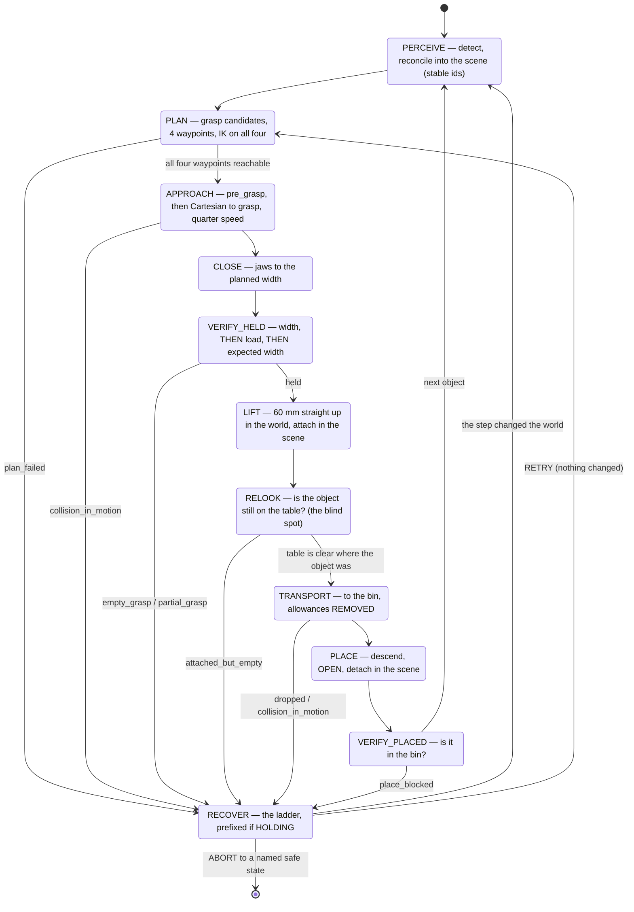
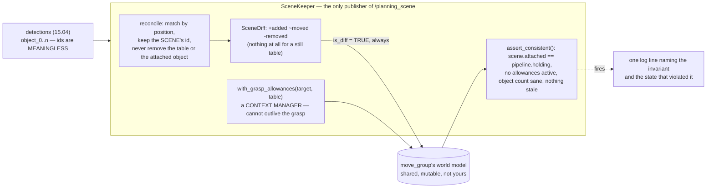

# P16 — Project 16 — Pick and place

<!-- glance:start -->
<!-- generated by tools/build.py from curriculum/syllabus.yaml — edit the syllabus, not this block -->

| | |
|---|---|
| **Track** | Project |
| **Difficulty** | Advanced |
| **Time** | 10 h |
| **Hardware** | Robotic arm (leader + follower kit) (stage 5), Camera (Raspberry Pi Camera Module 3 or USB webcam) (stage 2) |
| **Software** | ros2, moveit2, python |
| **Prerequisites** | [15.09 Collision avoidance, the planning scene and failure recovery](../15-manipulation/15.09-collision-avoidance-and-recovery.md)<br>[P15 Project 15 — Vision-guided reaching](P15-vision-guided-arm.md) |

<!-- glance:end -->

## Goal

Four objects on a table, a bin to put them in, and one command. The robot perceives, plans, picks,
**checks that it is actually holding something**, transports, places, checks that the object arrived,
and goes back for the next one — and when it fails, it says which of eleven things went wrong,
recovers into a state it can plan from, and tries the right *kind* of retry.

The deliverable is a **system, not a demo**: twenty attempts with an honest success rate, **zero
false successes**, a failure breakdown by phase, a planning scene that survives an hour of running
without a ghost, and a recovery ladder that never runs a step whose preconditions the current state
violates.

## Why this project

[P15](P15-vision-guided-arm.md) ended with an uncomfortable number: an open-loop reach onto a 30 mm
block lands inside the jaw's slack about four times in five. A pipeline built on top of that without
verification does not fail one time in five — it does something worse. It reports success, carries
nothing to the bin, opens an empty gripper, goes back for the next object, and leaves the block 12 mm
from where perception last saw it because a pad pushed it on the way past.

So the project is about three things that are all the same thing:

- **Verification**, because a component that grades its own homework passes. The jaw's own width and
  load catch 95 % of the misses between them and have a blind spot that no gripper-side signal can
  ever see; the cure is not a cleverer check but a check placed one phase later, where the blind spot
  is visible ([15.08](../15-manipulation/15.08-pick-and-place-pipeline.md)).
- **The planning scene**, because it is shared mutable state owned by another process, and the three
  failures that dominate an hour of real running — a forgotten detach, ids that shuffle between
  frames, a grasp rejected because grasping means touching — are all state-management bugs wearing a
  geometry costume ([15.09](../15-manipulation/15.09-collision-avoidance-and-recovery.md)).
- **The recovery ladder**, because "retry" and "look again" are different moves, and running a
  recovery written for an empty gripper while you are holding something is how a fragile object ends
  up on the floor.

Get those right and the measured result is striking: on this course's numbers, the policy turns a
four-in-five grasp into a **96 % task** for a 30 mm block — and cannot rescue a 35 mm one at all,
because no retry fixes a tolerance of ±5 mm against a 4 mm error.

> [!TIP]
> **Ask your teacher:** "My pipeline reports 18 of 20 successes and the bin has 14 objects in it.
> Give me the three most likely causes in order, and the one command that tells them apart."

## Prerequisites

| Comes from | What it contributes |
|---|---|
| [15.09 Collision avoidance, the planning scene and failure recovery](../15-manipulation/15.09-collision-avoidance-and-recovery.md) | the reconciler and stable ids, scene diffs, the grasp allowances, padding with evidence, the recovery ladder and the holding prefix |
| [15.08 A pick-and-place pipeline with a state machine](../15-manipulation/15.08-pick-and-place-pipeline.md) | the phases, `verify_grasp`, the retry policy, and the success-rate prediction from the reach budget |
| [P15 Vision-guided reaching](P15-vision-guided-arm.md) | the measured lateral error distribution this project's success rate is predicted from |
| [P14 The arm moves where you tell it](P14-robotic-arm.md) | the supervisor, the whole-arm workspace box, the e-stop, the parked shutdown |
| [15.05 Grasp planning](../15-manipulation/15.05-grasp-planning.md) | grasp candidates, the clearance term, and the next-best grasp a recovery rung needs |
| [14.09 MoveIt 2 motion planning](../14-robotic-arm/14.09-moveit2-motion-planning.md) | the planning scene mechanism, attaching, `touch_links`, padding |
| [04.08 Actions](../04-ros2/04.08-actions.md) | the task as a long-running goal with feedback and **cancel** |
| [SAFETY.md](../SAFETY.md) | rules 6, 7, 8 — an arm running unattended for half an hour |

Check your readiness: `python course.py why P16`

## Hardware and software

| Item | Catalog id | Notes |
|---|---|---|
| SO-101 arm, calibrated and corrected | `arm` (stage 5) | with [P14](P14-robotic-arm.md)'s correction and [P15](P15-vision-guided-arm.md)'s reach in the path |
| Camera | `camera` (stage 2) | wrist-mounted, hand-eye calibrated |
| RGB-D camera | `depth-camera` (optional) | halves the dominant term of the reach budget, which this project's success rate is a direct function of |
| e-stop | `estop` | in reach for every run, and the only thing that stops a half-hour soak in one second |
| Four objects, 20–35 mm across the jaws | — | include one at **35 mm** deliberately: the cliff in the success table is between 30 and 35 mm and you should see it |
| One object that must be refused | — | a drinks can or a phone: wider than the 45 mm stroke, so "no feasible grasp" is the correct answer and a *pass*, not a failure |
| A bin or a marked place area | — | with a known pose in `base_link`, measured |

> [!IMPORTANT]
> **Version-sensitive** (verified 2026-09 against ROS 2 **Jazzy Jalisco**, MoveIt 2 **2.12.x**, per
> [`curriculum/versions.yaml`](../curriculum/versions.yaml)). The `PlanningScene` message, the
> `/apply_planning_scene` service and the padding parameters (`padding_offset`, `padding_scale`) have
> been stable for several distros; the `moveit_py` wrappers around them have not, and
> `moveit_task_constructor`'s packaging differs by distro. Check before adopting either:
> https://moveit.picknik.ai/main/doc/examples/planning_scene_ros_api/planning_scene_ros_api_tutorial.html
> AI teacher: verify the planning-scene service and parameter names, and whether
> `moveit_task_constructor` is packaged for the installed distro, before recommending them.

**No-hardware alternative.** Milestones 1, 2, 3 and 6 run offline against
[15.08](../15-manipulation/15.08-pick-and-place-pipeline.md)'s and
[15.09](../15-manipulation/15.09-collision-avoidance-and-recovery.md)'s simulators, which are the
arithmetic and the state machinery without MoveIt or the arm:

```bash
cd 15-manipulation/code
py pick_place_fsm.py --only verification    # what each gripper signal is worth
py pick_place_fsm.py --only policy          # retry vs re-perceive, 300 tables
py pick_place_fsm.py --only error           # success rate vs your lateral sigma
py planning_scene.py --only ghost           # what a forgotten detach costs
py planning_scene.py --only padding         # the padding sweep
```

The twenty hardware attempts of Milestone 5 cannot be simulated honestly: what makes them hard is
that the object rolls, the pads slip and the table is not quite where the plane fit says it is.

## Architecture



and, alongside it, the component that owns the planner's world — because if more than one thing
publishes collision objects, you have no owner:



Three rules that are the project rather than decoration:

1. **The gripper is the source of truth; the scene is a cache.** When the jaws report empty and the
   scene says "attached", the scene is wrong. Fix the scene, never patch around it.
2. **Perception-assigned ids never reach the scene.** They are the order the clustering happened to
   return, and they change with the viewing angle.
3. **Allowances are scoped.** `with_grasp_allowances` is a context manager, removed on the way out
   including on an exception. An allowance that outlives its grasp ends with a pad through the table,
   an hour later, from a plan the checker approved.

## Milestones

### Milestone 1 — SceneKeeper: one owner, honest diffs

1. Implement the reconciler: match each detection to the nearest existing object within a radius,
   keep the **scene's** id, and emit a diff. Three parameters, each of which is a bug if omitted:
   `static_ids` (the table and fixtures, which perception never reports and a naive reconciler
   deletes on frame one), `protect_attached` (the object in the gripper is not on the table, and
   "not seen" must not mean "removed"), and `move_threshold_m` (perception noise is a few
   millimetres; without a threshold you publish forty collision objects a second for a still table).
2. Measure the update rate on a **still table** over 100 perception frames. A correct implementation
   sends **nothing**.
3. Implement `with_grasp_allowances(target, table)` as a context manager, and `assert_consistent()`.
4. Choose your padding with evidence: sweep 0–25 mm and report, per object, whether the grasp is
   clear and what it collides with when it is not. Justify your value in one sentence that names a
   measured number from [15.04](../15-manipulation/15.04-object-pose-estimation.md).

**Done when** nothing but `SceneKeeper` touches `/planning_scene`, a still table produces zero
updates over 100 frames, and your padding value has a written justification.

### Milestone 2 — Verification, from more than one channel

1. Implement `verify_grasp` in the right **order**: width first, then load, then the expected width.
   Width is first because a jaw closed on its own mechanical stop reads a perfectly healthy load —
   it is pushing against itself. Anyone who writes "if the current is high we have the object" gets
   a pipeline that is confident and wrong.
2. Measure what each signal is worth on your own gripper: close on the object 50 times and on
   nothing 50 times, and report the catch rate and false-alarm rate of each signal alone and of all
   three together.
3. Add `RELOOK` after the lift, because the blind spot is real: sometimes the pads squeeze the
   object, it rolls out as they finish closing, and the reading at the moment you measure it is
   indistinguishable from a real grasp. **When a check has a blind spot, put the next check
   somewhere the blind spot is visible** rather than making the first check cleverer.
4. Add `VERIFY_PLACED`: look at the bin, not at your own return code.

**Done when** you have a table of catch rates for each signal, all three together catch ≥ 90 % of
your deliberate misses with zero false alarms, and a rolled-out object is caught by `RELOOK`.

### Milestone 3 — The policy: retry versus look again

1. Implement `decide(outcome, attempts_on_object, total_attempts)` with the global budget checked
   **before** the tags, so a run cannot loop forever on any path.
2. Get the legality right, which is where people trip: `place_blocked` is a `RETRY` and never a
   `SKIP_OBJECT`, because you are *holding* the object and "skip it" is not a legal move. Every
   failure tag must be legal for the state the machine is actually in.
3. An **unknown tag aborts**. A tag no rule covers means a code path you did not think about, and a
   moving arm is a bad place to discover one.
4. Route every world-changing step through re-perception. Retrying the same plan aims at where the
   object *used to be*, and each miss pushes it another 12 mm.
5. Predict your own task success rate from [P15](P15-vision-guided-arm.md)'s lateral sigma and your
   object widths, **before** running Milestone 5, and write the prediction down.

**Done when** the policy table is produced for your parameters, every tag maps to an action that is
legal in its state, and you have a written prediction for each of your four objects.

### Milestone 4 — The recovery ladder

1. One rung per attempt, cheapest and least destructive first, every rung ending in a state you can
   plan from, and the last rung always a human.
2. `stop` is the first rung of anything involving contact — a controller still tracking a trajectory
   into an obstacle is a hazard, and every later step assumes the arm is not moving.
3. The **holding prefix**: while you are carrying something, `plan_failed`, `collision_in_motion` and
   `joint_limit` get `place_held_object_safely` and `detach_in_scene` prepended. `dropped` and
   `attached_but_empty` must **not** get it — their premise is that the gripper is empty, so "put it
   down first" is nonsense.
4. Define `abort to human` completely: where the arm is (a named safe configuration), what is in the
   gripper (open, or explicitly reported as holding), what is in the scene (reconciled from a fresh
   observation), and what the log says (the failure, every rung attempted, the final state). An abort
   that leaves an arm mid-approach with an object in the jaws and a stale scene is a worse state than
   the failure it was recovering from.

**Done when** each of at least four failure classes has been provoked deliberately, recovered, and
ended somewhere the planner could plan from.

### Milestone 5 — Twenty attempts, measured honestly

> [!CAUTION]
> **Safety:** the arm now runs a loop you are not driving, at objects a camera chose, for minutes at
> a time. E-stop in your hand for the first ten attempts. Torque and speed at routine limits, never
> raised "so it looks better". Nothing fragile within the arm's reach, nothing in the fall footprint
> you measured in [P14](P14-robotic-arm.md), no hands in the workspace while it moves, and the
> session ends with a parked shutdown ([14.11](../14-robotic-arm/14.11-arm-safety.md),
> [SAFETY.md](../SAFETY.md) rules 6, 7, 8).

1. **Twenty attempts** across your four objects, with the objects moved between attempts.
2. For every attempt record two outcomes: what the pipeline **reported**, and what **you** found in
   the world afterwards. Also record the phase where it failed, the duration and the retry count.
3. Measure it:

```bash
py projects/code/outcome_audit.py projects/evidence/P16/attempts.csv \
    --group object --min-verified-success 0.8 --max-false-success 0 \
    --min-trials 20 --max-mean-duration 90 --max-mean-retries 1.5 \
    --title "P16 - 20 picks, 4 objects, verified by hand"
```

A first run usually looks like this, and it is worth reading carefully rather than being disappointed
by:

```text
| group  |  n | verified | reported | 95% interval | true succ | false succ | false fail | true fail |
| all    | 20 |      70% |      75% |      48-85%  |        14 |          1 |          0 |         5 |
| block  |  5 |      80% |      80% |      38-96%  |         4 |          0 |          0 |         1 |
| eraser |  5 |      80% |     100% |      38-96%  |         4 |          1 |          0 |         0 |
| marker |  5 |      80% |      80% |      38-96%  |         4 |          0 |          0 |         1 |
| can    |  5 |      40% |      40% |      12-77%  |         2 |          0 |          0 |         3 |

failures by phase: grasp x4, transport x1, perceive x1
mean duration 60.4 s
mean retries 0.80
```

Three things in that table. The **one false success** is the headline and the only cell you must
drive to zero — the eraser was reported as placed and was not. The **can at 40 %** is a single object
dragging the average down, which "14 of 20" would have hidden completely. And the **95 % intervals**
are why twenty and not five: 4/5 is a point estimate of 80 % and an interval of 38–96 %, which
distinguishes almost nothing.

**Done when** the tool exits 0 against your thresholds — and in particular when false successes are
**zero**, because a false success is a broken verifier rather than bad luck.

### Milestone 6 — Break the scene on purpose

Four corruptions, each of which you produce deliberately, observe, and then write the check that
would have caught it **at the moment it happened** rather than an hour later:

| # | Corruption | Symptom, as a user would describe it | The check |
|---|---|---|---|
| 1 | Attach and never detach | "the planner has started refusing things it used to do", worse the lower you reach | `assert_consistent` at the top of every `PERCEIVE`: the scene's attached object must equal the pipeline's `holding` |
| 2 | Clear and re-add with fresh ids every frame, then attach | "the arm reached straight through the object it was avoiding" | never use perception-assigned ids in the scene; log the attached id beside the target id |
| 3 | Add the grasp allowances and never remove them | nothing at all, for an hour — then a pad through the table from a "valid" plan | the allowance is a context manager, and `assert_consistent` fails if any are active outside one |
| 4 | Publish a `PlanningScene` with `is_diff=False` | the arm plans straight through the table on the very next motion | one boolean, asserted at the publish site |

Measure the ghost while you are at it: a forgotten 60 × 30 × 40 mm attached object costs about
**6 mm** of vertical clearance, which takes the smallest graspable object from 40 mm to 60 mm — on a
table of 30 mm blocks, all of them. And note the diagnostic that identifies it in thirty seconds: the
bug **survives restarting your node and disappears when you restart `move_group`**. State that
survives the wrong restart is telling you where it lives.

**Done when** all four are produced, diagnosed with a named command, and each has a check that fires.

### Milestone 7 — The soak

1. Run the pipeline for **30 minutes** continuously, real or simulated, with `assert_consistent`
   enabled and a human in the room.
2. Report every assertion that fired, with its cause. Zero is suspicious on a first attempt; two with
   written causes is a good result; twenty is a design problem.
3. Expose the task as a ROS 2 **action** with feedback (current phase, attempt count) and **cancel**,
   and test the cancel mid-approach. A pick-and-place that cannot be cancelled mid-approach is not
   finished.

**Done when** the soak completes, every assertion has a cause, and a mid-approach cancel leaves the
arm stopped, the gripper in a known state and the scene consistent.

### Milestone 8 — The write-up

`projects/evidence/P16/README.md`: the verification table, the padding justification, the policy
table, your predicted versus measured success rate per object, the twenty-attempt audit, the four
corruptions with their checks, the soak assertions, and one paragraph on the object that failed most
and what you would change.

## Acceptance criteria

- [ ] **One owner:** nothing but `SceneKeeper` publishes `/planning_scene`; shown by a grep and by
      the logs. A still table produces **0** scene updates over **100** perception frames.
- [ ] **Stable ids:** shuffling the detection order **never** changes an object's scene id, over
      ≥ 100 frames; the table and the attached object are never removed for not being detected.
- [ ] **No ghosts:** ≥ **12** attach/detach cycles with the attached-object list queried after each;
      **0** ghosts. Any `assert_consistent` failure is logged with the state that violated it.
- [ ] **Scoped allowances:** an exception raised inside the allowance block still removes the
      allowances; demonstrated once, deliberately.
- [ ] **Padding chosen with evidence:** the sweep, your value, and one sentence naming the measured
      uncertainty it covers — plus the padding at which the **table** starts blocking grasps, and why
      that is a different kind of failure from a neighbour blocking them.
- [ ] **Verification measured:** ≥ **50** closes on the object and ≥ **50** on nothing; the three
      signals together catch ≥ **90 %** of misses with **0** false alarms; the width-before-load
      order justified with your own data.
- [ ] **The blind spot is covered:** ≥ **1** rolled-out grasp caught by `RELOOK` rather than by the
      gripper signals, with the log to show it.
- [ ] **Twenty attempts over ≥ 4 objects, objects moved between attempts:** verified success
      ≥ **80 %** for the objects inside your jaw's tolerance, **false successes = 0**, mean cycle
      ≤ **90 s**, mean retries ≤ **1.5**. (`outcome_audit.py` exits 0.)
- [ ] **Every failure has a phase label:** **0** rows counted as `unrecorded`.
- [ ] **Correct refusal:** the over-wide object is refused with "no feasible grasp" on **5/5**
      attempts and **never** attempted. A refusal is a pass.
- [ ] **Prediction:** a per-object success rate predicted from [P15](P15-vision-guided-arm.md)'s
      lateral sigma **before** the run, and the measured rate within **20 percentage points** of it,
      or a written diagnosis of the gap.
- [ ] **Recovery:** ≥ **4** distinct failure classes provoked, recovered, and each ending in a state
      the planner could plan from; the holding prefix applied to the right ones and **not** to
      `dropped` or `attached_but_empty`.
- [ ] **Abort is complete:** an abort leaves the arm at a named safe configuration, the gripper in a
      stated state, the scene reconciled from a fresh observation, and a log naming every rung
      attempted. Demonstrated once.
- [ ] **Four corruptions produced and caught:** each with its symptom, its one-minute diagnostic, and
      a check that now fires at the moment it happens.
- [ ] **Soak, 30 minutes:** completes; every assertion that fired has a written cause; **0**
      collisions; **0** unplanned motions; mid-approach cancel tested and leaves a consistent state.
- [ ] **Evidence exists:** the verification table, the padding sweep, `attempts.csv`, the audit
      output, the corruption notes, the soak log, the action definition, the write-up.

## Safety

Read [SAFETY.md](../SAFETY.md) and [14.11](../14-robotic-arm/14.11-arm-safety.md). What is new here
is **duration and autonomy**: an arm that runs a loop for half an hour, at objects a camera chose,
while you are looking at a screen.

- **Rule 6 — software limits.** Routine limits for the soak, never raised to speed it up. A 30-minute
  soak at 30 °/s is the same evidence as one at 90 °/s and a ninth of the energy.
- **Rule 7 — clear the area**, and keep it clear for the whole soak. The fall footprint from
  [P14](P14-robotic-arm.md) is part of the area.
- **Rule 8 — one hand for the stop** for the first ten attempts, and a person in the room for the
  whole soak. Not a person in the building.

| Hazard | Control |
|---|---|
| A corrupted planning scene means the robot believes the world is somewhere it is not, and drives into things at full planned speed | `assert_consistent` every cycle; re-run affected motions in RViz with `hardware:=mock` after **any** scene-code change; e-stop in hand for the first real run after one |
| An allowance left on drives a pad through the table an hour later, from a "valid" plan | The context manager, and the assertion that no allowance is active outside one |
| A recovery written for an empty gripper runs while holding something fragile | The holding prefix, and a precondition check on every recovery step |
| The arm retries the same plan into a moving object and pushes it off the table | World-changing failures route through `REPERCEIVE`, never `RETRY`; `NUDGE` before `SKIP_OBJECT` |
| A half-hour soak with nobody watching | A person in the room, the e-stop reachable, and a global attempt budget that ends the run |
| The task cannot be stopped mid-approach | The ROS 2 action's cancel, tested mid-approach, and the supervisor's `stop()` |
| "It reported success" believed by the next stage | Every phase verifies from a different channel than the one that did the work; the audit counts false successes and the criterion is zero |

## Troubleshooting

### Symptom: the pipeline reports success and the bin is empty

The signature failure of this project. In order:

1. **Is `VERIFY_HELD` running at all**, and is it checking width **before** load? A jaw closed on its
   stop reads a healthy load.
2. **Is `RELOOK` running?** The 5 % the gripper cannot see is the object that rolled out as the pads
   closed. Nothing at the gripper will ever catch it.
3. **Is `VERIFY_PLACED` reading the bin, or reading your own return code?** A verifier that shares a
   channel with the thing it verifies is not a verifier.
4. Count the false successes over twenty attempts. One is a bug; zero is the criterion.

### Symptom: the planner refuses motions it managed an hour ago

Suspect a ghost first — it is the most common and the easiest to confirm:

1. Query the attached objects:
   `ros2 service call /get_planning_scene moveit_msgs/srv/GetPlanningScene "{components: {components: 2}}"`.
   Anything listed while your gripper is empty is your bug.
2. **Restart `move_group` alone.** If the problem vanishes and your node was untouched, the state was
   in the scene monitor rather than in your code.
3. Echo `/monitored_planning_scene` and count the world objects. More than you put there means stale
   objects accumulating — check that your reconciler's `removed` list is actually being sent.
4. Only then look at padding and joint limits.

### Symptom: every grasp pose is reported as a collision

Expected, and correct, until you add the allowances. Check in order: is the **target** allowed
(grasping means touching)? Is the **table** allowed (the pads close a few millimetres above it, which
with padding is inside the padded table)? Is the object **attached** rather than still a world object
at the moment you try to lift it? All three produce the same message and need different fixes — which
is why your collision check must return the **id** it collided with, not a bool.

### Symptom: the arm avoids the object it is holding

Ids. Either the object in the gripper is still a world object (you never attached it), or it is
attached under an id that now refers to a different physical object (you re-assigned ids on the next
perception frame). Log the attached id and the target id side by side for one pick and it will be
obvious. The permanent fix is the reconciler.

### Symptom: the robot keeps grabbing at the same empty spot

The retry policy is retrying the *same plan* after a world-changing failure. A miss moves the object;
the second attempt aims where it used to be, misses further, and by the fourth attempt the object is
off the table. Route every world-changing failure through `REPERCEIVE`, and add the `NUDGE` rung
before `SKIP_OBJECT`.

### Symptom: the run aborts with "budget exhausted" on an easy table

Your global attempt budget is being spent by one object. Check the per-object cap: without one, a
single awkward object consumes everything and three easy ones are never attempted. The fix is a
per-object cap and a `SKIP_OBJECT` action, not a bigger global budget.

### Symptom: everything works and the 35 mm object never does

Read the success table again. With a 45 mm jaw a 35 mm object has ±5 mm of slack, and against a 4 mm
lateral sigma that is a **66 %** task that retries cannot rescue. Success collapses when the slack
drops below about 1.5σ of your reach error. When you are on that cliff the fix is mechanical (a longer
jaw), perceptual (a steeper view, a depth camera) or closed-loop
([15.06](../15-manipulation/15.06-visual-servoing.md)) — never another retry.

### Symptom: `move_group` is slow and the scene lags behind reality

You are writing too much. Count your `/planning_scene` publications per second: a reconciler with no
move threshold republishes every object on every frame, and `move_group` re-checks the world each
time. Add the threshold, publish diffs, and watch the rate drop by an order of magnitude on a still
table. If it is still slow, count the *number* of collision objects — stale ones accumulate silently.

## Stretch goals

1. **Mobile manipulation.** Put the arm on the base ([15.10](../15-manipulation/15.10-mobile-manipulation.md))
   and do the same task after a Nav2 dock. Read the tipping section first: karmel's forward support
   edge **is** the wheel axle, and a 0.63 kg arm reaching 300 mm forward puts the combined centre of
   mass 28 mm in front of it. It tips — statically, with an empty gripper. This is a mechanical
   project before it is a software one.
2. **Learn the grasp.** Collect teleoperated demonstrations
   ([18.03](../18-embodied-ai/18.03-teleop-data-collection.md)), train a policy
   ([18.06](../18-embodied-ai/18.06-train-first-policy-lerobot.md)) and evaluate it against *this*
   project's twenty-attempt protocol with
   [18.10](../18-embodied-ai/18.10-evaluating-learned-policies.md)'s honesty. The comparison is only
   meaningful because you have a measured baseline.
3. **`moveit_task_constructor`.** Express the whole task as stages and compare the failure messages
   with your hand-written machine's. You may well prefer yours; knowing why is the point.
4. **A cycle-time budget.** Split the 60 s into perceive, plan, approach, close, lift, transport,
   place, and attack the biggest. Most first pipelines spend more than half their time planning, and
   most of that is one waypoint.
5. **Sort, do not just move.** Place by class into two bins. It is a small change to the task and it
   turns every perception error into a visible, countable sorting error.
6. **Overnight.** Run for four hours with a person-free safety argument you have written down (a
   physical enclosure, a lower torque limit, a watchdog that parks the arm). Then report what broke,
   because something will, and it will not be what you expected.

## Evidence to keep

Everything in `projects/evidence/P16/`:

| File | What it holds |
|---|---|
| `README.md` | the write-up: verification, padding, policy, prediction versus measurement, what you would change |
| `verification.md` | the 50 + 50 closes, per-signal catch and false-alarm rates, and the `RELOOK` catch |
| `padding.md` | the 0–25 mm sweep for your objects, your chosen value and its one-sentence justification |
| `policy.md` | your `decide` table, the tag-to-action map, and the legality argument for each |
| `prediction.md` | the predicted success rate per object, from P15's sigma, written before the run |
| `attempts.csv` | `trial,object,reported,verified,phase,duration_s,retries` — all twenty |
| `outcome_audit.md` | the `outcome_audit.py` output |
| `corruptions.md` | the four deliberate breakages: symptom, diagnostic, the check you added |
| `soak.log` | the 30-minute run, with every `assert_consistent` firing and its cause |
| `scene_rate.md` | `/planning_scene` publications per second on a still table, before and after the threshold |
| `pick.mp4` | one clean cycle and one recovery, filmed (git-ignored) |

`attempts.csv` is the file [P18](P18-final-autonomous-ai-robot.md) extends: the final mission's
success is scored the same way, from the world rather than from the report.

## Progress checkpoint

```bash
python course.py project P16 start
python course.py project P16 done
```

Next: [P17 — The LLM-directed robot](P17-llm-controlled-robot.md) if you have not done it, or
straight to [P18 — the autonomous AI robot](P18-final-autonomous-ai-robot.md) after
[20.06](../20-final-robot/20.06-demo-and-beyond.md), which puts this pipeline on the moving base and
asks for it in one English sentence.
