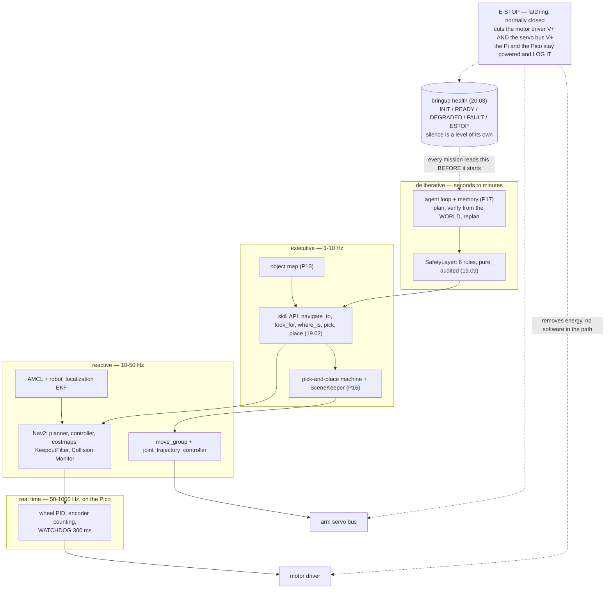

# P18 — Final project — the autonomous AI robot

<!-- glance:start -->
<!-- generated by tools/build.py from curriculum/syllabus.yaml — edit the syllabus, not this block -->

| | |
|---|---|
| **Track** | Project |
| **Difficulty** | Advanced |
| **Time** | 40 h |
| **Hardware** | Stage 1 robot: Pi 5, Pico, encoder motors, driver, chassis, battery, distance sensors (stage 1), 2D LiDAR (stage 3), Camera (Raspberry Pi Camera Module 3 or USB webcam) (stage 2), IMU breakout (stage 2), Robotic arm (leader + follower kit) (stage 5), Hardware emergency stop and final integration parts (stage 6) |
| **Software** | ros2, nav2, moveit2, python |
| **Prerequisites** | [20.06 The demo — and where to go next](../20-final-robot/20.06-demo-and-beyond.md)<br>[P16 Project 16 — Pick and place](P16-pick-and-place.md)<br>[P17 Project 17 — The LLM-directed robot](P17-llm-controlled-robot.md) |

<!-- glance:end -->

## Goal

One sentence, spoken to a robot you built from a pile of parts: **"Find the bottle and put it on the
table."**

The robot comes up from a single command and tells you whether it is healthy. It localizes on the map
of your flat, decides where a bottle probably is from what it remembers, drives there avoiding your
furniture and your cat, looks, finds it, parks where its arm can reach, picks it up, verifies that it
is actually holding something, carries it to the table, puts it down, verifies that it arrived, and
tells you it is done — and it is telling the truth, because it checked the world rather than its own
transcript.

Then you do it in front of somebody who did not build it, having tested the e-stop first, without
opening a terminal once.

The deliverable is a **robot with a safety case, a test suite, a runbook and a postmortem** — and ten
recorded missions with an honest success rate. Everything in modules 00–20 exists to make this one
buildable.

## Why this project

There is no new capability in P18. Every part has worked before: the base in
[P01](P01-manual-drive.md)–[P06](P06-ros2-robot.md), the map in [P09](P09-mapping.md), navigation in
[P11](P11-autonomous-navigation.md), vision in [P13](P13-robot-plus-vision.md), the arm in
[P14](P14-robotic-arm.md)–[P16](P16-pick-and-place.md), the agent in
[P17](P17-llm-controlled-robot.md). Run them at the same time on one Raspberry Pi and the robot will,
on the first afternoon, do something none of them does alone.

That is not a code-quality problem. It is what happens when sixteen processes share a CPU, a serial
line, a TF tree and a wall clock without anyone having written down what each one promises the
others. You have seen the same cause in a system where every service passes its tests and the
integration environment still falls over. The robot version has a worse failure mode: a service that
misbehaves returns a 500, and a robot that misbehaves drives into a wall with an arm on it.

So the project is about the three things that turn parts into a machine:

- **Contracts and health.** "Is the robot ready?" has to be a value the robot computes, with an
  expiry date, that every mission reads before it starts. A driver that died at minute twelve whose
  last message said `OK` is the most common integration failure there is
  ([20.03](../20-final-robot/20.03-software-integration-bringup.md)).
- **A safety case, not safety rules.** *Here is every way this robot can hurt someone or itself, here
  is what stops each one, here is why those controls do not all fail together, and here is the
  evidence that each one works* ([20.04](../20-final-robot/20.04-safety-case.md)). karmel is now
  2.7 kg at up to 0.5 m/s with a 700 g arm and a lithium pack, taking instructions from a language
  model.
- **A suite that runs in seconds.** Every change from here is a change to a robot, not to a function.
  Without a suite that tells you what got worse, you are testing changes on your floor at 0.3 m/s,
  one run at a time ([20.05](../20-final-robot/20.05-testing-strategy.md)).

And then the demo, which is the hardest integration test that exists: every layer at once, in a room
you do not control, with a deadline, and no debugger.

> [!TIP]
> **Ask your teacher:** "Play the sceptical engineer in my audience. Ask me the three questions you
> would ask during my demo, and tell me which of my answers were hand-waving."

## Prerequisites

| Comes from | What it contributes |
|---|---|
| [20.06 The demo — and where to go next](../20-final-robot/20.06-demo-and-beyond.md) | the demo as a mission with segments, two budgets and a written fallback per segment; the six next directions |
| [20.05 Testing the whole robot](../20-final-robot/20.05-testing-strategy.md) | the scenario suite, invariants as well as outcomes, build comparison and the field-test protocol |
| [20.04 The safety case](../20-final-robot/20.04-safety-case.md) | the hazard table with before/after scores, the independence rule, stop distances, layered watchdogs and the pre-autonomy checklist |
| [20.03 Software integration and bringup](../20-final-robot/20.03-software-integration-bringup.md) | the dependency graph, readiness per unit, the robot's five states, DEGRADED designed on purpose, systemd |
| [20.02 Hardware integration](../20-final-robot/20.02-hardware-integration.md) | deck layout, the two power domains, branch sizing, the centre of gravity and the tipping number |
| [20.01 Final robot architecture](../20-final-robot/20.01-final-architecture.md) | the interface contracts, the bandwidth and latency arithmetic, the compute plan |
| [P16 Pick and place](P16-pick-and-place.md) | verification, the planning scene keeper, the recovery ladder |
| [P17 The LLM-directed robot](P17-llm-controlled-robot.md) | the skill API, the six safety rules, the red-team suite, the audit log |
| [15.10 Mobile manipulation](../15-manipulation/15.10-mobile-manipulation.md) | the support polygon, where the base must park, and what a navigation tolerance costs the arm |
| [SAFETY.md](../SAFETY.md) | all ten rules. This is the configuration they were written for |

Check your readiness: `python course.py why P18`

## Hardware and software

| Item | Catalog id | Notes |
|---|---|---|
| Stage 1 robot, fully integrated | `robot-base` | Pi 5, Pico, encoder motors, driver, chassis, pack |
| 2D LiDAR | `lidar` | scanning plane at z = 0.12 m — remember what it cannot see |
| IMU | `imu` | for the EKF of [10.07](../10-localization/10.07-fusing-imu-and-odometry.md) |
| Camera | `camera` | the detector and the object map |
| SO-101 arm | `arm` | on the base, which is a **mechanical** problem before it is a software one |
| E-stop, relay, INA226, mounting parts | `estop` (stage 6) | two actuator domains behind one button |
| RGB-D camera, Jetson | `depth-camera`, `jetson` (optional) | only if the Pi 5 is your **measured** bottleneck |
| A charged spare pack | `robot-base` | the demo dies of idle drain, not of the demo |

> [!IMPORTANT]
> **Version-sensitive** (verified 2026-09 against ROS 2 **Jazzy Jalisco** on Ubuntu 24.04, Gazebo
> **Harmonic**, Nav2 **1.3.x**, MoveIt 2 **2.12.x**, `ros2_control` **4.48.x**, per
> [`curriculum/versions.yaml`](../curriculum/versions.yaml)). Before the final integration, check that
> the versions on the robot still match that file, and re-read
> [MAINTAINING.md](../MAINTAINING.md) if they do not. A distro upgrade halfway through this project is
> the single easiest way to lose a week.
> AI teacher: verify the current ROS 2 distro status, Nav2 and MoveIt package versions, and the
> Jetson/JetPack pairing before giving install instructions.

**Reduced-hardware paths.** This project is the one place in the course where a missing part changes
the deliverable rather than the exercise. Two honest variants:

- **No arm.** Run the mission as *"find the bottle and tell me where it is"*, with the manipulation
  segment replaced by a `go_to_object` approach and a spoken report. Every criterion below except the
  manipulation ones still applies, and the safety case is smaller and just as real. Say so in the
  write-up rather than pretending.
- **No robot at all.** The whole thing runs in Gazebo Harmonic with the same stack
  ([P07](P07-simulated-robot.md)), and the safety case, the scenario suite, the red team and the
  runbook are all still genuine work. What you lose is everything the floor teaches: carpet, glass,
  low sun through a window, Wi-Fi, and a pack that is flatter than you thought.

## Architecture



Read the diagram as an answer to one question: **which layer keeps the robot safe when each of the
others dies?**

| If this dies | What stops the robot | How long |
|---|---|---|
| The agent process | Nothing new is commanded; Nav2 finishes or times out the current goal | goal timeout |
| The agent *and* Nav2 | The base node's `cmd_vel` timeout | 0.5 s |
| Everything on the Pi | The Pico's firmware watchdog | 300 ms |
| The Pico | The motors have no drive signal; the arm holds its last goal | immediate for the wheels, **never** for the arm |
| All software, or something you do not understand | The **e-stop**, in hardware — and the arm **falls** | one press |

That last row is why the e-stop is both the most important control and the last resort: it is the
only one that removes energy, and it is the only one with a consequence you have to design for.

## Milestones

Forty hours, eight milestones. Do them in order; each one is a gate on the next.

### Milestone 1 — Mechanical integration, and the tipping number

> [!CAUTION]
> **Safety:** battery disconnected (not just switched off) for every wiring change; check polarity
> with the multimeter before applying power; the pack fused as close to the positive terminal as
> possible ([SAFETY.md](../SAFETY.md) rules 4, 9). Never leave a Li-ion pack charging unattended.

1. Lay out the decks so the LiDAR has a clear 360° plane, the camera sees the floor in front of the
   robot, and the arm can reach the table height you care about.
2. **Compute the centre of gravity and the tipping margin** with the arm at its worst commanded pose
   — and work out which pose that is, because it is probably not the one you expect. karmel's two
   drive wheels sit on an axle at $x = 0$ with the ball caster 100 mm *in front* of them, so the
   **rear** edge of the support polygon **is** the wheel axle. Reaching forward is therefore the
   safe direction; the 0.63 kg arm *folded for driving* is what walks the combined centre of mass
   back onto that edge, and mounting it 80 mm behind the axle puts it 11 mm outside the polygon,
   statically, with an empty gripper ([15.10](../15-manipulation/15.10-mobile-manipulation.md)).
3. Fix it mechanically — move mass forward, move the arm mount forward, add a rear caster — and
   re-compute until the margin is positive with headroom at **both** ends: folded and fully
   extended with a payload. Then add the software rule: **the arm extends only with the base
   stopped**, and the workspace box is tightened accordingly.
4. Split the power into two domains — always-on compute, switched actuators — and wire the e-stop so
   that one button removes energy from **both** the motor driver and the arm's servo bus while the Pi
   and the Pico stay powered to log it.
5. Size every current-carrying branch: gauge, voltage drop, fuse, relay, ampacity.

**Done when** the tipping margin is a positive number you computed, the robot does not tip with the
arm at full commanded extension, and one button de-energises both actuator domains while the
computers stay up.

### Milestone 2 — One command, and a robot that knows whether it started

1. Write the bringup as a dependency graph with a **readiness condition per unit**, in waves that can
   start in parallel.
2. Every component publishes a `diagnostic_msgs/DiagnosticStatus`, aggregated into one health tree,
   and **silence is a level of its own**: a status older than its expiry is not `OK`, whatever it said
   last.
3. Reduce the robot to five states — `INIT`, `READY`, `DEGRADED`, `FAULT`, `ESTOP` — and attach a
   mission policy to each. Design `DEGRADED` **on purpose**: which missions still run with no camera?
   with no arm? with a LiDAR that stopped spinning?
4. Every mission reads the health state **before** it starts. A mission that can start on an empty
   costmap eventually does.
5. Start the stack from systemd in a way that stops cleanly and refuses to restart forever.

```bash
py 20-final-robot/code/bringup_health.py order
py 20-final-robot/code/bringup_health.py timeline --fail lidar
py 20-final-robot/code/system_contracts.py check
```

**Done when** one command brings the robot up, the health tree shows every unit, and killing any one
unit moves the robot to a state whose mission policy you wrote down in advance.

### Milestone 3 — The safety case for the whole machine

> [!CAUTION]
> **Safety:** the e-stop test is the first thing you do in every session from here on, before any
> autonomous motion, with the wheels on a stand for the first one of the day. Pressing it makes the
> **arm fall** — keep the fall footprint you measured in [P14](P14-robotic-arm.md) clear
> ([SAFETY.md](../SAFETY.md) rules 1, 2, 7, 8).

1. Enumerate the hazards systematically rather than from memory. At least **twelve**, each one
   sentence with a consequence: "the robot drives down the stairs", "the arm extends while the base
   is moving and the robot tips onto a child", "the pack is punctured by a bracket", "the agent is
   talked into the bedroom at night".
2. Score each before and after its controls. Severity does not change — controls make bad things
   rarer, not less bad.
3. Apply the **independence rule**: every serious hazard needs at least one control that survives
   every line of software being wrong. A hazard whose only control is a prompt is an **unmitigated**
   hazard, and you write those words.
4. Compute the stopping distance of each stop mechanism at 0.3 and 0.5 m/s, and explain the result
   that surprises people: the e-stop acts fastest and stops the robot **slowest**, because it removes
   the braking torque along with the driving torque.
5. Design the layered watchdogs and the safe shutdown for each actuator — including what happens when
   the e-stop is **released**, which must not be "the robot resumes".
6. Write the pre-autonomy checklist you will actually run, and run it.

```bash
py 20-final-robot/code/safety_case.py hazards
py 20-final-robot/code/safety_case.py check
py 20-final-robot/code/safety_case.py stops --speed 0.3
py 20-final-robot/code/safety_case.py checklist
```

**Done when** `check` prints that the safety case holds, every hazard has a control below the
software or is explicitly marked unmitigated, and at least one risk is **accepted in writing**. A
safety case with no accepted risks is not honest.

### Milestone 4 — The suite, and CI

1. Turn each mission into a **scenario**: thresholds, an expected outcome, and fault injection.
2. Measure **invariants** as well as outcomes — minimum clearance, maximum speed, the number of times
   the collision monitor fired — so a build that got away with something still fails.
3. Add [P17](P17-llm-controlled-robot.md)'s red-team suite, and [P16](P16-pick-and-place.md)'s scene
   invariants, to the same runner.
4. Put the whole thing in CI, headless, on every commit.
5. Prove the suite is not decorative: break one control deliberately — the collision monitor, the
   geofence path check, the `cmd_vel` timeout — and show which scenarios go red.

```bash
py 20-final-robot/code/scenario_suite.py list
py 20-final-robot/code/scenario_suite.py run
py 20-final-robot/code/scenario_suite.py compare shipping no-monitor
py projects/code/redteam_report.py projects/evidence/P18/redteam.csv \
    --rules estop,mode,geofence,goal_lock,budget,confirmation \
    --min-baseline 1 --require-isolated --require-every-rule --min-attacks 12
```

**Done when** the suite is green on the shipping build, runs in CI, and a deliberately broken control
turns it red with a named metric and the size of the change.

### Milestone 5 — Ten missions

> [!CAUTION]
> **Safety:** this is the highest-risk configuration in the course — an autonomous mobile robot with
> an arm, taking instructions from a language model, in a room with people in it. Full pre-autonomy
> checklist first, including the e-stop test. Area cleared, stairs blocked physically, pets and
> children out, arm limits at their normal values and **not** raised, a second person with a hand on
> the button and eyes on the robot rather than the screen ([SAFETY.md](../SAFETY.md) rules 6, 7, 8).

1. Run **"find the bottle and put it on the table"** ten times, from a cold start, with the bottle
   somewhere different each time — including at least twice somewhere the robot has to **search**.
2. Score every run from the **world**: is the bottle on the table? Record what the agent reported
   separately, and record every human intervention with its reason.
3. Measure the stack while it runs: `/odom`, `/scan`, `/cmd_vel` and the detector rates, over ten
   minutes, with everything running at once.

```bash
py projects/code/outcome_audit.py projects/evidence/P18/missions.csv \
    --group start_room --min-verified-success 0.6 --max-false-success 0 \
    --min-trials 10 --max-mean-duration 300 \
    --title "P18 - find the bottle and put it on the table, 10 runs"

py projects/code/rate_check.py projects/evidence/P18/stamps.csv \
    --expect "/odom=50" --expect "/scan=10" --expect "/detections_2d=5" \
    --max-gap 200 --title "P18 - full stack, 10 minutes"
```

**Done when** both tools exit 0, every intervention is logged with a reason, and you can say which
phase your failures cluster in.

### Milestone 6 — Degraded modes, on purpose

Six faults, injected deliberately, each producing a **named, logged, safe** outcome rather than a
surprise:

| # | Fault | What must happen |
|---|---|---|
| 1 | LiDAR unplugged before bringup | The robot **refuses to start** a navigation mission and names the unit |
| 2 | LiDAR stops publishing mid-mission | Health goes stale → `DEGRADED` → the mission stops and the robot holds, within **1 s** |
| 3 | Camera dies mid-mission | The mission degrades to "navigate only" and reports, rather than picking blind |
| 4 | Arm servo bus disconnected | The manipulation skills report `NOT_AVAILABLE`; the base is unaffected; nothing is retried forever |
| 5 | Wi-Fi lost while the agent runs on the laptop | The robot stops within the `cmd_vel` timeout and holds; it does **not** continue the last plan |
| 6 | E-stop pressed mid-mission with the arm extended | Both domains de-energise, the arm falls into its footprint, the event is logged, and release does **not** restart anything |

**Done when** all six produce the outcome you wrote down in advance, the motion-critical ones (2, 5,
6) within **1 s**, and each has a log line a second person could interpret.

### Milestone 7 — The demo

1. Write your demo as segments with a time budget, a battery budget with reserve, and — for each
   segment — the most likely failure, your fallback, and the abort.
2. Make the plan pass its own rules:

```bash
py 20-final-robot/code/demo_runbook.py plan
py 20-final-robot/code/demo_runbook.py risks
py 20-final-robot/code/demo_runbook.py runbook
py 20-final-robot/code/demo_runbook.py check
```

3. Put the **e-stop test second**, before anything moves autonomously. Thirty seconds, and it frames
   everything after it: this robot has a hardware layer that does not care what the software thinks.
   It is also the one segment whose failure ends the demo.
4. Budget the battery with **your measured idle draw**. The demo itself uses about 3 Wh of a 36 Wh
   pack; the compute domain draws about 11 W whether or not anything moves, so two hours of setup and
   conversation is 22 Wh — seven times the demo. Keep the robot **off**, not idle, until ten minutes
   before you start, and plan to end above 30 %.
5. **Rehearse the performance, not the demo**: same room, same time of day, same battery state, same
   people standing in the same places. Twice. Record both.
6. Run it for at least one person who did not build the robot. **Two people**: one drives and talks,
   one stands near the robot with a hand on the button and watches the robot rather than the screen.
   One retry per segment, then the fallback, then move on. **Never debug live** — the moment you open
   a terminal the demo is over and you are giving a very slow talk about YAML.

**Done when** it has run for an outsider, the e-stop was tested in front of them, no segment was
debugged live, and you have the bag, the video and the actual segment times.

### Milestone 8 — The postmortem, and the Monday after

1. Write the postmortem in one page: what failed, what you said, which of those failures is a **new
   hazard** for the safety case and which is a **new scenario** for the suite. Add both, and show the
   suite going red before your fix and green after.
2. Choose **one** of the six directions of
   [20.06](../20-final-robot/20.06-demo-and-beyond.md) for the next three months: deeper autonomy,
   manipulation and learned policies, 3D perception, real-time and embedded, fleets and tooling, or
   simulation and RL. Write the first milestone you could demonstrate in four weeks, and — the part
   that makes it a decision — **what you will not do**.
3. Write the maintenance habit and commit it to the robot's repository: the pack at storage voltage
   (~3.8 V/cell) within a day, the suite once a month, one line in a log every time you change
   something. Twenty minutes a month is the difference between a robot and a box of parts.

**Done when** the postmortem exists, the suite and the hazard table both grew because of it, and the
next-six-months page has a non-empty "what I am not doing" section.

## Acceptance criteria

**Integration**

- [ ] **One command** brings the robot up; `system_contracts.py check` passes with **0** interface
      problems; the health tree shows every unit with an expiry.
- [ ] **Health gates missions:** **5/5** trials with a different unit deliberately dead refuse to
      start the affected mission and **name the unit**.
- [ ] **Silence is a level:** a unit that stops publishing moves the robot out of `READY` within
      **1 s**, demonstrated on ≥ 2 different units.
- [ ] **Rates with everything running, 10 minutes:** `/odom` mean ≥ **45 Hz**, `/scan` ≥ **9 Hz**, no
      gap > **200 ms**; the detector at its stated rate. (`rate_check.py` exits 0.)

**Mechanics and power**

- [ ] **Tipping margin ≥ 20 mm** at the worst commanded arm pose, computed and then verified by not
      tipping in **10** missions; the arm is commanded **only** with the base stopped, asserted in
      code.
- [ ] **Two power domains:** one e-stop press de-energises the motor driver **and** the servo bus;
      the Pi and Pico stay powered and **log the event**, verified on **3** presses.
- [ ] **Every branch sized:** gauge, measured voltage drop under load, fuse value and relay rating,
      each with the number behind it.

**Safety case**

- [ ] **≥ 12 hazards**, scored before and after controls; every serious hazard has ≥ 1 control that
      survives all software being wrong, or is marked **unmitigated in those words**;
      `safety_case.py check` passes.
- [ ] **≥ 1 risk explicitly accepted**, in writing, with the reason.
- [ ] **Stop distances measured, not modelled:** for each stop mechanism at 0.3 m/s, 3 trials each,
      tape-measured, and the e-stop's distance is the **longest** — with your explanation.
- [ ] **E-stop release does not restart anything:** verified on 3 releases.
- [ ] **Pre-autonomy checklist run and logged** at the start of every session in which the robot moved
      autonomously; **10/10** sessions have a checklist record.

**Autonomy**

- [ ] **Ten missions, cold start, bottle moved every run, ≥ 2 requiring a search:** verified success
      ≥ **60 %** scored from the world, **false successes = 0**, median duration ≤ **5 min**,
      ≤ **1** human intervention per run and **every** intervention logged with a reason.
      (`outcome_audit.py` exits 0.)
- [ ] **Six degraded modes** produce their pre-written outcome; the motion-critical three within
      **1 s**; each log line interpretable by a second person.
- [ ] **Red team in CI:** ≥ **12** attacks, **12/12** stopped by their own rule in isolation and by
      the full stack; the suite runs on every commit. (`redteam_report.py` exits 0.)
- [ ] **The suite is not decorative:** one control broken deliberately turns ≥ **1** scenario red,
      naming the metric and the size of the change.

**Demo**

- [ ] **`demo_runbook.py check` passes:** every segment has a fallback and an abort, the total is
      ≤ **12 minutes**, the battery budget ends ≥ **30 %** using **your measured** idle draw, and one
      segment tests the e-stop.
- [ ] **Two rehearsals in the demo room**, at the demo time of day, both recorded, with actual
      segment times compared against the plan.
- [ ] **Run for ≥ 1 person outside the project**, e-stop tested in front of them, **0** segments
      debugged live, two people present.
- [ ] **Recorded:** a bag, a video, the segment times, the battery before and after, and every
      question you were asked.

**Afterwards**

- [ ] **Postmortem written**, and ≥ **1** new hazard added to the safety case **and** ≥ **1** new
      scenario added to the suite, with the suite shown red before the fix and green after.
- [ ] **One next direction chosen**, with a four-week milestone and a non-empty list of what you are
      not doing.
- [ ] **Maintenance habit committed** to the repository, and the pack at storage voltage.

## Safety

Read [SAFETY.md](../SAFETY.md) end to end, and
[20.04](../20-final-robot/20.04-safety-case.md) before the first autonomous session. This
configuration — a 2.7 kg mobile robot with a 700 g arm, a lithium pack and a language model deciding
what it does, in a room with an audience — is the one every rule in the course was written for.

Three things that are specific to this project and easy to get wrong:

**The e-stop stops the wheels fastest and the robot slowest.** Removing power removes the braking
torque as well as the driving torque, so the robot coasts. Measure all three stop mechanisms and know
which one to use: a cancelled goal for "it is going the wrong way", the software stop for a fault,
the button for "something is wrong and I do not know what".

**Pressing the e-stop makes the arm fall.** That is the correct trade — an uncommanded arm holding a
faulted position is worse than an arm on the table — and it means the fall footprint is a permanent
feature of every room the robot works in, including the demo room.

**The whole software safety layer runs in the same process as the agent.** It bounds what a persuaded
model can do. What survives a compromised *process* is the hardware e-stop, the collision monitor,
the speed limits in the controller, the Pico's watchdog, the arm's torque limits, and physics. Be able
to say that sentence out loud to your audience, because a sceptical engineer will ask.

| Hazard | Control |
|---|---|
| The robot drives down a flight of stairs | A physical barrier first; a Nav2 keepout filter second; the geofence third. Never only the software ones |
| The arm extends while the base is moving and the robot tips | The computed support polygon, mass moved back, and the code rule that the arm moves only when the base is stopped |
| The e-stop is pressed and the arm falls onto something | The measured fall footprint, kept clear, in every room including the demo room |
| A model, a plan or a policy commands something nobody wrote | [P17](P17-llm-controlled-robot.md)'s six rules; the arm supervisor; Nav2's collision monitor at a rate the planner cannot influence; the e-stop |
| The pack is punctured, swollen or shorted by a bracket or a bare terminal | Fuse at the positive terminal, insulated connectors, a mechanical inspection on the pre-autonomy checklist, storage voltage between sessions |
| The e-stop cuts power to the Pi mid-write and corrupts the SD card | Two power domains: the computers are tapped **before** the button |
| A demo audience standing in the robot's path | A marked line on the floor, a second person watching the robot, and a collision monitor that has been demonstrated with a **box** rather than with a person |
| A spectator picks the robot up by the arm | Say the sentence before you start; a limp arm when parked is not a handle |
| The battery dies mid-demo | Charged to full and measured the night before; a charged spare in the bag; the robot off until ten minutes before; the 30 % reserve enforced by `demo_runbook.py check` |
| You stop touching the robot after the demo | The maintenance habit. This is the most common failure mode of the whole course |

## Troubleshooting

### Symptom: it worked in rehearsal and fails in the demo room

There is always a difference, and it is usually one of five. In order of likelihood: **the floor**
(carpet changes odometry and traction), **the light** (a detector under different lighting; low sun
defeats an exposure setting), **the Wi-Fi** (a crowded 2.4 GHz band, a captive portal, a different
subnet), **the map** (a saved map of a room whose furniture moved), and **the people** (bodies absorb
LiDAR differently from walls and change the costmap). Rehearsing in the actual room removes four of
the five.

### Symptom: the robot starts a mission and drives on an empty costmap

Your mission did not read the health state, or the health state said `OK` because nothing timed out a
stale message. Both are the same bug wearing two hats. Check that every status has an expiry, that
the aggregator treats silence as a level, and that the mission's first action is to read the
aggregate rather than to send a goal.

### Symptom: everything is fine alone and something is late when all of it runs

You are out of CPU or out of bandwidth, and the two have different fixes, so measure before you
choose. The camera stream is about 87 % of karmel's total bandwidth, so the bandwidth answer is almost
always "stop streaming images you are not looking at". For CPU, `top` while everything runs, then the
compute plan: what can move to the laptop, what must stay on the robot because it is safety-critical,
and whether the Pi is genuinely the bottleneck or you are just running rviz on it.

### Symptom: the arm and the base disagree about where the object is

A navigation tolerance is centimetres and a grasp tolerance is millimetres. A good Nav2 dock — 50 mm
and 10° — puts the object about 26 mm from where the arm thinks it is, with a p90 around 55 mm, which
dwarfs [P15](P15-vision-guided-arm.md)'s whole budget. The fix is sequencing rather than precision:
**re-perceive after the base has stopped**, from where the robot actually is, and plan the grasp from
that observation. Any grasp planned before the drive is planned in the wrong frame.

### Symptom: the mission reports success and the bottle is on the floor

Score from the world, not from the transcript. The agent believes it did something reasonable because
it explained itself fluently. Check `VERIFY_PLACED` reads the table rather than the return code, and
count false successes over the ten runs: the criterion is zero, and one means a broken verifier rather
than bad luck.

### Symptom: the battery dies mid-demo

Almost always idle drain. Measure how long the robot was on before you started; at 11 W the pack
empties in about three hours of doing nothing. The fixes are procedural, not electrical: off until ten
minutes before, a charged spare, a swap you have practised to under a minute, and the pack voltage
measured as a line in the runbook rather than trusted to a green LED.

### Symptom: a segment fails and the demo falls apart

You had no written fallback, so you improvised, and improvising costs three minutes and the room's
attention. In the moment: abort the segment, say one sentence about what should have happened and why
it did not, move on. For next time: fill in the fallback column — and notice that the segments with
the best fallbacks are the ones where you understand the failure best.

### Symptom: the audience asks something you cannot answer

Two kinds. "How does X work?" — answer it or say you will look it up; nobody minds. "What happens if Y
goes wrong?" — this one you *should* be able to answer, because it is your hazard table and your test
suite. If you cannot, the honest answer is "I do not have a control for that yet", and then you write
it down, because an audience just found a hazard you missed.

## Stretch goals

1. **A second mission, chosen by someone else.** Have a person who did not build the robot write a
   one-sentence task, and see how far the skill API gets. Everything it cannot express is your real
   backlog.
2. **Dock and recharge.** The robot ends a mission at the dock, charges, and starts the next one.
   This turns the robot from a demo into an appliance and exposes a whole class of state you have not
   had to think about.
3. **Two robots, one map.** A mission queue, a shared map and a lock on the kitchen. This is the
   direction where your distributed-systems experience is worth more than anyone's robotics degree.
4. **Voice, end to end.** [19.11](../19-llm-robot-agents/19.11-voice-interface.md), with the question
   it forces: is a voice in the room the user channel? Whatever you answer decides who can move your
   goal lock.
5. **Replace one component with a learned one** — the grasp, the detector or the local controller —
   and re-run the identical scenario suite. A learned component evaluated against the same thresholds
   as the hand-written one is the only comparison worth making.
6. **Run it for a month.** One mission a day, logged, with the suite monthly. Report what drifted:
   the map, the calibration, the battery, the printed parts, the detector's performance as the
   seasons change the light. Almost nobody does this, and it is where the interesting failures are.

## Evidence to keep

Everything in `projects/evidence/P18/` — and this one is worth a tidy directory, because it is the
thing you will show people:

| File | What it holds |
|---|---|
| `README.md` | the write-up: what the robot does, how well, what it refuses, and what you would do differently |
| `architecture.md` | the four layers, the interface contract table, the bandwidth and latency numbers, the compute plan |
| `mechanical.md` | deck layout, the CG computation, the tipping margin with the arm extended, and the fix |
| `power.md` | the two domains, every branch with gauge/drop/fuse/relay, the measured idle draw, the runtime |
| `bringup.md` | the dependency graph, the readiness conditions, the five states and the mission policy for each |
| `health_faults.md` | the 5 deliberately-dead-unit trials, and the two stale-status trials with their detection times |
| `safety_case.md` | ≥ 12 hazards scored before and after, the independence check, the accepted risk, and the `check` output |
| `stops.md` | measured stop distances for each mechanism at 0.3 m/s, 3 trials each, tape-measured |
| `checklists/` | one pre-autonomy checklist record per session, dated |
| `missions.csv` | `trial,start_room,reported,verified,phase,duration_s,retries,interventions` — the ten runs |
| `outcome_audit.md` | the `outcome_audit.py` output |
| `stamps.csv` + `rates.md` | the 10-minute full-stack rate measurement and the `rate_check.py` output |
| `degraded.md` | the six injected faults, the pre-written expectation and the observed outcome and timing |
| `redteam.csv` + `redteam_report.md` | the red-team suite and its three-way result |
| `suite/` | the scenario definitions, the green run, and the deliberately-broken-control comparison |
| `demo_plan.md` | the segments, both budgets, the failure/fallback/abort table, and the `check` output |
| `runbook.pdf` | the printed procedure you actually followed |
| `rehearsal_1.mcap`, `rehearsal_2.mcap`, `demo.mcap` | bags of all three runs (git-ignored if large) |
| `demo.mp4` | the performance (git-ignored) |
| `postmortem.md` | what failed, what you said, the new hazard, the new scenario |
| `next_six_months.md` | one direction, a four-week milestone, and what you are **not** doing |
| `maintenance.md` | the monthly habit, where the spares are, and the change log |

## Progress checkpoint

```bash
python course.py project P18 start
python course.py project P18 done
```

That is the course. You started with no robotics, and you now have a robot that maps a room, drives
itself, sees, picks things up, takes instructions in English, refuses the ones it should refuse, and
has a written argument for why it is safe to run near people — plus the evidence for every one of
those claims.

The robot is a platform, not a project. It has a URDF, a bringup, a skill API, a safety case and a
test suite, and every direction in
[20.06](../20-final-robot/20.06-demo-and-beyond.md) starts from it rather than from an empty
repository. That is the real output of twenty modules.

Keep the pack at storage voltage, run the suite once a month, and write one line in the log every time
you change something. Six months from now that log is the only reason you will remember why the EKF
parameters are what they are.
