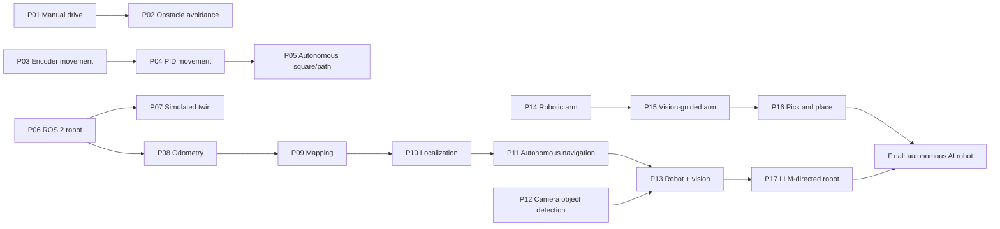

# Projects

Lessons teach one thing at a time. Projects prove you can combine them into a working robot
capability — they are how the course distinguishes **"I read this"** from **"I can actually do
this."** Each project has acceptance criteria you can measure, and evidence you keep (plots,
bags, videos, maps) so you can show yourself — or anyone — that it works.



| Project | Proves you can… | Unlocked after |
|---|---|---|
| [P01 Manual drive](P01-manual-drive.md) | build, power and remotely drive a robot safely | 01.15 |
| [P02 Obstacle avoidance](P02-obstacle-avoidance.md) | close a loop between a sensor and the motors | 01.13, P01 |
| [P03 Encoder-based movement](P03-encoder-movement.md) | move exact distances and angles | 01.12 |
| [P04 PID-controlled movement](P04-pid-movement.md) | tune feedback control from logged data | 08.10, P03 |
| [P05 Autonomous square/path](P05-autonomous-square-path.md) | combine control, odometry and IMU for accurate paths | 08.11, 09.04, P04 |
| [P06 ROS 2 robot](P06-ros2-robot.md) | turn the robot into a well-structured ROS 2 system | 04.16 |
| [P07 Simulated twin](P07-simulated-robot.md) | run the same stack in Gazebo and on hardware | 06.09, P06 |
| [P08 Odometry](P08-odometry.md) | produce calibrated, quantified odometry | 09.07, P06 |
| [P09 Mapping](P09-mapping.md) | map a real home with LiDAR SLAM | 11.07, P08 |
| [P10 Localization](P10-localization.md) | localize reliably on a saved map with fused sensors | 10.09, 10.07, P09 |
| [P11 Autonomous navigation](P11-autonomous-navigation.md) | "go to the kitchen" safely | 12.10, P10 |
| [P12 Camera object detection](P12-camera-object-detection.md) | run and evaluate detection on robot hardware | 13.15 |
| [P13 Robot + vision](P13-robot-plus-vision.md) | find objects and place them on the map | 13.16, P11, P12 |
| [P14 Robotic arm](P14-robotic-arm.md) | command an arm to Cartesian goals safely | 14.10, 14.11 |
| [P15 Vision-guided arm](P15-vision-guided-arm.md) | reach toward objects the camera found | 15.07, P14 |
| [P16 Pick and place](P16-pick-and-place.md) | pick and place with failure detection | 15.09, P15 |
| [P17 LLM-directed robot](P17-llm-controlled-robot.md) | let an LLM direct the robot through safe skills | 19.09, P13 |
| [Final project](P18-final-autonomous-ai-robot.md) | "Find the bottle and put it on the table." | 20.06, P16, P17 |

Track projects with:

```bash
python course.py project P04 start
python course.py project P04 done
```

## Project file template (for authors)

Every project file uses these `##` sections in this order (checked by `tools/validate.py`):

```markdown
# P04 — Project 4 — PID-controlled movement

<!-- glance:start -->
<!-- glance:end -->

## Goal
One paragraph: the capability, stated as an observable behavior.

## Why this project
What it proves, how it feeds the final robot.

## Prerequisites
Lessons and projects (link them) + the skills each contributes.

## Hardware and software
Exact catalog items (HARDWARE.md ids) and software; simulation alternative if any.

## Architecture
A diagram (Mermaid) of the components/nodes/data flow you will build, with interfaces.

## Milestones
### Milestone 1 — …
Numbered, incremental, each independently testable, each with "done when…".

## Acceptance criteria
A checklist of measurable criteria (numbers and tolerances, number of trials).

## Safety
Project-specific hazards and required controls (link SAFETY.md).

## Troubleshooting
Symptom → systematic diagnosis for the problems this integration typically hits.

## Stretch goals
Harder variants.

## Evidence to keep
Plots, bags, maps, videos, config files, a short write-up — and where to store them
(`projects/evidence/P04/` is git-ignored except for small files).

## Progress checkpoint
`python course.py project P04 done` and what to do next.
```
