# Paper progression: from classical robotics to embodied AI

> [!IMPORTANT]
> **Version-sensitive** (verified 2026-09-16). Every URL was checked on that date: arXiv IDs against
> the arXiv API, DOIs against Crossref, and project pages over HTTP. Evidence:
> [`research/papers-raw-2026-09.md`](research/papers-raw-2026-09.md) and
> [`research/embodied-ai-landscape-2026-09.md`](research/embodied-ai-landscape-2026-09.md).
> Tracks 1–4 barely change. Tracks 5–8 go stale within months: new model versions, new licenses,
> new weights. AI teacher: before recommending a model or repo from Tracks 5–8, check its current
> repo, license and docs.

This is a reading path, not a bibliography. It holds 52 core papers in 8 tracks, in the order
listed. Each entry says what to read, what to skip and which lesson to finish first. Everything
else is in [Optional extras](#optional-extras), one line each.

You never have to read a paper to finish the main path. Read one when a lesson made you curious,
when you are about to use the algorithm on the robot, or when a tool's parameters make no sense
until you see the idea behind them.

## Contents

- [How to read a paper as an engineer](#how-to-read-a-paper-as-an-engineer)
- [Maturity labels](#maturity-labels)
- [The progression at a glance](#the-progression-at-a-glance)
- [Track 1 — Probabilistic state estimation](#track-1--probabilistic-state-estimation)
- [Track 2 — SLAM](#track-2--slam)
- [Track 3 — Planning and navigation](#track-3--planning-and-navigation)
- [Track 4 — Manipulation and kinematics](#track-4--manipulation-and-kinematics)
- [Track 5 — Vision for robots](#track-5--vision-for-robots)
- [Track 6 — Reinforcement learning](#track-6--reinforcement-learning)
- [Track 7 — Imitation learning and vision-language-action models](#track-7--imitation-learning-and-vision-language-action-models)
- [Track 8 — LLM agents for robots](#track-8--llm-agents-for-robots)
- [Optional extras](#optional-extras)

---

## How to read a paper as an engineer

A paper is a design document that also had to get past reviewers. Its job is to convince people,
so the part you need (the mechanism, the numbers, the failure cases) is spread across sections
written for other purposes. Read it in three passes and stop as soon as you have what you came for.
This is S. Keshav's three-pass method, adapted for engineers who build things.

### Pass 1 — Triage (10 minutes)

Read the title, abstract, introduction and conclusion. Look at every figure and the headings.
Then answer five questions:

1. What problem does it solve, and for which robot, sensors and compute?
2. What is the one new idea? It is usually in the last paragraph of the introduction ("our
   contributions are…").
3. What does it build on? Do you know those things? If not, find the prerequisite lesson below.
4. How was it evaluated: in simulation or on real hardware, how many trials, compared against what?
5. Is there code, and under what license? When was it last updated?

Most papers stop here. That is fine.

### Pass 2 — Understand the mechanism (about an hour)

- Study the **method figure and the algorithm box** until you could explain them on a whiteboard.
  They usually carry more than the prose around them.
- Read the method section. When you hit an equation, work out what each symbol *is* (a pose? a
  covariance? a batch of images?) before you worry about how it is derived.
- In the experiments, read the **setup** (data size, compute, hardware, number of trials) and the
  **main results table**. Then read the **ablations**. They show which parts of the design matter.
- Write down in 3–5 sentences what you would need to build to reproduce the main result.

### Pass 3 — Rebuild it (hours; only for what you will use)

Rebuild the smallest version from memory: a 1D Kalman filter, a 20-node pose graph, A* on a
50×50 grid, an ACT model on 50 demos. Then compare your version with the authors' code. Your
mistakes will show you what you had not understood. Keep pass 3 for papers behind algorithms that
run on your robot.

### What to skip

| Skip on the first read | Why |
|---|---|
| Related work | A map of the field for reviewers. Come back to it when you need the next paper to read. |
| Proofs and convergence theorems | Read the theorem *statements*. The proofs rarely change what you build. |
| Long benchmark tables | Read the main table and the ablations. The rest shows that the method is state of the art on the day it was written. |
| Hyperparameter appendices | Useful only when you reproduce the paper, and then the code is the better source. |
| Author lists and acknowledgements | Some foundation-model papers devote a full page to the author list. |

### Engineer's red flags

- **Only simulation results**, or real-robot results with fewer than about 10 trials per condition.
- **Compute is missing** or vague ("trained on a cluster"). Robot runtime latency is missing.
- **No code**, a stale repo, or a license that does not fit your use (non-commercial, AGPL, a key
  you must request).
- **Numbers taken from a demo video** instead of a table.

> [!TIP]
> **Ask your teacher:** "I did pass 1 on this paper. Here are my answers to the five triage
> questions. What did I miss, and is it worth a pass 2 for my robot?"

> [!TIP]
> **Ask your teacher:** "Walk me through the method figure of this paper box by box, and give me
> the shape of the tensor or matrix on every arrow."

---

## Maturity labels

Labels follow [`research/embodied-ai-landscape-2026-09.md`](research/embodied-ai-landscape-2026-09.md)
(dated 2026-09). They describe the **method or software as used today**, not the quality of the paper.

| Label | Meaning |
|---|---|
| **MATURE** | Stable and widely used in production, or a standard baseline. Docs and releases are dependable. |
| **USABLE-BY-HOBBYIST** | With one consumer GPU (24 GB), Colab or a rented GPU, and a low-cost arm or base, you can get real results. |
| **RESEARCH** | Important ideas, but expect big compute, closed weights, sparse docs or APIs that break. Read the paper, and do not plan the robot around it. |

Classical algorithms in Tracks 1–3 (Kalman filters, A*, DWA) are MATURE and ship in ROS 2 packages.

---

## The progression at a glance

Arrows mean "read this first". Dashed arrows are the important links between tracks.

```mermaid
flowchart TD
  subgraph T1["1 · State estimation"]
    KF["1.1 Kalman / EKF tutorial"] --> UKF["1.2 Unscented filter"]
    KF --> MCL["1.3 Monte Carlo localization"] --> KLD["1.4 KLD-sampling (AMCL)"]
  end
  subgraph T2["2 · SLAM"]
    SLAMT["2.1 SLAM tutorial I+II"] --> GSLAM["2.2 Graph-based SLAM"]
    GSLAM --> STB["2.3 SLAM Toolbox"]
    GSLAM --> ORB["2.4 ORB-SLAM / ORB-SLAM3"]
    STB --> CAD["2.5 SLAM survey (Cadena)"]
    ORB --> CAD
  end
  subgraph T3["3 · Planning & navigation"]
    ASTAR["3.1 A*"] --> SMAC["3.6 Smac planners"]
    RRT["3.2 RRT"]
    DWA["3.3 Dynamic window"] --> MPPI["3.4 MPPI"]
    BT["3.7 Behavior trees"] --> NAV2["3.5 Nav2 (Marathon 2)"]
    MPPI --> NAV2
    SMAC --> NAV2
  end
  subgraph T4["4 · Manipulation"]
    MOVEIT["4.1 MoveIt"]
    GRASP["4.2 Grasp synthesis survey"] --> DEX["4.3 Dex-Net 2.0"] --> CGN["4.4 Contact-GraspNet"]
  end
  subgraph T5["5 · Vision"]
    YOLO["5.1 YOLO"]
    VIT["5.2 ViT"] --> DETR["5.3 DETR"]
    VIT --> CLIP["5.4 CLIP"] --> GDINO["5.5 Grounding DINO"]
    DETR --> GDINO
    VIT --> SAM["5.6 SAM / SAM 2 / SAM 3"]
    VIT --> DINO["5.7 DINOv2"] --> DAV2["5.8 Depth Anything V2"]
  end
  subgraph T6["6 · Reinforcement learning"]
    DQN["6.1 DQN"] --> PPO["6.2 PPO"] --> SAC["6.3 SAC"]
    DR["6.4 Domain randomization"] --> LEG["6.5 Walk in minutes"]
    PPO --> LEG
    SAC --> HIL["6.6 HIL-SERL"]
  end
  subgraph T7["7 · Imitation learning & VLAs"]
    DAG["7.1 DAgger"] --> ACT["7.2 ACT"] --> DP["7.3 Diffusion Policy"] --> LER["7.4 LeRobot"]
    RT2["7.5 RT-2"] --> OVLA["7.6 OpenVLA / OFT"] --> PI0["7.7 pi0 / FAST"]
    DP --> PI0
    PI0 --> SMOL["7.8 SmolVLA"]
    PI0 --> PI05["7.9 pi0.5"] --> GR00T["7.10 GR00T N1"] --> GEM["7.11 Gemini Robotics"]
  end
  subgraph T8["8 · LLM agents"]
    SAY["8.1 SayCan"] --> CAP["8.2 Code as Policies"] --> CHAT["8.3 ChatGPT for Robotics"]
    CHAT --> IM["8.4 Inner Monologue"] --> PAIR["8.5 RoboPAIR (attacks)"] --> GUARD["8.6 RoboGuard"]
    GUARD --> ROSA["8.7 ROSA"]
  end
  KLD --> SLAMT
  CAD --> ASTAR
  RRT --> MOVEIT
  NAV2 --> MOVEIT
  CGN --> YOLO
  DAV2 --> DQN
  HIL --> DAG
  GEM --> SAY
  UKF -.-> SLAMT
  DETR -.-> ACT
  CLIP -.-> RT2
  DINO -.-> OVLA
  DR -.-> GR00T
  DAG -.-> HIL
  BT -.-> SAY
  GDINO -.-> CAP
  LER -.-> SMOL
```

**Order in one line:** Track 1 → 2 → 3 → 4 → 5 → 6 → 7 → 8. This is the order in which the course
modules use the ideas (10 → 11 → 12 → 14/15 → 13 → 17 → 18 → 19). Tracks 1–3 are classical and
permanent. Tracks 5–8 are modern and dated. If you only have time for ten papers: 1.1, 1.3, 2.2, 3.1,
3.5, 5.4, 7.2, 7.3, 7.7, 8.5.

---

## Track 1 — Probabilistic state estimation

This track explains every "where am I?" node on the robot: `robot_localization` (EKF/UKF), AMCL,
and the SLAM back ends in Track 2. Textbook companion: *Probabilistic Robotics* (Thrun, Burgard,
Fox). See [resources.md](resources.md#7-sensors-state-estimation-and-slam).

### 1.1 An Introduction to the Kalman Filter (TR 95-041)

**G. Welch, G. Bishop** · 1995, revised 2006 ·
https://www.cs.utexas.edu/~pstone/Courses/393Rfall15/readings/Welch+Bishop-TR-95.pdf
(a course mirror; the original UNC URL returns 404) · **MATURE**

- **Why it matters:** The standard short tutorial, about 16 pages. It covers the discrete Kalman
  filter and the Extended Kalman Filter. Every IMU and odometry fusion node descends from these
  equations.
- **Prerequisites:** [10.04 Kalman filter in 1D](../10-localization/10.04-kalman-filter-1d.md),
  [10.05 Multivariate Kalman filter](../10-localization/10.05-kalman-filter-multivariate.md),
  [FM.15 Covariance and multivariate Gaussians](../optional-foundations/mathematics/FM.15-covariance-multivariate-gaussians.md),
  [FM.07 Matrices](../optional-foundations/mathematics/FM.07-matrices.md),
  [FM.17 Derivatives](../optional-foundations/mathematics/FM.17-derivatives.md) (for Jacobians).
- **What you should understand:** The five predict/update equations. What Q (process noise) and
  R (measurement noise) do to the gain, and how to tune them by intuition. How the EKF linearizes
  with Jacobians, and why it can diverge.
- **Read:** ALL. It is short. Code the "estimating a random constant" example yourself.
- **Read after:** [10.06 Extended Kalman Filter](../10-localization/10.06-extended-kalman-filter.md).
  You can read the linear KF part after 10.05.

### 1.2 Unscented Filtering and Nonlinear Estimation

**S. J. Julier, J. K. Uhlmann** · 2004 (Proc. IEEE) · https://doi.org/10.1109/JPROC.2003.823141 · **MATURE**

- **Why it matters:** Shows exactly how the EKF fails on nonlinear models and presents the
  sigma-point (UKF) alternative. `robot_localization` ships both filters, and this paper helps
  you choose.
- **Prerequisites:** 1.1,
  [10.06 Extended Kalman Filter](../10-localization/10.06-extended-kalman-filter.md),
  [FM.15 Covariance](../optional-foundations/mathematics/FM.15-covariance-multivariate-gaussians.md).
- **What you should understand:** Why linearizing biases the mean and covariance. How the
  unscented transform propagates a handful of sigma points instead. When a UKF is worth the extra
  computation.
- **Read:** PARTIAL. Read the introduction, the discussion of EKF problems, the unscented
  transform and the UKF algorithm. Skip the extended application sections.
- **Read after:** [10.07 Fusing IMU and odometry](../10-localization/10.07-fusing-imu-and-odometry.md).

### 1.3 Monte Carlo Localization for Mobile Robots

**F. Dellaert, D. Fox, W. Burgard, S. Thrun** · 1999 (ICRA) · https://doi.org/10.1109/ROBOT.1999.772544 · **MATURE**

- **Why it matters:** Introduced particle-filter localization (MCL), the algorithm inside Nav2's
  AMCL.
- **Prerequisites:** [10.03 Bayes filter](../10-localization/10.03-bayes-filter.md),
  [10.08 Particle filters and MCL](../10-localization/10.08-particle-filter-mcl.md),
  [FM.16 Bayes' rule](../optional-foundations/mathematics/FM.16-bayes-rule.md),
  [FM.13 Probability](../optional-foundations/mathematics/FM.13-probability-basics.md).
- **What you should understand:** Belief as weighted samples. Sampling from the motion model,
  weighting with the sensor model, resampling. Why particles handle global localization and
  beliefs with several peaks, which a Kalman filter cannot.
- **Read:** ALL. It is a short conference paper.
- **Read after:** [10.08 Particle filters and MCL](../10-localization/10.08-particle-filter-mcl.md).

### 1.4 Adapting the Sample Size in Particle Filters Through KLD-Sampling

**D. Fox** · 2003 (IJRR) · https://doi.org/10.1177/0278364903022012001 · **MATURE**

- **Why it matters:** The "A" (adaptive) in AMCL. It explains the `min_particles`,
  `max_particles`, `pf_err` and `pf_z` parameters you will tune in Nav2.
- **Prerequisites:** 1.3, [10.09 AMCL in ROS 2](../10-localization/10.09-amcl-in-ros2.md),
  [FM.14 Distributions](../optional-foundations/mathematics/FM.14-distributions-gaussians-noise.md).
- **What you should understand:** Why a fixed particle count wastes compute once the robot is
  localized. The KLD bound on how many particles you need, given how many histogram bins are
  occupied. How that bound becomes AMCL's parameters.
- **Read:** PARTIAL. Read the introduction, the KLD-sampling derivation at an intuitive level,
  and the experiments. Skip the detailed proofs.
- **Read after:** [10.09 AMCL in ROS 2](../10-localization/10.09-amcl-in-ros2.md).

---

## Track 2 — SLAM

### 2.1 Simultaneous Localization and Mapping: Part I and Part II

**H. Durrant-Whyte, T. Bailey** · 2006 (IEEE Robotics & Automation Magazine) ·
Part I https://doi.org/10.1109/MRA.2006.1638022 · Part II https://doi.org/10.1109/MRA.2006.1678144

- **Why it matters:** The classic two-part tutorial. It defines the SLAM problem in probabilistic
  form and presents the EKF-SLAM and Rao-Blackwellized particle-filter solutions.
- **Prerequisites:** Track 1,
  [11.01 Map representations](../11-slam/11.01-map-representations.md),
  [11.03 The SLAM problem](../11-slam/11.03-the-slam-problem.md),
  [05.04 Homogeneous transforms](../05-frames-and-transforms/05.04-homogeneous-transforms.md).
- **What you should understand:** Why you estimate the pose and the map jointly. Why the
  correlations between landmarks matter. Why data association and loop closure are the hard
  parts. Why naive EKF-SLAM does not scale (Part II).
- **Read:** Part I ALL. Part II PARTIAL: computational complexity, data association and
  environment representation.
- **Read after:** [11.03 The SLAM problem](../11-slam/11.03-the-slam-problem.md).

### 2.2 A Tutorial on Graph-Based SLAM

**G. Grisetti, R. Kümmerle, C. Stachniss, W. Burgard** · 2010 (IEEE ITS Magazine) · https://doi.org/10.1109/MITS.2010.939925 · **MATURE**

- **Why it matters:** The modern formulation used by SLAM Toolbox, Cartographer, ORB-SLAM, g2o
  and GTSAM. A front end builds a pose graph, and a back end solves it as nonlinear least squares.
  If you read one SLAM paper, read this one.
- **Prerequisites:** 2.1,
  [11.05 Pose graphs and loop closure](../11-slam/11.05-pose-graphs-loop-closure.md),
  [FM.19 Linear systems and least squares](../optional-foundations/mathematics/FM.19-linear-systems-least-squares.md),
  [FM.20 Optimization basics](../optional-foundations/mathematics/FM.20-optimization-basics.md).
- **What you should understand:** Nodes, edges and information matrices. Error functions on
  poses (angles wrap around). Why the problem is sparse. Why a single loop closure fixes drift
  across the whole trajectory.
- **Read:** ALL. Then write a tiny 2D pose-graph optimizer (this is pass 3).
- **Read after:** [11.05 Pose graphs and loop closure](../11-slam/11.05-pose-graphs-loop-closure.md).

### 2.3 SLAM Toolbox: SLAM for the Dynamic World

**S. Macenski, I. Jambrecic** · 2021 (JOSS) · https://doi.org/10.21105/joss.02783 ·
code https://github.com/SteveMacenski/slam_toolbox · **MATURE**

- **Why it matters:** The default 2D SLAM in ROS 2 and Nav2 (Karto scan matcher plus a Ceres pose
  graph), and the SLAM you actually run in this course.
- **Prerequisites:** 2.2, [11.04 Scan matching with ICP](../11-slam/11.04-scan-matching-icp.md),
  [04.15 Lifecycle nodes](../04-ros2/04.15-lifecycle-nodes.md).
- **What you should understand:** Synchronous vs. asynchronous mapping. Serializing a map and
  continuing it later. Lifelong mapping with pose-graph pruning. Localization mode.
- **Read:** ALL (it is 2 pages), then the repo README, which is the real documentation.
- **Read after:** [11.06 slam_toolbox in simulation](../11-slam/11.06-slam-toolbox-simulation.md).

### 2.4 ORB-SLAM: A Versatile and Accurate Monocular SLAM System

**R. Mur-Artal, J. M. M. Montiel, J. D. Tardós** · 2015 (T-RO) · https://arxiv.org/abs/1502.00956 · **MATURE** (as an architecture)

- **Why it matters:** The canonical feature-based visual SLAM design: separate threads for
  tracking, local mapping and loop closing, plus ORB features, a covisibility graph and
  bag-of-words relocalization.
- **Prerequisites:** 2.2,
  [13.04 Features and matching](../13-computer-vision/13.04-features-and-matching.md),
  [13.05 Pinhole camera model](../13-computer-vision/13.05-pinhole-camera-model.md),
  [FCV.05 Stereo and epipolar geometry](../optional-foundations/computer-vision/FCV.05-stereo-epipolar.md).
- **What you should understand:** The three-thread architecture. How keyframes are selected and
  culled. How a monocular map is initialized. Why a monocular camera cannot observe scale, so the
  scale drifts.
- **Read:** PARTIAL. Read the system overview, tracking, local mapping and loop closing. Skim the
  experiments.
- **Then:** *ORB-SLAM3* (Campos et al., 2020/2021) https://arxiv.org/abs/2007.11898 · code
  https://github.com/UZ-SLAMLab/ORB_SLAM3 (GPL-3.0). It adds visual-inertial initialization and
  the Atlas multi-map system. Read the system overview and the map-merging sections.
- **Read after:** [11.08 Visual SLAM](../11-slam/11.08-visual-slam.md). Do 13.04 and 13.05 first
  if you have not.

### 2.5 Past, Present, and Future of Simultaneous Localization and Mapping

**C. Cadena, L. Carlone, H. Carrillo, Y. Latif, D. Scaramuzza, J. Neira, I. Reid, J. J. Leonard** · 2016 (T-RO) · https://arxiv.org/abs/1606.05830

- **Why it matters:** The survey that defined the field's agenda: factor graphs and MAP estimation
  as the standard formulation, robustness, metric vs. semantic maps, open problems. Read it to see
  where your robot's SLAM sits in the field.
- **Prerequisites:** 2.1–2.3.
- **What you should understand:** The anatomy of a modern SLAM system. Why robust back ends
  exist (a false loop closure can destroy the whole map). Choices of map representation. Where
  semantic SLAM and deep learning fit.
- **Read:** PARTIAL. Read the anatomy, robustness, representation and semantic mapping sections.
  Skim the rest.
- **Read after:** [11.09 SLAM troubleshooting](../11-slam/11.09-slam-troubleshooting.md).

---

## Track 3 — Planning and navigation

### 3.1 A Formal Basis for the Heuristic Determination of Minimum Cost Paths (A*)

**P. E. Hart, N. J. Nilsson, B. Raphael** · 1968 (IEEE TSSC) · https://doi.org/10.1109/TSSC.1968.300136 · **MATURE**

- **Why it matters:** A* is the backbone of Nav2's NavFn and Smac global planners. It extends
  Dijkstra's algorithm (1959, see extras) with a heuristic.
- **Prerequisites:** [12.02 Grid path planning](../12-navigation/12.02-grid-path-planning.md).
- **What you should understand:** f = g + h. Admissible vs. consistent heuristics. Why A* expands
  fewer nodes than Dijkstra and still finds the optimal path. Why tie-breaking matters on grids.
- **Read:** PARTIAL. Read the algorithm and the admissibility and optimality results. Skip the
  formal proofs on the first pass.
- **Read after:** [12.02 Grid path planning](../12-navigation/12.02-grid-path-planning.md).

### 3.2 Rapidly-Exploring Random Trees: A New Tool for Path Planning (TR 98-11)

**S. M. LaValle** · 1998 · https://msl.cs.illinois.edu/~lavalle/papers/Lav98c.pdf · **MATURE**

- **Why it matters:** Sampling-based planning in configuration spaces with many dimensions. It is
  the default family for arms in MoveIt/OMPL.
- **Prerequisites:** [12.03 Sampling-based planning](../12-navigation/12.03-sampling-based-planning.md),
  [14.01 Arm anatomy](../14-robotic-arm/14.01-arm-anatomy.md) (for why an arm's configuration
  space has 5–7 dimensions).
- **What you should understand:** The Voronoi bias that pulls the tree into unexplored space. The
  extend step. Probabilistic completeness. Why sampling beats grids once you have more than 3–4
  dimensions.
- **Read:** ALL. It is a short technical report.
- **Read after:** [12.03 Sampling-based planning](../12-navigation/12.03-sampling-based-planning.md).

### 3.3 The Dynamic Window Approach to Collision Avoidance

**D. Fox, W. Burgard, S. Thrun** · 1997 (IEEE Robotics & Automation Magazine) · https://doi.org/10.1109/100.580977 · **MATURE**

- **Why it matters:** Local planning in velocity space under acceleration limits. It is the
  ancestor of Nav2's DWB controller.
- **Prerequisites:** [09.01 Differential-drive kinematics](../09-odometry/09.01-diff-drive-kinematics.md),
  [12.04 Costmaps](../12-navigation/12.04-costmaps.md), 3.1.
- **What you should understand:** Which velocities are admissible. How acceleration limits define
  the dynamic window. The objective that trades heading, clearance and velocity. Why the robot gets
  stuck in local minima (and why a global planner is still needed).
- **Read:** ALL.
- **Read after:** [12.05 Local planning and obstacle avoidance](../12-navigation/12.05-local-planning-obstacle-avoidance.md).

### 3.4 Aggressive Driving with Model Predictive Path Integral Control (MPPI)

**G. Williams, P. Drews, B. Goldfain, J. M. Rehg, E. A. Theodorou** · 2016 (ICRA) ·
https://doi.org/10.1109/ICRA.2016.7487277 · companion: *Information Theoretic MPC for Model-Based
Reinforcement Learning* (Williams et al., 2017) https://doi.org/10.1109/ICRA.2017.7989202 · **MATURE** (as the Nav2 MPPI controller)

- **Why it matters:** MPPI is sampling-based MPC. It copes with costs that are not smooth and
  parallelizes well. Nav2's MPPI controller is the modern default local controller.
- **Prerequisites:** 3.3,
  [FCT.06 State space, LQR and MPC](../optional-foundations/control-theory/FCT.06-state-space-lqr-mpc.md),
  [FM.14 Distributions and noise](../optional-foundations/mathematics/FM.14-distributions-gaussians-noise.md).
- **What you should understand:** The loop: sample K noisy control sequences, roll each one out,
  weight them by exp(−cost/λ), average. What the temperature λ does. Why the cost does not need to
  be differentiable. This intuition is what makes Nav2's MPPI parameters readable.
- **Read:** 2016 paper ALL (the practical algorithm). 2017 paper PARTIAL: the information-theoretic
  derivation, at the level of intuition.
- **Read after:** [12.05 Local planning and obstacle avoidance](../12-navigation/12.05-local-planning-obstacle-avoidance.md).

### 3.5 The Marathon 2: A Navigation System

**S. Macenski, F. Martín, R. White, J. Ginés Clavero** · 2020 (IROS) · https://arxiv.org/abs/2003.00368 ·
code https://github.com/ros-navigation/navigation2 · docs https://docs.nav2.org/jazzy/ · **MATURE**

- **Why it matters:** The Nav2 architecture paper: a behavior-tree navigator, lifecycle-managed
  servers with planner, controller and behavior plugins, and layered costmaps. It was validated on
  long campus "marathons".
- **Prerequisites:** [04.08 Actions](../04-ros2/04.08-actions.md),
  [04.15 Lifecycle nodes](../04-ros2/04.15-lifecycle-nodes.md),
  [12.06 Nav2 architecture](../12-navigation/12.06-nav2-architecture.md), 1.3, 3.1, 3.3, 3.7.
- **What you should understand:** Why behavior trees instead of a state machine. How the system
  splits into servers and plugins. How lifecycle management brings the stack up and down. How
  recovery behaviors are orchestrated.
- **Read:** ALL.
- **Read after:** [12.06 Nav2 architecture](../12-navigation/12.06-nav2-architecture.md).

### 3.6 Open-Source, Cost-Aware Kinematically Feasible Planning for Mobile and Surface Robotics (Smac Planner)

**S. Macenski, M. Booker, J. Wallace, T. Fischer** · 2024 · https://arxiv.org/abs/2401.13078 · **MATURE**

- **Why it matters:** Describes Nav2's Smac planners: 2D A*, Hybrid-A* and State Lattice, all
  cost-aware. They replaced NavFn for car-like and legged robots.
- **Prerequisites:** 3.1, [12.04 Costmaps](../12-navigation/12.04-costmaps.md).
- **What you should understand:** How Hybrid-A* expands in continuous states. Motion primitives
  on a state lattice. Obstacle heuristics and Dubins/Reeds-Shepp heuristics. Analytic expansions
  and path smoothing.
- **Read:** PARTIAL. Read the planner descriptions and heuristics. Skim the benchmarks.
- **Read after:** [12.07 Nav2 in simulation](../12-navigation/12.07-nav2-in-simulation.md).

### 3.7 Behavior Trees in Robotics and AI: An Introduction

**M. Colledanchise, P. Ögren** · 2017/2018 (book, CRC Press; arXiv version) · https://arxiv.org/abs/1709.00084 ·
library https://github.com/BehaviorTree/BehaviorTree.CPP · **MATURE**

- **Why it matters:** The standard reference for behavior trees. BTs are the execution layer in
  Nav2, and a common target for LLM-generated plans (Track 8).
- **Prerequisites:** [19.04 State machines](../19-llm-robot-agents/19.04-state-machines.md) (or
  any experience with finite state machines),
  [12.06 Nav2 architecture](../12-navigation/12.06-nav2-architecture.md).
- **What you should understand:** Sequence, fallback, parallel and decorator nodes. What a "tick"
  does and why it makes a tree reactive. Why BTs are more modular than FSMs.
- **Read:** PARTIAL. Read the chapter on how BTs work, the design principles and the comparison
  with FSMs. Skip the formal analysis chapters.
- **Read after:** [12.06 Nav2 architecture](../12-navigation/12.06-nav2-architecture.md). Read it
  again with [19.05 Behavior trees](../19-llm-robot-agents/19.05-behavior-trees.md).

---

## Track 4 — Manipulation and kinematics

For kinematics, a textbook beats the papers. The original Denavit–Hartenberg paper (1955, in the
extras) matters for history. Learn forward kinematics, inverse kinematics and Jacobians from
*Modern Robotics* (Lynch & Park, free PDF) alongside
[14.04](../14-robotic-arm/14.04-forward-kinematics.md)–[14.06](../14-robotic-arm/14.06-jacobian.md).
See [resources.md](resources.md#1-robotics-general).

### 4.1 Reducing the Barrier to Entry of Complex Robotic Software: a MoveIt! Case Study

**D. Coleman, I. Șucan, S. Chitta, N. Correll** · 2014 (JOSER) · https://arxiv.org/abs/1404.3785 ·
MoveIt 2 docs https://moveit.picknik.ai/main/index.html · code https://github.com/moveit/moveit2 · **MATURE**

- **Why it matters:** The architecture paper for MoveIt: `move_group`, the planning scene, planners
  plugged in through OMPL, and the Setup Assistant. No dedicated MoveIt 2 paper exists. The MoveIt 2
  docs are the practical reference.
- **Prerequisites:** 3.2, [05.08 URDF and xacro](../05-frames-and-transforms/05.08-urdf-and-xacro.md),
  [14.05 Inverse kinematics](../14-robotic-arm/14.05-inverse-kinematics.md),
  [14.08 The arm in ROS 2](../14-robotic-arm/14.08-arm-urdf-and-ros2-control.md).
- **What you should understand:** The `move_group` pipeline. How the planning scene does
  collision checking. Kinematics plugins. Why the Setup Assistant mattered for adoption.
- **Read:** ALL (short). Then the MoveIt 2 "Getting Started" and motion planning pipeline tutorials.
- **Read after:** [14.09 MoveIt 2](../14-robotic-arm/14.09-moveit2-motion-planning.md).

### 4.2 Data-Driven Grasp Synthesis — A Survey

**J. Bohg, A. Morales, T. Asfour, D. Kragic** · 2013/2014 (T-RO) · https://arxiv.org/abs/1309.2660

- **Why it matters:** A taxonomy that connects analytic grasping (force closure) to learned
  grasping. It sorts objects into known, familiar and unknown, and that split tells you which
  method to use.
- **Prerequisites:** [15.01 Physics of grasping](../15-manipulation/15.01-physics-of-grasping.md),
  [15.04 Object pose estimation](../15-manipulation/15.04-object-pose-estimation.md).
- **What you should understand:** Analytic vs. data-driven grasp synthesis. How grasps are
  represented. Why unknown objects push you toward learned methods.
- **Read:** PARTIAL. Read the introduction, the analytic vs. data-driven background, and the
  section on unknown objects.
- **Read after:** [15.05 Grasp planning](../15-manipulation/15.05-grasp-planning.md).

### 4.3 Dex-Net 2.0: Deep Learning to Plan Robust Grasps with Synthetic Point Clouds and Analytic Grasp Metrics

**J. Mahler, J. Liang, S. Niyaz, …, K. Goldberg** · 2017 (RSS) · https://arxiv.org/abs/1703.09312 ·
code https://github.com/BerkeleyAutomation/dex-net · **RESEARCH** (read for the idea)

- **Why it matters:** Trains a grasp-quality CNN on millions of synthetic depth images labeled by
  analytic robustness metrics. It is the template for "label data in simulation, train a CNN" in
  grasping.
- **Prerequisites:** 4.2, [FML.08 CNNs](../optional-foundations/machine-learning/FML.08-cnns.md),
  [13.08 Depth and 3D vision](../13-computer-vision/13.08-depth-and-3d-vision.md).
- **What you should understand:** Planar parallel-jaw grasps from a depth image. What makes a
  grasp robust under uncertainty. Sampling grasps with the cross-entropy method.
- **Read:** PARTIAL. Read the problem statement, dataset generation, the GQ-CNN and the physical
  experiments.
- **Read after:** [15.05 Grasp planning](../15-manipulation/15.05-grasp-planning.md).

### 4.4 Contact-GraspNet: Efficient 6-DoF Grasp Generation in Cluttered Scenes

**M. Sundermeyer, A. Mousavian, R. Triebel, D. Fox** · 2021 (ICRA) · https://arxiv.org/abs/2103.14127 ·
code https://github.com/NVlabs/contact_graspnet · **RESEARCH** (off-the-shelf code exists)

- **Why it matters:** Anchors grasps on observed contact points, which leaves a 4-DoF grasp to
  predict per point. It is efficient, works in clutter from a single depth view, and is widely used
  as an off-the-shelf grasp proposer.
- **Prerequisites:** 4.3, [13.08 Depth and 3D vision](../13-computer-vision/13.08-depth-and-3d-vision.md),
  [13.11 Segmentation](../13-computer-vision/13.11-segmentation.md).
- **What you should understand:** How the contact-point representation reduces what the network
  must predict. Training on synthetic scenes. Combining grasps with instance masks to grasp one
  target object.
- **Read:** ALL (short).
- **Read after:** [15.05 Grasp planning](../15-manipulation/15.05-grasp-planning.md).

---

## Track 5 — Vision for robots

> [!IMPORTANT]
> **Version-sensitive** (verified 2026-09-16). The papers are stable. The recommended model versions
> and licenses are not. Check the linked repo before you build on a model.

### 5.1 You Only Look Once: Unified, Real-Time Object Detection (YOLO)

**J. Redmon, S. Divvala, R. Girshick, A. Farhadi** · 2015 (CVPR 2016) · https://arxiv.org/abs/1506.02640 ·
current practice: Ultralytics docs https://docs.ultralytics.com/ (YOLO26: https://docs.ultralytics.com/models/yolo26/) · **MATURE**

- **Why it matters:** Single-shot real-time detection is the practical detector on robots and
  Jetsons. As of 2026-09, Ultralytics recommends YOLO26 or YOLO11. Ultralytics code and models are
  **AGPL-3.0**, with an enterprise license for closed products. That is a real constraint.
- **Prerequisites:** [13.09 CNNs for robot vision](../13-computer-vision/13.09-cnns-for-robot-vision.md),
  [FCV.06 Detection metrics](../optional-foundations/computer-vision/FCV.06-detection-metrics.md),
  [FML.08 CNNs](../optional-foundations/machine-learning/FML.08-cnns.md).
- **What you should understand:** Detection as one regression over a grid. The speed/accuracy
  trade-off. From the docs: exporting to ONNX/TensorRT, and the task types (detect, segment, pose,
  track).
- **Read:** Paper PARTIAL: the unified detection section and the limitations. Docs: quickstart,
  predict, export, the Jetson guide.
- **Read after:** [13.10 Object detection models](../13-computer-vision/13.10-object-detection-models.md).

### 5.2 An Image is Worth 16x16 Words: Transformers for Image Recognition at Scale (ViT)

**A. Dosovitskiy, L. Beyer, A. Kolesnikov, et al.** · 2020 (ICLR 2021) · https://arxiv.org/abs/2010.11929 · **MATURE**

- **Why it matters:** Vision transformers are the encoders inside CLIP, SigLIP, DINOv2, SAM and
  every VLA in Track 7.
- **Prerequisites:** [FML.10 Transformers and attention](../optional-foundations/machine-learning/FML.10-transformers-attention.md),
  [FML.08 CNNs](../optional-foundations/machine-learning/FML.08-cnns.md).
- **What you should understand:** Patch embeddings and the class token. Why ViTs need
  large-scale pre-training. The difference in inductive bias between ViTs and CNNs.
- **Read:** PARTIAL. Read the method section and the key scaling experiments.
- **Read after:** [13.09 CNNs for robot vision](../13-computer-vision/13.09-cnns-for-robot-vision.md).

### 5.3 End-to-End Object Detection with Transformers (DETR)

**N. Carion, F. Massa, G. Synnaeve, N. Usunier, A. Kirillov, S. Zagoruyko** · 2020 (ECCV) · https://arxiv.org/abs/2005.12872 · **MATURE**

- **Why it matters:** Treats detection as set prediction with object queries and bipartite
  matching. The same design reappears in Grounding DINO, SAM 3 and the transformer decoder of
  ACT (7.2).
- **Prerequisites:** 5.2, [FML.10 Transformers and attention](../optional-foundations/machine-learning/FML.10-transformers-attention.md).
- **What you should understand:** Object queries. The Hungarian matching loss. Why DETR needs no
  anchors and no NMS. Why it converges slowly.
- **Read:** PARTIAL. Read the DETR model and the set-prediction loss sections.
- **Read after:** [13.10 Object detection models](../13-computer-vision/13.10-object-detection-models.md).
  Required before 7.2.

### 5.4 Learning Transferable Visual Models From Natural Language Supervision (CLIP)

**A. Radford, J. W. Kim, C. Hallacy, et al.** · 2021 (ICML) · https://arxiv.org/abs/2103.00020 ·
code https://github.com/openai/CLIP · **MATURE**

- **Why it matters:** Contrastive image–text pre-training enables zero-shot recognition. It is the
  root of open-vocabulary perception and of the vision towers in VLMs and VLAs.
- **Prerequisites:** 5.2, [FML.09 Embeddings](../optional-foundations/machine-learning/FML.09-embeddings.md).
- **What you should understand:** Two encoders trained with a contrastive loss. Prompt templates.
  Zero-shot transfer. The known weaknesses, counting and spatial relations, which are exactly what
  robots need.
- **Read:** PARTIAL. Read the approach, zero-shot transfer and limitations. Skip the long
  benchmark appendix.
- **Read after:** [13.13 Embeddings and open-vocabulary detection](../13-computer-vision/13.13-embeddings-open-vocabulary.md).

### 5.5 Grounding DINO: Marrying DINO with Grounded Pre-Training for Open-Set Object Detection

**S. Liu, Z. Zeng, T. Ren, et al.** · 2023 (ECCV 2024) · https://arxiv.org/abs/2303.05499 ·
code https://github.com/IDEA-Research/GroundingDINO · **USABLE-BY-HOBBYIST**

- **Why it matters:** A strong open-set detector that also handles referring expressions ("the cup
  left of the laptop"). Grounding DINO plus SAM ("Grounded-SAM") became the default open-vocabulary
  segmentation pipeline in robotics.
- **Prerequisites:** 5.3, 5.4.
- **What you should understand:** How language and vision features are fused (the feature
  enhancer, language-guided query selection, the cross-modality decoder). Open-set vs. closed-set
  evaluation.
- **Read:** PARTIAL. Read the method overview. Skim the ablations.
- **Read after:** [13.13 Embeddings and open-vocabulary detection](../13-computer-vision/13.13-embeddings-open-vocabulary.md).

### 5.6 Segment Anything (SAM)

**A. Kirillov, E. Mintun, N. Ravi, et al.** · 2023 (ICCV) · https://arxiv.org/abs/2304.02643 ·
code https://github.com/facebookresearch/segment-anything · **MATURE**

- **Why it matters:** A promptable segmentation model: points or boxes in, masks out. The heavy
  encoder runs once per frame and the light decoder runs once per prompt. That split suits robots.
- **Prerequisites:** 5.2, [13.11 Segmentation](../13-computer-vision/13.11-segmentation.md).
- **What you should understand:** Heavy image encoder vs. light prompt encoder and mask decoder.
  Returning several masks when a prompt is ambiguous. The data engine behind SA-1B.
- **Read:** PARTIAL. Read the task, model and data engine sections. Skim the zero-shot experiments.
- **Then:** *SAM 2* (Ravi et al., 2024) https://arxiv.org/abs/2408.00714 · https://github.com/facebookresearch/sam2
  adds a streaming memory for video, which lets you track a grasped object. Read the model section.
  *SAM 3: Segment Anything with Concepts* (Carion et al., 2025) https://arxiv.org/abs/2511.16719 ·
  https://github.com/facebookresearch/sam3 takes a noun phrase or an example and returns every
  matching instance in images and video. Read the task definition and model overview.
  **USABLE-BY-HOBBYIST** (verify hardware needs in the repo).
- **Read after:** [13.11 Segmentation](../13-computer-vision/13.11-segmentation.md). Read SAM 2
  after [13.12 Tracking](../13-computer-vision/13.12-tracking.md).

### 5.7 DINOv2: Learning Robust Visual Features without Supervision

**M. Oquab, T. Darcet, T. Moutakanni, et al.** · 2023 (TMLR) · https://arxiv.org/abs/2304.07193 ·
code https://github.com/facebookresearch/dinov2 · **MATURE**

- **Why it matters:** General-purpose self-supervised dense features. OpenVLA's encoder, Depth
  Anything and many policy encoders build on them.
- **Prerequisites:** 5.2,
  [FML.11 Unsupervised learning](../optional-foundations/machine-learning/FML.11-unsupervised-learning.md).
- **What you should understand:** Why self-supervised features transfer to dense tasks (depth,
  correspondence). Why curating the training data matters. Linear probing on frozen features.
- **Read:** PARTIAL. Read the data pipeline section and the results on dense tasks.
- **Then:** *DINOv3* (Siméoni et al., 2025) https://arxiv.org/abs/2508.10104 ·
  https://github.com/facebookresearch/dinov3. SKIM the introduction and the Gram-anchoring idea.
  Its license differs from DINOv2's, so check the repo. **RESEARCH**.
- **Read after:** [13.13 Embeddings and open-vocabulary detection](../13-computer-vision/13.13-embeddings-open-vocabulary.md).

### 5.8 Depth Anything V2

**L. Yang, B. Kang, Z. Huang, Z. Zhao, X. Xu, J. Feng, H. Zhao** · 2024 (NeurIPS) · https://arxiv.org/abs/2406.09414 ·
code https://github.com/DepthAnything/Depth-Anything-V2 · **USABLE-BY-HOBBYIST**

- **Why it matters:** Robust monocular depth, relative or metric, from one RGB camera. A robot
  with only a camera can get usable depth.
- **Prerequisites:** 5.7, [13.08 Depth and 3D vision](../13-computer-vision/13.08-depth-and-3d-vision.md).
- **What you should understand:** Why synthetic labels give fine detail and pseudo-labeled real
  images give robustness. Relative vs. metric depth heads. The small models meant for edge devices.
  Licenses differ by model size: the Small model is Apache-2.0, the larger ones are CC-BY-NC
  according to the repo. Verify before use.
- **Read:** PARTIAL. Read the data-centric motivation and the pipeline sections.
- **Read after:** [13.08 Depth and 3D vision](../13-computer-vision/13.08-depth-and-3d-vision.md) and 5.7.

---

## Track 6 — Reinforcement learning

### 6.1 Playing Atari with Deep Reinforcement Learning (DQN)

**V. Mnih, K. Kavukcuoglu, D. Silver, et al.** · 2013 (NeurIPS Deep Learning Workshop) · https://arxiv.org/abs/1312.5602 ·
Nature version (2015) https://doi.org/10.1038/nature14236 · **MATURE**

- **Why it matters:** The start of deep RL: Q-learning with a CNN, experience replay and target
  networks.
- **Prerequisites:** [17.03 Q-learning on a gridworld](../17-reinforcement-learning/17.03-q-learning-gridworld.md),
  [FML.08 CNNs](../optional-foundations/machine-learning/FML.08-cnns.md).
- **What you should understand:** Why naive neural Q-learning diverges, and how replay and target
  networks stabilize it. Why discrete actions do not fit robots, which is why 6.2 and 6.3 exist.
- **Read:** 2013 arXiv version ALL (short). Nature version PARTIAL (methods).
- **Read after:** [17.04 DQN](../17-reinforcement-learning/17.04-deep-q-networks.md).

### 6.2 Proximal Policy Optimization Algorithms (PPO)

**J. Schulman, F. Wolski, P. Dhariwal, A. Radford, O. Klimov** · 2017 · https://arxiv.org/abs/1707.06347 · **MATURE**

- **Why it matters:** The workhorse for massively parallel RL in simulation. Legged locomotion in
  Isaac Lab and MuJoCo Playground is trained with PPO.
- **Prerequisites:** [17.05 Policy gradients](../17-reinforcement-learning/17.05-policy-gradients.md).
- **What you should understand:** The clipped surrogate objective. Why several epochs on the same
  batch are safe. Why PPO is robust and simple. The hyperparameters that matter.
- **Read:** ALL (short). Read it next to a clean implementation, such as CleanRL or
  Stable-Baselines3.
- **Read after:** [17.06 Actor-critic, PPO and SAC](../17-reinforcement-learning/17.06-actor-critic-ppo-sac.md).

### 6.3 Soft Actor-Critic (SAC)

**T. Haarnoja, A. Zhou, P. Abbeel, S. Levine** · 2018 (ICML) · https://arxiv.org/abs/1801.01290 · **MATURE**

- **Why it matters:** Sample-efficient off-policy RL for continuous control. It is the base of
  real-world robot RL systems, including HIL-SERL (6.6) and LeRobot's RL stack.
- **Prerequisites:** 6.1, 6.2.
- **What you should understand:** The maximum-entropy objective. Soft Q-functions. The
  reparameterized stochastic actor. Automatic temperature tuning comes in a follow-up paper.
- **Read:** PARTIAL. Read the preliminaries, the intuition of soft policy iteration and the SAC
  algorithm. Skip the proofs.
- **Read after:** [17.06 Actor-critic, PPO and SAC](../17-reinforcement-learning/17.06-actor-critic-ppo-sac.md).

### 6.4 Domain Randomization for Transferring Deep Neural Networks from Simulation to the Real World

**J. Tobin, R. Fong, A. Ray, J. Schneider, W. Zaremba, P. Abbeel** · 2017 (IROS) · https://arxiv.org/abs/1703.06907 · **MATURE** (as a technique)

- **Why it matters:** Randomize textures, lighting and camera pose so that the real world looks
  like one more variation. This is the core sim-to-real idea.
- **Prerequisites:** [06.10 The sim-to-real gap](../06-simulation/06.10-sim-to-real-gap.md),
  [FML.08 CNNs](../optional-foundations/machine-learning/FML.08-cnns.md).
- **What you should understand:** The reality gap. Visual vs. dynamics randomization. Why variety
  beats fidelity for perception.
- **Read:** ALL (short).
- **Read after:** [17.09 Sim-to-real for RL](../17-reinforcement-learning/17.09-rl-sim-to-real.md).

### 6.5 Learning to Walk in Minutes Using Massively Parallel Deep Reinforcement Learning

**N. Rudin, D. Hoeller, P. Reist, M. Hutter** · 2021 (CoRL) · https://arxiv.org/abs/2109.11978 ·
code https://github.com/leggedrobotics/legged_gym · **USABLE-BY-HOBBYIST** (through Isaac Lab or MuJoCo Playground)

- **Why it matters:** Thousands of environments in parallel on one GPU, plus PPO, produce a walking
  policy in minutes. It is the template for locomotion in Isaac Lab and MuJoCo Playground, and you
  can reproduce it.
- **Prerequisites:** 6.2, 6.4, [17.09 Sim-to-real for RL](../17-reinforcement-learning/17.09-rl-sim-to-real.md).
- **What you should understand:** How PPO hyperparameters change with massive parallelism (batch
  size, horizon). The terrain curriculum. The reward-shaping terms. Bootstrapping on time-outs.
- **Read:** ALL (short). Then run a locomotion example in Isaac Lab or MuJoCo Playground.
- **Read after:** [17.09 Sim-to-real for RL](../17-reinforcement-learning/17.09-rl-sim-to-real.md).

### 6.6 Precise and Dexterous Robotic Manipulation via Human-in-the-Loop Reinforcement Learning (HIL-SERL)

**J. Luo, C. Xu, J. Wu, S. Levine** · 2024 (Science Robotics 2025) · https://arxiv.org/abs/2410.21845 ·
code https://github.com/rail-berkeley/hil-serl · **USABLE-BY-HOBBYIST** (implemented in LeRobot)

- **Why it matters:** RL on a real robot, with no simulator, that reaches near-perfect success in
  1–2.5 hours per task. It combines demos, human corrections and a learned reward classifier. It is
  a realistic RL project for the course arm.
- **Prerequisites:** 6.3, 7.1 (skim DAgger first),
  [18.03 Teleoperation and demonstration data](../18-embodied-ai/18.03-teleop-data-collection.md).
- **What you should understand:** Mixing demo data with online data. Using human interventions as
  training data. Binary reward classifiers. Why pretrained vision backbones make real-world RL
  feasible.
- **Read:** PARTIAL. Read the system overview, the method, and the real-robot results and analysis.
- **Read after:** [18.06 Train your first policy with LeRobot](../18-embodied-ai/18.06-train-first-policy-lerobot.md).
  It sits in this track for the RL ideas, but it needs the LeRobot workflow.

---

## Track 7 — Imitation learning and vision-language-action models

> [!IMPORTANT]
> **Version-sensitive** (verified 2026-09-16). This is the fastest-moving track. The model
> versions, weights, licenses and VRAM figures below are dated. The current picture is in
> [18.01 The embodied AI landscape](../18-embodied-ai/18.01-embodied-ai-landscape.md) and
> [`research/embodied-ai-landscape-2026-09.md`](research/embodied-ai-landscape-2026-09.md).
> AI teacher: check the repo and the LeRobot docs before giving setup instructions.

### 7.1 A Reduction of Imitation Learning and Structured Prediction to No-Regret Online Learning (DAgger)

**S. Ross, G. J. Gordon, J. A. Bagnell** · 2010/2011 (AISTATS) · https://arxiv.org/abs/1011.0686 · **MATURE** (as an idea)

- **Why it matters:** Formalizes why behavior cloning compounds its errors, roughly O(T²ε) over a
  horizon T. It fixes this by collecting expert labels on the states the learner itself visits.
  This is the theory behind "human corrections" in HIL-SERL, pi*0.6 and LeRobot's rollout tool.
- **Prerequisites:** [18.02 Imitation learning and behavior cloning](../18-embodied-ai/18.02-imitation-learning-behavior-cloning.md),
  [FML.03 Train, validation and test sets](../optional-foundations/machine-learning/FML.03-train-validation-test.md).
- **What you should understand:** Covariate shift. Why small BC errors push the robot into states
  it never saw. The DAgger loop. The no-regret guarantee, at the level of intuition.
- **Read:** PARTIAL. Read the introduction, the preliminaries and the DAgger algorithm. Skip the
  structured-prediction theory.
- **Read after:** [18.02 Imitation learning and behavior cloning](../18-embodied-ai/18.02-imitation-learning-behavior-cloning.md).

### 7.2 Learning Fine-Grained Bimanual Manipulation with Low-Cost Hardware (ALOHA + ACT)

**T. Z. Zhao, V. Kumar, S. Levine, C. Finn** · 2023 (RSS) · https://arxiv.org/abs/2304.13705 ·
project https://tonyzhaozh.github.io/aloha/ · code https://github.com/tonyzhaozh/act · **MATURE / USABLE-BY-HOBBYIST**

- **Why it matters:** The policy you will train first, and LeRobot's recommended starter. Action
  chunking, a CVAE and a transformer learn a task from about 50 demos. Training fits in 2–6 GB of
  VRAM, and inference runs on a Jetson Orin Nano.
- **Prerequisites:** 5.3 (encoder–decoder transformer with queries), 7.1,
  [FML.12 Generative models](../optional-foundations/machine-learning/FML.12-generative-models-diffusion.md) (VAEs),
  [18.03 Teleoperation and demonstration data](../18-embodied-ai/18.03-teleop-data-collection.md).
- **What you should understand:** Why predicting k-step action chunks shortens the effective
  horizon and reduces compounding error. Temporal ensembling. Why a CVAE (human demos do the same
  task in several ways). The low-cost teleop hardware design.
- **Read:** ALL. The whole paper is practical.
- **Read after:** [18.04 ACT](../18-embodied-ai/18.04-action-chunking-transformers.md).

### 7.3 Diffusion Policy: Visuomotor Policy Learning via Action Diffusion

**C. Chi, Z. Xu, S. Feng, E. Cousineau, Y. Du, B. Burchfiel, R. Tedrake, S. Song** · 2023 (RSS; IJRR 2024) · https://arxiv.org/abs/2303.04137 ·
project https://diffusion-policy.cs.columbia.edu/ · code https://github.com/real-stanford/diffusion_policy · **MATURE / USABLE-BY-HOBBYIST**

- **Why it matters:** Denoising diffusion over action sequences handles demos that solve a task in
  several different ways. It is now the standard baseline, and its idea is the action head of
  GR00T and Octo (pi0 uses the closely related flow matching).
- **Prerequisites:** 7.2,
  [FML.12 Generative models: VAEs, diffusion and flow matching](../optional-foundations/machine-learning/FML.12-generative-models-diffusion.md).
- **What you should understand:** Predicting an action sequence and executing it with a receding
  horizon. Visual conditioning. CNN vs. transformer denoisers. Why it beats explicit BC on demos
  with several modes. The trade-off between denoising steps and latency.
- **Read:** PARTIAL. Read the method, the key design decisions and the discussion of its
  "intriguing properties". Skim the large benchmark tables.
- **Read after:** [18.05 Diffusion policies](../18-embodied-ai/18.05-diffusion-policies.md).

### 7.4 LeRobot: An Open-Source Library for End-to-End Robot Learning

**R. Cadene, S. Aliberts, F. Capuano, et al. (Hugging Face)** · 2026 (ICLR 2026) · https://arxiv.org/abs/2602.22818 ·
code https://github.com/huggingface/lerobot · docs https://huggingface.co/docs/lerobot/index · **USABLE-BY-HOBBYIST**

- **Why it matters:** Describes the system you use in Module 18: the LeRobotDataset format,
  hardware abstractions, the policy zoo and async inference, in one place. The API still breaks
  between minor versions, so pin the version.
- **Prerequisites:** 7.2, 7.3,
  [18.03 Teleoperation and demonstration data](../18-embodied-ai/18.03-teleop-data-collection.md).
- **What you should understand:** The dataset format (Parquet plus MP4, streamable). The robot and
  teleoperator abstractions. The training and evaluation pipeline. Why inference runs
  asynchronously.
- **Read:** ALL. Then the companion *Robot Learning: A Tutorial* (Capuano et al., 2025)
  https://arxiv.org/abs/2510.12403. It bridges classical robotics and learned policies in textbook
  style. Read its imitation-learning and generalist-policy chapters.
- **Read after:** [18.06 Train your first policy with LeRobot](../18-embodied-ai/18.06-train-first-policy-lerobot.md).

### 7.5 RT-2: Vision-Language-Action Models Transfer Web Knowledge to Robotic Control

**A. Brohan, N. Brown, J. Carbajal, et al. (Google DeepMind)** · 2023 (CoRL) · https://arxiv.org/abs/2307.15818 · **RESEARCH** (closed, historical)

- **Why it matters:** Coined "VLA". It fine-tunes a web-scale VLM to output actions as text tokens,
  co-training with web data, and shows semantic generalization the robot data alone did not teach.
  It builds on RT-1 (see extras).
- **Prerequisites:** 5.4,
  [13.14 Vision-language models on a robot](../13-computer-vision/13.14-vision-language-models.md),
  [FML.10 Transformers](../optional-foundations/machine-learning/FML.10-transformers-attention.md).
- **What you should understand:** Actions as tokens. Co-fine-tuning so the model does not forget
  web knowledge. The emergent capabilities (symbols, simple reasoning). Why big models are too slow
  for fast control.
- **Read:** PARTIAL. Read the method and the evaluations of emergent capabilities.
- **Read after:** [18.07 Vision-language-action models](../18-embodied-ai/18.07-vision-language-action-models.md).

### 7.6 OpenVLA: An Open-Source Vision-Language-Action Model

**M. J. Kim, K. Pertsch, S. Karamcheti, et al.** · 2024 (CoRL) · https://arxiv.org/abs/2406.09246 ·
https://openvla.github.io/ · **RESEARCH** (good to read, less good to build on in 2026)

- **Why it matters:** The first strong open 7B VLA (DINOv2 + SigLIP vision, Llama 2). It beat
  RT-2-X with 7× fewer parameters and includes studies of LoRA fine-tuning and quantization.
- **Prerequisites:** 7.5, 5.7, 5.4. Also LoRA and quantization (see
  [16.04 Models on edge compute](../16-machine-learning/16.04-models-on-edge-compute.md)).
- **What you should understand:** How a VLM becomes a VLA by binning actions into tokens. Fused
  vision encoders. What parameter-efficient fine-tuning achieves. Why inference is slow.
- **Read:** PARTIAL. Read the model, the training data, and the fine-tuning and quantization
  experiments.
- **Then:** *OpenVLA-OFT: Fine-Tuning Vision-Language-Action Models: Optimizing Speed and Success*
  (Kim, Finn, Liang, 2025) https://arxiv.org/abs/2502.19645 · https://github.com/moojink/openvla-oft.
  Read ALL of the design-study sections. They explain most clearly why modern VLAs predict chunks of
  continuous actions instead of tokens (LIBERO 76.5% → 97.1%, 26× faster).
- **Read after:** [18.07 Vision-language-action models](../18-embodied-ai/18.07-vision-language-action-models.md).

### 7.7 π0: A Vision-Language-Action Flow Model for General Robot Control

**K. Black, N. Brown, D. Driess, et al. (Physical Intelligence)** · 2024 · https://arxiv.org/abs/2410.24164 ·
https://www.pi.website/blog/pi0 · code https://github.com/Physical-Intelligence/openpi · **USABLE-BY-HOBBYIST** (with 24 GB for LoRA; otherwise rent)

- **Why it matters:** A PaliGemma VLM plus a separate "action expert" trained with flow matching. It
  outputs 50-step action chunks at up to 50 Hz and was pre-trained across 7 robot types. Open
  weights, and it runs in LeRobot.
- **Prerequisites:** 7.3, 7.6,
  [FML.12 Generative models (flow matching)](../optional-foundations/machine-learning/FML.12-generative-models-diffusion.md).
- **What you should understand:** Why a continuous flow-matching action head instead of tokens.
  How the action expert attends to the VLM. The recipe: broad pre-training, then post-training on
  curated high-quality data.
- **Read:** PARTIAL. Read the model, the data and training recipe, and the evaluation overview.
- **Then:** *FAST: Efficient Action Tokenization for VLA Models* (Pertsch et al., 2025)
  https://arxiv.org/abs/2501.09747. It compresses action chunks with DCT plus BPE so that
  autoregressive VLAs train about 5× faster. Read the tokenization section.
- **Read after:** [18.07 Vision-language-action models](../18-embodied-ai/18.07-vision-language-action-models.md).

### 7.8 SmolVLA: A Vision-Language-Action Model for Affordable and Efficient Robotics

**M. Shukor, D. Aubakirova, F. Capuano, et al. (Hugging Face)** · 2025 · https://arxiv.org/abs/2506.01844 ·
model https://huggingface.co/lerobot/smolvla_base · docs https://huggingface.co/docs/lerobot/smolvla · **USABLE-BY-HOBBYIST**

- **Why it matters:** A VLA of about 450M parameters, trained only on community LeRobot datasets.
  It competes with VLAs 10× larger and fine-tunes on a single GPU (10–16 GB). It is the VLA you can
  actually fine-tune on the course arm. On a Jetson it needs about 1 s per chunk, so offload
  inference to a GPU through async inference.
- **Prerequisites:** 7.2, 7.4, 7.7.
- **What you should understand:** What makes it small (skipped layers, fewer visual tokens, the
  design of the action expert). Why community data needs curation. How async inference decouples
  perception from executing actions.
- **Read:** ALL. It is practical and fairly short.
- **Read after:** [18.07 Vision-language-action models](../18-embodied-ai/18.07-vision-language-action-models.md),
  before [18.08 Fine-tuning a small VLA](../18-embodied-ai/18.08-fine-tuning-a-vla.md).

### 7.9 π0.5: a Vision-Language-Action Model with Open-World Generalization

**Physical Intelligence (K. Black, N. Brown, et al.)** · 2025 · https://arxiv.org/abs/2504.16054 ·
https://www.pi.website/blog/pi05 · LeRobot docs https://huggingface.co/docs/lerobot/pi05 · **USABLE-BY-HOBBYIST** (24 GB+ GPU)

- **Why it matters:** Co-training on mixed data (several robots, web data, predicted subtasks,
  verbal instructions) lets the robot clean homes it has never seen. One model does both levels:
  it predicts the next subtask as text, then the actions. Open weights in openpi and LeRobot.
- **Prerequisites:** 7.7.
- **What you should understand:** What each data source contributes (read the ablations). How
  high-level and low-level inference run in one model. Pre-training on discrete tokens, then
  adding the flow-matching action expert.
- **Read:** PARTIAL. Read the method, the co-training data and the data-ablation experiments.
- **Then:** *Knowledge Insulating VLA Models* (Driess et al., 2025) https://arxiv.org/abs/2505.23705
  (method section). *Real-Time Execution of Action Chunking Flow Policies* (Black, Galliker, Levine,
  2025) https://arxiv.org/abs/2506.07339 (method section). It matters when a slow VLA must still
  move smoothly.
- **Read after:** [18.09 Foundation models, world models and cross-embodiment data](../18-embodied-ai/18.09-foundation-models-world-models.md).

### 7.10 GR00T N1: An Open Foundation Model for Generalist Humanoid Robots

**NVIDIA (J. Bjorck et al.)** · 2025 · https://arxiv.org/abs/2503.14734 · code https://github.com/NVIDIA/Isaac-GR00T ·
N1.7 blog (2026-04-17) https://huggingface.co/blog/nvidia/gr00t-n1-7 · **USABLE-BY-HOBBYIST** for inference and small fine-tunes on rented 40 GB+ GPUs · **RESEARCH** for humanoid work

- **Why it matters:** An open dual-system VLA: a VLM "System 2" plans and a diffusion-transformer
  "System 1" acts. It is trained on a "data pyramid" of web and human video, synthetic data and real
  robot data. The current release as of 2026-09 is N1.7 (3B parameters, commercial license), and it
  is available as the `groot` policy in LeRobot.
- **Prerequisites:** 6.4, 7.3, 7.7.
- **What you should understand:** The data pyramid. Latent-action pseudo-labels for video that
  has no actions. Encoders and decoders specific to each embodiment. What changed from N1 to N1.7.
- **Read:** PARTIAL. Read the model architecture and the data pyramid sections, then skim the N1.7
  blog.
- **Read after:** [18.09 Foundation models, world models and cross-embodiment data](../18-embodied-ai/18.09-foundation-models-world-models.md).

### 7.11 Gemini Robotics: Bringing AI into the Physical World

**Gemini Robotics Team, Google DeepMind** · 2025 · https://arxiv.org/abs/2503.20020 ·
*Gemini Robotics 1.5* (2025) https://arxiv.org/abs/2510.03342 · model page https://deepmind.google/models/gemini-robotics/ ·
**RESEARCH** (VLA and On-Device: closed, trusted testers only) · **USABLE-BY-HOBBYIST** (Gemini Robotics-ER 2 via the public Gemini API, preview)

- **Why it matters:** The closed frontier. It pairs a Gemini-based VLA with Gemini Robotics-ER, an
  embodied-reasoning "brain" that points, draws 3D boxes and trajectories, and detects success.
  Version 1.5 adds "thinking before acting" and motion transfer across robot bodies. As of 2026-09,
  ER 2 is the easiest way to give a hobby arm a high-level planner: all you need is an API key.
  That is why this paper bridges into Track 8.
- **Prerequisites:** 7.5, 7.7,
  [13.14 Vision-language models on a robot](../13-computer-vision/13.14-vision-language-models.md).
- **What you should understand:** The division of labor between ER (reason, ground, plan) and the
  VLA (act). The latency architecture (backbone in the cloud, decoder on the robot). Specializing
  by fine-tuning. Semantic safety evaluation (ASIMOV).
- **Read:** PARTIAL. In the 2025 report, read the ER capabilities and the VLA architecture overview.
  In the 1.5 report, read the thinking and motion-transfer sections. Both are long, so skip most
  benchmark tables.
- **Read after:** [18.09 Foundation models, world models and cross-embodiment data](../18-embodied-ai/18.09-foundation-models-world-models.md).

---

## Track 8 — LLM agents for robots

> [!IMPORTANT]
> **Version-sensitive** (verified 2026-09-16). The ideas in 8.1–8.6 are stable. The tools
> (ROSA, MCP servers, LLM APIs) change monthly. See
> [resources.md → Fast-moving technologies](resources.md#fast-moving-technologies-verify-before-use).

Before this track, read 3.7 (behavior trees). An LLM that produces a validated behavior tree is
safer than one that emits motor commands.

### 8.1 Do As I Can, Not As I Say: Grounding Language in Robotic Affordances (SayCan)

**M. Ahn, A. Brohan, N. Brown, et al. (Google)** · 2022 (CoRL) · https://arxiv.org/abs/2204.01691 · https://say-can.github.io/

- **Why it matters:** The first influential "LLM as planner over a skill library". Learned
  affordance values check which skill is actually feasible. Today's tool calling over a fixed skill
  API descends from it.
- **Prerequisites:** [19.01 Why the LLM should not drive the motors](../19-llm-robot-agents/19.01-why-llms-dont-drive-motors.md),
  [19.02 Robot skill API](../19-llm-robot-agents/19.02-robot-skill-api.md), 6.1–6.3 (value functions).
- **What you should understand:** Score = how useful the LLM thinks a skill is × how feasible the
  value function says it is. The limits: a fixed skill set, open-loop execution, slow planning.
- **Read:** PARTIAL. Read the method and the failure analysis.
- **Read after:** [19.02 Robot skill API](../19-llm-robot-agents/19.02-robot-skill-api.md).

### 8.2 Code as Policies: Language Model Programs for Embodied Control

**J. Liang, W. Huang, F. Xia, P. Xu, K. Hausman, B. Ichter, P. Florence, A. Zeng** · 2022 (ICRA 2023) · https://arxiv.org/abs/2209.07753 · https://code-as-policies.github.io/

- **Why it matters:** The LLM writes Python that calls perception and control APIs, with numpy for
  spatial reasoning. This is still the dominant pattern: Gemini Robotics-ER 2's agentic code
  execution works the same way.
- **Prerequisites:** 8.1,
  [19.03 Tool calling with the simulated robot](../19-llm-robot-agents/19.03-tool-calling-sim-robot.md).
- **What you should understand:** The prompt is API imports plus examples. Hierarchical generation
  of functions that do not exist yet. Why code gives precise numeric and spatial behavior. Why
  generated code must run in a sandbox that can import only the skill API.
- **Read:** ALL.
- **Read after:** [19.03 Tool calling with the simulated robot](../19-llm-robot-agents/19.03-tool-calling-sim-robot.md).

### 8.3 ChatGPT for Robotics: Design Principles and Model Abilities

**S. Vemprala, R. Bonatti, A. Bucker, A. Kapoor (Microsoft)** · 2023 (IEEE Access 2024) · https://arxiv.org/abs/2306.17582

- **Why it matters:** A practitioner's recipe. Define a high-level function library, describe it,
  let the model write code, keep a human in the loop in simulation, and iterate. It is essentially
  today's MCP and tool-calling workflow.
- **Prerequisites:** 8.2.
- **What you should understand:** How to design an API for an LLM to call (descriptive names,
  docstrings). Correcting the model through dialog. Where the LLM fails: low-level control and
  unsafe assumptions.
- **Read:** PARTIAL. Read the design principles section. Skim the case studies.
- **Read after:** [19.03 Tool calling with the simulated robot](../19-llm-robot-agents/19.03-tool-calling-sim-robot.md).

### 8.4 Inner Monologue: Embodied Reasoning through Planning with Language Models

**W. Huang, F. Xia, T. Xiao, et al.** · 2022 (CoRL) · https://arxiv.org/abs/2207.05608 · https://innermonologue.github.io/

- **Why it matters:** Closes the loop in language. Success detection, scene descriptions and human
  input flow back into the prompt. This is the pattern behind every agent that appends tool results
  to its context.
- **Prerequisites:** 8.1,
  [19.07 Perception–action loops](../19-llm-robot-agents/19.07-perception-action-loops.md).
- **What you should understand:** The kinds of feedback and where each comes from. Replanning on
  failure. Behaviors that emerge, such as changing the goal mid-task.
- **Read:** PARTIAL. Read the method and the feedback sources. Skim the experiments.
- **Read after:** [19.07 Perception–action loops](../19-llm-robot-agents/19.07-perception-action-loops.md).

### 8.5 Jailbreaking LLM-Controlled Robots (RoboPAIR)

**A. Robey, Z. Ravichandran, V. Kumar, H. Hassani, G. J. Pappas** · 2024 (ICRA 2025) · https://arxiv.org/abs/2410.13691 · https://robopair.org/

- **Why it matters:** Jailbreaks made three LLM-controlled robots take harmful physical actions,
  often with a 100% attack success rate: a self-driving LLM (white-box), a Clearpath Jackal with a
  GPT-4o planner (gray-box) and a Unitree Go2 (black-box). **Read this before you give an LLM
  actuators.**
- **Prerequisites:** 8.1–8.3.
- **What you should understand:** Why alignment in text does not prevent harm in the physical
  world. The attacker's access levels. The syntax checker that keeps attacks executable. What this
  implies for guardrails, which must work even when the LLM is adversarial.
- **Read:** ALL.
- **Read after:** [19.03 Tool calling with the simulated robot](../19-llm-robot-agents/19.03-tool-calling-sim-robot.md),
  and no later than [19.09 Safety boundaries](../19-llm-robot-agents/19.09-agent-safety-boundaries.md).

### 8.6 Safety Guardrails for LLM-Enabled Robots (RoboGuard)

**Z. Ravichandran, A. Robey, V. Kumar, G. J. Pappas, H. Hassani** · 2025 · https://arxiv.org/abs/2503.07885 · **RESEARCH**

- **Why it matters:** The defensive follow-up to 8.5. A trusted "root-of-trust" LLM turns
  predefined safety rules into temporal-logic constraints grounded in the robot's world model.
  Control synthesis then enforces those constraints against a planner that may be jailbroken.
- **Prerequisites:** 8.5,
  [19.08 Memory and the agent's world model](../19-llm-robot-agents/19.08-memory-and-world-model.md).
- **What you should understand:** Why the safety reasoner is separate from the task planner. How
  rules are grounded in context. Formal synthesis as the enforcement layer. The cost in overhead and
  latency. For the course robot, the practical version is hard limits in the controller plus
  allow-lists outside the LLM.
- **Read:** PARTIAL. Read the method and the evaluation of how much it reduces attack success.
- **Read after:** [19.09 Safety boundaries for LLM-controlled robots](../19-llm-robot-agents/19.09-agent-safety-boundaries.md).

### 8.7 Enabling Novel Mission Operations and Interactions with ROSA: The Robot Operating System Agent

**R. Royce, M. Kaufmann, J. Becktor, et al. (NASA JPL)** · 2024 · https://arxiv.org/abs/2410.06472 ·
code https://github.com/nasa-jpl/rosa · **USABLE-BY-HOBBYIST** (better for diagnostics and introspection than for control)

- **Why it matters:** A deployed LangChain ReAct agent with tools for introspecting and controlling
  ROS 1 and ROS 2. It is a concrete template for the "LLM talks to ROS" lab. Compare it with the
  MCP-based ros-mcp-server (https://github.com/robotmcp/ros-mcp-server). That server documents no
  safety layer: anything rosbridge exposes, the LLM can command.
- **Prerequisites:** [04.13 Debugging and introspection](../04-ros2/04.13-debugging-and-introspection.md),
  8.2, 8.5.
- **What you should understand:** How to design tools for ROS introspection. Customizing the robot
  system prompt. Where the agent should have **no** authority.
- **Read:** ALL (short). Then the repo README and the tool definitions.
- **Read after:** [19.10 Exposing ROS 2 to agents](../19-llm-robot-agents/19.10-ros2-for-agents-mcp.md).

---

## Optional extras

One line each, grouped by track. All were verified 2026-09-16 unless marked otherwise.

### Track 1 — State estimation

- *A New Approach to Linear Filtering and Prediction Problems* — Kalman — 1960 — https://doi.org/10.1115/1.3662552 — the origin; skim for history, and learn the filter from 1.1.
- *Robust Monte Carlo Localization for Mobile Robots* — Thrun, Fox, Burgard, Dellaert — 2001 — https://doi.org/10.1016/S0004-3702(01)00069-8 — journal-length MCL with Mixture-MCL.
- *Particle Filters in Robotics* — Thrun — 2002 — https://arxiv.org/abs/1301.0607 — a short overview of particle filters across robotics.
- *Probabilistic Robotics* (book) — Thrun, Burgard, Fox — 2005 — https://mitpress.mit.edu/9780262201629/probabilistic-robotics/ — the canonical text for Tracks 1–2 (the old book site is dead).

### Track 2 — SLAM

Foundations behind the from-scratch lessons 11.01–11.05 (DOIs checked against Crossref 2026-09-17):

- *High resolution maps from wide angle sonar* — Moravec, Elfes — 1985 — https://doi.org/10.1109/ROBOT.1985.1087316 — the first occupancy grids; read after [11.02](../11-slam/11.02-occupancy-grid-mapping.md).
- *Using occupancy grids for mobile robot perception and navigation* — Elfes — 1989 — https://doi.org/10.1109/2.30720 — the Bayesian cell update in its classic form; [11.01](../11-slam/11.01-map-representations.md), [11.02](../11-slam/11.02-occupancy-grid-mapping.md).
- *OctoMap: an efficient probabilistic 3D mapping framework based on octrees* — Hornung, Wurm, Bennewitz, Stachniss, Burgard — 2013 — https://doi.org/10.1007/s10514-012-9321-0 — 3D occupancy with octrees; [11.01](../11-slam/11.01-map-representations.md).
- *A solution for the best rotation to relate two sets of vectors* — Kabsch — 1976 — https://doi.org/10.1107/S0567739476001873 — the SVD rotation fit; [11.04](../11-slam/11.04-scan-matching-icp.md).
- *Least-Squares Fitting of Two 3-D Point Sets* — Arun, Huang, Blostein — 1987 — https://doi.org/10.1109/TPAMI.1987.4767965 — the same fit with the reflection case; [11.04](../11-slam/11.04-scan-matching-icp.md).
- *A method for registration of 3-D shapes* (ICP) — Besl, McKay — 1992 — https://doi.org/10.1109/34.121791 — the original ICP; [11.04](../11-slam/11.04-scan-matching-icp.md).
- *An ICP variant using a point-to-line metric* (PL-ICP) — Censi — 2008 — https://doi.org/10.1109/ROBOT.2008.4543181 — faster, unbiased 2D scan matching; [11.04](../11-slam/11.04-scan-matching-icp.md).
- *Real-time correlative scan matching* — Olson — 2009 — https://doi.org/10.1109/ROBOT.2009.5152375 — the exhaustive-search matcher family Karto/slam_toolbox belongs to; [11.04](../11-slam/11.04-scan-matching-icp.md).
- *A Review of Point Cloud Registration Algorithms for Mobile Robotics* — Pomerleau, Colas, Siegwart — 2015 — https://doi.org/10.1561/2300000035 — every ICP design choice compared.
- *KISS-ICP: In Defense of Point-to-Point ICP* — Vizzo et al. — 2022 — https://arxiv.org/abs/2209.15397 — modern 3D LiDAR odometry from plain ICP; USABLE-BY-HOBBYIST.
- *Globally Consistent Range Scan Alignment for Environment Mapping* — Lu, Milios — 1997 — https://doi.org/10.1023/A:1008854305733 — the first pose graph built from scan matches; [11.05](../11-slam/11.05-pose-graphs-loop-closure.md).
- *Efficient Sparse Pose Adjustment for 2D mapping* — Konolige, Grisetti, Kümmerle, Burgard, Limketkai, Vincent — 2010 — https://doi.org/10.1109/IROS.2010.5649043 — the sparse 2D back end behind Karto; [11.05](../11-slam/11.05-pose-graphs-loop-closure.md).
- *g2o: A general framework for graph optimization* — Kümmerle, Grisetti, Strasdat, Konolige, Burgard — 2011 — https://doi.org/10.1109/ICRA.2011.5979949 — how graph optimizers exploit sparsity; [11.05](../11-slam/11.05-pose-graphs-loop-closure.md).

Beyond the course labs:

- *FastSLAM* — Montemerlo, Thrun, Koller, Wegbreit — 2002 — https://cdn.aaai.org/AAAI/2002/AAAI02-089.pdf — particles over trajectories with one small EKF per landmark; the idea behind GMapping.
- *Improved Techniques for Grid Mapping With Rao-Blackwellized Particle Filters* (GMapping) — Grisetti, Stachniss, Burgard — 2007 — https://doi.org/10.1109/TRO.2006.889486 — the long-time ROS 1 default SLAM.
- *Real-Time Loop Closure in 2D LIDAR SLAM* (Cartographer) — Hess, Kohler, Rapp, Andor — 2016 — https://doi.org/10.1109/ICRA.2016.7487258 — submaps and branch-and-bound loop closure; effectively unmaintained upstream, so use SLAM Toolbox.
- *ORB-SLAM2* — Mur-Artal, Tardós — 2016/2017 — https://arxiv.org/abs/1610.06475 — stereo and RGB-D extension of 2.4.
- *LOAM: Lidar Odometry and Mapping in Real-time* — Zhang, Singh — 2014 — https://www.roboticsproceedings.org/rss10/p07.pdf — root of the 3D LiDAR lineage (LeGO-LOAM, LIO-SAM, FAST-LIO).
- *LIO-SAM* — Shan et al. — 2020 — https://arxiv.org/abs/2007.00258 — tightly coupled LiDAR–inertial odometry via smoothing.
- *How NeRFs and 3D Gaussian Splatting are Reshaping SLAM: a Survey* — Tosi et al. — 2024 — https://arxiv.org/abs/2402.13255 — map of neural/radiance-field SLAM; RESEARCH.
- *NeRF* — Mildenhall et al. — 2020 — https://arxiv.org/abs/2003.08934 — neural radiance fields.
- *3D Gaussian Splatting for Real-Time Radiance Field Rendering* — Kerbl et al. — 2023 — https://arxiv.org/abs/2308.04079 — explicit Gaussian scene representation.

### Track 3 — Planning and navigation

- *A Note on Two Problems in Connexion with Graphs* — Dijkstra — 1959 — https://doi.org/10.1007/BF01386390 — shortest paths in 3 pages; read before 3.1 if you like history.
- *Sampling-based Algorithms for Optimal Motion Planning* (RRT*, PRM*) — Karaman, Frazzoli — 2011 — https://arxiv.org/abs/1105.1186 — asymptotic optimality by rewiring; read after 3.2.
- *Probabilistic Roadmaps for Path Planning in High-Dimensional Configuration Spaces* — Kavraki, Švestka, Latombe, Overmars — 1996 — https://doi.org/10.1109/70.508439 — PRM.
- *Path Planning for Autonomous Vehicles in Unknown Semi-structured Environments* (Hybrid A*) — Dolgov, Thrun, Montemerlo, Diebel — 2010 — https://doi.org/10.1177/0278364909359210 — background for 3.6.
- *Integrated Online Trajectory Planning and Optimization in Distinctive Topologies* (TEB) — Rösmann, Hoffmann, Bertram — 2017 — https://doi.org/10.1016/j.robot.2016.11.007 — timed elastic band; not maintained in Nav2 for recent distros, MPPI is the successor.
- *Regulated Pure Pursuit for Robot Path Tracking* — Macenski et al. — 2023 — https://arxiv.org/abs/2305.20026 — the simple, robust Nav2 controller for slow robots.
- *A Survey of Behavior Trees in Robotics and AI* — Iovino, Scukins, Styrud, Ögren, Smith — 2020/2022 — https://arxiv.org/abs/2005.05842 — companion to 3.7.
- *From the Desks of ROS Maintainers: A Survey of Modern & Capable Mobile Robotics Algorithms in ROS 2* — Macenski et al. — 2023 — https://arxiv.org/abs/2307.15236 — an excellent map of what is actually deployed.
- *Robot Operating System 2: Design, Architecture, and Uses in the Wild* — Macenski, Foote, Gerkey, Lalancette, Woodall — 2022 — https://arxiv.org/abs/2211.07752 — the ROS 2 design paper; good after Module 04.

### Track 4 — Manipulation and kinematics

- *A Kinematic Notation for Lower-Pair Mechanisms Based on Matrices* (DH parameters) — Denavit, Hartenberg — 1955 — https://doi.org/10.1115/1.4011045 — history; learn DH from *Modern Robotics* instead.
- *GraspNet-1Billion* — Fang, Wang, Gou, Lu — 2020 — https://doi.org/10.1109/CVPR42600.2020.01146 — the standard 6-DoF grasp benchmark (project https://www.graspnet.net/).
- *AnyGrasp: Robust and Efficient Grasp Perception in Spatial and Temporal Domains* — Fang et al. — 2022/2023 — https://arxiv.org/abs/2212.08333 — dense 6-DoF grasps plus temporal tracking; the SDK needs a license key.
- *cuRobo: Parallelized Collision-Free Minimum-Jerk Robot Motion Generation* — Sundaralingam et al. — 2023 — https://arxiv.org/abs/2310.17274 — GPU motion generation that integrates with MoveIt and Isaac.
- *FoundationPose: Unified 6D Pose Estimation and Tracking of Novel Objects* — Wen, Yang, Kautz, Birchfield — 2023 — https://arxiv.org/abs/2312.08344 — 6D pose of unseen objects; NVIDIA non-commercial source license (per repo).

### Track 5 — Vision

- *Attention Is All You Need* — Vaswani et al. — 2017 — https://arxiv.org/abs/1706.03762 — prerequisite for 5.2 onward.
- *ImageNet Classification with Deep Convolutional Neural Networks* (AlexNet) — Krizhevsky, Sutskever, Hinton — 2012 — https://doi.org/10.1145/3065386 — the 2012 turning point; historical.
- *Deep Residual Learning for Image Recognition* (ResNet) — He, Zhang, Ren, Sun — 2015 — https://arxiv.org/abs/1512.03385 — ResNet-18 is still the encoder in ACT and Diffusion Policy.
- *Simple Open-Vocabulary Object Detection with Vision Transformers* (OWL-ViT) — Minderer et al. — 2022 — https://arxiv.org/abs/2205.06230 — text-query detection; OWLv2 https://arxiv.org/abs/2306.09683 scales it with self-training.
- *Depth Anything* (v1) repo — https://github.com/LiheYoung/Depth-Anything — predecessor of 5.8.

### Track 6 — Reinforcement learning

- *Learning Dexterous In-Hand Manipulation* — OpenAI (Andrychowicz et al.) — 2018 — https://arxiv.org/abs/1808.00177 — the landmark sim-to-real result: PPO plus massive randomization on a Shadow Hand.
- *Learning Agile and Dynamic Motor Skills for Legged Robots* — Hwangbo et al. — 2019 — https://arxiv.org/abs/1901.08652 — a learned actuator network closes the dynamics gap.
- *Learning Quadrupedal Locomotion over Challenging Terrain* — Lee, Hwangbo, Wellhausen, Koltun, Hutter — 2020 — https://arxiv.org/abs/2010.11251 — teacher–student privileged learning.
- *SERL: A Software Suite for Sample-Efficient Robotic RL* — Luo et al. — 2024 — https://arxiv.org/abs/2401.16013 — the predecessor of 6.6.
- *Mastering Diverse Domains through World Models* (DreamerV3) — Hafner et al. — 2023 — https://arxiv.org/abs/2301.04104 — model-based RL.
- *TD-MPC2: Scalable, Robust World Models for Continuous Control* — Hansen, Su, Wang — 2023 — https://arxiv.org/abs/2310.16828 — TD-MPC v1 https://arxiv.org/abs/2203.04955 is in LeRobot.
- *MuJoCo: A physics engine for model-based control* — Todorov, Erez, Tassa — 2012 — https://doi.org/10.1109/IROS.2012.6386109 — the simulator behind most robot-learning work.
- *MuJoCo Playground* — Zakka et al. — 2025 — https://arxiv.org/abs/2502.08844 — GPU RL environments with sim-to-real results; USABLE-BY-HOBBYIST.
- *Isaac Lab: A GPU-Accelerated Simulation Framework for Multi-Modal Robot Learning* — NVIDIA (Mittal et al.) — 2025 — https://arxiv.org/abs/2511.04831 — successor to Orbit and Isaac Gym.
- *ManiSkill3* — Tao et al. — 2024 — https://arxiv.org/abs/2410.00425 — GPU-parallel manipulation simulation.

### Track 7 — Imitation learning and VLAs

- *BC-Z: Zero-Shot Task Generalization with Robotic Imitation Learning* — Jang et al. — 2021 — https://arxiv.org/abs/2202.02005 — large multi-task BC conditioned on language, with interventions.
- *RT-1: Robotics Transformer for Real-World Control at Scale* — Brohan et al. — 2022 — https://arxiv.org/abs/2212.06817 — showed that data scale plus a transformer generalizes; the predecessor of 7.5.
- *Open X-Embodiment: Robotic Learning Datasets and RT-X Models* — Open X-Embodiment Collaboration — 2023 — https://arxiv.org/abs/2310.08864 — the cross-embodiment pre-training dataset (MATURE as a resource).
- *Octo: An Open-Source Generalist Robot Policy* — Octo Model Team — 2024 — https://arxiv.org/abs/2405.12213 — a clean cross-embodiment design; RESEARCH (historical).
- *What Matters in Learning from Offline Human Demonstrations for Robot Manipulation* (robomimic) — Mandlekar et al. — 2021 — https://arxiv.org/abs/2108.03298 — the canonical offline imitation-learning study.
- *Mobile ALOHA* — Fu, Zhao, Finn — 2024 — https://arxiv.org/abs/2401.02117 — whole-body mobile bimanual teleop with co-training.
- *Universal Manipulation Interface* (UMI) — Chi et al. — 2024 — https://arxiv.org/abs/2402.10329 — collect demos with a hand-held gripper and no robot.
- *DROID: A Large-Scale In-The-Wild Robot Manipulation Dataset* — Khazatsky, Pertsch, Nair, et al. — 2024 — https://arxiv.org/abs/2403.12945 — 76k diverse trajectories.
- *Behavior Generation with Latent Actions* (VQ-BeT) — Lee et al. — 2024 — https://arxiv.org/abs/2403.03181 — a policy type available in LeRobot.
- *X-VLA: Soft-Prompted Transformer as Scalable Cross-Embodiment VLA* — Zheng et al. — 2025 — https://arxiv.org/abs/2510.10274 — an open VLA in LeRobot; RESEARCH.
- *MolmoAct: Action Reasoning Models that can Reason in Space* — Lee, Duan, Fang, et al. (Ai2) — 2025 — https://arxiv.org/abs/2508.07917 — reasons about space before acting; RESEARCH.
- *π\*0.6: a VLA That Learns From Experience* — Physical Intelligence — 2025 — https://arxiv.org/abs/2511.14759 — RL from experience and corrections; closed weights.
- *π0.7: a Steerable Generalist Robotic Foundation Model* — Physical Intelligence — 2026 — https://arxiv.org/abs/2604.15483 — the current closed frontier.
- *Cosmos World Foundation Model Platform for Physical AI* — NVIDIA — 2025 — https://arxiv.org/abs/2501.03575 — world models for synthetic data and evaluation.
- *Cosmos-Reason1: From Physical Common Sense to Embodied Reasoning* — NVIDIA — 2025 — https://arxiv.org/abs/2503.15558 — the physical-reasoning VLM line (Reason2-2B is GR00T N1.7's backbone).
- *V-JEPA 2* — Assran, Bardes, Fan, et al. (Meta) — 2025 — https://arxiv.org/abs/2506.09985 — self-supervised video world model used for planning (V-JEPA 2.1: https://arxiv.org/abs/2603.14482).
- *Genie 3* (blog, no paper) — Google DeepMind — 2025 — https://deepmind.google/blog/genie-3-a-new-frontier-for-world-models/ — real-time interactive world model; closed.

### Track 8 — LLM agents

- *ProgPrompt: Generating Situated Robot Task Plans using Large Language Models* — Singh et al. — 2022 — https://arxiv.org/abs/2209.11302 — prompts written as programs, with assertions for preconditions.
- *VoxPoser: Composable 3D Value Maps for Robotic Manipulation with Language Models* — Huang et al. — 2023 — https://arxiv.org/abs/2307.05973 — the LLM writes constraints and a planner produces the motion.
- *SayPlan: Grounding LLMs using 3D Scene Graphs for Scalable Robot Task Planning* — Rana et al. — 2023 — https://arxiv.org/abs/2307.06135 — scene graphs as the LLM's world state.
- *BTGenBot: Behavior Tree Generation for Robotic Tasks with Lightweight LLMs* — Izzo, Bardaro, Matteucci — 2024 — https://arxiv.org/abs/2403.12761 — LLM-generated BehaviorTree.CPP XML.
- *LLM-as-BT-Planner* — Ao et al. — 2024 — https://arxiv.org/abs/2409.10444 — BT generation for assembly planning.
- *ROS-LLM: A ROS framework for embodied AI with task feedback and structured reasoning* — Mower et al. — 2024 — https://arxiv.org/abs/2406.19741.
- *ReMEmbR: Long-Horizon Spatio-Temporal Memory for Robot Navigation* — Anwar et al. (NVIDIA) — 2024 — https://arxiv.org/abs/2409.13682 — VLM captions in a vector DB as robot memory.
- *LLM-Driven Robots Risk Enacting Discrimination, Violence, and Unlawful Actions* — Hundt et al. — 2024 — https://arxiv.org/abs/2406.08824.
- *BadRobot: Jailbreaking Embodied LLM Agents in the Physical World* — Zhang et al. — 2024 — https://arxiv.org/abs/2407.20242 — a taxonomy of embodied jailbreaks.
- *Generating Robot Constitutions & Benchmarks for Semantic Safety* (ASIMOV) — Sermanet et al. (Google DeepMind) — 2025 — https://arxiv.org/abs/2503.08663.
- Gemini Robotics-ER 2 API docs — Google — 2026 — https://ai.google.dev/gemini-api/docs/robotics-overview — first-party "robot brain" with function calling (preview).
- RAI agent framework for ROS 2 — Robotec.ai — https://github.com/RobotecAI/rai.

---

*Maintenance:* when you refresh this file, create a new dated research snapshot first (see
[MAINTAINING.md](../MAINTAINING.md)), then update the maturity labels and the "Version-sensitive"
markers here. Leave Tracks 1–4 alone unless a link breaks.
